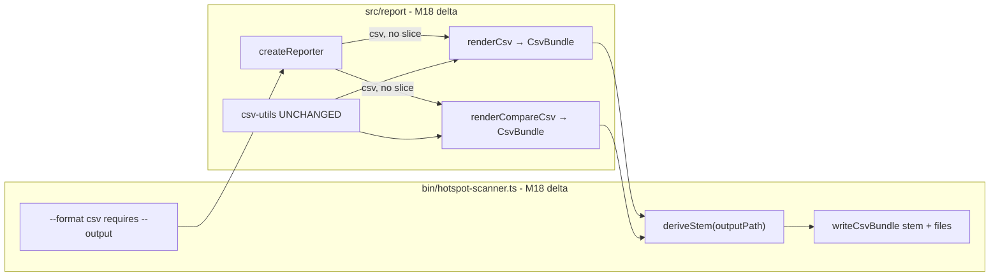

# Milestone 18 — CSV Bundle Export Design

**Spec**: [`.specs/features/csv-bundle/spec.md`](./spec.md)  
**Context**: [`.specs/features/csv-bundle/context.md`](./context.md)  
**Status**: Done  
**Supersedes**: M17 multi-block single-file layout in [csv-export/design.md](../csv-export/design.md) (column sets reused; title rows and blank-line join dropped)

---

## Architecture Overview

Today, `createReporter().render()` / `renderCompare()` return a **string**; the CLI writes once to stdout or `--output`. M18 changes the CSV path only: renderers return a **`CsvBundle`** (`Record` of relative suffixes → file contents). The CLI derives a **stem** from `--output`, expands `{stem}.{suffix}` for each entry, and writes N UTF-8 files. `src/report/` stays pure (no `fs`).



**Baseline:** [csv-export/design.md](../csv-export/design.md) — M17 columns + escaping; [export-formats/design.md](../export-formats/design.md) — M10 `--output` transport; [format-scoped-top/design.md](../format-scoped-top/design.md) — `--top` ignored for csv.  
**ROADMAP:** M18 CSV Bundle Export (new milestone; do not reopen M17).

---

## File layout

```text
# scan --output out/report.csv
out/report.meta.json
out/report.hotspots.csv   # or .functions.csv if --granularity function
out/report.coupling.csv

# compare --output out/compare.csv
out/compare.meta.json
out/compare.hotspots.new.csv          # or .functions.* when function mode
out/compare.hotspots.removed.csv
out/compare.hotspots.rank-changed.csv
out/compare.coupling.new.csv
out/compare.coupling.removed.csv
out/compare.coupling.rank-changed.csv
```

**Stem rule:** If `--output` ends with `.csv` (case-sensitive), strip that suffix once; otherwise use the path as-is.

| `--output`        | Stem              | Example ranking file                                                             |
| ----------------- | ----------------- | -------------------------------------------------------------------------------- |
| `out/report.csv`  | `out/report`      | `out/report.hotspots.csv`                                                        |
| `out/report`      | `out/report`      | `out/report.hotspots.csv`                                                        |
| `out/compare.CSV` | `out/compare.CSV` | No strip (suffix is `.csv` lowercase only) — prefer documenting lowercase `.csv` |

**YAGNI note:** Case-insensitive strip is optional; implement **lowercase `.csv` strip only** unless tests prove otherwise. Document that users should pass `--output …/*.csv` lowercase.

---

## Code Reuse Analysis

### Existing Components to Leverage

| Component                         | Location                                        | How to Use                                             |
| --------------------------------- | ----------------------------------------------- | ------------------------------------------------------ |
| `escapeCsvField` / `formatCsvRow` | `src/report/csv-utils.ts`                       | **Unchanged** — all data rows                          |
| Column sourcing tables            | [csv-export/design.md](../csv-export/design.md) | Reuse hotspots/functions/coupling/compare columns      |
| `createReporter`                  | `src/report/index.ts`                           | CSV branch returns `CsvBundle`; skip slice             |
| `validateOutputPath`              | `bin/hotspot-scanner.ts`                        | Validate user `--output` path before write (M10)       |
| `writeReport`                     | `bin/hotspot-scanner.ts`                        | Keep for non-csv formats; add `writeCsvBundle` sibling |
| `CliUsageError`                   | `bin/hotspot-scanner.ts`                        | Missing `--output` for csv                             |
| Fixtures                          | `tests/fixtures/report/`                        | Unit tests for bundle contents                         |
| Integration                       | `tests/fixtures/repos/small-ts/`                | E2E multi-file asserts                                 |

### Integration Points

| Consumer                    | Impact                                                                     |
| --------------------------- | -------------------------------------------------------------------------- |
| `src/scan.ts`               | None                                                                       |
| `src/compare/**`            | None                                                                       |
| `src/report/csv.ts`         | Return `CsvBundle`; drop title rows / blank-line join / metadata CSV block |
| `src/report/compare-csv.ts` | Return `CsvBundle` with 6 data keys + `meta.json`                          |
| `src/report/index.ts`       | Widen return type for csv; dispatch unchanged for other formats            |
| `bin/hotspot-scanner.ts`    | Require `--output` for csv; stem + multi-write                             |
| Scoring / types             | None                                                                       |

---

## Components

### `CsvBundle` type

- **Purpose**: Pure in-memory map of relative file suffixes to UTF-8 string contents
- **Location**: Prefer `src/report/csv-bundle.ts` (small shared module) **or** export from `csv.ts` and re-export via compare — pick one module owner to avoid cycles; recommended: **`src/report/csv-bundle.ts`**
- **Interfaces**:

```typescript
/**
 * Keys are suffixes after `{stem}.` — e.g. "hotspots.csv", "meta.json",
 * "hotspots.rank-changed.csv".
 * Values are full file bodies (CSV text or JSON text), without path.
 */
export type CsvBundle = Readonly<Record<string, string>>;
```

- **Dependencies**: None
- **Reuses**: N/A

### `renderCsv` (refactor)

- **Purpose**: Build scan CSV bundle (meta JSON string + ranking CSV + coupling CSV)
- **Location**: `src/report/csv.ts`
- **Interfaces**:
  - `renderCsv(result: ScanResult): CsvBundle`
- **Dependencies**: `csv-utils`, `CsvBundle` type
- **Reuses**: M17 column formatters; drop `renderSection` title row

**Scan bundle keys:**

| Key             | When                         |
| --------------- | ---------------------------- |
| `meta.json`     | Always                       |
| `hotspots.csv`  | `granularity !== "function"` |
| `functions.csv` | `granularity === "function"` |
| `coupling.csv`  | Always                       |

Never include both `hotspots.csv` and `functions.csv`.

### `renderCompareCsv` (refactor)

- **Purpose**: Build compare CSV bundle (meta + 6 data CSVs)
- **Location**: `src/report/compare-csv.ts`
- **Interfaces**:
  - `renderCompareCsv(result: CompareResult): CsvBundle`
- **Dependencies**: `csv-utils`, `CsvBundle`
- **Reuses**: M17 compare column sets

**Compare bundle keys (file mode):**

| Key                         |
| --------------------------- |
| `meta.json`                 |
| `hotspots.new.csv`          |
| `hotspots.removed.csv`      |
| `hotspots.rank-changed.csv` |
| `coupling.new.csv`          |
| `coupling.removed.csv`      |
| `coupling.rank-changed.csv` |

**Function mode:** replace `hotspots.*` with `functions.*`; coupling keys unchanged. Always emit all six data keys + meta (empty → header-only CSV string).

### `createReporter` (delta)

- **Purpose**: Dispatch formats; CSV returns bundle
- **Location**: `src/report/index.ts`
- **Interfaces**:

```typescript
export type ReporterRenderResult = string | CsvBundle;

export interface Reporter {
  render(result: ScanResult, options: ReporterOptions): ReporterRenderResult;
  renderCompare(
    result: CompareResult,
    options: ReporterOptions,
  ): ReporterRenderResult;
}
```

- **Dependencies**: `renderCsv`, `renderCompareCsv`, existing string renderers
- **Reuses**: M16 unsliced path for csv/json

### CLI stem + write

- **Purpose**: Enforce `--output` for csv; expand stem; write N files
- **Location**: `bin/hotspot-scanner.ts`
- **Interfaces** (suggested):

```typescript
export function deriveCsvStem(outputPath: string): string;
export async function writeCsvBundle(
  stem: string,
  bundle: CsvBundle,
): Promise<void>;
```

- **Dependencies**: `node:fs/promises` `writeFile`; `validateOutputPath`
- **Reuses**: M10 overwrite / UTF-8 / no BOM; trailing newline per file if missing (parity with `writeReport`)

**Validation order:**

1. If `format === "csv"` and `outputPath` missing → `CliUsageError` with clear message
2. `validateOutputPath(outputPath)` (user path, not every expanded path)
3. `stem = deriveCsvStem(outputPath)`
4. For each `[suffix, content]` in bundle: `writeFile(`${stem}.${suffix}`, ensureTrailingNewline(content), "utf8")`

**Help text:** Document that `--format csv` requires `--output` and writes a multi-file bundle.

---

## Data Models

### Scan `meta.json`

```typescript
interface ScanCsvMeta {
  kind: "scan";
  scan_window: string; // result.meta.since
  scanned_at: string; // result.meta.scannedAt
  granularity: "file" | "function";
}
```

Pretty-print JSON with trailing newline (2-space indent, match project JSON style if any; otherwise compact OK — prefer **2-space** for Sheets-adjacent readability).

### Compare `meta.json`

```typescript
interface CompareCsvMeta {
  kind: "compare";
  granularity: "file" | "function";
  baseline_scanned_at: string;
  baseline_since: string;
  current_scanned_at: string;
  current_since: string;
  warnings: string[]; // empty array when none
}
```

---

## Column sets (reuse M17; no title rows)

Each data file: **first line = header**, then data rows. Empty section = header line only.

### Scan — `hotspots.csv`

`rank,file,score,cpx,cpxN,churn,churnN,funcs,authors,lines`

### Scan — `functions.csv`

`rank,file,function,line,score,cpx,cpxN,churn,churnN,authors,lines`

### Scan / compare coupling files

`rank,fileA,fileB,strength,coChanges`  
(removed: empty `rank`; rank-changed: `baselineRank,currentRank,rankDelta,fileA,fileB,strength,coChanges`)

### Compare — hotspots / functions

Same as [csv-export/design.md](../csv-export/design.md) § Compare CSV Layout column tables (new / removed / rank-changed).

---

## Error Handling Strategy

| Error Scenario                                        | Handling                 | User Impact                                                                     |
| ----------------------------------------------------- | ------------------------ | ------------------------------------------------------------------------------- |
| `--format csv` without `--output`                     | `CliUsageError`          | Exit `2`; message states `--output` required for csv                            |
| Invalid `--output` (empty, directory, missing parent) | M10 `validateOutputPath` | Exit `2`                                                                        |
| Write failure mid-bundle                              | Propagate `fs` error     | Exit `1`; partial files may exist (document; no transactional rollback — YAGNI) |
| Invalid `--format`                                    | Unchanged `parseFormat`  | Exit `2`                                                                        |

---

## Tech Decisions (non-obvious)

| Decision                                | Choice                  | Rationale                                    |
| --------------------------------------- | ----------------------- | -------------------------------------------- |
| Return type union `string \| CsvBundle` | Widened `Reporter`      | Minimal churn vs separate CSV-only API       |
| Shared `csv-bundle.ts` for type         | Small module            | Avoid csv ↔ compare-csv import cycle         |
| Validate only user `--output` path      | Not every expanded file | M10 parity; parent dir same for all siblings |
| Always emit empty compare files         | Header-only             | Stable paths for scripts                     |
| No zip / BOM / legacy flag              | YAGNI                   | Locked in context.md                         |
| `--top` ignored for csv                 | Unchanged               | M16/M17 parity                               |

---

## Risks

| Risk                                                              | Mitigation                                                                        |
| ----------------------------------------------------------------- | --------------------------------------------------------------------------------- |
| Breaking change for M17 consumers                                 | Document in STATE + README; ROADMAP M17 supersede note; no dual layout            |
| Partial writes on disk full                                       | Accept fail-fast; YAGNI atomic rename                                             |
| `Reporter` return type breaks typed callers                       | Only CLI + tests consume today; update call sites in T3                           |
| Stem collision if user passes `report.hotspots.csv` as `--output` | Document stem = strip trailing `.csv` once; unusual stems are user responsibility |
| Integration tests still assert M17 title rows                     | Rewrite asserts to bundle files / headers in T4                                   |

---

## Test Impact

| File                                      | Change                               |
| ----------------------------------------- | ------------------------------------ |
| `src/report/csv-bundle.ts`                | **New** (type + optional helpers)    |
| `src/report/csv.ts`                       | Return `CsvBundle`; drop multi-block |
| `src/report/csv.test.ts`                  | Assert keys, headers, XOR, empty     |
| `src/report/compare-csv.ts`               | Return `CsvBundle`                   |
| `src/report/compare-csv.test.ts`          | Six keys + meta; modes               |
| `src/report/index.ts`                     | Union return; csv dispatch           |
| `src/report/index.test.ts`                | Bundle vs string; top ignored        |
| `bin/hotspot-scanner.ts`                  | require output; stem; writeCsvBundle |
| `bin/hotspot-scanner.test.ts`             | CliUsageError; multi-write           |
| `bin/hotspot-scanner.integration.test.ts` | Bundle file asserts on small-ts      |

**Do not change:** scoring, scan pipeline, json/table/markdown renderers (except type-safe call sites if needed), `csv-utils.ts`.

---

## Documentation Sync Targets

| File                                            | Update                                       |
| ----------------------------------------------- | -------------------------------------------- |
| `.specs/codebase/ARCHITECTURE.md`               | CSV bundle; `--output` required; `CsvBundle` |
| `.specs/codebase/STRUCTURE.md`                  | `csv-bundle.ts` if added                     |
| `README.md`                                     | Flags / examples for multi-file csv          |
| `.cursor/skills/vitals-cli-validation/SKILL.md` | Bundle path examples                         |
| `.specs/project/ROADMAP.md`                     | M18 + optional M17 supersede note            |
| `.specs/project/STATE.md`                       | Breaking decision log                        |
