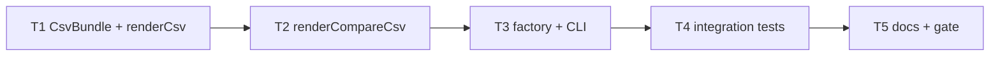

# Milestone 18 — CSV Bundle Export Tasks

**Design**: [`.specs/features/csv-bundle/design.md`](./design.md)  
**Spec**: [`.specs/features/csv-bundle/spec.md`](./spec.md)  
**Context**: [`.specs/features/csv-bundle/context.md`](./context.md)  
**Status**: Done

---

## Execution Plan

### Phase 1: Scan CSV bundle (Sequential)

```
T1 CsvBundle type + refactor renderCsv + unit tests
```

### Phase 2: Compare CSV bundle (Sequential)

```
T1 → T2 refactor renderCompareCsv + unit tests
```

### Phase 3: Factory + CLI (Sequential)

```
T2 → T3 createReporter union + require --output + stem multi-write + unit tests
```

### Phase 4: Integration (Sequential)

```
T3 → T4 integration tests on small-ts
```

### Phase 5: Docs + gate (Sequential)

```
T4 → T5 documentation sync + project gate
```



### Diagram-Definition Cross-Check

| Task | Depends on (declared) | Appears in diagram after deps | Match |
| ---- | --------------------- | ----------------------------- | ----- |
| T1 | None | Root | ✅ |
| T2 | T1 | T1 → T2 | ✅ |
| T3 | T2 | T2 → T3 | ✅ |
| T4 | T3 | T3 → T4 | ✅ |
| T5 | T4 | T4 → T5 | ✅ |

### Path Conflict Check

| Task | Module owner | Paths | Conflict with parallel peers |
| ---- | ------------ | ----- | ---------------------------- |
| T1 | `src/report/` | `csv-bundle.ts`, `csv.ts`, `csv.test.ts` | N/A (sequential) |
| T2 | `src/report/` | `compare-csv.ts`, `compare-csv.test.ts` | After T1 — OK |
| T3 | `src/report/` + `bin/` | `index.ts`, `index.test.ts`, `bin/hotspot-scanner.ts`, `bin/hotspot-scanner.test.ts` | Sequential after T2 — OK |
| T4 | `bin/` | `bin/hotspot-scanner.integration.test.ts` | After T3 — OK |
| T5 | docs | ARCHITECTURE, STRUCTURE, README, vitals-cli-validation, ROADMAP | After T4 — OK |

### Test Co-location Validation

| Task | Code layer | TESTING.md expectation | Tests in same task | Match |
| ---- | ---------- | ---------------------- | ------------------ | ----- |
| T1 | `src/report/csv*.ts` | Unit required | `csv.test.ts` (+ type smoke) | ✅ |
| T2 | `src/report/compare-csv.ts` | Unit required | `compare-csv.test.ts` | ✅ |
| T3 | `src/report/index.ts`, `bin/` | Unit required | `index.test.ts`, `bin/hotspot-scanner.test.ts` | ✅ |
| T4 | `bin/` integration | Integration | `bin/hotspot-scanner.integration.test.ts` | ✅ |
| T5 | Docs only | Gate | `pnpm build && pnpm test` | ✅ |

---

## Task Breakdown

### T1: CsvBundle type + refactor `renderCsv`

**What**: Add `CsvBundle` type in `src/report/csv-bundle.ts`. Refactor `renderCsv()` to return a `CsvBundle` with `meta.json` (JSON string), either `hotspots.csv` or `functions.csv` (granularity XOR), and always `coupling.csv`. Drop section title rows and blank-line multi-block join; metadata must not appear as CSV. Reuse M17 column sets and `csv-utils`. Update `csv.test.ts` accordingly.

**Where**: `src/report/csv-bundle.ts`, `src/report/csv.ts`, `src/report/csv.test.ts`

**Depends on**: None

**Reuses**: [design.md](./design.md) § File layout, § Column sets; [context.md](./context.md) locked decisions; `csv-utils.ts`; `tests/fixtures/report/sample-result.json`

**Requirement**: HOTSPOT-135, HOTSPOT-136, HOTSPOT-140, HOTSPOT-141, HOTSPOT-142, HOTSPOT-143

**Tools**:

- MCP: NONE
- Skill: NONE

**Done when**:

- [x] `CsvBundle` type exported from `src/report/csv-bundle.ts`
- [x] `renderCsv()` returns `CsvBundle` (not a multi-block string)
- [x] Keys: `meta.json` + `coupling.csv` + exactly one of `hotspots.csv` | `functions.csv`
- [x] Each CSV body is header + data only (no title row)
- [x] Empty ranking/coupling → header-only file content still present in bundle
- [x] `meta.json` parseable JSON with `kind: "scan"` and fields per design
- [x] Scores: 4 decimals; integers: no decimals; escaping via `csv-utils`
- [x] `--top` N/A at this layer (full arrays from caller) — unit fixture uses full result
- [x] No `fs` imports in report modules touched

**Tests**: `csv.test.ts` — keys, headers, granularity XOR, empty sections, no title rows, special-char paths

**Gate**: `pnpm exec vitest run src/report/csv.test.ts`

---

### T2: Refactor `renderCompareCsv` to CsvBundle

**What**: Refactor `renderCompareCsv()` to return a `CsvBundle` with `meta.json` and always six data CSV keys (hierarchical names). File vs function ranking keys per design; empty sections header-only; reuse M17 compare columns (empty rank for removed; rank-changed columns). Update `compare-csv.test.ts`.

**Where**: `src/report/compare-csv.ts`, `src/report/compare-csv.test.ts`

**Depends on**: T1

**Reuses**: `CsvBundle` from T1; [design.md](./design.md) § Compare bundle keys; M17 compare column tables; `tests/fixtures/report/compare-*.json`

**Requirement**: HOTSPOT-135, HOTSPOT-137, HOTSPOT-140, HOTSPOT-141, HOTSPOT-142, HOTSPOT-143

**Tools**:

- MCP: NONE
- Skill: NONE

**Done when**:

- [x] File mode keys: `meta.json` + `hotspots.{new,removed,rank-changed}.csv` + `coupling.{new,removed,rank-changed}.csv`
- [x] Function mode uses `functions.*` instead of `hotspots.*` (never both)
- [x] All six data files always present (header-only when empty)
- [x] `meta.json` has `kind: "compare"`, baseline/current fields, `warnings` array
- [x] Removed rows: empty `rank` cell; rank-changed includes `baselineRank`, `currentRank`, `rankDelta`
- [x] No title rows; `csv-utils` escaping preserved

**Tests**: `compare-csv.test.ts` — file mode, function mode, empty sections, removed rank, special characters

**Gate**: `pnpm exec vitest run src/report/compare-csv.test.ts`

---

### T3: Reporter factory + CLI stem multi-write

**What**: Widen `Reporter.render` / `renderCompare` to `string | CsvBundle`. Dispatch csv to refactored renderers (still unsliced / `--top` ignored). In `bin/hotspot-scanner.ts`: require `--output` for `--format csv` (`CliUsageError`); implement `deriveCsvStem` + `writeCsvBundle`; update help text; keep non-csv single-string write path. Update `index.test.ts` and `bin/hotspot-scanner.test.ts` (replace M17 single-file CSV expectations).

**Where**: `src/report/index.ts`, `src/report/index.test.ts`, `bin/hotspot-scanner.ts`, `bin/hotspot-scanner.test.ts`

**Depends on**: T2

**Reuses**: [design.md](./design.md) § CLI stem + write; M10 `validateOutputPath`; `CliUsageError`

**Requirement**: HOTSPOT-135, HOTSPOT-138, HOTSPOT-139, HOTSPOT-142, HOTSPOT-143

**Tools**:

- MCP: NONE
- Skill: NONE

**Done when**:

- [x] `createReporter().render(..., { format: "csv" })` returns `CsvBundle`
- [x] `createReporter().renderCompare(..., { format: "csv" })` returns `CsvBundle`
- [x] `table` / `json` / `markdown` still return `string`
- [x] `top: 1` with csv still yields full ranking rows in bundle contents
- [x] `--format csv` without `--output` → `CliUsageError` (exit path covered in unit test)
- [x] `--format csv --output <tmp>/report.csv` writes `report.meta.json`, `report.hotspots.csv` (or functions), `report.coupling.csv`
- [x] Compare csv writes six data files + meta under stem
- [x] Non-csv `--output` / stdout behavior unchanged
- [x] Help text documents csv requires `--output` / multi-file bundle

**Tests**: `index.test.ts` — union dispatch, top ignored; `bin/hotspot-scanner.test.ts` — missing output error, stem expansion multi-write, overwrite

**Gate**: `pnpm exec vitest run src/report/index.test.ts bin/hotspot-scanner.test.ts`

---

### T4: Integration tests (CSV bundle on fixtures)

**What**: Rewrite/extend CLI integration tests for M18 bundle layout on `small-ts`. Assert scan and compare create expected stem files; assert `--top 1 --format csv` still exports all hotspot rows; assert missing `--output` fails for csv. Clean temp dirs in `afterEach`.

**Where**: `bin/hotspot-scanner.integration.test.ts`

**Depends on**: T3

**Reuses**: `tests/fixtures/repos/small-ts/`; temp dir patterns from M10/M17; `vitals-cli-validation` expectations

**Requirement**: HOTSPOT-136, HOTSPOT-137, HOTSPOT-138, HOTSPOT-139, HOTSPOT-140, HOTSPOT-142, HOTSPOT-143

**Tools**:

- MCP: NONE
- Skill: `vitals-cli-validation`

**Done when**:

- [x] `--format csv --output <tmp>/report.csv` exits `0`
- [x] Files exist: `report.meta.json`, `report.hotspots.csv` (or functions), `report.coupling.csv`
- [x] Hotspots/functions CSV first line is header (not a title); no multi-block blank-line join required
- [x] `--baseline ... --format csv --output <tmp>/compare.csv` exits `0` with six data CSVs + meta
- [x] `--format csv` without `--output` exits `!= 0`
- [x] `--top 1 --format csv --output` ranking file still contains all hotspot data rows when fixture has multiple
- [x] Temp files cleaned up in `afterEach`

**Tests**: `bin/hotspot-scanner.integration.test.ts` — CSV bundle scan + compare + require output

**Gate**: `pnpm exec vitest run bin/hotspot-scanner.integration.test.ts`

---

### T5: Documentation sync + project gate

**What**: Update ARCHITECTURE.md, STRUCTURE.md, README.md, and vitals-cli-validation skill for CSV bundle + required `--output`. Keep ROADMAP M18 implementation checkboxes unchecked until this task’s Execute Done; then mark them `[x]`. Optional one-line M17 supersede note if not already present. Run full project gate.

**Where**: `.specs/codebase/ARCHITECTURE.md`, `.specs/codebase/STRUCTURE.md`, `README.md`, `.cursor/skills/vitals-cli-validation/SKILL.md`, `.specs/project/ROADMAP.md`

**Depends on**: T4

**Reuses**: [design.md](./design.md) § Documentation Sync Targets

**Requirement**: HOTSPOT-144

**Tools**:

- MCP: NONE
- Skill: `vitals-cli-validation`

**Done when**:

- [x] ARCHITECTURE.md documents `CsvBundle`, multi-file layout, `--format csv` requires `--output`, `--top` ignored
- [x] STRUCTURE.md lists `csv-bundle.ts` (if present) and updated csv module roles
- [x] README.md describes CSV bundle paths and required `--output`
- [x] vitals-cli-validation includes CSV bundle example commands
- [x] ROADMAP M18 implementation checkboxes marked `[x]` on Execute Done; Specs remain Done/Planned per sync rules
- [x] `pnpm build && pnpm test` passes

**Tests**: Full project gate

**Gate**: `pnpm build && pnpm test`

---

## Requirement Traceability (Tasks)

| Requirement ID | Tasks |
| -------------- | ----- |
| HOTSPOT-135 | T1, T2, T3 |
| HOTSPOT-136 | T1, T3, T4 |
| HOTSPOT-137 | T2, T3, T4 |
| HOTSPOT-138 | T3, T4 |
| HOTSPOT-139 | T3, T4 |
| HOTSPOT-140 | T1, T2, T4 |
| HOTSPOT-141 | T1, T2 |
| HOTSPOT-142 | T1, T2, T3, T4 |
| HOTSPOT-143 | T1, T2, T3, T4 |
| HOTSPOT-144 | T5 |

**Coverage:** 10 total, 10 mapped to tasks, 0 unmapped

---

## Parallel Execution Map

```
Phase 1–5 are sequential (shared src/report then bin then docs).

No [P] tasks — Path Conflict / same-module ownership.
```

**Note for orchestrator:** Do not start Execute while Status is `Planned`. User promotes to `Approved` / `Ready for Execute` in a **new** development session, then invoke `orchestrator-implementer`.
