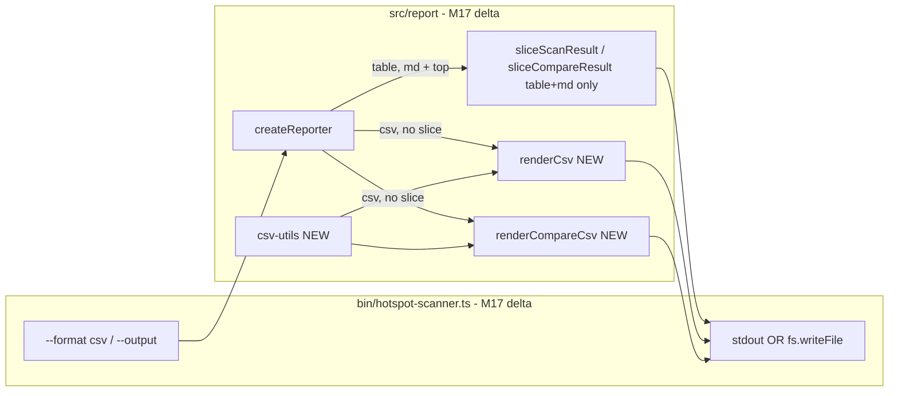

# Milestone 17 — CSV Export Design

**Spec**: [`.specs/features/csv-export/spec.md`](./spec.md)  
**Context**: [`.specs/features/csv-export/context.md`](./context.md)  
**Status**: Done

---

## Architecture Overview

M17 adds a fourth scan renderer (`renderCsv`), a fourth compare renderer (`renderCompareCsv`), and shared RFC 4180 helpers. The reporter layer remains pure (returns strings); the CLI owns transport (stdout vs file). Scoring, compare engine, and JSON/markdown/table renderers are unchanged.



**Baseline:** [`.specs/features/export-formats/design.md`](../export-formats/design.md) — M10 reporter + CLI I/O; [`.specs/features/scan-compare/design.md`](../scan-compare/design.md) — M13 compare reporters; [`.specs/features/function-granularity/design.md`](../function-granularity/design.md) — M11 granularity branch.  
**ROADMAP:** M17 CSV Export.

---

## Code Reuse Analysis

### Existing Components to Leverage

| Component                        | Location                               | How to Use                                                |
| -------------------------------- | -------------------------------------- | --------------------------------------------------------- |
| `createReporter`                 | `src/report/index.ts`                  | Add `csv` branch; skip slice when `format === "csv"`      |
| `sliceScanResult`                | `src/report/slice.ts`                  | Unchanged for table/json/markdown; **not called** for csv |
| `sliceCompareResult`             | `src/report/slice-compare.ts`          | Unchanged for table/json/markdown; **not called** for csv |
| `renderMarkdown`                 | `src/report/markdown.ts`               | Column names and section order reference                  |
| `renderCompareMarkdown`          | `src/report/compare-markdown.ts`       | Compare section names and columns reference               |
| `parseFormat`                    | `bin/hotspot-scanner.ts`               | Extend union to include `csv`                             |
| `validateOutputPath`, file write | `bin/hotspot-scanner.ts`               | Reuse unchanged from M10                                  |
| `sample-result.json`             | `tests/fixtures/report/`               | Scan CSV unit tests                                       |
| Compare fixtures                 | `tests/fixtures/report/compare-*.json` | Compare CSV unit tests                                    |
| Integration fixture              | `tests/fixtures/repos/small-ts/`       | E2E CSV export in T4                                      |

### Integration Points

| Consumer                    | Impact                                                      |
| --------------------------- | ----------------------------------------------------------- |
| `src/scan.ts`               | None — `ScanResult` unchanged                               |
| `src/compare/**`            | None — `CompareResult` unchanged                            |
| `src/report/index.ts`       | Extend `ReporterOptions.format`, csv dispatch without slice |
| `src/report/csv-utils.ts`   | **New** — escaping helpers                                  |
| `src/report/csv.ts`         | **New** — `renderCsv()`                                     |
| `src/report/compare-csv.ts` | **New** — `renderCompareCsv()`                              |
| `bin/hotspot-scanner.ts`    | Extend `OutputFormat`, `parseFormat`, help text             |

---

## Type Changes

### `OutputFormat` (`bin/hotspot-scanner.ts`)

```typescript
export type OutputFormat = "table" | "json" | "markdown" | "csv";
```

### `ReporterOptions` (`src/report/index.ts`)

```typescript
export interface ReporterOptions {
  format: "table" | "json" | "markdown" | "csv";
  top?: number;
}
```

### `createReporter` dispatch

```typescript
return {
  render(result, options) {
    if (options.format === "csv") {
      return renderCsv(result);
    }
    const sliced = sliceScanResult(result, options.top);
    switch (options.format) {
      case "json":
        return renderJson(sliced);
      case "markdown":
        return renderMarkdown(sliced);
      default:
        return renderTable(sliced);
    }
  },
  renderCompare(result, options) {
    if (options.format === "csv") {
      return renderCompareCsv(result);
    }
    const sliced = sliceCompareResult(result, options.top);
    switch (options.format) {
      case "json":
        return renderCompareJson(sliced);
      case "markdown":
        return renderCompareMarkdown(sliced);
      default:
        return renderCompareTable(sliced);
    }
  },
};
```

**Note:** When M16 lands, move JSON to the unsliced branch alongside CSV. M17 implements CSV-only unsliced path; JSON slicing unchanged until M16.

### `parseFormat` error message

```typescript
throw new CliUsageError(
  `Invalid --format: ${value}. Expected table, json, markdown, or csv.`,
);
```

---

## CSV Utilities (`src/report/csv-utils.ts`)

```typescript
export function escapeCsvField(value: string): string;
export function formatCsvRow(fields: string[]): string;
```

### RFC 4180 escaping rules

```typescript
export function escapeCsvField(value: string): string {
  const needsQuotes = /[",\r\n]/.test(value);
  if (!needsQuotes) {
    return value;
  }
  return `"${value.replace(/"/g, '""')}"`;
}

export function formatCsvRow(fields: string[]): string {
  return fields.map(escapeCsvField).join(",");
}
```

**YAGNI:** Do not add a third-party CSV library — two functions suffice.

---

## Scan CSV Layout (`src/report/csv.ts`)

`export function renderCsv(result: ScanResult): string`

### Block structure

Blocks joined with `\n\n` (blank line separator).

1. **Metadata** — title `"Metadata"`, then `key,value` header:

| key           | value source                                                     |
| ------------- | ---------------------------------------------------------------- |
| `scan_window` | `result.meta.since`                                              |
| `scanned_at`  | `result.meta.scannedAt`                                          |
| `granularity` | `result.meta.granularity` (omit row if undefined / file default) |

2. **Ranking section** — depends on `meta.granularity`:

| Granularity      | Section title   | Columns                                                             |
| ---------------- | --------------- | ------------------------------------------------------------------- |
| `file` (default) | `Top Hotspots`  | `rank,file,score,cpx,cpxN,churn,churnN,funcs,authors,lines`         |
| `function`       | `Top Functions` | `rank,file,function,line,score,cpx,cpxN,churn,churnN,authors,lines` |

3. **Coupling** — section title `Top Coupling Pairs`:

| Column    | Source field       | Format     |
| --------- | ------------------ | ---------- |
| rank      | index + 1          | integer    |
| fileA     | `fileA`            | escaped    |
| fileB     | `fileB`            | escaped    |
| strength  | `couplingStrength` | 4 decimals |
| coChanges | `coChangeCount`    | integer    |

### Hotspot column sourcing

| Column  | Source field           | Format     |
| ------- | ---------------------- | ---------- |
| rank    | index + 1              | integer    |
| file    | `filePath`             | escaped    |
| score   | `hotspotScore`         | 4 decimals |
| cpx     | `cyclomaticComplexity` | integer    |
| cpxN    | `complexityNormalized` | 4 decimals |
| churn   | `commitCount`          | integer    |
| churnN  | `churnNormalized`      | 4 decimals |
| funcs   | `functionCount`        | integer    |
| authors | `authorCount`          | integer    |
| lines   | `linesChanged`         | integer    |

### Function column sourcing

| Column   | Source field           | Format     |
| -------- | ---------------------- | ---------- |
| rank     | index + 1              | integer    |
| file     | `filePath`             | escaped    |
| function | `functionName`         | escaped    |
| line     | `line`                 | integer    |
| score    | `hotspotScore`         | 4 decimals |
| cpx      | `complexity`           | integer    |
| cpxN     | `complexityNormalized` | 4 decimals |
| churn    | `commitCount`          | integer    |
| churnN   | `churnNormalized`      | 4 decimals |
| authors  | `authorCount`          | integer    |
| lines    | `linesChanged`         | integer    |

### Section title row helper

```typescript
function renderSection(
  title: string,
  header: string[],
  rows: string[][],
): string[] {
  const lines = [formatCsvRow([title]), formatCsvRow(header)];
  for (const row of rows) {
    lines.push(formatCsvRow(row));
  }
  return lines;
}
```

Title row is a single-field CSV row (quoted section name) per context.md.

### Formatting helpers (local duplicate)

```typescript
const SCORE_DECIMALS = 4;

function formatScore(value: number): string {
  return value.toFixed(SCORE_DECIMALS);
}
```

---

## Compare CSV Layout (`src/report/compare-csv.ts`)

`export function renderCompareCsv(result: CompareResult): string`

### Metadata block

Title `"Compare Metadata"`. Rows:

| key                   | value                                                        |
| --------------------- | ------------------------------------------------------------ |
| `granularity`         | `result.granularity`                                         |
| `baseline_scanned_at` | `result.meta.baseline.scannedAt`                             |
| `baseline_since`      | `result.meta.baseline.since`                                 |
| `current_scanned_at`  | `result.meta.current.scannedAt`                              |
| `current_since`       | `result.meta.current.since`                                  |
| `warning`             | one row per warning in `result.meta.warnings` (key repeated) |

### File-mode sections

| Section title               | Columns                                                                             |
| --------------------------- | ----------------------------------------------------------------------------------- |
| New Hotspots                | `rank,file,score,cpx,cpxN,churn,churnN,funcs,authors`                               |
| Removed Hotspots            | `rank,file,score,cpx,cpxN,churn,churnN,funcs,authors` (rank empty)                  |
| Rank Changed Hotspots       | `baselineRank,currentRank,rankDelta,file,score,cpx,cpxN,churn,churnN,funcs,authors` |
| New Coupling Pairs          | `rank,fileA,fileB,strength,coChanges`                                               |
| Removed Coupling Pairs      | `rank,fileA,fileB,strength,coChanges` (rank empty)                                  |
| Rank Changed Coupling Pairs | `baselineRank,currentRank,rankDelta,fileA,fileB,strength,coChanges`                 |

### Function-mode sections

Replace hotspot sections with:

| Section title          | Columns                                                                                     |
| ---------------------- | ------------------------------------------------------------------------------------------- |
| New Functions          | `rank,file,function,line,score,cpx,cpxN,churn,churnN,authors`                               |
| Removed Functions      | `rank,file,function,line,score,cpx,cpxN,churn,churnN,authors` (rank empty)                  |
| Rank Changed Functions | `baselineRank,currentRank,rankDelta,file,function,line,score,cpx,cpxN,churn,churnN,authors` |

Coupling sections unchanged (file-level pairs).

---

## CLI Wiring

No new flags beyond extending `--format` enum. Existing `--output` path from M10 applies to CSV.

### Commander option text

```typescript
.option("--format <format>", "Output format: table|json|markdown|csv", "table")
```

### Write routing

Unchanged from M10 — `createReporter().render()` / `renderCompare()` returns string; CLI writes to stdout or file.

Append trailing newline when writing to stdout/file if missing (match table/markdown behavior).

---

## Test Impact

| File                                      | Change                                 |
| ----------------------------------------- | -------------------------------------- |
| `src/report/csv-utils.ts`                 | **New**                                |
| `src/report/csv-utils.test.ts`            | **New** — escaping matrix              |
| `src/report/csv.ts`                       | **New** — `renderCsv()`                |
| `src/report/csv.test.ts`                  | **New** — sections, granularity, empty |
| `src/report/compare-csv.ts`               | **New** — `renderCompareCsv()`         |
| `src/report/compare-csv.test.ts`          | **New** — file + function modes        |
| `src/report/index.ts`                     | csv dispatch, no slice for csv         |
| `src/report/index.test.ts`                | csv render + top ignored               |
| `bin/hotspot-scanner.ts`                  | `parseFormat`, help text               |
| `bin/hotspot-scanner.test.ts`             | format validation                      |
| `bin/hotspot-scanner.integration.test.ts` | `--format csv --output` scan + compare |

**Do not change:**

- `src/report/json.ts`, `table.ts`, `markdown.ts`
- `src/report/compare-json.ts`, `compare-table.ts`, `compare-markdown.ts`
- `src/scan.ts`, `src/compare/**`, scoring modules

### Test patterns

- **Unit (csv-utils):** Assert `escapeCsvField` for `plain`, `a,b`, `"quoted"`, `line\nbreak`, unicode
- **Unit (csv):** Load `sample-result.json`; assert `"Top Hotspots"`, header row, escaped path fixture if added
- **Unit (index):** Fixture with 5 hotspots; `render(..., { format: "csv", top: 1 })` → 5 data rows in hotspots section
- **Integration:** temp `report.csv`; assert contains `key,value` and section title rows; `rm` in `afterEach`

---

## Risks

| Risk                                        | Mitigation                                                                        |
| ------------------------------------------- | --------------------------------------------------------------------------------- |
| Strict CSV parsers reject multi-block files | Document layout; metadata block is valid CSV; section titles are single-cell rows |
| Paths with special characters break import  | `escapeCsvField` test matrix                                                      |
| Column drift vs markdown                    | Design tables mirror `markdown.ts` / `compare-markdown.ts`                        |
| M16 changes JSON slice behavior             | M17 csv branch independent; refactor both to unsliced when M16 lands              |
| Compare CSV file size on large repos        | Acceptable — same as JSON full export; user opts in via `--format csv`            |

---

## Documentation Sync Targets

| File                                            | Update                                                                    |
| ----------------------------------------------- | ------------------------------------------------------------------------- |
| `.specs/codebase/ARCHITECTURE.md`               | `--format csv`; `renderCsv` / `renderCompareCsv`; `--top` ignored for csv |
| `.specs/codebase/STRUCTURE.md`                  | Add `csv-utils.ts`, `csv.ts`, `compare-csv.ts`                            |
| `README.md`                                     | Flags table: `csv` format                                                 |
| `.cursor/skills/vitals-cli-validation/SKILL.md` | Example `--format csv --output`                                           |
| `.specs/project/ROADMAP.md`                     | Link spec; implementation checkboxes on Execute                           |
