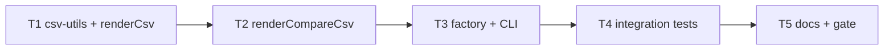

# Milestone 17 — CSV Export Tasks

**Design**: [`.specs/features/csv-export/design.md`](./design.md)  
**Spec**: [`.specs/features/csv-export/spec.md`](./spec.md)  
**Context**: [`.specs/features/csv-export/context.md`](./context.md)  
**Status**: Done

---

## Execution Plan

### Phase 1: CSV utils + scan renderer (Sequential)

```
T1 csv-utils + renderCsv + unit tests
```

### Phase 2: Compare CSV renderer (Sequential)

```
T1 → T2 renderCompareCsv + unit tests
```

### Phase 3: Factory + CLI (Sequential)

```
T2 → T3 index dispatch + parseFormat + bin tests
```

### Phase 4: Integration (Sequential)

```
T3 → T4 integration tests on small-ts
```

### Phase 5: Docs + gate (Sequential)

```
T4 → T5 documentation sync + project gate
```



### Diagram-Definition Cross-Check

| Task | Depends on (declared) | Appears in diagram after deps | Match |
| ---- | --------------------- | ----------------------------- | ----- |
| T1   | None                  | Root                          | ✅    |
| T2   | T1                    | T1 → T2                       | ✅    |
| T3   | T2                    | T2 → T3                       | ✅    |
| T4   | T3                    | T3 → T4                       | ✅    |
| T5   | T4                    | T4 → T5                       | ✅    |

### Test Co-location Validation

| Task | Code layer                          | TESTING.md expectation | Tests in same task                             | Match |
| ---- | ----------------------------------- | ---------------------- | ---------------------------------------------- | ----- |
| T1   | `src/report/csv-utils.ts`, `csv.ts` | Unit required          | `csv-utils.test.ts`, `csv.test.ts`             | ✅    |
| T2   | `src/report/compare-csv.ts`         | Unit required          | `compare-csv.test.ts`                          | ✅    |
| T3   | `src/report/index.ts`, `bin/`       | Unit required          | `index.test.ts`, `bin/hotspot-scanner.test.ts` | ✅    |
| T4   | `bin/` integration                  | Integration            | `bin/hotspot-scanner.integration.test.ts`      | ✅    |
| T5   | Docs only                           | Gate                   | `pnpm build && pnpm test`                      | ✅    |

---

## Task Breakdown

### T1: CSV utils + scan renderer

**What**: Implement `escapeCsvField()` and `formatCsvRow()` in `src/report/csv-utils.ts`. Implement `renderCsv()` in `src/report/csv.ts` per design § Scan CSV Layout — metadata block, hotspots/functions section by granularity, coupling section. Add unit tests for RFC 4180 escaping and scan CSV structure.

**Where**: `src/report/csv-utils.ts`, `src/report/csv-utils.test.ts`, `src/report/csv.ts`, `src/report/csv.test.ts`

**Depends on**: None

**Reuses**: [design.md](./design.md) § CSV Utilities, § Scan CSV Layout; [context.md](./context.md) § Multi-block layout; `tests/fixtures/report/sample-result.json`

**Requirement**: HOTSPOT-121, HOTSPOT-122, HOTSPOT-127

**Tools**:

- MCP: NONE
- Skill: NONE

**Done when**:

- [x] `escapeCsvField()` quotes fields containing comma, quote, CR, LF
- [x] `formatCsvRow()` joins escaped fields without trailing comma
- [x] `renderCsv()` emits metadata block with `key,value` header
- [x] File granularity renders **Top Hotspots** section with correct columns
- [x] Function granularity renders **Top Functions** section (no hotspots block)
- [x] Coupling section renders with `coChanges` column
- [x] Empty sections render title + header, zero data rows
- [x] Scores/normalized: 4 decimals; integers: no decimals
- [x] `src/report/csv*.ts` covered by unit tests

**Tests**: `csv-utils.test.ts` — escaping matrix; `csv.test.ts` — blocks, headers, granularity branch, empty sections

**Gate**: `pnpm exec vitest run src/report/csv-utils.test.ts src/report/csv.test.ts`

---

### T2: Compare CSV renderer

**What**: Implement `renderCompareCsv()` in `src/report/compare-csv.ts` per design § Compare CSV Layout. File and function mode sections; rank-changed columns; empty rank for removed rows. Add unit tests using compare fixtures.

**Where**: `src/report/compare-csv.ts`, `src/report/compare-csv.test.ts`

**Depends on**: T1

**Reuses**: [design.md](./design.md) § Compare CSV Layout; `tests/fixtures/report/compare-*.json`; `csv-utils.ts` from T1

**Requirement**: HOTSPOT-124, HOTSPOT-127

**Tools**:

- MCP: NONE
- Skill: NONE

**Done when**:

- [x] File mode includes new/removed/rank-changed hotspot sections + coupling sections
- [x] Function mode includes function sections instead of hotspot sections
- [x] Compare metadata block includes baseline/current timestamps and warnings
- [x] Removed sections have empty `rank` cell
- [x] Rank-changed sections include `baselineRank`, `currentRank`, `rankDelta`
- [x] Empty compare sections render title + header only
- [x] Paths and function names use RFC 4180 escaping

**Tests**: `compare-csv.test.ts` — file mode fixture, function mode fixture, empty sections, removed rank column

**Gate**: `pnpm exec vitest run src/report/compare-csv.test.ts`

---

### T3: Reporter factory + CLI `--format csv`

**What**: Extend `ReporterOptions.format` and `createReporter()` to dispatch `csv` without calling slice helpers (full result). Extend `OutputFormat` and `parseFormat()` in `bin/hotspot-scanner.ts`. Update commander help text. Add `index.test.ts` and `bin/hotspot-scanner.test.ts` coverage including `--top` ignored for csv.

**Where**: `src/report/index.ts`, `src/report/index.test.ts`, `bin/hotspot-scanner.ts`, `bin/hotspot-scanner.test.ts`

**Depends on**: T2

**Reuses**: [design.md](./design.md) § `createReporter` dispatch; [context.md](./context.md) § `--top` ignored; M10 `validateOutputPath` / file write

**Requirement**: HOTSPOT-123, HOTSPOT-125, HOTSPOT-126, HOTSPOT-127

**Tools**:

- MCP: NONE
- Skill: NONE

**Done when**:

- [x] `parseFormat("csv")` returns `"csv"`
- [x] Invalid format error lists `table`, `json`, `markdown`, `csv`
- [x] `createReporter().render(..., { format: "csv", top: 1 })` returns unsliced CSV (all hotspot rows)
- [x] `createReporter().renderCompare(..., { format: "csv", top: 1 })` returns unsliced compare CSV
- [x] `table`, `json`, `markdown` dispatch unchanged
- [x] `--output` with `--format csv` writes UTF-8 file; stdout silent for report
- [x] stderr diagnostics unchanged with `--output`

**Tests**: `index.test.ts` — csv dispatch, top ignored; `bin/hotspot-scanner.test.ts` — parseFormat, writeFile mock

**Gate**: `pnpm exec vitest run src/report/index.test.ts bin/hotspot-scanner.test.ts`

---

### T4: Integration tests (CSV file export)

**What**: Extend CLI integration tests on `small-ts` fixture. Scan with `--format csv --output <tmp>/report.csv` — assert file contains metadata and section headers. Compare with `--baseline` and `--format csv --output` — assert compare section headers. Verify `--top 1 --format csv` still exports all hotspot rows.

**Where**: `bin/hotspot-scanner.integration.test.ts`

**Depends on**: T3

**Reuses**: `tests/fixtures/repos/small-ts/`; temp dir pattern from M10 T3; baseline JSON from existing compare integration

**Requirement**: HOTSPOT-127

**Tools**:

- MCP: NONE
- Skill: `vitals-cli-validation`

**Done when**:

- [x] `--format csv --output <tmp>/report.csv` exits `0`
- [x] CSV file contains `key,value` metadata header
- [x] CSV file contains `"Top Hotspots"` or `"Top Functions"` section title row
- [x] `--baseline <file> --format csv --output <tmp>/compare.csv` exits `0`
- [x] Compare CSV contains `"New Hotspots"` or `"New Functions"` section title
- [x] `--top 1 --format csv` output row count exceeds 1 when fixture has multiple hotspots
- [x] Temp files cleaned up in `afterEach`

**Tests**: `bin/hotspot-scanner.integration.test.ts` — CSV scan + compare export

**Gate**: `pnpm exec vitest run bin/hotspot-scanner.integration.test.ts`

---

### T5: Documentation sync + project gate

**What**: Update ARCHITECTURE.md, STRUCTURE.md, README.md, vitals-cli-validation skill. Mark ROADMAP M17 implementation checkboxes `[x]` on Execute Done only — during planning, link spec and set `**Specs:** Done`. Run full project gate.

**Where**: `.specs/codebase/ARCHITECTURE.md`, `.specs/codebase/STRUCTURE.md`, `README.md`, `.cursor/skills/vitals-cli-validation/SKILL.md`, `.specs/project/ROADMAP.md`

**Depends on**: T4

**Reuses**: [design.md](./design.md) § Documentation Sync Targets

**Requirement**: HOTSPOT-128

**Tools**:

- MCP: NONE
- Skill: `vitals-cli-validation`

**Done when**:

- [x] ARCHITECTURE.md documents `--format csv` and CSV reporters; notes `--top` ignored for csv
- [x] STRUCTURE.md lists `csv-utils.ts`, `csv.ts`, `compare-csv.ts`
- [x] README.md flags table includes `csv` format
- [x] vitals-cli-validation skill includes CSV export example
- [x] ROADMAP M17 implementation checkboxes marked `[x]` on Execute Done
- [x] `pnpm build && pnpm test` passes

**Tests**: Full project gate

**Gate**: `pnpm build && pnpm test`

---

## Requirement Traceability (Tasks)

| Requirement ID | Tasks          |
| -------------- | -------------- |
| HOTSPOT-121    | T1             |
| HOTSPOT-122    | T1             |
| HOTSPOT-123    | T3             |
| HOTSPOT-124    | T2             |
| HOTSPOT-125    | T3             |
| HOTSPOT-126    | T3             |
| HOTSPOT-127    | T1, T2, T3, T4 |
| HOTSPOT-128    | T5             |

**Coverage:** 8 total, 8 mapped to tasks, 0 unmapped
