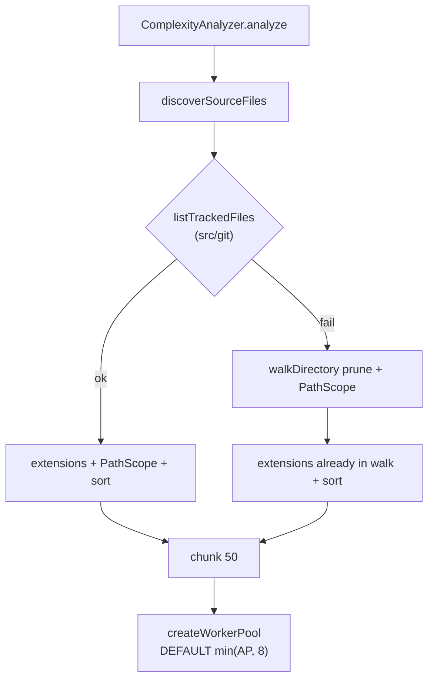

# Milestone 36 — Discovery & concurrency defaults Design

**Spec**: [`.specs/features/discovery-concurrency-defaults/spec.md`](./spec.md)  
**Context**: [`.specs/features/discovery-concurrency-defaults/context.md`](./context.md)  
**Status**: Planned (planning session)

---

## Architecture Overview

M36 is a brownfield polish on two hot paths: **source discovery** (main thread, before batching) and **default pool size** (constant only). No new CLI flags. No pipeline stage reordering.



**Fragile areas (CONCERNS):** RT-001 memory — raising default cap to 8 increases peak AST heap; mitigate with docs + existing `--concurrency`. Do not change McCabe, git log streaming, or scoring.

---

## Code Reuse Analysis

### Existing Components to Leverage

| Component | Location | How to Use |
| --------- | -------- | ---------- |
| `discoverSourceFiles` / walk | `src/complexity/discover.ts` | Keep walk as fallback; add Git-primary branch |
| `PathScope` / `isPathInScope` / `shouldPruneDirectory` | `src/paths/scope.ts` | Same filter on Git paths; prune only on walk |
| `ELIGIBLE_EXTENSIONS` | `src/complexity/discover.ts` | Shared filter for both paths |
| Git spawn pattern | `src/git/spawn.ts` | Mirror `-C repo`, stderr capture, error type |
| `DEFAULT_WORKER_CONCURRENCY` | `src/complexity/pool.ts` | Change cap `4` → `8` only |
| Config merge | `src/config/merge-options.ts` | Already imports constant — no formula duplication |
| `--concurrency` CLI | `bin/hotspot-scanner.ts` | Untouched validation |

### Integration Points

| System | Integration Method |
| ------ | ------------------ |
| Git binary | New `listTrackedFiles` under `src/git/` — **only** spawn site for ls-files |
| Complexity | `discover.ts` imports git helper (or injectable default); no `child_process` in complexity |
| Docs / SoT | README, ARCHITECTURE, INTEGRATIONS, CONCERNS, `scripts/benchmark-scan.md` |

---

## Components

### `listTrackedFiles` (new)

- **Purpose**: Return null-delimited `git ls-files` paths relative to `repoPath`
- **Location**: `src/git/ls-files.ts` (name flexible; must stay under `src/git/`)
- **Interfaces**:
  - `listTrackedFiles(repoPath: string): Promise<string[]>` — posix-normalized relative paths (all tracked paths; caller filters extensions)
  - Optional: `GitLsFilesError` analogous to `GitLogError` (repoPath, command, stderr)
- **Dependencies**: `child_process.spawn`, Node streams/buffer for `-z` split
- **Reuses**: argv style from `buildGitLogArgv` (`-C`, repoPath); test mock pattern from `spawn.test.ts`
- **Argv lock**: `git -C <repoPath> ls-files -z` (no `--others`)

### `discoverSourceFiles` (extend)

- **Purpose**: Discover in-scope eligible sources for complexity
- **Location**: `src/complexity/discover.ts`
- **Behavior**:
  1. Validate `repoPath` exists / is directory (unchanged)
  2. Resolve `effectiveScope = scope ?? createPathScope()`
  3. Try `listTrackedFiles(repoPath)` (default) or injectable `deps.listTrackedFiles`
  4. On success: filter extension + `isPathInScope` → sort → return
  5. On failure: existing `walkDirectory` → sort → return
- **Injectable seam (recommended)**: `DiscoverDependencies.listTrackedFiles?: typeof listTrackedFiles` so unit tests force Git path vs fallback without real git
- **Dependencies**: `../paths/scope.js`, `../git/ls-files.js` (default)
- **Reuses**: Current walk + tests in `discover.test.ts`

### `DEFAULT_WORKER_CONCURRENCY` (change)

- **Purpose**: Built-in complexity pool size when CLI/config omit concurrency
- **Location**: `src/complexity/pool.ts`
- **Change**: `Math.min(availableParallelism(), 4)` → `Math.min(availableParallelism(), 8)`
- **No algorithm changes** to `createWorkerPool`

---

## Data Models

No new domain types on `ScanResult`. Optional internal:

```typescript
export interface DiscoverDependencies {
  listTrackedFiles?: (repoPath: string) => Promise<string[]>;
}
```

Public signature may remain `discoverSourceFiles(repoPath, scope?)` with an overload or optional third arg for deps — implementer picks the smallest API surface that keeps `ComplexityAnalyzerDependencies.discoverSourceFiles` injection working.

---

## Error Handling Strategy

| Error Scenario | Handling | User Impact |
| -------------- | -------- | ----------- |
| `repoPath` missing / not dir | Throw (existing) | Non-zero exit via scan |
| `git ls-files` non-zero / spawn error | Catch in discover → walk fallback | Transparent; slightly slower discovery |
| Walk on huge non-git tree | Same as today | Tests / rare API use |
| Invalid `--concurrency` | Unchanged M28 | Non-zero before scan |
| Worker OOM at high concurrency | Operator lowers `--concurrency` | Documented; no new code |

---

## Tech Decisions

| ID | Decision | Choice | Rationale |
| -- | -------- | ------ | --------- |
| D1 | Default concurrency | `min(availableParallelism(), 8)` | Parent lock; memory still capped vs uncapped |
| D2 | Primary discovery | `git ls-files -z` tracked-only | ROADMAP; faster than walk on monorepos |
| D3 | Fallback | Silent filesystem walk | Preserves non-git tests; YAGNI warnings |
| D4 | Git boundary | Helper in `src/git/` | INTEGRATIONS compliance |
| D5 | Success empty set | Return `[]`, no walk merge | Avoid double-counting / surprise untracked |
| D6 | Docs | Living SoT + README + benchmark | Do not rewrite archival M15/M28 feature locks |

---

## Risks

| Risk | Mitigation |
| ---- | ---------- |
| Behavior change: untracked TS/JS no longer analyzed on Git success path | Locked in context; document; fallback still covers non-git |
| complexity → git import coupling | Allowed if spawn stays in git; prefer thin helper |
| Memory spike at default 8 | Docs + `--concurrency`; CONCERNS RT-001 note updated |
| Path conflict on parallel tasks | T1 `src/git/` ∥ T3 `pool.ts`; T2 after T1 |

---

## Test Plan (summary)

| Layer | Focus |
| ----- | ----- |
| Unit `src/git/ls-files.test.ts` | Mock spawn; `-z` split; error on non-zero |
| Unit `discover.test.ts` | Existing non-git cases; inject reject → walk; inject list → filter/scope/sort; tracked-only |
| Unit `pool` / merge | Constant `min(AP, 8)`; merge still uses export |
| Docs | Manual checklist in T4 |
| Gate | `pnpm build && pnpm test` |

No new fixture repo required (optional real-git temp in discover test is implementer discretion).
