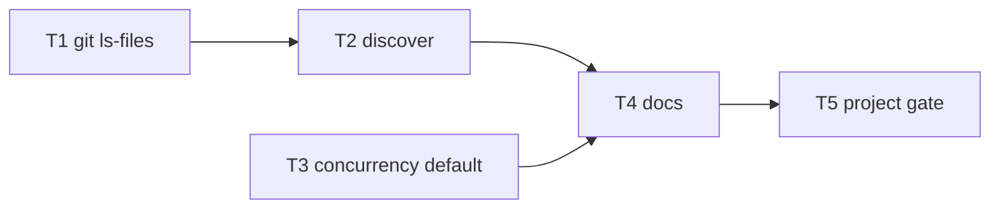

# Milestone 36 — Discovery & concurrency defaults Tasks

**Spec**: [`.specs/features/discovery-concurrency-defaults/spec.md`](./spec.md)  
**Design**: [`.specs/features/discovery-concurrency-defaults/design.md`](./design.md)  
**Context**: [`.specs/features/discovery-concurrency-defaults/context.md`](./context.md)  
**Status**: Done

---

## Execution Plan

### Phase 1: Parallel foundation

```
T1 [P]  listTrackedFiles (src/git)
T3 [P]  DEFAULT_WORKER_CONCURRENCY → 8 (pool)
```

### Phase 2: Discovery wiring

```
T1 → T2  discover prefer ls-files + fallback
```

### Phase 3: Docs + gate

```
T2 ─┐
    ├→ T4 docs → T5 full gate
T3 ─┘
```



### Diagram-Definition Cross-Check

| Task | Depends on (body) | Diagram | Status |
| ---- | ----------------- | ------- | ------ |
| T1 | None | Root parallel | ✅ Match |
| T2 | T1 | T1 → T2 | ✅ Match |
| T3 | None | Root parallel | ✅ Match |
| T4 | T2, T3 | T2/T3 → T4 | ✅ Match |
| T5 | T4 | T4 → T5 | ✅ Match |

### Path Conflict Check (Check 5)

| Task | Module owner | Paths | Conflict |
| ---- | ------------ | ----- | -------- |
| T1 | git | `src/git/ls-files.ts`, `src/git/ls-files.test.ts` (+ optional `src/git/index` export) | None vs T3 |
| T2 | complexity | `src/complexity/discover.ts`, `src/complexity/discover.test.ts` | After T1 only |
| T3 | complexity/pool | `src/complexity/pool.ts` (+ pool test assert if needed) | Disjoint from T1; do not edit `discover.ts` |
| T4 | docs | `README.md`, `.specs/codebase/{ARCHITECTURE,INTEGRATIONS,CONCERNS}.md`, `scripts/benchmark-scan.md` | After code tasks |
| T5 | gate | none (verify only) | After T4 |

### Test Co-location Validation

| Task | Code layer | Matrix requires | Task says | Status |
| ---- | ---------- | --------------- | --------- | ------ |
| T1 | Git adapter helper | unit (mock spawn) | unit `ls-files.test.ts` | ✅ OK |
| T2 | Complexity discover | unit | unit `discover.test.ts` | ✅ OK |
| T3 | Complexity pool constant | unit | unit assert on `DEFAULT_WORKER_CONCURRENCY` | ✅ OK |
| T4 | Docs | none | none | ✅ OK |
| T5 | Gate | full | `pnpm build && pnpm test` | ✅ OK |

### Requirement → Task Mapping

| Requirement ID | Task(s) |
| -------------- | ------- |
| HOTSPOT-400 | T2 |
| HOTSPOT-401 | T2 |
| HOTSPOT-402 | T2 |
| HOTSPOT-403 | T2 |
| HOTSPOT-404 | T1 |
| HOTSPOT-405 | T2 |
| HOTSPOT-406 | T3 |
| HOTSPOT-407 | T3 |
| HOTSPOT-408 | T4 |
| HOTSPOT-409 | T4 |
| HOTSPOT-410 | T4 |
| HOTSPOT-411 | T4 |
| HOTSPOT-412 | T2 |
| HOTSPOT-413 | T2 |

---

## Task Breakdown

### T1: Add `listTrackedFiles` git helper [P]

**What**: Implement `git -C <repo> ls-files -z` helper that returns posix-relative tracked paths; throw a typed/clear error on spawn failure or non-zero exit. Unit-test with mocked `child_process.spawn`.

**Where**: `src/git/ls-files.ts`, `src/git/ls-files.test.ts` (export from `src/git/` public surface only if needed by discover import path)

**Depends on**: None

**Reuses**: `src/git/spawn.ts` error/argv patterns; `src/git/spawn.test.ts` mock style

**Requirement**: HOTSPOT-404

**Tools**:

- Skill: `coding-guidelines`, `vitals-pipeline-domain`
- MCP: NONE

**Done when**:

- [x] `listTrackedFiles(repoPath)` spawns only inside `src/git/`
- [x] Argv includes `-C`, `ls-files`, `-z`
- [x] Null-delimited stdout parsed into path strings; separators normalized to `/`
- [x] Non-zero exit / spawn error rejects with repoPath context
- [x] Unit tests mock spawn — no real git required for the happy/error matrix
- [x] Gate check passes: `pnpm exec vitest run src/git/ls-files.test.ts`

**Tests**: unit  
**Gate**: `pnpm exec vitest run src/git/ls-files.test.ts`

**Commit** (propose only): `feat(git): add listTrackedFiles via git ls-files -z`

---

### T2: Prefer ls-files in discover with walk fallback

**What**: Update `discoverSourceFiles` to try `listTrackedFiles`, filter by eligible extensions + `isPathInScope`, sort; on failure fall back to existing walk. Keep injectable seam for tests. Extend `discover.test.ts` (non-git cases still pass; inject reject → walk; inject list → filter/scope/tracked-only).

**Where**: `src/complexity/discover.ts`, `src/complexity/discover.test.ts`

**Depends on**: T1

**Reuses**: T1 helper; `createPathScope` / `isPathInScope` / `shouldPruneDirectory`; existing walk

**Requirement**: HOTSPOT-400, HOTSPOT-401, HOTSPOT-402, HOTSPOT-403, HOTSPOT-405, HOTSPOT-412, HOTSPOT-413

**Tools**:

- Skill: `coding-guidelines`, `vitals-pipeline-domain`, `task-implementer`
- MCP: NONE

**Done when**:

- [x] Production path prefers Git listing before walk
- [x] Success path: extensions + PathScope + sorted posix relatives; empty Git list → `[]` (no walk merge)
- [x] Failure path: silent walk fallback; default excludes + include still honored
- [x] No `child_process` import in `discover.ts`
- [x] Existing non-git temp-dir tests still pass
- [x] New tests cover inject-success filter and inject-reject fallback
- [x] Gate check passes: `pnpm exec vitest run src/complexity/discover.test.ts`

**Tests**: unit  
**Gate**: `pnpm exec vitest run src/complexity/discover.test.ts`

**Commit** (propose only): `feat(complexity): prefer git ls-files for source discovery`

---

### T3: Raise `DEFAULT_WORKER_CONCURRENCY` cap to 8 [P]

**What**: Change `DEFAULT_WORKER_CONCURRENCY` to `Math.min(availableParallelism(), 8)`. Add/adjust a unit assertion that the exported constant matches that formula. Do not change pool dispatch algorithm, CLI parsing, or config merge logic beyond picking up the constant.

**Where**: `src/complexity/pool.ts`, `src/complexity/pool.test.ts` (or minimal assert colocated)

**Depends on**: None

**Reuses**: `merge-options.ts` already imports the constant; CLI override unchanged

**Requirement**: HOTSPOT-406, HOTSPOT-407

**Tools**:

- Skill: `coding-guidelines`
- MCP: NONE

**Done when**:

- [x] Cap literal is `8` (not `4`) in `pool.ts` only
- [x] `DEFAULT_WORKER_CONCURRENCY === Math.min(availableParallelism(), 8)`
- [x] Existing merge-options tests still pass without hardcoded `4`
- [x] Gate check passes: `pnpm exec vitest run src/complexity/pool.test.ts src/config/merge-options.test.ts`

**Tests**: unit  
**Gate**: `pnpm exec vitest run src/complexity/pool.test.ts src/config/merge-options.test.ts`

**Commit** (propose only): `feat(complexity): raise default worker concurrency cap to 8`

---

### T4: Update README, SoT docs, and benchmark notes

**What**: Document discovery preference (`git ls-files` + PathScope, walk fallback), new default `min(availableParallelism(), 8)`, memory vs `--concurrency` trade-off, and precedence CLI > config > default. Update living SoT + benchmark; do **not** rewrite archival M15/M28 feature context locks.

**Where**: `README.md`, `.specs/codebase/ARCHITECTURE.md`, `.specs/codebase/INTEGRATIONS.md`, `.specs/codebase/CONCERNS.md`, `scripts/benchmark-scan.md`

**Depends on**: T2, T3

**Reuses**: Existing README concurrency section (M28); ARCHITECTURE diagnostics / complexity parallelism sections

**Requirement**: HOTSPOT-408, HOTSPOT-409, HOTSPOT-410, HOTSPOT-411

**Tools**:

- Skill: `vitals-spec-driven` docs awareness only
- MCP: NONE

**Done when**:

- [x] README flag table + concurrency prose say cap **8** and memory guidance
- [x] ARCHITECTURE discovery + default concurrency statements updated (incl. ls-files preference)
- [x] INTEGRATIONS worker_threads default row says `min(availableParallelism(), 8)`
- [x] CONCERNS Performance bullet updated (cap 8 + override note)
- [x] `scripts/benchmark-scan.md` has an M36 note (discovery + default concurrency); still no CI timing gate
- [x] No edits to ROADMAP/STATE in this task (planner deferred; sync on Execute Done)

**Tests**: none  
**Gate**: none (docs-only; verified in T5)

**Commit** (propose only): `docs: document M36 discovery and concurrency defaults`

---

### T5: Full project quality gate

**What**: Run the mandatory project gate and confirm no regressions from T1–T4.

**Where**: repo root (no source edits expected)

**Depends on**: T4

**Reuses**: quality-gates / TESTING.md

**Requirement**: (verification for all HOTSPOT-400–413)

**Tools**:

- Agent (dev session): `verifier-quality-gates`
- Skill: `vitals-cli-validation` (optional smoke: `pnpm exec hotspot-scanner scan tests/fixtures/repos/small-ts --concurrency 1`)

**Done when**:

- [x] `pnpm build && pnpm test` exits 0
- [x] Coverage thresholds still met (per-file)
- [x] No silent test deletions (test count not unexpectedly down)

**Tests**: full suite  
**Gate**: `pnpm build && pnpm test`

**Commit**: none (verify only)

---

## Parallel Execution Map

```
Phase 1:
  ├── T1 [P]  src/git/ls-files
  └── T3 [P]  pool DEFAULT_WORKER_CONCURRENCY

Phase 2:
  T1 complete → T2 discover

Phase 3:
  T2 + T3 complete → T4 docs → T5 gate
```

**Parallelism constraint:** T1 and T3 are `[P]` (disjoint paths). T2 must not start until T1 lands. T4 waits for both T2 and T3.

---

## Handoff

Planning session ends here (**Status: Planned**).

Next (separate development session):

1. Promote Status to `Approved` or `Ready for Execute`
2. Invoke `orchestrator-implementer`
3. Final gate: `pnpm build && pnpm test`
4. ROADMAP/STATE sync deferred to Execute Done (not edited in planning)
