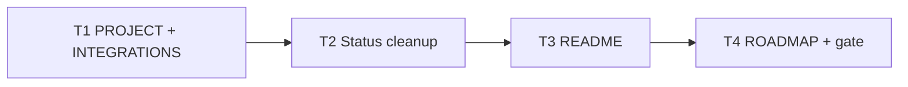

# Milestone 19 — Documentation Sync Tasks

**Spec**: [`.specs/features/docs-sync/spec.md`](./spec.md)  
**Status**: Done  
**Note**: Medium / docs-only — no `design.md`

---

## Execution Plan

```
T1 PROJECT + INTEGRATIONS → T2 status cleanup → T3 README → T4 ROADMAP/STACK consistency + gate
```



### Diagram-Definition Cross-Check

| Task | Depends on | Diagram | Match |
| ---- | ---------- | ------- | ----- |
| T1 | None | Root | ✅ |
| T2 | T1 | T1 → T2 | ✅ |
| T3 | T2 | T2 → T3 | ✅ |
| T4 | T3 | T3 → T4 | ✅ |

### Path Conflict Check

| Task | Module owner | Paths | Conflict |
| ---- | ------------ | ----- | -------- |
| T1 | docs | `PROJECT.md`, `INTEGRATIONS.md`, optionally `integrations.mdc` | Sequential |
| T2 | docs | `.specs/features/*/spec.md|design.md|tasks.md` Status fields; ROADMAP header | After T1 |
| T3 | docs | `README.md` | After T2 |
| T4 | docs | `ROADMAP.md`, `STACK.md` if needed | After T3 |

### Test Co-location Validation

| Task | Code layer | Matrix | Tests | Match |
| ---- | ---------- | ------ | ----- | ----- |
| T1–T4 | Docs only | none | Gate `pnpm build && pnpm test` (sanity; no code change expected) | ✅ |

---

## Task Breakdown

### T1: Sync PROJECT.md + INTEGRATIONS.md

**What**: Update PROJECT.md tech stack and scope for post-v1 + M7–M18 summary; fix INTEGRATIONS.md Git invocation to `child_process.spawn` only (remove simple-git as current option). Align `.cursor/rules/integrations.mdc` if it still presents simple-git as an equal alternative.

**Where**: `.specs/project/PROJECT.md`, `.specs/codebase/INTEGRATIONS.md`, `.cursor/rules/integrations.mdc` (if needed)

**Depends on**: None

**Reuses**: STATE.md decision `child_process.spawn` over simple-git; STACK.md spawn note

**Requirement**: HOTSPOT-153, HOTSPOT-156

**Done when**:

- [x] PROJECT.md has no simple-git; commander not TBD
- [x] PROJECT.md scope lists shipped post-v1 capabilities through M18 at summary level
- [x] INTEGRATIONS.md Git = spawn only

**Tests**: none

**Gate**: none (docs) — verify with grep

---

### T2: Fix stale Status on Done milestones

**What**: Correct `Status: Planned` (or Draft) to `Done` on feature artifacts for milestones ROADMAP marks complete — especially `csv-bundle` and any other Done feature still wrong. Fix ROADMAP header stale wording. Do not mark M14/M19–M24 Done.

**Where**: `.specs/features/csv-bundle/{spec,design,tasks}.md` (and other Done features as found), `.specs/project/ROADMAP.md` header

**Depends on**: T1

**Reuses**: ROADMAP `[x]` as SoT for Done

**Requirement**: HOTSPOT-154

**Done when**:

- [x] csv-bundle (and other verified Done) Status fields are `Done`
- [x] ROADMAP header not contradictory
- [x] Backlog Planned features untouched

**Tests**: none

**Gate**: none

---

### T3: Update README.md

**What**: Document full JSON (raw metrics, granularity/functions), `--top` ignored for JSON, `--baseline` compare overview, programmatic API (`runScan` / package exports), markdown output, and CSV **bundle** (M18: requires `--output`, multi-file + meta). Remove any M17 multi-block CSV as current behavior.

**Where**: `README.md`

**Depends on**: T2

**Reuses**: Existing CLI flag names from ARCHITECTURE / AGENTS.md

**Requirement**: HOTSPOT-155

**Done when**:

- [x] README sections/examples cover JSON, compare, API, markdown, csv bundle
- [x] No obsolete simple-git or pre-harmonic product formula as current score

**Tests**: none

**Gate**: none

---

### T4: ROADMAP M19 checklist + consistency + sanity gate

**What**: Mark M19 ROADMAP bullets `[x]` when complete; quick STACK.md consistency check; run `pnpm build && pnpm test` to ensure docs-only change did not disturb the tree.

**Where**: `.specs/project/ROADMAP.md`, `.specs/codebase/STACK.md` (only if stale)

**Depends on**: T3

**Requirement**: HOTSPOT-157

**Done when**:

- [x] M19 checklist items `[x]`
- [x] STACK/INTEGRATIONS/PROJECT agree on Git spawn
- [x] `pnpm build && pnpm test` passes

**Tests**: none (full gate sanity)

**Gate**: `pnpm build && pnpm test`

**Commit** (propose only): `docs: sync PROJECT, README, INTEGRATIONS with post-v1 reality`

---

## Requirement → Task map

| Requirement ID | Task |
| -------------- | ---- |
| HOTSPOT-153 | T1 |
| HOTSPOT-154 | T2 |
| HOTSPOT-155 | T3 |
| HOTSPOT-156 | T1 |
| HOTSPOT-157 | T4 |
