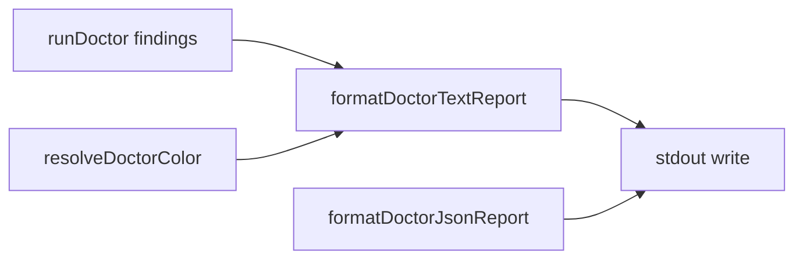

# Milestone 74 — Doctor Color UX Design

**Spec**: [`.specs/features/doctor-color-ux/spec.md`](./spec.md)  
**Context**: [`.specs/features/doctor-color-ux/context.md`](./context.md)  
**Status**: Specs Planned

---

## Architecture Overview

Presentation-only change for doctor **text** output. Domain findings from `runDoctor` stay unchanged. Color paint lives with existing ANSI helpers; text formatting moves from bin into `src/doctor/format.ts`; bin resolves enablement and writes stdout.



**Data flow:**

```
runDoctor → findings
resolveDoctorColor(format, noColor, envNoColor, stdoutIsTTY) → color: boolean
formatDoctorTextReport(findings, { color }) → string → stdout
```

JSON path unchanged: `formatDoctorJsonReport(result)` — never receives color.

---

## Code Reuse Analysis

| Component                  | Location                                     | How to use                                                                                  |
| -------------------------- | -------------------------------------------- | ------------------------------------------------------------------------------------------- |
| ANSI + `stripAnsi`         | `src/report/color.ts`                        | Add `paintDoctorStatus(status, enabled)`; reuse `RESET` / red / yellow; add green if needed |
| Table color gate           | `bin/hotspot-scanner.ts` `resolveTableColor` | Mirror as `resolveDoctorColor` with `format === "text"` allowlist; no `outputPath`          |
| JSON formatter             | `src/doctor/format.ts`                       | Keep; add text formatter alongside                                                          |
| Bin `formatDoctorFindings` | `bin/hotspot-scanner.ts`                     | Replace call sites with `formatDoctorTextReport`; delete local helper                       |
| Doctor CLI tests           | `bin/hotspot-scanner.test.ts`                | Extend `runCli doctor` cases; use `stripAnsi` where needed                                  |

### Fragile / concerns

| Concern                                                           | Mitigation                                                                                                                              |
| ----------------------------------------------------------------- | --------------------------------------------------------------------------------------------------------------------------------------- |
| Existing CLI regex `/pass:.*Node/` may break if ANSI splits oddly | Prefer `stripAnsi(stdout)` then assert; or assert `/pass:/` still matches (ANSI before word usually ok — still stripAnsi for stability) |
| Coupling doctor → report color module                             | Acceptable — same as table; no new dep. Do **not** put ANSI strings in `src/doctor/index.ts`                                            |
| Scan `--no-color` vs doctor `--no-color`                          | Separate commander options on each command; document both                                                                               |

---

## Components and Interfaces

### 1. `paintDoctorStatus`

**Location:** `src/report/color.ts`

```ts
import type { DoctorFindingStatus } from "../doctor/index.js";
// Prefer accepting "pass" | "warn" | "fail" string union to avoid report→doctor type cycle
// if package boundaries complain — Agent Discretion: string union matching DoctorFindingStatus

export function paintDoctorStatus(
  status: "pass" | "warn" | "fail",
  enabled: boolean,
): string {
  const prefix = `${status}:`;
  if (!enabled) return prefix;
  // pass → green, warn → yellow, fail → red + RESET
}
```

**Cycle note:** If importing doctor types into `src/report/` is undesirable, use the inline union above (no import). Prefer no cycle.

### 2. `formatDoctorTextReport`

**Location:** `src/doctor/format.ts`

```ts
export function formatDoctorTextReport(
  findings: DoctorFinding[],
  options?: { color?: boolean },
): string {
  const color = options?.color === true;
  const lines = findings.map(
    (f) => `${paintDoctorStatus(f.status, color)} ${f.message}`,
  );
  return `${lines.join("\n")}\n`;
}
```

Note: today the format is `` `${status}: ${message}` `` — painted prefix is `status:` then space then message (same visible shape).

### 3. `resolveDoctorColor`

**Location:** `bin/hotspot-scanner.ts` (export for unit tests, like `resolveTableColor`)

```ts
export function resolveDoctorColor(opts: {
  format: "text" | "json";
  noColor: boolean;
  envNoColor: string | undefined;
  stdoutIsTTY: boolean | undefined;
}): boolean {
  if (opts.format !== "text") return false;
  if (opts.noColor) return false;
  if (opts.envNoColor !== undefined && opts.envNoColor.length > 0) return false;
  if (opts.stdoutIsTTY !== true) return false;
  return true;
}
```

### 4. Doctor command wiring

- `.option("--no-color", "Disable ANSI colors in doctor text output")`
- In action: `const color = resolveDoctorColor({ format, noColor: Boolean(options.color === false) /* commander --no-color */, envNoColor: process.env.NO_COLOR, stdoutIsTTY: process.stdout.isTTY })`
- Commander maps `--no-color` to `options.color === false` when using default boolean negation — match how scan wires `--no-color` (read existing scan action).

---

## Test Plan

| Layer                                                | Coverage                                                                        |
| ---------------------------------------------------- | ------------------------------------------------------------------------------- |
| Unit `src/report/color.test.ts` (or extend existing) | `paintDoctorStatus` on/off for pass/warn/fail                                   |
| Unit `src/doctor/format.test.ts`                     | `formatDoctorTextReport` color true/false; `stripAnsi` equality; JSON unchanged |
| Unit bin                                             | `resolveDoctorColor` matrix (text/json, TTY, noColor, NO_COLOR)                 |
| CLI `bin/hotspot-scanner.test.ts`                    | doctor `--no-color`; JSON no ANSI; help lists flag                              |

Gate: `pnpm build && pnpm test`

---

## Hard Boundaries

- Do **not** change `runDoctor` finding messages or exit aggregation
- Do **not** bump doctor JSON `version`
- Do **not** add color deps to `package.json`
- Do **not** implement `FORCE_COLOR`
- Do **not** color scan/trend in this milestone
