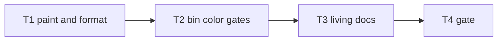

# Milestone 74 — Doctor Color UX Tasks

**Design**: [`.specs/features/doctor-color-ux/design.md`](./design.md)  
**Spec**: [`.specs/features/doctor-color-ux/spec.md`](./spec.md)  
**Context**: [`.specs/features/doctor-color-ux/context.md`](./context.md)  
**Status**: Done  
**Note**: Medium feature — color paint + doctor format + bin gates + docs. STOP at Planned; Execute in a separate session via `orchestrator-implementer` after Status promotion. Do **not** implement M73 `top-only-rollups` here.

---

## Execution Plan

### Phase 1: Paint + text formatter

```
T1 paintDoctorStatus + formatDoctorTextReport + unit tests
```

### Phase 2: Bin wiring

```
T1 → T2 resolveDoctorColor + doctor --no-color + CLI tests
```

### Phase 3: Docs + gate

```
T2 → T3 README / ARCHITECTURE / CONVENTIONS
T3 → T4 project gate
```



### Diagram-Definition Cross-Check

| Task | Depends on (body) | Diagram shows | Status |
| ---- | ----------------- | ------------- | ------ |
| T1 | None | Root | Match |
| T2 | T1 | T1→T2 | Match |
| T3 | T2 | T2→T3 | Match |
| T4 | T3 | T3→T4 | Match |

### Path Conflict Check (Check 5)

| Task | Module owner | Paths | Conflict |
| ---- | ------------ | ----- | -------- |
| T1 | report + doctor format | `src/report/color.ts`, `src/report/color.test.ts` (or co-located), `src/doctor/format.ts`, `src/doctor/format.test.ts` | Sole paint/format owner |
| T2 | bin | `bin/hotspot-scanner.ts`, `bin/hotspot-scanner.test.ts` | Sole CLI owner; may delete local `formatDoctorFindings` |
| T3 | docs | `README.md`, `.specs/codebase/ARCHITECTURE.md`, `.specs/codebase/CONVENTIONS.md` (brief) | After T2 |
| T4 | gate | none | After T3 |

No `[P]` — sequential owners.

### Test Co-location Validation

| Task | Code layer | TESTING.md expectation | Task Tests | Status |
| ---- | ---------- | ---------------------- | ---------- | ------ |
| T1 | `src/report/`, `src/doctor/` | unit | unit | OK |
| T2 | `bin/` | unit | unit | OK |
| T3 | docs | none | review checklist | OK |
| T4 | full project | gate | `pnpm build && pnpm test` | OK |

### Granularity Check

| Task | Scope | Status |
| ---- | ----- | ------ |
| T1 | Paint + text formatter + unit tests | Cohesive |
| T2 | Color resolve + `--no-color` + CLI tests | Cohesive |
| T3 | Living docs only | Cohesive |
| T4 | Project gate | Granular |

---

## Task Breakdown

### T1: `paintDoctorStatus` + `formatDoctorTextReport`

**What:** Add `paintDoctorStatus` in `src/report/color.ts` (green/yellow/red prefixes; no-op when disabled). Add `formatDoctorTextReport(findings, { color })` in `src/doctor/format.ts` producing `status: message` lines with optional ANSI on the prefix only. Unit-test paint and formatter; assert `stripAnsi(colored) === plain`. Do not change `formatDoctorJsonReport`.  
**Where:** `src/report/color.ts`, `src/report/color.test.ts` (create or extend), `src/doctor/format.ts`, `src/doctor/format.test.ts`  
**Depends on:** None  
**Reuses:** Existing ANSI constants / `stripAnsi` in `color.ts`; `DoctorFinding` type  
**Requirement:** HOTSPOT-1520, HOTSPOT-1521, HOTSPOT-1522  
**Module owner:** `src/report/` + `src/doctor/`

**Tools:**

- MCP: NONE
- Skill: `coding-guidelines`, `vitals-pipeline-domain` (light — doctor format only)

**Done when:**

- [x] `paintDoctorStatus` colors pass/warn/fail when enabled; plain when disabled
- [x] `formatDoctorTextReport` wraps only the `status:` prefix
- [x] `stripAnsi(formatDoctorTextReport(f, { color: true })) === formatDoctorTextReport(f, { color: false })`
- [x] JSON formatter tests still pass unchanged
- [x] Gate check passes: `pnpm test -- src/report/color.test.ts src/doctor/format.test.ts`
- [x] Test count: no silent deletions

**Tests:** unit  
**Gate:** `pnpm test -- src/report/color.test.ts src/doctor/format.test.ts`

**Verify:** Manual unit run; inspect one colored line contains `\x1b[` and stripAnsi equals plain.

**Commit:** `feat(doctor): paint status prefixes in text report`

---

### T2: `resolveDoctorColor` + doctor `--no-color` + CLI wiring

**What:** Export `resolveDoctorColor` (text + TTY + `--no-color` + `NO_COLOR`). Add `--no-color` on the doctor command. Wire doctor action to call `formatDoctorTextReport` with resolved color; remove bin-local `formatDoctorFindings`. Unit-test resolver matrix; extend `runCli doctor` tests (TTY on → ANSI when injectable; `--no-color` / `NO_COLOR` / json → plain; help lists flag). Prefer injecting stdout TTY the same way other bin tests inject env.  
**Where:** `bin/hotspot-scanner.ts`, `bin/hotspot-scanner.test.ts`  
**Depends on:** T1  
**Reuses:** `resolveTableColor` pattern; scan `--no-color` commander wiring  
**Requirement:** HOTSPOT-1523, HOTSPOT-1524, HOTSPOT-1525, HOTSPOT-1526, HOTSPOT-1527, HOTSPOT-1528  
**Module owner:** `bin/`

**Tools:**

- MCP: NONE
- Skill: `coding-guidelines`, `vitals-cli-validation`

**Done when:**

- [x] `resolveDoctorColor` matrix covered (text/json, TTY, noColor, NO_COLOR empty vs set)
- [x] Doctor `--no-color` registered and disables color on TTY
- [x] JSON doctor output has no ANSI
- [x] Existing doctor text assertions updated with `stripAnsi` if needed
- [x] Gate check passes: `pnpm test -- bin/hotspot-scanner.test.ts`
- [x] Test count: no silent deletions

**Tests:** unit  
**Gate:** `pnpm test -- bin/hotspot-scanner.test.ts`

**Verify:** `pnpm exec hotspot-scanner doctor --help` lists `--no-color`; CLI tests green.

**Commit:** `feat(cli): add doctor --no-color and TTY status colors`

---

### T3: Living docs (README + codebase)

**What:** Document doctor TTY status colors and disable rules (`--no-color`, `NO_COLOR`, non-TTY, JSON plain) in README doctor section; brief note in ARCHITECTURE (CLI color / doctor) and CONVENTIONS if they mention color. No pipeline doc churn.  
**Where:** `README.md`, `.specs/codebase/ARCHITECTURE.md`, `.specs/codebase/CONVENTIONS.md`  
**Depends on:** T2  
**Reuses:** Existing README “Colors” / doctor `--format` wording  
**Requirement:** HOTSPOT-1529, HOTSPOT-1530  
**Module owner:** docs

**Tools:**

- MCP: NONE
- Skill: `coding-guidelines`

**Done when:**

- [x] README mentions doctor text status colors + disable gates
- [x] ARCHITECTURE (and CONVENTIONS if applicable) note doctor color briefly
- [x] No contradictory “doctor never colors” claims left
- [x] Gate check: docs-only review (no code gate required beyond T4)

**Tests:** none  
**Gate:** review checklist

**Verify:** Grep README for doctor + color / `--no-color`.

**Commit:** `docs: document doctor TTY status colors`

---

### T4: Project quality gate

**What:** Run full project gate.  
**Where:** repo root  
**Depends on:** T3  
**Reuses:** AGENTS.md quality gate  
**Requirement:** (milestone success — all HOTSPOT-1520–1530)  
**Module owner:** gate

**Tools:**

- MCP: NONE
- Skill: none — invoke `verifier-quality-gates` or run gate inline

**Done when:**

- [x] `pnpm build && pnpm test` passes
- [x] Test count: no silent deletions vs pre-milestone baseline

**Tests:** full suite  
**Gate:** `pnpm build && pnpm test`

**Verify:** Gate output green.

**Commit:** (none — verification only; or chore if docs-only fixups needed)

---

## Parallelization Summary

| Flag | Tasks | Reason |
| ---- | ----- | ------ |
| none | T1→T2→T3→T4 | Sequential module ownership |

**Max parallel workers:** 1

---

## Requirement Coverage

| ID | Task |
| -- | ---- |
| HOTSPOT-1520 | T1 |
| HOTSPOT-1521 | T1 |
| HOTSPOT-1522 | T1 |
| HOTSPOT-1523 | T2 |
| HOTSPOT-1524 | T2 |
| HOTSPOT-1525 | T2 |
| HOTSPOT-1526 | T2 |
| HOTSPOT-1527 | T2 |
| HOTSPOT-1528 | T2 |
| HOTSPOT-1529 | T3 |
| HOTSPOT-1530 | T3 |

All mapped. Buffer/reserved IDs unassigned.
