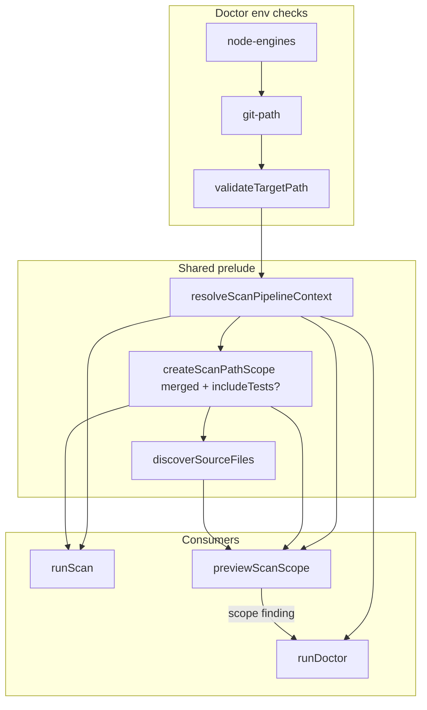

# Milestone 52 — Doctor Scope Parity Design

**Spec**: [`.specs/features/doctor-scope-parity/spec.md`](./spec.md)  
**Context**: [`.specs/features/doctor-scope-parity/context.md`](./context.md)  
**Status**: Planned  
**Depth**: Medium  
**Design SoT**: [ARCHITECTURE.md](../../codebase/ARCHITECTURE.md)

---

## Architecture Overview

Close the doctor ↔ scan prelude gap without new pipeline stages. Reuse M43 `resolveScanPipelineContext` and M39 `previewScanScope` inventory; add a thin shared PathScope builder so `includeTests` (M46) cannot diverge across entry points.



**Doctor flow (post-M52):**

1. `node-engines`, `git-path` (unchanged).
2. Validate target exists / is directory.
3. Build `ScanOptions`-shaped input: `{ repoPath: resolvedTarget, configPath?, includeTests? }`.
4. Call `resolveScanPipelineContext` → `git-repo` finding (pass/fail); on ConfigError → `config` fail.
5. Preserve M39 `config` soft-warn/pass messaging (request-path discovery).
6. On prelude success → `previewScanScope(same options)` → emit `scope` pass from preview fields (+ remount note from context/`remountWarning`).
7. `tsconfig` informational walk from **request path** (unchanged).
8. `aggregateExitCode` unchanged.

**YAGNI:** No new `src/scan-prelude.ts` file unless the shared helper would otherwise create a circular import; prefer exporting a small `createScanPathScope` next to existing scan/preview code.

---

## Code Reuse Analysis

### Existing Components to Leverage

| Component                                     | Location                               | How to Use                                            |
| --------------------------------------------- | -------------------------------------- | ----------------------------------------------------- |
| `resolveScanPipelineContext`                  | `src/scan.ts`                          | Doctor remount + merge + git-on-root                  |
| `previewScanScope` / `formatScanScopePreview` | `src/scan-preview.ts`                  | Eligible count + include/exclude for `scope` finding  |
| `createPathScope`                             | `src/paths/scope.ts`                   | Via shared helper; M46 adds `includeTests`            |
| `aggregateExitCode` / finding model           | `src/doctor/index.ts`                  | Extend `DoctorFindingId` with `"scope"`               |
| `monorepo-nested` fixture                     | `tests/fixtures/repos/monorepo-nested` | Nested doctor + dry-run parity                        |
| `formatDoctorFindings`                        | `bin/hotspot-scanner.ts`               | Unchanged (`status: message`); additive id OK for M51 |

### Integration Points

| System                 | Integration Method                                      |
| ---------------------- | ------------------------------------------------------- |
| M43 remount            | Prelude only — no workspace yaml                        |
| M39 doctor exit policy | Unchanged aggregate rules                               |
| M46 PathScope          | Optional `includeTests` through helper + doctor options |
| M51 doctor JSON        | Additive finding id; no format work in M52              |
| Commander              | Optional `--include-tests` on `doctor` when M46 Done    |

### Fragile / concern notes

| Area                      | Risk                                                  | Mitigation                                                                                        |
| ------------------------- | ----------------------------------------------------- | ------------------------------------------------------------------------------------------------- |
| `src/scan.ts` wiring      | Accidental pipeline order change                      | Helper only; no mine/AST reorder; integration tests untouched except PathScope args               |
| Duplicate PathScope sites | Silent eligible-count drift after M46                 | Single `createScanPathScope` used by runScan + preview                                            |
| Doctor calling preview    | Circular imports (`doctor` → `scan-preview` → `scan`) | Keep preview importing scan; doctor imports preview — avoid doctor←→scan cycles via index barrels |
| Config double-load        | Performance noise only                                | Acceptable; prefer clarity of soft-warn messages over micro-optimizing loads                      |

---

## Components

### 1. `createScanPathScope` (shared helper)

- **Purpose**: One PathScope construction site for scan + dry-run (+ doctor via preview).
- **Location**: Prefer `src/scan-preview.ts` or small export from `src/scan.ts` / `src/paths/` — implementer picks to avoid cycles; document in STRUCTURE.
- **Interfaces** (illustrative):

```typescript
export function createScanPathScope(
  merged: Pick<MergedScanConfig, "include" | "exclude">,
  options?: { includeTests?: boolean },
): PathScope {
  return createPathScope({
    include: merged.include,
    exclude: merged.exclude,
    // includeTests only when PathScopeOptions supports it (M46+)
    ...(options?.includeTests !== undefined
      ? { includeTests: options.includeTests }
      : {}),
  });
}
```

- **Wiring**: `runScan` and `previewScanScope` replace inline `createPathScope({ include, exclude })` with this helper; pass `options.includeTests` from `ScanOptions` when present.
- **Reuses**: `createPathScope` (M7/M30/M46).

### 2. `runDoctor` prelude + `scope` finding

- **Purpose**: Remount-aware git/config readiness + scope inventory parity.
- **Location**: `src/doctor/index.ts` (+ tests)
- **Interfaces**:

```typescript
export type DoctorFindingId =
  "node-engines" | "git-path" | "git-repo" | "config" | "tsconfig" | "scope"; // NEW

export interface RunDoctorOptions {
  targetPath: string;
  configPath?: string;
  enginesNode?: string;
  nodeVersion?: string;
  /** Forward-compat with M46; CLI when available */
  includeTests?: boolean;
}
```

- **Logic**:
  - Map options → `ScanOptions` fragment for prelude/preview.
  - On `resolveScanPipelineContext` success: `git-repo` pass message uses `pipelineRepoPath`; append remount hint when `remountWarning` set.
  - On git/path failure: `git-repo` fail; skip `scope`.
  - On success: `const preview = await previewScanScope(...)`; push `scope` pass built from preview (+ remount).
  - Keep `checkConfig` / `checkTsConfig` semantics from M39.
- **Dependencies**: `#scan` / `scan-preview`, config loader
- **Reuses**: `aggregateExitCode`, existing finding printer in bin

### 3. CLI doctor `--include-tests` (P2 / M46-gated)

- **Purpose**: CLI parity with scan dry-run for test inventory.
- **Location**: `bin/hotspot-scanner.ts`
- **Change**: When M46 has registered `--include-tests` on scan, add the same boolean on `doctor` and pass into `runDoctor({ includeTests })`.
- **Reuses**: `isExplicitCliOption` / boolean option pattern from M46 design.

### 4. Docs

- **Purpose**: ARCHITECTURE CLI table + monorepo section; STRUCTURE doctor row; README adoption blurb.
- **Location**: `.specs/codebase/ARCHITECTURE.md`, `STRUCTURE.md`, `README.md` (minimal)

---

## Data Models

No new JSON schema / `ScanResult` fields. Doctor domain only:

| Field                           | Change            |
| ------------------------------- | ----------------- |
| `DoctorFindingId`               | add `"scope"`     |
| `RunDoctorOptions.includeTests` | optional boolean  |
| `ScanScopePreview`              | unchanged (reuse) |

---

## Error Handling Strategy

| Error Scenario               | Handling                                          | User Impact         |
| ---------------------------- | ------------------------------------------------- | ------------------- |
| Target missing / not dir     | `git-repo` fail                                   | Exit `1`            |
| Not a git work tree          | Prelude throws / validate fails → `git-repo` fail | Exit `1`            |
| Invalid / missing `--config` | `config` fail                                     | Exit `2`            |
| Missing config on walk       | `config` warn + `scope` pass (defaults)           | Exit `0` if healthy |
| Zero eligible files          | `scope` pass with count `0`                       | Exit `0`            |
| Node / git PATH fail         | Existing findings                                 | Exit `1`            |

---

## Tech Decisions

| Decision               | Choice                                | Rationale                                                 |
| ---------------------- | ------------------------------------- | --------------------------------------------------------- |
| Inventory API          | Reuse `previewScanScope`              | Guarantees eligible-count parity; YAGNI second discoverer |
| PathScope helper       | Thin wrapper around `createPathScope` | Single place for M46 `includeTests`                       |
| Doctor CLI scope flags | Only optional `--include-tests`       | Full include/exclude tuning stays on `scan --dry-run`     |
| M51                    | Note only                             | JSON out of scope; additive finding id                    |
| New module file        | Avoid unless cycles force it          | Keep STRUCTURE simple                                     |

---

## Testing Strategy

| Layer                                | Focus                                                                                          |
| ------------------------------------ | ---------------------------------------------------------------------------------------------- |
| Unit `src/doctor/`                   | Nested remount pass; `scope` present; count matches preview; config warn preserved; exit codes |
| Unit `src/scan-preview` / `src/scan` | Helper used; `includeTests` forwarded when available                                           |
| CLI `bin/hotspot-scanner.test.ts`    | Doctor on `monorepo-nested` package path exit `0`; optional `--include-tests` forward          |
| Regression                           | `small-ts` doctor healthy; non-git fail                                                        |

**Gate:** Per-task Vitest targets; final `pnpm build && pnpm test`.

---

## Risks

| Risk               | Mitigation                                                                             |
| ------------------ | -------------------------------------------------------------------------------------- |
| Execute before M46 | Helper uses optional spread; tests for `includeTests` gated or assert “when supported” |
| Message flakiness  | Assert finding `id` + eligible count / repo path substrings, not full prose snapshots  |
| Double config load | Documented; soft-warn clarity wins                                                     |
