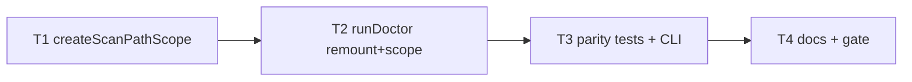

# Milestone 52 — Doctor Scope Parity Tasks

**Design**: [`.specs/features/doctor-scope-parity/design.md`](./design.md)  
**Spec**: [`.specs/features/doctor-scope-parity/spec.md`](./spec.md)  
**Context**: [`.specs/features/doctor-scope-parity/context.md`](./context.md)  
**Status**: Done

---

## Execution Plan

```
T1 shared PathScope helper ──→ T2 runDoctor prelude + scope ──→ T3 tests / CLI ──→ T4 docs + full gate
```



### Diagram-Definition Cross-Check

| Task | Depends on (body) | Diagram shows | Status |
| ---- | ----------------- | ------------- | ------ |
| T1 | None | Root | ✅ Match |
| T2 | T1 | T1→T2 | ✅ Match |
| T3 | T2 | T2→T3 | ✅ Match |
| T4 | T3 | T3→T4 | ✅ Match |

### Path Conflict Check (Check 5)

| Task | Module owner | Paths | Conflict |
| ---- | ------------ | ----- | -------- |
| T1 | `src/scan.ts` + `src/scan-preview.ts` | shared helper + call sites | Sole owner of PathScope wiring |
| T2 | `src/doctor/` | `index.ts` + doctor tests | After T1; does not edit scan PathScope sites |
| T3 | `src/doctor/` + `bin/` tests | doctor tests, `bin/hotspot-scanner.test.ts` (+ CLI flag if M46) | After T2; may touch bin only for doctor flag / assertions |
| T4 | docs | ARCHITECTURE, STRUCTURE, README | After T3 |

### Test Co-location Validation

| Task | Code layer | Matrix / TESTING.md | Task Tests | Status |
| ---- | ---------- | ------------------- | ---------- | ------ |
| T1 | `src/scan.ts` / `src/scan-preview.ts` | unit co-located | unit | ✅ OK |
| T2 | `src/doctor/` | unit co-located | unit | ✅ OK |
| T3 | doctor + CLI | unit + CLI | unit + CLI | ✅ OK |
| T4 | docs | none | none + full gate | ✅ OK |

### Granularity Check

| Task | Scope | Status |
| ---- | ----- | ------ |
| T1 | One helper + wire two call sites | ✅ Granular |
| T2 | Doctor prelude + `scope` finding | ✅ Cohesive doctor slice |
| T3 | Parity / fixture / CLI assertions | ✅ Granular |
| T4 | Docs + project gate | ✅ Granular |

---

## Task Breakdown

### T1: Shared `createScanPathScope` + wire runScan / preview

**What**: Introduce a shared PathScope builder that accepts merged include/exclude and optional `includeTests`; replace inline `createPathScope` in `runScan` and `previewScanScope`.

**Where**: `src/scan.ts`, `src/scan-preview.ts` (and/or tiny helper module if cycles require), co-located tests (`src/scan-preview.test.ts` and/or `src/scan.test.ts`)

**Depends on**: None

**Reuses**: `createPathScope` (`src/paths/scope.ts`); M46 `includeTests` option when present

**Requirement**: HOTSPOT-804, HOTSPOT-807, HOTSPOT-814

**Tools**:

- MCP: NONE
- Skill: `coding-guidelines`, `vitals-pipeline-domain`

**Done when**:

- [x] Shared helper used by both `runScan` and `previewScanScope`
- [x] `ScanOptions.includeTests` (if typed) forwarded into PathScope; if M46 not landed, helper still typechecks and preserves current exclude behavior
- [x] Existing dry-run / scan unit tests updated if signatures change
- [x] Gate check passes: `pnpm exec vitest run src/scan-preview.test.ts src/scan.test.ts`
- [x] Test count: no silent deletions

**Tests**: unit  
**Gate**: `pnpm exec vitest run src/scan-preview.test.ts src/scan.test.ts`

**Verify**:

```bash
pnpm exec vitest run src/scan-preview.test.ts src/scan.test.ts
```

**Commit**: `refactor(scan): share PathScope builder for prelude parity`

---

### T2: `runDoctor` uses prelude + emit `scope` finding

**What**: Wire `runDoctor` through `resolveScanPipelineContext` for remount-aware `git-repo`; on success call `previewScanScope` and emit `scope` pass; preserve M39 config/tsconfig/exit policy; extend `DoctorFindingId` + `RunDoctorOptions.includeTests`.

**Where**: `src/doctor/index.ts`, `src/doctor/index.test.ts`

**Depends on**: T1

**Reuses**: `resolveScanPipelineContext`, `previewScanScope`, `aggregateExitCode`, [context.md](./context.md) locked messages intent

**Requirement**: HOTSPOT-800, HOTSPOT-801, HOTSPOT-802, HOTSPOT-803, HOTSPOT-805, HOTSPOT-806, HOTSPOT-808, HOTSPOT-809, HOTSPOT-810

**Tools**:

- MCP: NONE
- Skill: `coding-guidelines`, `vitals-pipeline-domain`

**Done when**:

- [x] Nested package path without local `.git` passes `git-repo` via remount
- [x] `git-repo` message names pipeline git root when remounted
- [x] `scope` finding present on healthy runs; eligible count matches `previewScanScope` for same options
- [x] Zero eligible → `scope` pass; missing config → soft warn preserved; exit policy unchanged
- [x] No mine/AST/scorer calls from doctor path
- [x] Gate check passes: `pnpm exec vitest run src/doctor/`
- [x] Test count: no silent deletions

**Tests**: unit  
**Gate**: `pnpm exec vitest run src/doctor/`

**Verify**:

```bash
pnpm exec vitest run src/doctor/
```

**Commit**: `feat(doctor): align remount and scope with scan prelude`

---

### T3: Fixture parity + CLI wiring

**What**: Add/extend tests so `doctor` on `monorepo-nested` package path exits `0` with remount/`scope`; assert eligible-count parity vs dry-run; wire doctor `--include-tests` when M46 CLI exists; keep `small-ts` regression.

**Where**: `src/doctor/index.test.ts`, `bin/hotspot-scanner.ts` (doctor `--include-tests` if M46 Done), `bin/hotspot-scanner.test.ts`

**Depends on**: T2

**Reuses**: `tests/fixtures/repos/monorepo-nested`, `small-ts`; existing CLI doctor describe blocks

**Requirement**: HOTSPOT-801, HOTSPOT-806, HOTSPOT-813, HOTSPOT-815

**Tools**:

- MCP: NONE
- Skill: `coding-guidelines`, `vitals-cli-validation`

**Done when**:

- [x] Doctor CLI (or domain) on nested package path exit `0`
- [x] Eligible count parity covered (unit and/or CLI)
- [x] If M46 Done: `--include-tests` on doctor forwards and changes count consistently with dry-run; else document deferral in task notes and skip CLI flag only
- [x] `small-ts` doctor still healthy
- [x] Gate check passes: `pnpm exec vitest run src/doctor/ bin/hotspot-scanner.test.ts`
- [x] Test count: no silent deletions

**Tests**: unit + CLI  
**Gate**: `pnpm exec vitest run src/doctor/ bin/hotspot-scanner.test.ts`

**Verify**:

```bash
pnpm exec vitest run src/doctor/ bin/hotspot-scanner.test.ts
pnpm exec hotspot-scanner doctor tests/fixtures/repos/monorepo-nested/packages/api
# (adjust nested package subpath to fixture layout)
pnpm exec hotspot-scanner scan tests/fixtures/repos/monorepo-nested/packages/api --dry-run
```

**Commit**: `test(doctor): cover monorepo remount and dry-run scope parity`

---

### T4: Docs + full project gate

**What**: Update ARCHITECTURE (doctor uses prelude; scope finding), STRUCTURE, README adoption path (package-cwd doctor); note M51 additive `scope` id; run full quality gate.

**Where**: `.specs/codebase/ARCHITECTURE.md`, `.specs/codebase/STRUCTURE.md`, `README.md` (minimal), optionally STATE decision row if Execute adds locks

**Depends on**: T3

**Reuses**: Existing M39/M43 doc sections

**Requirement**: HOTSPOT-811, HOTSPOT-812

**Tools**:

- MCP: NONE
- Skill: `coding-guidelines`

**Done when**:

- [x] ARCHITECTURE documents doctor ↔ `resolveScanPipelineContext` / dry-run scope parity
- [x] STRUCTURE notes shared helper / `scope` finding
- [x] README does not claim package-cwd doctor requires local `.git`
- [x] M51 sister note: `scope` additive for future JSON (no JSON shipped here)
- [x] Gate check passes: `pnpm build && pnpm test`
- [x] Test count: no silent deletions vs pre-feature baseline

**Tests**: none (docs) + full gate  
**Gate**: `pnpm build && pnpm test` (`deferred_project_gate` for feature Done)

**Verify**:

```bash
pnpm build && pnpm test
```

**Commit**: `docs: sync doctor scope parity with architecture`

---

## Parallel Execution Map

```
Phase 1 (Sequential):
  T1 ──→ T2 ──→ T3 ──→ T4
```

No `[P]` tasks — T1–T2 share prelude semantics; T3 depends on doctor behavior; T4 is docs/gate.

---

## Requirement → Task Mapping

| Requirement ID | Task(s) |
| -------------- | ------- |
| HOTSPOT-800 | T2 |
| HOTSPOT-801 | T2, T3 |
| HOTSPOT-802 | T2 |
| HOTSPOT-803 | T2 |
| HOTSPOT-804 | T1 |
| HOTSPOT-805 | T2 |
| HOTSPOT-806 | T2, T3 |
| HOTSPOT-807 | T1 |
| HOTSPOT-808 | T2 |
| HOTSPOT-809 | T2 |
| HOTSPOT-810 | T2 |
| HOTSPOT-811 | T4 |
| HOTSPOT-812 | T4 |
| HOTSPOT-813 | T3 |
| HOTSPOT-814 | T1 |
| HOTSPOT-815 | T3 |
| HOTSPOT-816–819 | Reserved |

**Unmapped P1:** none.

---

## Handoff

Planning session ends here (**Status: Planned**). Promote to `Approved` / `Ready for Execute`, then open a **new** development session and invoke `orchestrator-implementer`.

Suggested Execute order relative to sisters: **M46 Done first** (PathScope test defaults), then M52. If M46 is not Done, ship T1–T2–T3 remount/`scope` without CLI `--include-tests`, and complete HOTSPOT-813 when M46 lands.
