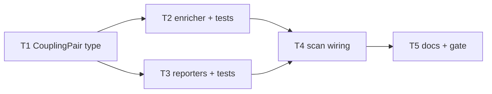

# Milestone 14 — Enriched Coupling Tasks

**Design**: [`.specs/features/enriched-coupling/design.md`](./design.md)  
**Spec**: [`.specs/features/enriched-coupling/spec.md`](./spec.md)  
**Context**: [`.specs/features/enriched-coupling/context.md`](./context.md)  
**Status**: Done

---

## Execution Plan

### Phase 1: Types + enricher (Sequential)

```
T1 domain type → T2 enrichCouplingStaticDeps + unit tests
```

### Phase 2: Reporters (Sequential after T1)

```
T1 → T3 reporter columns/fields + unit tests
```

### Phase 3: Pipeline + integration (Sequential)

```
T2, T3 → T4 scan wiring + integration
```

### Phase 4: Docs + gate (Sequential)

```
T4 → T5 documentation + full gate
```



### Diagram-Definition Cross-Check

| Task | Depends on (declared) | Appears in diagram after deps | Match |
| ---- | --------------------- | ----------------------------- | ----- |
| T1   | None                  | Root                          | ✅    |
| T2   | T1                    | T1 → T2                       | ✅    |
| T3   | T1                    | T1 → T3                       | ✅    |
| T4   | T2, T3                | T2/T3 → T4                    | ✅    |
| T5   | T4                    | T4 → T5                       | ✅    |

### Path Conflict Check

| Task | Module owner   | Paths                                                                          | Conflict with parallel peers          |
| ---- | -------------- | ------------------------------------------------------------------------------ | ------------------------------------- |
| T1   | `src/types/`   | `domain.ts`                                                                    | N/A sequential root                   |
| T2   | `src/scoring/` | `enrich-coupling-static.ts`, `*.test.ts`, maybe export from `scoring/index.ts` | Disjoint from T3                      |
| T3   | `src/report/`  | table/markdown/csv/compare-* + fixtures                                        | Disjoint from T2 — **[P] OK with T2** |
| T4   | `src/scan.ts`  | `scan.ts`, integration tests                                                   | After T2+T3                           |
| T5   | docs           | ARCHITECTURE, README, STRUCTURE, ROADMAP                                       | After T4                              |

> T2 and T3 may run in parallel after T1 (`[P]` on T3).

### Test Co-location Validation

| Task | Code layer     | TESTING.md expectation        | Tests in same task                   | Match |
| ---- | -------------- | ----------------------------- | ------------------------------------ | ----- |
| T1   | `src/types/`   | none (excluded from coverage) | Type-only; consumers tested in T2–T4 | ✅    |
| T2   | `src/scoring/` | Unit required                 | `enrich-coupling-static.test.ts`     | ✅    |
| T3   | `src/report/`  | Unit required                 | Existing reporter tests updated      | ✅    |
| T4   | `src/scan.ts`  | Integration                   | scan/integration or fixture assert   | ✅    |
| T5   | Docs           | Gate                          | `pnpm build && pnpm test`            | ✅    |

---

## Task Breakdown

### T1: Add `hasStaticDependency` to CouplingPair

**What**: Extend `CouplingPair` in `src/types/domain.ts` with `hasStaticDependency: boolean`. Update any compile-breaking fixtures/types exports as needed for the typecheck of dependent stubs (prefer minimal: leave scorer returning without field until T2 if TS allows temporary cast — **prefer** making enrich the sole producer of complete pairs; T2 updates scorer call site).

**Where**: `src/types/domain.ts` (and `src/types/index.ts` if re-exports need touch — usually none)

**Depends on**: None

**Reuses**: Existing `CouplingPair` shape

**Requirement**: HOTSPOT-145

**Tools**:

- MCP: NONE
- Skill: NONE

**Done when**:

- [x] `CouplingPair` includes `hasStaticDependency: boolean`
- [x] `pnpm build` succeeds **or** only expected breakages are in scoring/report until T2/T3 (prefer fix scorer to set `false` temporarily in T1 if that keeps build green)

**Tests**: none (types layer)

**Gate**: `pnpm exec tsc --noEmit` or `pnpm build` if T1 sets temporary `false` in scorer

---

### T2: Implement static-dependency enricher [P with T3 after T1]

**What**: Add `enrichCouplingStaticDeps` per design/context (relative import/export/require resolution; missing file → `false`). Unit tests for true/false/missing/package-only. Keep `scoreCoupling` formula untouched — either enrich copies pairs or scorer sets placeholder `false` and enrich overwrites.

**Where**: `src/scoring/enrich-coupling-static.ts`, `src/scoring/enrich-coupling-static.test.ts`, `src/scoring/index.ts` (export), optionally `coupling-scorer.ts` only if placeholder `false` required

**Depends on**: T1

**Reuses**: [context.md](./context.md) resolution rules; repo-relative paths as stored on pairs

**Requirement**: HOTSPOT-146, HOTSPOT-147, HOTSPOT-152

**Tools**:

- MCP: NONE
- Skill: `vitals-pipeline-domain`

**Done when**:

- [x] Enricher sets correct boolean for fixture sources
- [x] Missing/unreadable → `false`, no throw
- [x] Bare package import alone does not yield `true` for unrelated peer
- [x] No ts-morph imports under `src/scoring/`
- [x] Gate check passes: targeted vitest for enricher
- [x] Test count: enricher tests pass (no silent deletions)

**Tests**: unit — `enrich-coupling-static.test.ts`

**Gate**: `pnpm exec vitest run src/scoring/enrich-coupling-static.test.ts`

---

### T3: Reporter surfaces for hasStaticDependency [P with T2 after T1]

**What**: Show `hasStaticDependency` in JSON (passthrough), table, markdown, CSV coupling, and compare coupling renderers. Update report fixtures and unit tests.

**Where**: `src/report/table.ts`, `markdown.ts`, `csv.ts`, `compare-table.ts`, `compare-markdown.ts`, `compare-csv.ts`, related `*.test.ts`, `tests/fixtures/report/*` as needed

**Depends on**: T1

**Reuses**: Existing column layout patterns

**Requirement**: HOTSPOT-148, HOTSPOT-149, HOTSPOT-150, HOTSPOT-152

**Tools**:

- MCP: NONE
- Skill: NONE

**Done when**:

- [x] JSON coupling objects include the field in reporter fixtures
- [x] Table/markdown show yes/no (or equivalent) column
- [x] CSV header includes `hasStaticDependency`
- [x] Compare coupling rows include the field/column
- [x] Reporter unit tests updated and green

**Tests**: unit — affected `src/report/*.test.ts`

**Gate**: `pnpm exec vitest run src/report/`

---

### T4: Wire enricher in runScan + integration

**What**: Call enricher from `src/scan.ts` after coupling score. Add/adjust integration assertion on fixture repo (import-linked vs not). Ensure programmatic `runScan` output includes field.

**Where**: `src/scan.ts`, relevant `src/scan*.test.ts` / `bin/*.integration.test.ts`, fixture sources under `tests/fixtures/` if a pair must be added

**Depends on**: T2, T3

**Reuses**: `onWarning` hook optional for read failures

**Requirement**: HOTSPOT-151, HOTSPOT-152

**Tools**:

- MCP: NONE
- Skill: `vitals-cli-validation`

**Done when**:

- [x] `runScan()` coupling entries always have boolean set
- [x] Integration/fixture covers at least one `true` and one `false` case (or documented fixture limitation with unit coverage compensating)
- [x] Ranking order of pairs unchanged for same temporal inputs
- [x] Targeted tests pass

**Tests**: integration + any scan unit tests

**Gate**: `pnpm exec vitest run src/scan.ts src/scoring/ bin/hotspot-scanner.integration.test.ts` (adjust to actual test file names)

---

### T5: Documentation sync + full gate

**What**: Document enriched coupling in ARCHITECTURE (data flow), README (JSON field / table column), STRUCTURE if new file listed, STATE already has planning note. Mark ROADMAP M14 items complete only after Execute — this task updates docs for the feature behavior.

**Where**: `.specs/codebase/ARCHITECTURE.md`, `README.md`, `.specs/codebase/STRUCTURE.md` (if needed), `.specs/project/ROADMAP.md` (Execute updates checkboxes)

**Depends on**: T4

**Reuses**: M9/M11 doc sync style

**Requirement**: HOTSPOT-152

**Tools**:

- MCP: NONE
- Skill: NONE

**Done when**:

- [x] Docs mention `hasStaticDependency`
- [x] Full gate passes: `pnpm build && pnpm test`
- [x] No silent test deletions

**Tests**: none (docs) — full suite via gate

**Gate**: `pnpm build && pnpm test`

**Commit** (propose only): `feat(scoring): enrich coupling pairs with hasStaticDependency`

---

## Parallel Execution Map

```
Phase 1: T1
Phase 2 (parallel): T2 [P], T3 [P]
Phase 3: T4
Phase 4: T5
```

**Parallelism constraint:** T2 (`src/scoring/`) and T3 (`src/report/`) are disjoint path prefixes; unit tests parallel-safe.

---

## Requirement → Task map

| Requirement ID | Task           |
| -------------- | -------------- |
| HOTSPOT-145    | T1             |
| HOTSPOT-146    | T2             |
| HOTSPOT-147    | T2             |
| HOTSPOT-148    | T3             |
| HOTSPOT-149    | T3             |
| HOTSPOT-150    | T3             |
| HOTSPOT-151    | T4             |
| HOTSPOT-152    | T2, T3, T4, T5 |
