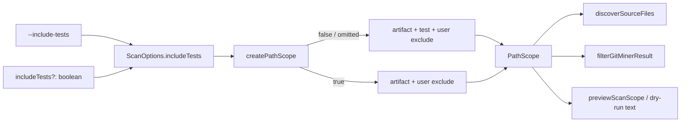

# Milestone 46 — Exclude Tests by Default Design

**Spec**: [`.specs/features/exclude-tests-by-default/spec.md`](./spec.md)  
**Context**: [`.specs/features/exclude-tests-by-default/context.md`](./context.md)  
**Status**: Planned  
**Depth**: Large

---

## Architecture Overview

Single choke point: `createPathScope` decides which built-in exclude lists apply. Scan orchestration and dry-run already build one `PathScope` and pass it to discovery + git filter — no second filter path. CLI forwards a boolean onto `ScanOptions` (not config merge).



**Breaking change (intentional):** default `PathScope.excludes` grows by `DEFAULT_TEST_EXCLUDE_PATTERNS`. Rankings and `eligibleFileCount` shrink when tests previously dominated. JSON contract unchanged.

---

## Code Reuse Analysis

### Existing Components to Leverage

| Component | Location | How to Use |
| --------- | -------- | ---------- |
| `createPathScope` / `isPathInScope` / `shouldPruneDirectory` | `src/paths/scope.ts` | Split constants; add `includeTests` to `PathScopeOptions` |
| `DEFAULT_EXCLUDE_PATTERNS` consumers / tests | `src/paths/scope.test.ts`, ARCHITECTURE | Update assertions; keep export name as full defaults |
| `runScan` PathScope build | `src/scan.ts` | Pass `includeTests: options.includeTests` |
| `previewScanScope` | `src/scan-preview.ts` | Same wiring + preview line |
| `buildScanOptions` / `executeScan` / `executeCompareAndRender` | `bin/scan-actions.ts` | Forward boolean like diagnostics options (not `HotspotScannerConfig`) |
| Commander flag pattern | `bin/hotspot-scanner.ts` | Mirror `--quiet` / `--dry-run` boolean options on scan + baseline save + compare |
| Config merge | `src/config/merge-options.ts` | **Do not** add `includeTests` key |

### Integration Points

| System | Integration Method |
| ------ | ------------------ |
| PathScope (M7/M30) | Extend options; preserve exclude-wins-over-include |
| Dry-run (M39) | Surface policy in `formatScanScopePreview` |
| Workflow verbs (M40) | Same flag on `baseline save` / `compare` via shared scan-actions |
| picomatch | Unchanged dependency; verify `__tests__` prune in unit tests |

### Fragile / concern notes

| Area | Risk | Mitigation |
| ---- | ---- | ---------- |
| PathScope is shared filter for git + complexity | Wrong default → silent ranking drift | Co-located unit tests on patterns + prune; CLI forward tests |
| Baseline/compare migration | Pre-M46 baselines include tests | Docs note expected “removed” test deltas; no schema migration |
| Over-exclusion | Excluding `testing/` dirs by name | Patterns are suffix/`__tests__` only — edge case in spec |

---

## Components

### 1. Path scope constants + `includeTests`

- **Purpose**: Split artifact vs test defaults; build exclude list based on opt-in.
- **Location**: `src/paths/scope.ts`, re-exports in `src/paths/index.ts`
- **Interfaces**:

```typescript
export const DEFAULT_ARTIFACT_EXCLUDE_PATTERNS = [ /* current M7/M30 list */ ] as const;

export const DEFAULT_TEST_EXCLUDE_PATTERNS = [
  "**/*.test.ts",
  "**/*.test.tsx",
  "**/*.test.js",
  "**/*.test.jsx",
  "**/*.spec.ts",
  "**/*.spec.tsx",
  "**/*.spec.js",
  "**/*.spec.jsx",
  "**/__tests__/**",
] as const;

export const DEFAULT_EXCLUDE_PATTERNS = [
  ...DEFAULT_ARTIFACT_EXCLUDE_PATTERNS,
  ...DEFAULT_TEST_EXCLUDE_PATTERNS,
] as const;

export interface PathScopeOptions {
  include?: string[];
  exclude?: string[];
  /** When true, omit DEFAULT_TEST_EXCLUDE_PATTERNS. Default false. */
  includeTests?: boolean;
}
```

- **Logic**:
  - `builtIn = includeTests ? ARTIFACT : [...ARTIFACT, ...TEST]`
  - `allExcludes = [...builtIn, ...userExcludes]`
- **Prune note**: Unit-test `shouldPruneDirectory("src/__tests__")` / `"__tests__"`. If `**/__tests__/**` alone fails prune for the bare directory name, add the minimal extra pattern needed (document in task notes) — do not expand file suffixes.
- **Reuses**: Existing picomatch matcher compilation.

### 2. `ScanOptions.includeTests`

- **Purpose**: Programmatic API parity with CLI.
- **Location**: `src/types/domain.ts`
- **Interfaces**: optional `includeTests?: boolean` on `ScanOptions` (not on `ScanMeta`, not on config types).
- **Dependencies**: Consumed only by `runScan` / `previewScanScope` when calling `createPathScope`.
- **Reuses**: Same optional-boolean style as other CLI-forwarded fields that skip config (contrast: `concurrency` is config-backed).

### 3. Scan + preview wiring

- **Purpose**: One PathScope policy for mine and dry-run.
- **Location**: `src/scan.ts`, `src/scan-preview.ts`
- **Interfaces**:
  - `createPathScope({ include: merged.include, exclude: merged.exclude, includeTests: options.includeTests })`
  - Extend `ScanScopePreview` with `includeTests: boolean` (or derive display-only from options)
  - `formatScanScopePreview` lines (locked phrasing):

```
default excludes: always on
test files: excluded   # or: test files: included
```

  Keep existing `default excludes: always on` (artifact+test policy when excluded; when included, still true for artifacts). Do not dump full pattern lists into dry-run (YAGNI).

### 4. CLI / scan-actions

- **Purpose**: Parse and forward `--include-tests` without polluting config types.
- **Location**: `bin/hotspot-scanner.ts`, `bin/scan-actions.ts`
- **Interfaces**:
  - Add `.option("--include-tests", "…")` to `scan`, `baseline save`, `compare`
  - Extend `buildScanOptions` / `executeScan` / compare helpers to accept `includeTests?: boolean` on the options bag (alongside `quiet` / `noProgress`), set `scanOptions.includeTests`
  - Do **not** put `includeTests` on `HotspotScannerConfig`
- **Reuses**: Existing boolean option + help text patterns from M38/M39.

### 5. Docs

- **Purpose**: Align product docs with new default.
- **Location**: `.specs/codebase/ARCHITECTURE.md`, `README.md`, `docs/recipes.md`, `.specs/project/STATE.md`
- **Reuses**: M30/M7 PathScope wording; M45 recipes structure.

---

## Data Models

No new JSON Schema fields. `ScanResult` / `CompareResult` unchanged.

`ScanScopePreview` gains a boolean (or equivalent) for test policy display only — not persisted.

---

## Error Handling Strategy

| Error Scenario | Handling | User Impact |
| -------------- | -------- | ----------- |
| Unknown config key `includeTests` in JSON | Unchanged M21 validation — do not add key; if unknown keys already error, leave as-is | No new config surface |
| Pre-M46 baseline vs post-M46 default scan | Compare runs normally | Many “removed” test entities — documented |
| Invalid CLI (no new failure modes) | N/A | Boolean flag only |

---

## Tech Decisions

| Decision | Choice | Rationale |
| -------- | ------ | --------- |
| Split constants vs single list + filter | Split artifact + test | Clear mental model; matches user lock; easy `includeTests` |
| Config key | None | Same category as `--quiet` / `--dry-run` |
| Lift semantics | Only built-in test list | User excludes stay additive (M7) |
| Fixture repo | None | Scope unit tests sufficient (YAGNI) |
| Dry-run line | `test files: excluded\|included` | Stable, greppable; no pattern dump |
| Order of `DEFAULT_EXCLUDE_PATTERNS` | Artifact then test | Predictable; updates `scope.test.ts` equality |

---

## Test Plan (design-level)

| Surface | Focus |
| ------- | ----- |
| `src/paths/scope.test.ts` | Constant composition; default exclude of `*.test.ts` / `*.spec.tsx` / `__tests__`; `includeTests: true` includes those; user exclude still wins; prune `__tests__` |
| `src/scan-preview.test.ts` | Preview line + eligible count with/without includeTests |
| `bin/hotspot-scanner.test.ts` | Flag on scan help; forward on scan / baseline save / compare |
| Optional smoke | Dogfood `scan . --top 10` vs `--include-tests` (manual / noted in tasks Verify) |

Full gate: `pnpm build && pnpm test`.

---

## Out of Scope (design)

- Changing exemplar `.hotspot-scanner.json` exclude array (empty remains correct — tests are implicit defaults)
- Rewriting M7 patterns to different glob forms beyond test set
- Historical AST / scoring changes
