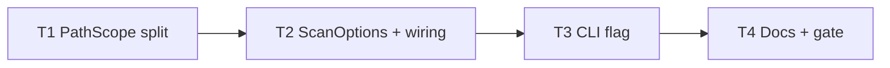

# Milestone 46 — Exclude Tests by Default Tasks

**Design**: [`.specs/features/exclude-tests-by-default/design.md`](./design.md)  
**Spec**: [`.specs/features/exclude-tests-by-default/spec.md`](./spec.md)  
**Context**: [`.specs/features/exclude-tests-by-default/context.md`](./context.md)  
**Status**: Done

---

## Execution Plan

```
T1 scope constants ──→ T2 ScanOptions + runScan/preview ──→ T3 CLI/scan-actions ──→ T4 docs + full gate
         │                        │
         └────────────────────────┴── (T2 may run after T1; T3 after T2)
```



### Diagram-Definition Cross-Check

| Task | Depends on (body) | Diagram shows | Status   |
| ---- | ----------------- | ------------- | -------- |
| T1   | None              | Root          | ✅ Match |
| T2   | T1                | T1→T2         | ✅ Match |
| T3   | T2                | T2→T3         | ✅ Match |
| T4   | T3                | T3→T4         | ✅ Match |

### Path Conflict Check

| Task | Module owner                                         | Paths                                                                                               | Conflict                                                                 |
| ---- | ---------------------------------------------------- | --------------------------------------------------------------------------------------------------- | ------------------------------------------------------------------------ |
| T1   | `src/paths/`                                         | `scope.ts`, `scope.test.ts`, `index.ts`                                                             | None                                                                     |
| T2   | `src/types/` + `src/scan.ts` + `src/scan-preview.ts` | `domain.ts`, `scan.ts`, `scan-preview.ts`, `scan-preview.test.ts` (+ focused `scan` unit if needed) | After T1; sole owner of scan/preview wiring — do not parallelize with T3 |
| T3   | `bin/`                                               | `hotspot-scanner.ts`, `scan-actions.ts`, `hotspot-scanner.test.ts`                                  | After T2; sole CLI owner                                                 |
| T4   | docs / project                                       | ARCHITECTURE.md, README.md, docs/recipes.md, STATE.md, ROADMAP checkbox on Done                     | After T3                                                                 |

### Test Co-location Validation

| Task | Code layer                                    | Matrix / TESTING.md           | Task Tests       | Status |
| ---- | --------------------------------------------- | ----------------------------- | ---------------- | ------ |
| T1   | `src/paths/`                                  | unit co-located               | unit             | ✅ OK  |
| T2   | `src/scan.ts` / `src/scan-preview.ts` / types | unit (preview + types wiring) | unit             | ✅ OK  |
| T3   | CLI `bin/`                                    | CLI Vitest                    | CLI unit         | ✅ OK  |
| T4   | docs only                                     | none                          | none + full gate | ✅ OK  |

### Granularity Check

| Task | Scope                                                                  | Status                     |
| ---- | ---------------------------------------------------------------------- | -------------------------- |
| T1   | One module: constants + createPathScope + unit tests                   | ✅ Granular                |
| T2   | Cohesive ScanOptions + runScan/preview PathScope wiring + preview line | ✅ OK (same feature slice) |
| T3   | CLI flag + scan-actions forward + CLI tests                            | ✅ Granular                |
| T4   | Docs + STATE + full project gate                                       | ✅ Granular                |

---

## Requirement → Task Mapping

| Requirement ID                                                                            | Task |
| ----------------------------------------------------------------------------------------- | ---- |
| HOTSPOT-640, HOTSPOT-641, HOTSPOT-642, HOTSPOT-643, HOTSPOT-644, HOTSPOT-645, HOTSPOT-655 | T1   |
| HOTSPOT-646, HOTSPOT-650, HOTSPOT-651                                                     | T2   |
| HOTSPOT-647, HOTSPOT-648, HOTSPOT-649, HOTSPOT-656                                        | T3   |
| HOTSPOT-652, HOTSPOT-653, HOTSPOT-654, HOTSPOT-657                                        | T4   |

---

## Task Breakdown

### T1: Split PathScope defaults + `includeTests`

**What**: Split `DEFAULT_EXCLUDE_PATTERNS` into artifact + test constants; extend `PathScopeOptions` / `createPathScope` with `includeTests`; export new constants; update unit tests.

**Where**: `src/paths/scope.ts`, `src/paths/scope.test.ts`, `src/paths/index.ts`

**Depends on**: None

**Reuses**: Existing picomatch / exclude-wins semantics; [context.md](./context.md) locked pattern list; [design.md](./design.md) § Components

**Requirement**: HOTSPOT-640, HOTSPOT-641, HOTSPOT-642, HOTSPOT-643, HOTSPOT-644, HOTSPOT-645, HOTSPOT-655

**Tools**:

- MCP: NONE
- Skill: `coding-guidelines`, `vitals-pipeline-domain`

**Done when**:

- [x] `DEFAULT_ARTIFACT_EXCLUDE_PATTERNS` equals previous M7/M30 list (unchanged entries)
- [x] `DEFAULT_TEST_EXCLUDE_PATTERNS` equals locked candidate set (8 file globs + `**/__tests__/**`)
- [x] `DEFAULT_EXCLUDE_PATTERNS` === `[...ARTIFACT, ...TEST]`
- [x] Default scope excludes `src/foo.test.ts`, `a.spec.tsx`, paths under `__tests__/`; includes `src/app.ts` and `src/testing/helpers.ts`
- [x] `createPathScope({ includeTests: true })` includes those test paths unless user `exclude` says otherwise
- [x] User `exclude` remains additive with `includeTests: true`
- [x] `shouldPruneDirectory` prunes `__tests__` (adjust pattern minimally only if needed)
- [x] Barrel re-exports artifact + test constants
- [x] Gate check passes: `pnpm exec vitest run src/paths/scope.test.ts`
- [x] Test count does not drop silently

**Tests**: unit  
**Gate**: `pnpm exec vitest run src/paths/scope.test.ts`

**Verify**:

```bash
pnpm exec vitest run src/paths/scope.test.ts
```

**Commit** (propose only): `feat(paths): exclude test globs by default with includeTests opt-in`

---

### T2: Wire `ScanOptions.includeTests` through runScan + dry-run

**What**: Add `includeTests?: boolean` to `ScanOptions`; pass into `createPathScope` from `runScan` and `previewScanScope`; extend dry-run preview with `test files: excluded|included`; update preview tests.

**Where**: `src/types/domain.ts`, `src/scan.ts`, `src/scan-preview.ts`, `src/scan-preview.test.ts` (optional focused assert in existing `src/scan.test.ts` only if needed for wiring — prefer preview + types)

**Depends on**: T1

**Reuses**: Existing `createPathScope({ include, exclude })` call sites; M39 preview formatting

**Requirement**: HOTSPOT-646, HOTSPOT-650, HOTSPOT-651

**Tools**:

- MCP: NONE
- Skill: `coding-guidelines`, `vitals-pipeline-domain`

**Done when**:

- [x] `ScanOptions` documents optional `includeTests`
- [x] `runScan` / `previewScanScope` pass `includeTests` into `createPathScope` (not via config merge)
- [x] `formatScanScopePreview` emits `test files: excluded` by default and `test files: included` when opted in
- [x] Preview eligible count decreases when a `*.test.ts` exists in a temp tree under default scope vs `includeTests: true`
- [x] No new config key in `HotspotScannerConfig` / exemplar
- [x] Gate check passes: `pnpm exec vitest run src/scan-preview.test.ts`
- [x] Test count does not drop silently

**Tests**: unit  
**Gate**: `pnpm exec vitest run src/scan-preview.test.ts`

**Verify**:

```bash
pnpm exec vitest run src/scan-preview.test.ts
```

**Commit** (propose only): `feat(scan): honor includeTests in runScan and dry-run preview`

---

### T3: CLI `--include-tests` on scan / baseline save / compare

**What**: Add `--include-tests` boolean to Commander commands; forward through `bin/scan-actions.ts` into `ScanOptions`; CLI tests for help + forwarding.

**Where**: `bin/hotspot-scanner.ts`, `bin/scan-actions.ts`, `bin/hotspot-scanner.test.ts`

**Depends on**: T2

**Reuses**: `quiet` / `noProgress` options-bag pattern in `executeScan` / compare helpers; existing CLI test spy patterns

**Requirement**: HOTSPOT-647, HOTSPOT-648, HOTSPOT-649, HOTSPOT-656

**Tools**:

- MCP: NONE
- Skill: `coding-guidelines`, `vitals-cli-validation`

**Done when**:

- [x] `--include-tests` on `scan`, `baseline save`, and `compare`
- [x] Help text lists the flag (at least `scan --help`)
- [x] Flag sets `includeTests: true` on options passed to `runScan` / preview / baseline / compare paths
- [x] Omitted flag leaves `includeTests` unset/false
- [x] Combined with `--exclude` still forwards user excludes (no clearing)
- [x] No `includeTests` config key added
- [x] Gate check passes: `pnpm exec vitest run bin/hotspot-scanner.test.ts`
- [x] Test count does not drop silently

**Tests**: CLI unit  
**Gate**: `pnpm exec vitest run bin/hotspot-scanner.test.ts`

**Verify**:

```bash
pnpm exec vitest run bin/hotspot-scanner.test.ts
pnpm exec hotspot-scanner scan --help | grep -F -- '--include-tests'
```

**Commit** (propose only): `feat(cli): add --include-tests to scan, baseline save, and compare`

---

### T4: Docs sync + full project gate

**What**: Update ARCHITECTURE PathScope section, README flags/path scoping, `docs/recipes.md` (remove redundant default test excludes; show `--include-tests` for audits), ensure STATE decision log reflects Execute (planning already logged); run full gate.

**Where**: `.specs/codebase/ARCHITECTURE.md`, `README.md`, `docs/recipes.md`, `.specs/project/STATE.md` (Execute completion row), ROADMAP M46 checkboxes on Done

**Depends on**: T3

**Reuses**: M30/M7 PathScope doc structure; M45 recipes layout

**Requirement**: HOTSPOT-652, HOTSPOT-653, HOTSPOT-654, HOTSPOT-657

**Tools**:

- MCP: NONE
- Skill: `coding-guidelines`

**Done when**:

- [x] ARCHITECTURE lists artifact + test defaults and `--include-tests` lift semantics
- [x] README documents `--include-tests` and default test exclusion
- [x] `docs/recipes.md` weekly triage does not require `--exclude "**/*.test.ts"` for default case; includes `--include-tests` audit example; monorepo examples drop redundant test-only excludes covered by defaults
- [x] STATE.md has Execute-complete decision when marking Done (planning row already present)
- [x] ROADMAP M46 items checked when feature Done
- [x] Full gate passes: `pnpm build && pnpm test`
- [x] Optional manual smoke noted: `pnpm exec hotspot-scanner scan . --top 10` shows no test paths; with `--include-tests` they may reappear

**Tests**: none (docs) + full gate  
**Gate**: `pnpm build && pnpm test`

**Verify**:

```bash
pnpm build && pnpm test
# optional dogfood:
pnpm exec hotspot-scanner scan . --top 10
pnpm exec hotspot-scanner scan . --include-tests --top 10
pnpm exec hotspot-scanner scan . --dry-run
```

**Commit** (propose only): `docs: document default test excludes and --include-tests`

---

## Parallel Execution Map

```
Phase 1 (Sequential):
  T1 ──→ T2 ──→ T3 ──→ T4
```

No `[P]` tasks — each phase owns overlapping scan/CLI wiring or depends on prior PathScope API. Parallelism would risk Path Conflict on `src/scan.ts` / `bin/`.

---

## Final gate (feature Done)

```bash
pnpm build && pnpm test
```

Per [TESTING.md](../../codebase/TESTING.md) § Coverage and [AGENTS.md](../../../AGENTS.md).
