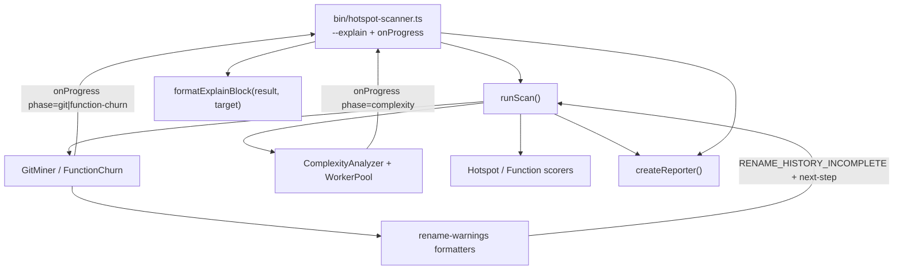

# Explain & Scan Feedback Design

**Spec**: [spec.md](./spec.md)  
**Context**: [context.md](./context.md)  
**Status**: Approved (planning lock)

---

## Architecture Overview

Three independent surfaces share diagnostics/CLI plumbing but do not share domain logic:

1. **Explain** — pure lookup + format over `ScanResult` after `runScan`; bin prints to stderr.
2. **Rename next-steps** — message-only change in `src/git/rename-warnings.ts` formatters.
3. **Complexity progress** — extend `ScanProgress` + emit from complexity pool/analyzer; diagnostics logger formats stderr; bin already forwards `onProgress`.



---

## Code Reuse Analysis

### Existing Components to Leverage

| Component | Location | How to Use |
| --------- | -------- | ---------- |
| `HotspotScore` / `FunctionHotspotScore` | `src/types/domain.ts` | Field source for explain — no recomputation |
| `ScanProgress` / `onProgress` | `src/types/domain.ts`, `src/scan.ts`, bin | Extend phase + fields; wire complexity |
| `maybeLogProgress` / `logProgress` | `src/diagnostics/logger.ts` | Extend for complexity stderr lines |
| `format*` rename helpers | `src/git/rename-warnings.ts` | Append next-step strings only |
| `createScanWarning` / `createRenameHistoryIncompleteWarning` | diagnostics / rename-warnings | Unchanged codes |
| Report / CLI output path | `bin/hotspot-scanner.ts` | After report write, call explain |
| `CliUsageError` | bin patterns | File-mode `:function` rejection |
| Fixture `small-ts` / `with-renames` | `tests/fixtures/repos/` | Explain + rename E2E |

### Integration Points

| System | Integration Method |
| ------ | ------------------ |
| M28 diagnostics | Additive `phase: "complexity"`; do not break git throttle semantics |
| M38 `--no-progress` (future) | Same `onProgress` hook — bin no-op silences all phases including complexity |
| M26 rename avisos | Message suffix only; CONCERNS codes stay stable |
| JSON / CSV / schemas | **No** contract change for explain |

### Fragile areas (CONCERNS)

| Concern | Mitigation |
| ------- | ---------- |
| Warning code stability | Do not rename codes; tests assert `RENAME_HISTORY_INCOMPLETE` |
| Scoring formulas | Explain reads scored fields only — no formula change |
| McCabe / AST | Progress hooks only — no analyze-file / mccabe edits |
| Pipeline overlap (M34) | Complexity progress concurrent with git in file mode is OK (separate phase labels) |

---

## Components

### Explain target parse + format

- **Purpose:** Parse `--explain` grammar; format stderr breakdown from `ScanResult`.
- **Location:** `src/report/explain.ts` (pure; no `fs`) + co-located `explain.test.ts`
- **Interfaces:**
  - `parseExplainTarget(raw: string): ExplainTarget` — `{ kind: "file"; filePath } | { kind: "function"; filePath; functionName }`
  - `normalizeExplainPath(filePath: string, repoPath: string): string` — repo-relative match key
  - `formatExplainBlock(result: ScanResult, target: ExplainTarget): string` — multi-line text; not-found message when empty match
- **Dependencies:** `ScanResult`, score types
- **Reuses:** Score field names from ARCHITECTURE hotspot/function tables; harmonic formula string as documentation only

### Rename warning next-steps

- **Purpose:** Append actionable guidance to existing formatter strings.
- **Location:** `src/git/rename-warnings.ts` (+ update `rename-warnings.test.ts`, miner tests asserting full messages)
- **Interfaces:** Same exports; message strings gain suffix (e.g. ` … Next step: widen --since to include rename history.`)
- **Dependencies:** None new
- **Reuses:** `createRenameHistoryIncompleteWarning(message)` unchanged

### Complexity progress emission

- **Purpose:** Report batch/file progress during AST analysis.
- **Location:** `src/complexity/pool.ts`, `src/complexity/index.ts`; types in `src/types/domain.ts`; logger in `src/diagnostics/logger.ts`; wire in `src/scan.ts`
- **Interfaces:**
  - `ScanProgressPhase = "git" | "function-churn" | "complexity"`
  - `ScanProgress` additive: `filesProcessed?`, `batchesProcessed?`, `totalFiles?`, `totalBatches?`; complexity sets `commitsProcessed: 0`
  - `ComplexityAnalyzerOptions.onProgress?: (p: ScanProgress) => void`
  - Pool: optional callback after each batch completion (inline loop + worker result path)
- **Dependencies:** Existing `WorkerPool.runBatches`
- **Reuses:** Bin `maybeLogProgress` path

### CLI wiring

- **Purpose:** `--explain <target>`; invoke explain after report; complexity progress via existing hook.
- **Location:** `bin/hotspot-scanner.ts`, `bin/hotspot-scanner.test.ts`
- **Interfaces:** Commander `.option("--explain <target>", …)`
- **Dependencies:** `parseExplainTarget`, `formatExplainBlock`, `runScan`, reporter
- **Reuses:** `onProgress: ({ phase, commitsProcessed, ... }) => maybeLogProgress(...)` — extend logger signature as needed

---

## Data Models

```typescript
type ScanProgressPhase = "git" | "function-churn" | "complexity";

interface ScanProgress {
  phase: ScanProgressPhase;
  /** git / function-churn commit counter; 0 for complexity */
  commitsProcessed: number;
  filesProcessed?: number;
  batchesProcessed?: number;
  totalFiles?: number;
  totalBatches?: number;
}

type ExplainTarget =
  | { kind: "file"; filePath: string }
  | { kind: "function"; filePath: string; functionName: string };
```

**Relationships:** Explain reads `ScanResult.hotspots` | `functions` only. Progress does not appear in `ScanResult`.

---

## Error Handling Strategy

| Error Scenario | Handling | User Impact |
| -------------- | -------- | ----------- |
| `--explain` with `:fn` in file mode | `CliUsageError` before/at CLI validation | Non-zero exit; no partial explain |
| Target not in rankings | stderr not-found; scan exit 0 | Clear message |
| Invalid repo / scan failure | Existing scan errors | Unchanged |
| Complexity zero files | No complexity progress required | Silent OK |

---

## Tech Decisions

| Decision | Choice | Rationale |
| -------- | ------ | --------- |
| Explain module under `report/` | Pure format from `ScanResult` | Keeps bin thin; no new top-level package folder |
| No score recomputation | Read ranked fields | Avoid drift from scorer; YAGNI |
| Progress per batch | Emit on batch complete | Matches pool unit of work; ~50 files/line |
| Keep `commitsProcessed` required | `0` for complexity | Avoid breaking existing call sites / tests abruptly |
| M38 honor path | Shared `onProgress` | Independent implementability |

---

## Testing strategy

| Area | Layer | Notes |
| ---- | ----- | ----- |
| `parseExplainTarget` / `formatExplainBlock` | unit | Grammar, not-found, file vs function fields |
| Rename formatters | unit + existing fixture assertions | Code stable; message includes next-step |
| Complexity `onProgress` | unit (analyzer/pool) + scan integration spy | Both concurrency paths |
| CLI `--explain` | bin unit + optional CLI integration | stderr capture; JSON stdout intact |
| Docs | review task | ARCHITECTURE progress table; README flag |

Gate: per-task targeted Vitest; final `pnpm build && pnpm test`.
