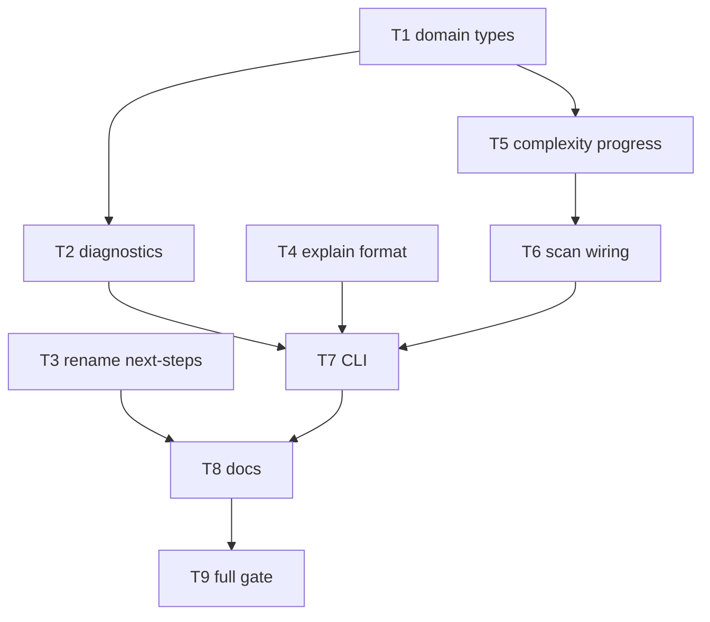

# Explain & Scan Feedback Tasks

**Design**: [design.md](./design.md)  
**Spec**: [spec.md](./spec.md)  
**Context**: [context.md](./context.md)  
**Status**: Done

---

## Execution Plan

### Phase 1: Foundation (Parallel OK)

```
T1 types ──┐
T3 rename ─┼──→ Phase 2
T4 explain ┘
```

### Phase 2: Progress plumbing (after T1)

```
T1 ──┬→ T2 diagnostics ──┐
     └→ T5 complexity ───┴──→ T6 scan
```

### Phase 3: CLI + docs + gate

```
T2 + T4 + T6 ──→ T7 CLI ──→ T8 docs ──→ T9 full gate
T3 ────────────────────────────────────→ T8 (message docs)
```



### Diagram-Definition Cross-Check

| Task | Depends on (task body) | Diagram shows | Match |
| ---- | ---------------------- | ------------- | ----- |
| T1 | None | Root | ✅ |
| T2 | T1 | T1→T2 | ✅ |
| T3 | None | Root | ✅ |
| T4 | None | Root | ✅ |
| T5 | T1 | T1→T5 | ✅ |
| T6 | T5 | T5→T6 | ✅ |
| T7 | T2, T4, T6 | T2/T4/T6→T7 | ✅ |
| T8 | T3, T7 | T3/T7→T8 | ✅ |
| T9 | T8 | T8→T9 | ✅ |

### Path Conflict Check (Check 5)

| Task | Module owner | Paths | Conflict |
| ---- | ------------ | ----- | -------- |
| T1 | `src/types/` | `src/types/domain.ts` (+ barrel if needed) | Sole owner |
| T2 | `src/diagnostics/` | `logger.ts`, `index.ts`, `*.test.ts` | Sole; `[P]` vs T3/T4/T5 after T1 |
| T3 | `src/git/` | `rename-warnings.ts`, `rename-warnings.test.ts`; message asserts in `src/git/index.test.ts`, `function-churn/*.test.ts` as needed | Sole git message owner; **not** `[P]` with other git editors |
| T4 | `src/report/` | `explain.ts`, `explain.test.ts`, `index.ts` export if needed | Sole; `[P]` vs T1/T2/T3/T5 |
| T5 | `src/complexity/` | `pool.ts`, `index.ts`, related `*.test.ts` | Sole complexity owner |
| T6 | `src/scan.ts` | `scan.ts`, `scan.test.ts`, `scan.integration.test.ts` as needed | Sole scan owner — **no `[P]`** with other scan editors |
| T7 | `bin/` | `hotspot-scanner.ts`, `hotspot-scanner.test.ts` | Sole bin owner |
| T8 | docs | README + `.specs/codebase/*` listed in task | Docs only |
| T9 | verification | no module ownership edits | After T8 |

### Test Co-location Validation

| Task | Code layer | TESTING.md expectation | Task `Tests` | Match |
| ---- | ---------- | ---------------------- | ------------ | ----- |
| T1 | `src/types/` | none (excluded from coverage) | none — compile via consumers | ✅ |
| T2 | diagnostics | unit | unit | ✅ |
| T3 | git rename-warnings | unit | unit | ✅ |
| T4 | report | unit | unit | ✅ |
| T5 | complexity | unit | unit | ✅ |
| T6 | scan orchestration | unit + integration as needed | unit (+ integration spy) | ✅ |
| T7 | bin CLI | CLI / unit | unit (CLI) | ✅ |
| T8 | docs | none | N/A — doc review | ✅ |
| T9 | full gate | `pnpm build && pnpm test` | full gate | ✅ |

### Granularity Check

| Task | Scope | Status |
| ---- | ----- | ------ |
| T1 | Domain progress type extension | ✅ Granular |
| T2 | Diagnostics complexity progress lines | ✅ Granular |
| T3 | Rename message next-steps | ✅ Granular |
| T4 | Explain parse + format | ✅ Granular |
| T5 | Complexity/pool progress emit | ✅ OK cohesive (same module) |
| T6 | Scan forward onProgress | ✅ Granular |
| T7 | CLI `--explain` + progress logger args | ✅ Granular |
| T8 | Living docs | ✅ Granular |
| T9 | Full gate | ✅ Granular |

---

## Task Breakdown

### T1: Extend ScanProgress for complexity phase

**What:** Add `"complexity"` to `ScanProgressPhase` and additive optional file/batch fields on `ScanProgress` per design/context.  
**Where:** `src/types/domain.ts` (export via `src/types/index.ts` if needed)  
**Depends on:** None  
**Reuses:** Existing `ScanProgress` / `ScanProgressPhase`  
**Requirement:** HOTSPOT-556, HOTSPOT-557

**Tools:**

- Skill: `coding-guidelines`

**Done when:**

- [x] `ScanProgressPhase` includes `"complexity"`
- [x] `ScanProgress` documents/supports `filesProcessed`, `batchesProcessed`, `totalFiles`, `totalBatches` (optional)
- [x] `commitsProcessed` remains required (complexity callers use `0`)
- [x] Typecheck consumers still compile (fixed in dependent tasks)

**Tests:** none  
**Gate:** none (types excluded from coverage; verified by T2/T5 compile)

---

### T2: Diagnostics complexity progress logging [P]

**What:** Extend `logProgress` / `maybeLogProgress` to format complexity phase lines (batch/file counters).  
**Where:** `src/diagnostics/logger.ts`, `src/diagnostics/index.ts`, `src/diagnostics/logger.test.ts`  
**Depends on:** T1  
**Reuses:** `PROGRESS_LOG_INTERVAL`, existing git phase formatting  
**Requirement:** HOTSPOT-560

**Tools:**

- Skill: `coding-guidelines`, `vitals-pipeline-domain`

**Done when:**

- [x] Complexity phase stderr uses phase name `complexity` and includes batch and/or file counters
- [x] Git / `function-churn` lines remain backward compatible when only `commitsProcessed` is set
- [x] Unit tests cover complexity emission and throttle behavior
- [x] Gate check passes: `pnpm exec vitest run src/diagnostics/logger.test.ts`

**Tests:** unit  
**Gate:** quick — `pnpm exec vitest run src/diagnostics/logger.test.ts`

---

### T3: Append actionable next-steps to rename warnings [P]

**What:** Append next-step clauses to rename (and related) formatter messages without changing `code` values.  
**Where:** `src/git/rename-warnings.ts`, `src/git/rename-warnings.test.ts`; update message expectations in `src/git/index.test.ts` and `src/git/function-churn/*.test.ts` as needed  
**Depends on:** None  
**Reuses:** `createRenameHistoryIncompleteWarning`, existing format helpers  
**Requirement:** HOTSPOT-550–HOTSPOT-555

**Tools:**

- Skill: `coding-guidelines`, `vitals-pipeline-domain`

**Done when:**

- [x] Ambiguous, unlinked, `--since` truncation, and function pós-rename messages include actionable next-steps (per context.md)
- [x] `code` remains `RENAME_HISTORY_INCOMPLETE` / `EMPTY_SINCE_WINDOW` unchanged
- [x] Unit + affected miner tests updated for new suffixes
- [x] Gate check passes: `pnpm exec vitest run src/git/rename-warnings.test.ts src/git/index.test.ts src/git/function-churn`

**Tests:** unit  
**Gate:** quick — `pnpm exec vitest run src/git/rename-warnings.test.ts src/git/index.test.ts src/git/function-churn`

---

### T4: Explain target parse + format block [P]

**What:** Implement `parseExplainTarget`, path normalization helper, and `formatExplainBlock` for file/function rankings.  
**Where:** `src/report/explain.ts`, `src/report/explain.test.ts`, export from `src/report/index.ts` if part of public/report barrel  
**Depends on:** None  
**Reuses:** `HotspotScore`, `FunctionHotspotScore`, `ScanResult`  
**Requirement:** HOTSPOT-541–HOTSPOT-546, HOTSPOT-548, HOTSPOT-549

**Tools:**

- Skill: `coding-guidelines`, `vitals-pipeline-domain`

**Done when:**

- [x] Grammar matches context.md (last `:` + function-name pattern)
- [x] File-mode and function-mode breakdown fields match spec
- [x] Path-only function mode lists all matching functions in rank order
- [x] Not-found produces clear message string
- [x] Lookup uses full arrays (unit fixture with rank beyond a simulated `--top`)
- [x] Gate check passes: `pnpm exec vitest run src/report/explain.test.ts`

**Tests:** unit  
**Gate:** quick — `pnpm exec vitest run src/report/explain.test.ts`

---

### T5: Emit complexity-phase onProgress from analyzer/pool

**What:** After each batch completes (inline and worker paths), invoke `onProgress` with `phase: "complexity"` and file/batch counters.  
**Where:** `src/complexity/pool.ts`, `src/complexity/index.ts`, related `*.test.ts`  
**Depends on:** T1  
**Reuses:** `createWorkerPool`, `DEFAULT_BATCH_SIZE`, existing analyzer deps injection  
**Requirement:** HOTSPOT-558, HOTSPOT-561, HOTSPOT-562

**Tools:**

- Skill: `coding-guidelines`, `vitals-pipeline-domain`

**Done when:**

- [x] `ComplexityAnalyzerOptions` (or deps) accepts `onProgress`
- [x] Inline `concurrency === 1` emits progress per batch
- [x] Worker pool path emits progress as batches complete
- [x] Zero-file analyze does not require progress calls
- [x] Unit tests spy progress payloads
- [x] Gate check passes: `pnpm exec vitest run src/complexity`

**Tests:** unit  
**Gate:** quick — `pnpm exec vitest run src/complexity`

---

### T6: Forward complexity onProgress from runScan

**What:** Pass `options.onProgress` into complexity analysis; keep git/function-churn progress unchanged.  
**Where:** `src/scan.ts`, `src/scan.test.ts`, `src/scan.integration.test.ts` as needed  
**Depends on:** T5  
**Reuses:** Existing git/function-churn `onProgress` wiring  
**Requirement:** HOTSPOT-559, HOTSPOT-563

**Tools:**

- Skill: `coding-guidelines`, `vitals-pipeline-domain`

**Done when:**

- [x] File and function mode scans forward progress to complexity
- [x] Integration/unit spy sees `phase: "complexity"` on `small-ts` (or injected analyzer)
- [x] Git / function-churn phases still emitted with prior semantics
- [x] Gate check passes: `pnpm exec vitest run src/scan.test.ts src/scan.integration.test.ts`

**Tests:** unit (+ integration spy)  
**Gate:** quick — `pnpm exec vitest run src/scan.test.ts src/scan.integration.test.ts`

---

### T7: CLI `--explain` + complexity progress stderr

**What:** Add `--explain <target>`; after report output, write explain block to stderr; ensure progress logger receives extended `ScanProgress` fields; reject `:function` in file granularity with `CliUsageError`.  
**Where:** `bin/hotspot-scanner.ts`, `bin/hotspot-scanner.test.ts`  
**Depends on:** T2, T4, T6  
**Reuses:** `runScan`, `createReporter`, `logWarning`, `maybeLogProgress`, `formatExplainBlock`  
**Requirement:** HOTSPOT-540, HOTSPOT-544, HOTSPOT-545, HOTSPOT-547

**Tools:**

- Skill: `coding-guidelines`, `vitals-cli-validation`

**Done when:**

- [x] `--explain` documented in option help
- [x] Full scan + report still run; explain on stderr only
- [x] JSON/csv stdout (or `--output`) unchanged by explain text
- [x] File mode + `:function` → non-zero `CliUsageError`
- [x] Not-found explain still exit 0 after successful scan
- [x] `maybeLogProgress` invoked with complexity fields when progress fires
- [x] Gate check passes: `pnpm exec vitest run bin/hotspot-scanner.test.ts`

**Tests:** unit (CLI)  
**Gate:** quick — `pnpm exec vitest run bin/hotspot-scanner.test.ts`

---

### T8: Living docs for explain, rename next-steps, complexity progress

**What:** Update ARCHITECTURE (progress table + explain CLI note), README (`--explain`, rename next-step note), CONCERNS/TESTING as needed.  
**Where:** `.specs/codebase/ARCHITECTURE.md`, `.specs/codebase/CONCERNS.md` and/or `TESTING.md` if touched, `README.md`  
**Depends on:** T3, T7  
**Reuses:** Existing M28 diagnostics / M26 rename sections  
**Requirement:** HOTSPOT-564–HOTSPOT-566

**Tools:**

- Skill: `vitals-spec-driven` (docs only)

**Done when:**

- [x] Progress phases table lists `complexity` with counters
- [x] Note that complexity progress honors future M38 `--no-progress` via `onProgress`
- [x] README documents `--explain` grammar and stderr behavior
- [x] Rename warning docs mention actionable next-steps; codes unchanged
- [x] No application code changes

**Tests:** N/A — doc review  
**Gate:** none (docs)

---

### T9: Full project gate

**What:** Run full quality gate; confirm feature ready for Status promotion after Execute.  
**Where:** repo root (verification only)  
**Depends on:** T8  
**Reuses:** AGENTS.md gate  
**Requirement:** HOTSPOT-569

**Tools:**

- Agent (dev session): `verifier-quality-gates`

**Done when:**

- [x] `pnpm build && pnpm test` passes
- [x] No silent test deletions vs pre-feature baseline
- [x] tasks.md checkboxes for T1–T8 complete in Execute session

**Tests:** full gate  
**Gate:** `pnpm build && pnpm test`

---

## Parallel Execution Map

```
Phase 1 (Parallel):
  T1 [types]
  T3 [P] rename next-steps
  T4 [P] explain format

Phase 2 (after T1):
  T2 [P] diagnostics     } parallel
  T5     complexity      }

Phase 3 (Sequential):
  T5 → T6 scan → T7 CLI → T8 docs → T9 gate
  (T3 feeds T8 only)
```

**Parallelism constraint:** T2 and T5 both depend on T1 but touch disjoint paths — `[P]` OK. T3/T4 independent of T1 — `[P]` OK in Phase 1.

---

## Requirement → Task Mapping

| Requirement ID | Task(s) |
| -------------- | ------- |
| HOTSPOT-540 | T7 |
| HOTSPOT-541 | T4 |
| HOTSPOT-542 | T4 |
| HOTSPOT-543 | T4 |
| HOTSPOT-544 | T7 |
| HOTSPOT-545 | T7 |
| HOTSPOT-546 | T4 |
| HOTSPOT-547 | T7 |
| HOTSPOT-548 | T4, T7 |
| HOTSPOT-549 | T4 |
| HOTSPOT-550 | T3 |
| HOTSPOT-551 | T3 |
| HOTSPOT-552 | T3 |
| HOTSPOT-553 | T3 |
| HOTSPOT-554 | T3 |
| HOTSPOT-555 | T3 |
| HOTSPOT-556 | T1 |
| HOTSPOT-557 | T1 |
| HOTSPOT-558 | T5 |
| HOTSPOT-559 | T6 |
| HOTSPOT-560 | T2 |
| HOTSPOT-561 | T5 |
| HOTSPOT-562 | T5 |
| HOTSPOT-563 | T6 |
| HOTSPOT-564 | T8 |
| HOTSPOT-565 | T8 |
| HOTSPOT-566 | T8 |
| HOTSPOT-567 | Reserved |
| HOTSPOT-568 | Reserved |
| HOTSPOT-569 | T9 |

---

## Handoff

Planning complete — **Status: Planned**.  
Promote to `Approved` / `Ready for Execute` in a **new** session, then invoke `orchestrator-implementer`.  
Suggested Execute order among milestones: after M41 (per ROADMAP). Sister: M38 `--no-progress` optional-before or after; M42 progress works with default-on.
