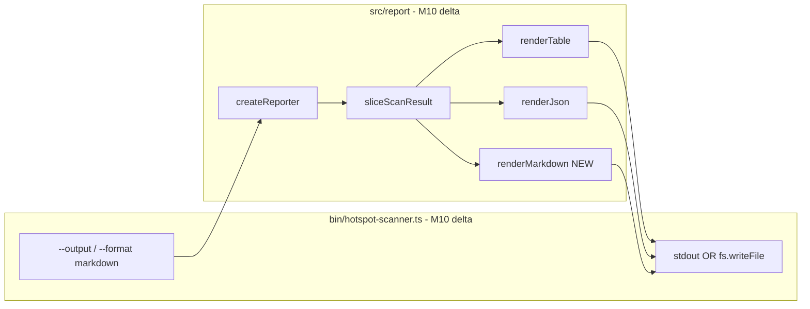

# Milestone 10 — Export Formats Design

**Spec**: [`.specs/features/export-formats/spec.md`](./spec.md)  
**Context**: [`.specs/features/export-formats/context.md`](./context.md)  
**Status**: Done

---

## Architecture Overview

M10 adds a third reporter (`renderMarkdown`) and CLI flags `--output` and `--format markdown`. The reporter layer remains pure (returns strings); the CLI owns transport (stdout vs file). Scoring, slicing, and JSON/table renderers are unchanged.



**Baseline:** [`.specs/features/reporter-cli/design.md`](../reporter-cli/design.md) — M5 reporter architecture; [`.specs/features/rich-output/design.md`](../rich-output/design.md) — M9 hotspot fields.  
**ROADMAP:** M10 Export Formats.

---

## Code Reuse Analysis

### Existing Components to Leverage

| Component | Location | How to Use |
| --------- | -------- | ---------- |
| `createReporter` | `src/report/index.ts` | Add `markdown` branch in dispatch |
| `sliceScanResult` | `src/report/slice.ts` | Unchanged — slice before all renders |
| `renderJson` | `src/report/json.ts` | Unchanged — file export reuses same string |
| `renderTable` | `src/report/table.ts` | Unchanged — file export reuses same string |
| `parseFormat` | `bin/hotspot-scanner.ts` | Extend union to include `markdown` |
| `sample-result.json` | `tests/fixtures/report/` | Reuse for markdown unit tests |
| Integration fixture | `tests/fixtures/repos/small-ts/` | File export E2E in T3 |
| M5 stderr channel | `src/diagnostics/logger.ts` | Unchanged — warnings/progress stay on stderr |

### Integration Points

| Consumer | Impact |
| -------- | ------ |
| `src/scan.ts` | None — `ScanResult` shape unchanged |
| `src/types/domain.ts` | None — `ScanOptions.format` may extend type if used internally; optional |
| `src/scoring/**` | None |
| `bin/hotspot-scanner.ts` | Add `--output`, extend `OutputFormat`, file write routing |
| `src/report/index.ts` | Extend `ReporterOptions.format`, import `renderMarkdown` |

---

## Type Changes

### `OutputFormat` (`bin/hotspot-scanner.ts`)

```typescript
export type OutputFormat = "table" | "json" | "markdown";
```

### `ReporterOptions` (`src/report/index.ts`)

```typescript
export interface ReporterOptions {
  format: "table" | "json" | "markdown";
  top?: number;
}
```

### `createReporter` dispatch

```typescript
return {
  render(result, options) {
    const sliced = sliceScanResult(result, options.top);
    switch (options.format) {
      case "json":
        return renderJson(sliced);
      case "markdown":
        return renderMarkdown(sliced);
      default:
        return renderTable(sliced);
    }
  },
};
```

**YAGNI:** Do not add a `OutputSink` abstraction — inline if/else in CLI action is sufficient.

---

## Markdown Layout

New module: `src/report/markdown.ts` — `export function renderMarkdown(result: ScanResult): string`

### Document structure

```markdown
# Hotspot Scanner Report

**Scan window:** 12 months ago  
**Scanned at:** 2026-07-22T12:00:00.000Z

## Top Hotspots

| Rank | File | Score | Cpx | CpxN | Churn | ChurnN | Funcs | Authors | Lines |
| ---: | --- | ---: | ---: | ---: | ---: | ---: | ---: | ---: | ---: |
| 1 | src/hot.ts | 0.8500 | 42 | 0.9000 | 15 | 0.9444 | 8 | 3 | 320 |

## Top Coupling Pairs

| Rank | File A | File B | Strength | Co-changes |
| ---: | --- | --- | ---: | ---: |
| 1 | src/a.ts | src/b.ts | 0.7500 | 12 |
```

### Column sourcing (hotspots)

| Column | Source field | Format |
| ------ | ------------ | ------ |
| Rank | index + 1 | integer |
| File | `filePath` | GFM-escaped |
| Score | `hotspotScore` | 4 decimals |
| Cpx | `cyclomaticComplexity` | integer |
| CpxN | `complexityNormalized` | 4 decimals |
| Churn | `commitCount` | integer |
| ChurnN | `churnNormalized` | 4 decimals |
| Funcs | `functionCount` | integer |
| Authors | `authorCount` | integer |
| Lines | `linesChanged` | integer |

### Column sourcing (coupling)

| Column | Source field | Format |
| ------ | ------------ | ------ |
| Rank | index + 1 | integer |
| File A | `fileA` | GFM-escaped |
| File B | `fileB` | GFM-escaped |
| Strength | `couplingStrength` | 4 decimals |
| Co-changes | `coChangeCount` | integer |

### Formatting helpers

```typescript
const SCORE_DECIMALS = 4;

function formatScore(value: number): string {
  return value.toFixed(SCORE_DECIMALS);
}

function escapeCell(value: string): string {
  return value.replace(/\|/g, "\\|");
}
```

**YAGNI:** Duplicate `SCORE_DECIMALS` in `markdown.ts` — do not extract shared `format.ts` unless a third duplicate appears.

### Empty sections

When `hotspots.length === 0` or `coupling.length === 0`, render section heading followed by:

```markdown
_No results._
```

Do not emit empty GFM tables (invalid/unreadable in some viewers).

---

## CLI Wiring

### New flag

```typescript
.option("--output <path>", "Write report to file instead of stdout")
```

### Path validation (`validateOutputPath`)

Run before `writeFile`:

1. Reject empty path
2. If path exists and is a directory → throw `CliUsageError`
3. Resolve parent dir (`path.dirname`); if parent does not exist → throw `CliUsageError`
4. Do not require target file to pre-exist (create/overwrite)

Export `validateOutputPath` for unit testing.

### Write routing (action handler)

```typescript
const output = createReporter().render(result, { format, top });

if (options.output) {
  await validateOutputPath(options.output);
  await fs.promises.writeFile(options.output, output, "utf8");
  // stdout: no report write
} else {
  process.stdout.write(output.endsWith("\n") ? output : `${output}\n`);
}
```

- Use `node:fs/promises` and `node:path` in `bin/hotspot-scanner.ts`
- Append trailing newline for markdown/table when writing to file (match stdout behavior)
- JSON: `renderJson` already returns compact JSON; newline append is acceptable

### `parseFormat` error message

```typescript
throw new CliUsageError(
  `Invalid --format: ${value}. Expected table, json, or markdown.`,
);
```

---

## Test Impact

| File | Change |
| ---- | ------ |
| `src/report/markdown.ts` | **New** — `renderMarkdown()` |
| `src/report/markdown.test.ts` | **New** — GFM structure, empty sections, pipe escape, formatting |
| `src/report/index.ts` | Markdown dispatch |
| `src/report/index.test.ts` | Assert `format: "markdown"` returns GFM |
| `bin/hotspot-scanner.ts` | `--output`, `parseFormat`, `validateOutputPath` |
| `bin/hotspot-scanner.test.ts` | Format validation, output path validation, file write mock |
| `bin/hotspot-scanner.integration.test.ts` | `--output` + markdown/json on `small-ts` |

**Do not change:**

- `src/report/json.ts`
- `src/report/table.ts`
- `src/report/slice.ts`
- `src/scan.ts` (unless `ScanOptions.format` type needs widening — prefer bin-only type)
- Scoring modules

### Test patterns

- **Unit (markdown):** Load `tests/fixtures/report/sample-result.json` as `ScanResult`; assert substrings for headings, column headers, formatted values
- **Unit (CLI):** Mock `fs.promises.writeFile`; assert called with UTF-8 and not `stdout.write` when `--output` set
- **Integration:** `os.tmpdir()` + `mkdtemp`; run CLI; read file; `JSON.parse` or assert markdown headings; `rm` cleanup in `afterEach`

---

## Risks

| Risk | Mitigation |
| ---- | ---------- |
| GFM table breaks on `\|` in paths | `escapeCell()` on all path columns |
| Wide markdown tables in narrow viewers | Acceptable for PR context; richer than CLI table |
| Test flakiness on file I/O | Unique temp dirs per test; cleanup in `afterEach` |
| `writeFile` errors surface as exit 1 | Catch in `main()`, `console.error`, `process.exit(1)` |
| Duplicate format constants (table vs markdown) | YAGNI — duplicate `SCORE_DECIMALS` until extraction justified |

---

## Documentation Sync Targets

| File | Update |
| ---- | ------ |
| `.specs/codebase/ARCHITECTURE.md` | CLI flags `--output`, `--format markdown`; `renderMarkdown` in report layer |
| `.specs/codebase/STRUCTURE.md` | Add `src/report/markdown.ts` |
| `README.md` | Flags table: `--output`, `markdown` format |
| `.cursor/skills/vitals-cli-validation/SKILL.md` | Example with `--output` |
| `.specs/project/ROADMAP.md` | Link spec; `**Specs:** Done` (planning); implementation checkboxes on Execute |
