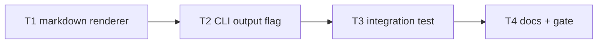

# Milestone 10 — Export Formats Tasks

**Design**: [`.specs/features/export-formats/design.md`](./design.md)  
**Spec**: [`.specs/features/export-formats/spec.md`](./spec.md)  
**Context**: [`.specs/features/export-formats/context.md`](./context.md)  
**Status**: Done

---

## Execution Plan

### Phase 1: Markdown renderer (Sequential)

```
T1 renderMarkdown + reporter dispatch + unit tests
```

### Phase 2: CLI flags (Sequential)

```
T1 → T2 --format markdown + --output + bin tests
```

### Phase 3: Integration (Sequential)

```
T2 → T3 file export integration test on small-ts
```

### Phase 4: Docs + gate (Sequential)

```
T3 → T4 documentation sync + project gate
```



### Diagram-Definition Cross-Check

| Task | Depends on (declared) | Appears in diagram after deps | Match |
| ---- | --------------------- | ----------------------------- | ----- |
| T1 | None | Root | ✅ |
| T2 | T1 | T1 → T2 | ✅ |
| T3 | T2 | T2 → T3 | ✅ |
| T4 | T3 | T3 → T4 | ✅ |

### Test Co-location Validation

| Task | Code layer | TESTING.md expectation | Tests in same task | Match |
| ---- | ---------- | ---------------------- | ------------------ | ----- |
| T1 | `src/report/markdown.ts`, `index.ts` | Unit required | `markdown.test.ts`, `index.test.ts` | ✅ |
| T2 | `bin/hotspot-scanner.ts` | CLI unit | `bin/hotspot-scanner.test.ts` | ✅ |
| T3 | `bin/` integration | Integration | `bin/hotspot-scanner.integration.test.ts` | ✅ |
| T4 | Docs only | Gate | `pnpm build && pnpm test` | ✅ |

---

## Task Breakdown

### T1: Markdown renderer + reporter dispatch

**What**: Implement `renderMarkdown()` in `src/report/markdown.ts` per design § Markdown Layout. Extend `ReporterOptions.format` and `createReporter()` dispatch. Add unit tests for GFM structure, empty sections, pipe escaping, and numeric formatting.

**Where**: `src/report/markdown.ts`, `src/report/markdown.test.ts`, `src/report/index.ts`, `src/report/index.test.ts`

**Depends on**: None

**Reuses**: [design.md](./design.md) § Markdown Layout; `tests/fixtures/report/sample-result.json`; M9 `HotspotScore` raw fields

**Requirement**: HOTSPOT-86, HOTSPOT-87, HOTSPOT-90

**Tools**:

- MCP: NONE
- Skill: NONE

**Done when**:

- [x] `renderMarkdown()` produces GFM with title, metadata, hotspots table (incl. Lines column), coupling table
- [x] Empty hotspots/coupling render `_No results._` without throwing
- [x] Pipe characters in file paths are escaped in table cells
- [x] Scores/normalized: 4 decimals; integers: no decimals
- [x] `createReporter().render(..., { format: "markdown" })` returns markdown string
- [x] `table` and `json` dispatch unchanged
- [x] `src/report/**` ≥80% line coverage maintained

**Tests**: `markdown.test.ts` — headings, columns, formatting, empty sections, pipe escape; `index.test.ts` — markdown dispatch

**Gate**: `pnpm exec vitest run src/report/markdown.test.ts src/report/index.test.ts`

---

### T2: CLI `--format markdown` + `--output`

**What**: Extend `OutputFormat` and `parseFormat()` to accept `markdown`. Add `--output <path>` flag. Implement `validateOutputPath()` and file write via `fs.promises.writeFile`. When `--output` is set, suppress stdout report; stderr diagnostics unchanged. Add CLI unit tests.

**Where**: `bin/hotspot-scanner.ts`, `bin/hotspot-scanner.test.ts`

**Depends on**: T1

**Reuses**: [context.md](./context.md) § `--output` suppresses stdout; [design.md](./design.md) § CLI Wiring

**Requirement**: HOTSPOT-83, HOTSPOT-84, HOTSPOT-85, HOTSPOT-88, HOTSPOT-89, HOTSPOT-90

**Tools**:

- MCP: NONE
- Skill: NONE

**Done when**:

- [x] `parseFormat("markdown")` returns `"markdown"`
- [x] Invalid format error mentions `table`, `json`, or `markdown`
- [x] `--output <path>` writes UTF-8 file with rendered report
- [x] With `--output`, stdout receives no report content
- [x] Missing parent directory → exit `!= 0` with clear error
- [x] Output path is directory → exit `!= 0`
- [x] Existing file at path is overwritten
- [x] Warnings still go to stderr when `--output` is set (mock test)
- [x] All three formats work with `--output`

**Tests**: `bin/hotspot-scanner.test.ts` — parseFormat, validateOutputPath, writeFile mock, stderr invariant

**Gate**: `pnpm exec vitest run bin/hotspot-scanner.test.ts`

---

### T3: Integration test (file export)

**What**: Extend CLI integration tests to run `small-ts` fixture with `--output` to temp files. Assert markdown file contains expected headings; JSON file parses with M9 schema. Verify exit code `0`.

**Where**: `bin/hotspot-scanner.integration.test.ts`

**Depends on**: T2

**Reuses**: `tests/fixtures/repos/small-ts/`; temp dir pattern from design § Test Impact

**Requirement**: HOTSPOT-88, HOTSPOT-90

**Tools**:

- MCP: NONE
- Skill: `vitals-cli-validation`

**Done when**:

- [x] `--output <tmp>/report.md --format markdown` exits `0` and file contains `# Hotspot Scanner Report`
- [x] `--output <tmp>/report.json --format json` exits `0` and `JSON.parse` yields `version`, `hotspots`, `coupling`, `meta`
- [x] Top hotspot in JSON export includes M9 raw fields
- [x] Temp files cleaned up after test

**Tests**: `bin/hotspot-scanner.integration.test.ts` — file export cases

**Gate**: `pnpm exec vitest run bin/hotspot-scanner.integration.test.ts`

---

### T4: Documentation sync + project gate

**What**: Update ARCHITECTURE.md, STRUCTURE.md, README.md, vitals-cli-validation skill. Mark ROADMAP M10 implementation checkboxes `[x]` on Execute Done only — during planning, link spec and set `**Specs:** Done`. Run full project gate.

**Where**: `.specs/codebase/ARCHITECTURE.md`, `.specs/codebase/STRUCTURE.md`, `README.md`, `.cursor/skills/vitals-cli-validation/SKILL.md`, `.specs/project/ROADMAP.md`

**Depends on**: T3

**Reuses**: [design.md](./design.md) § Documentation Sync Targets

**Requirement**: HOTSPOT-91

**Tools**:

- MCP: NONE
- Skill: `vitals-cli-validation`

**Done when**:

- [x] ARCHITECTURE.md documents `--output` and markdown format
- [x] STRUCTURE.md lists `src/report/markdown.ts`
- [x] README.md flags table includes `--output` and `markdown`
- [x] vitals-cli-validation skill includes file export example
- [x] ROADMAP M10 implementation checkboxes marked `[x]` on Execute Done
- [x] `pnpm build && pnpm test` passes

**Tests**: Full project gate

**Gate**: `pnpm build && pnpm test`

---

## Requirement Traceability (Tasks)

| Requirement ID | Tasks |
| -------------- | ----- |
| HOTSPOT-83 | T2 |
| HOTSPOT-84 | T2 |
| HOTSPOT-85 | T2 |
| HOTSPOT-86 | T1 |
| HOTSPOT-87 | T1 |
| HOTSPOT-88 | T2, T3 |
| HOTSPOT-89 | T2 |
| HOTSPOT-90 | T1, T2, T3 |
| HOTSPOT-91 | T4 |

**Coverage:** 9 total, 9 mapped to tasks, 0 unmapped
