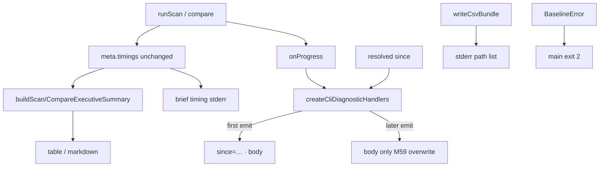

# Milestone 62 — Feedback and Copy UX Design

**Spec**: [`.specs/features/feedback-copy-ux/spec.md`](./spec.md)  
**Context**: [`.specs/features/feedback-copy-ux/context.md`](./context.md)  
**Status**: Done

---

## Architecture Overview

Presentation and CLI copy only. Pipeline scoring, JSON contract, and M51 `meta.timings` population stay unchanged. Changes concentrate in three layers:

1. **Diagnostics** — first-progress `since=` prefix in the CLI sink
2. **Report** — executive-summary Timing + empty-compare copy (`src/report` stays pure: no `fs`, no stderr)
3. **Bin** — CSV confirm + stderr timing + exit mapping + help/hints; README prose cleanup



**M61 note:** Do not add finalize phase, bars, or flush deferral. Document compose only: `since=` remains first emission of the scan.

---

## Code Reuse Analysis

| Component                | Location                                             | How to Use                                              |
| ------------------------ | ---------------------------------------------------- | ------------------------------------------------------- |
| CLI diagnostic handlers  | `src/diagnostics/logger.ts`                          | Extend options with `since`; track `sincePrefixed` flag |
| Progress formatters      | `formatProgressBody` / `writeProgressLine`           | Prefix only on first successful write                   |
| Executive summaries      | `src/report/summary.ts`                              | Add Timing helper; empty-delta branch                   |
| Compare table/markdown   | `src/report/compare-table.ts`, `compare-markdown.ts` | Consume shared summary (smoke tests)                    |
| CSV write                | `bin/scan-actions.ts` `writeCsvBundle`               | After `Promise.all`, confirm paths                      |
| Quiet flags              | existing `ScanDiagnosticOptions` / bin               | Suppress CSV confirm + stderr timing                    |
| Baseline path validation | `validateBaselinePath` + `BASELINE_JSON_HINT`        | Mention `baseline save`                                 |
| Baseline load hints      | `src/compare/load-baseline.ts`                       | Extend Hint to mention `baseline save`                  |
| Exit mapping             | `bin/hotspot-scanner.ts` `main`                      | Add `BaselineError` → 2                                 |
| Help constants           | `SEQUENTIAL_OPTION_HELP` / `NO_OVERLAP_OPTION_HELP`  | De-jargon                                               |
| Defaults                 | `DEFAULT_SINCE` from `src/scan.ts`                   | Resolve effective since for handlers                    |

### Fragile / concerns

| Concern                                                           | Mitigation                                                                            |
| ----------------------------------------------------------------- | ------------------------------------------------------------------------------------- |
| Diagnostics TTY live line (M59)                                   | Unit-test first vs second write with `stderrIsTTY: true`; do not break clear-on-flush |
| Report purity ([INTEGRATIONS.md](../../codebase/INTEGRATIONS.md)) | Timing **summary** strings only in `src/report/`; stderr timing stays in bin          |
| Compare / baseline validation                                     | Hints only — no validation weakening; co-locate load-baseline tests                   |
| M61 sister drift                                                  | Explicit non-goals; no flush/lifecycle changes beyond existing M58 flush              |

---

## Components and Interfaces

### 1. `CliDiagnosticOptions.since` + first-line prefix

**Location:** `src/diagnostics/logger.ts`

```ts
export interface CliDiagnosticOptions {
  quiet?: boolean;
  noProgress?: boolean;
  warningsMode?: WarningsMode;
  stderrIsTTY?: boolean;
  /** Effective scan window for first progress line only. */
  since?: string;
}
```

**Behavior:**

- Keep a closure flag `hasEmittedProgress = false`.
- On first `writeProgressLine` that actually writes: if `since` is non-empty, prepend `since=${since} · ` (exact separator locked in tests).
- Set flag after first write; later TTY/non-TTY writes use unprefixed body.
- Throttle unchanged: “first” = first emitted line after throttle.

### 2. Resolve since in scan-actions

**Location:** `bin/scan-actions.ts`

Pass resolved since into `createCliDiagnosticHandlers` from `executeScan` / `executeCompareAndRender`.

**Preferred approach:** Resolve effective since with the same precedence as the pipeline (CLI overrides > loaded config > `DEFAULT_SINCE`) before creating handlers, reusing existing merge/load helpers where practical. Avoid wrong prefix when since comes only from `.hotspot-scanner.json`.

YAGNI fallback if double-load is costly: document a minimal resolve path that still honors config — do not ship CLI-only approximation as final behavior.

### 3. Timing lines — report vs bin

**Report (pure):** `src/report/summary.ts`

```ts
export function formatTimingSummaryLine(timings: ScanStageTimings): string;
// e.g. "Timing: total 1.2s (git 800ms, complexity 900ms)"
```

- Append to `buildScanExecutiveSummary` when `full.meta.timings` defined.
- Append to `buildCompareExecutiveSummary` when `full.meta.current.timings` defined (current scan).
- Optional brief overlap note without milestone IDs when `gitMs + complexityMs > totalMs`.

**Bin (stderr):** After successful `executeScan` return (and compare path after current result known), if timings present and not quiet, write one short line, e.g. `timing: total ${totalMs}ms`. Keep distinct from the summary sentence per [context.md](./context.md).

Ownership: prefer a tiny helper in bin or diagnostics for the stderr string to avoid importing report into bin circularly — or export a second formatter from `summary.ts` if already imported by bin tests. Prefer **one module** for both wordings if it keeps report pure (string-only).

### 4. Empty compare deltas

**Location:** `src/report/summary.ts` → `formatCompareDeltaLine` / `buildCompareExecutiveSummary`

When `countCompareDeltas(full.hotspots) === 0`, return a stable clear line containing `No rank changes` (full sentence per context). Non-zero path unchanged.

### 5. CSV confirmation

**Location:** `bin/scan-actions.ts` — `writeCsvBundle` and/or `writeRenderedOutput`

After successful writes, for each key in the bundle:

```
Wrote CSV bundle:
  ${stem}.${suffix}
```

Thread `quiet` into `writeRenderedOutput` or confirm only from callers that know quiet. Suppress when quiet.

### 6. Baseline exit + hints

**Location:**

- `bin/hotspot-scanner.ts` `main`: `error instanceof BaselineError` → exit `2` (import class from compare).
- `bin/scan-actions.ts` `BASELINE_JSON_HINT`: mention `hotspot-scanner baseline save`.
- `src/compare/load-baseline.ts` hint constant: mention `baseline save` alongside re-scan / contract language.

### 7. Help + README

- Replace `SEQUENTIAL_OPTION_HELP` / `NO_OVERLAP_OPTION_HELP` milestone jargon.
- README: strip bare `M##` from user-facing sections listed in brownfield grep (remount, interpretation, timings, baseline workflow, stage overlap, flag table). Keep links to `.specs/features/…` if useful without embedding milestone codes in prose.

Optional living docs: one line in ARCHITECTURE diagnostics/report notes if they claim timings are JSON-only — HOTSPOT-1042.

---

## Data Flow

```
executeScan:
  since = resolveEffectiveSince(...)
  handlers = createCliDiagnosticHandlers({ …, since })
  result = await runScan(...)
  flushWarnings()
  return result

bin scan action:
  result = await executeScan(...)
  if (!quiet && result.meta.timings) stderr brief timing
  render → writeRenderedOutput
  if csv && !quiet → confirmation already inside write path
```

Compare: same since + brief timing from `compareResult.meta.current.timings` when present.

---

## Test Plan

| Layer                   | Focus                                                                                         |
| ----------------------- | --------------------------------------------------------------------------------------------- |
| Unit `src/diagnostics/` | First vs second progress; TTY + non-TTY; quiet/no-progress; missing since                     |
| Unit `src/report/`      | Timing summary line; empty vs non-empty compare deltas; scan summary                          |
| Unit `src/compare/`     | Baseline hint includes `baseline save`                                                        |
| Unit `bin/`             | CSV confirm paths; quiet suppress; BaselineError → 2; help strings; stderr timing; path hints |
| Docs                    | README milestone-ID scrub                                                                     |

**Gate:** per-task vitest paths; final `pnpm build && pnpm test`.

---

## Risks

| Risk                                     | Mitigation                                                       |
| ---------------------------------------- | ---------------------------------------------------------------- |
| since prefix wrong when only in config   | Resolve via merge/load before handlers                           |
| TTY line length / wrap with since prefix | Accept; keep prefix short `since=… ·`                            |
| Double timing noise (summary + stderr)   | Context lock: stderr brief; quiet suppresses stderr              |
| Exit-code regressions                    | Update BaselineError tests explicitly; leave cancel/strict alone |
| Accidental M61 scope creep               | Tasks forbid flush deferral / finalize / bars                    |

---

## Implementation Notes (Execute)

- YAGNI: no new flags, no schema edits, no ranking changes.
- Do not implement M61.
- Parent syncs ROADMAP/STATE — Execute may tick Done later; this planning session does not edit ROADMAP/STATE.
