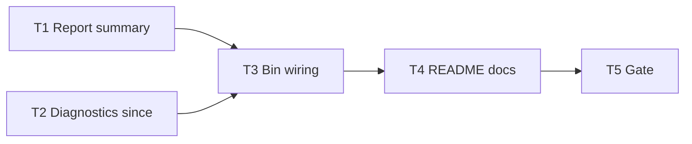

# Milestone 62 — Feedback and Copy UX Tasks

**Design**: [`.specs/features/feedback-copy-ux/design.md`](./design.md)  
**Spec**: [`.specs/features/feedback-copy-ux/spec.md`](./spec.md)  
**Context**: [`.specs/features/feedback-copy-ux/context.md`](./context.md)  
**Status**: Planned  
**Note**: Large feature — diagnostics + report + bin + docs. STOP at Planned; Execute in a separate session via `orchestrator-implementer` after Status promotion. Do **not** implement M61.

---

## Execution Plan

### Phase 1: Report + diagnostics (parallel-safe)

```
T1 report summary timings + empty compare
T2 diagnostics since= first progress
```

### Phase 2: Bin wiring

```
T1 + T2 → T3 CSV confirm + stderr timing + BaselineError exit 2 + hints + help
```

### Phase 3: Docs + gate

```
T3 → T4 README (+ optional ARCHITECTURE note) → T5 project gate
```



### Diagram-Definition Cross-Check

| Task | Depends on (declared) | Diagram shows | Match |
| ---- | --------------------- | ------------- | ----- |
| T1 | None | Root parallel | ✅ |
| T2 | None | Root parallel | ✅ |
| T3 | T1, T2 | T1→T3, T2→T3 | ✅ |
| T4 | T3 | T3→T4 | ✅ |
| T5 | T4 | T4→T5 | ✅ |

### Path Conflict Check (Check 5)

| Task | Module owner | Paths | Conflict |
| ---- | ------------ | ----- | -------- |
| T1 | report | `src/report/summary.ts`, `src/report/summary.test.ts`; smoke updates in `compare-table.test.ts` / `compare-markdown.test.ts` / `table.test.ts` / `markdown.test.ts` as needed | Sole report owner for summary copy |
| T2 | diagnostics | `src/diagnostics/logger.ts`, `src/diagnostics/logger.test.ts`; `src/diagnostics/index.ts` only if exporting new option types | Sole diagnostics owner; **no** bin yet |
| T3 | bin (+ compare hint) | `bin/scan-actions.ts`, `bin/hotspot-scanner.ts`, `bin/hotspot-scanner.test.ts`; `src/compare/load-baseline.ts`, `src/compare/load-baseline.test.ts` for Hint text | After T1/T2; only T3 touches bin + load-baseline hint |
| T4 | docs | `README.md`; optional `.specs/codebase/ARCHITECTURE.md` one-line timings note | After T3 |
| T5 | gate | none (verify) | After T4 |

T1 `[P]` with T2 — disjoint `src/report/` vs `src/diagnostics/`. No other `[P]`.

### Test Co-location Validation

| Task | Code layer | TESTING.md expectation | Task says | Match |
| ---- | ---------- | ---------------------- | --------- | ----- |
| T1 | `src/report/` | Unit | unit in same task | ✅ |
| T2 | `src/diagnostics/` | Unit | unit in same task | ✅ |
| T3 | `bin/` + `src/compare/` | Unit | unit in same task | ✅ |
| T4 | Docs | none | none | ✅ |
| T5 | Full project | Gate | `pnpm build && pnpm test` | ✅ |

### Granularity Check

| Task | Scope | Status |
| ---- | ----- | ------ |
| T1 | Summary Timing + empty compare copy + tests | ✅ Cohesive report |
| T2 | First-progress since prefix + tests | ✅ Cohesive diagnostics |
| T3 | Bin feedback + exit/hints/help + compare hint | ✅ Cohesive CLI surface |
| T4 | README de-jargon | ✅ Granular |
| T5 | Project gate | ✅ Granular |

### Requirement → Task Mapping

| Requirement ID | Task |
| -------------- | ---- |
| HOTSPOT-1031, HOTSPOT-1036, HOTSPOT-1037 | T1 |
| HOTSPOT-1034, HOTSPOT-1035 | T2 |
| HOTSPOT-1030, HOTSPOT-1032, HOTSPOT-1033, HOTSPOT-1038, HOTSPOT-1039, HOTSPOT-1040 | T3 |
| HOTSPOT-1041, HOTSPOT-1042 | T4 |
| (gate) | T5 |
| HOTSPOT-1043–1045 | Unused stretch (available) |
| HOTSPOT-1046–1059 | Reserved — unused |

---

## Task Breakdown

### T1: Executive summary timings + empty compare copy [P]

**What**: Extend `buildScanExecutiveSummary` / `buildCompareExecutiveSummary` to append a user-facing Timing line from `meta.timings` / `meta.current.timings` when present (total + stage breakdown; optional overlap note without milestone IDs). When compare hotspot delta total is 0, replace the opaque `showing 0 of 0…` line with a clear message containing **`No rank changes`**. Keep `src/report` pure (string formatting only). Update co-located summary tests and smoke asserts in compare/scan table/markdown tests as needed.

**Where**: `src/report/summary.ts`, `src/report/summary.test.ts`; optionally `src/report/compare-table.test.ts`, `src/report/compare-markdown.test.ts`, `src/report/table.test.ts`, `src/report/markdown.test.ts`

**Depends on**: None

**Reuses**: Existing summary helpers; `ScanStageTimings` from domain types; M41/M51 executive-summary patterns

**Done when**:

- [ ] Scan table/markdown summary includes Timing when timings present; omits when absent
- [ ] Compare summary uses current timings when present
- [ ] Empty hotspot deltas → clear “No rank changes” (or equivalent) summary line
- [ ] Non-zero deltas keep existing count wording
- [ ] Unit tests cover timing present/absent, empty vs non-empty compare
- [ ] No stderr/`fs` introduced under `src/report/`

**Tests**: Unit in `src/report/*.test.ts` (same task)

**Gate**: `pnpm exec vitest run src/report/summary.test.ts src/report/compare-table.test.ts src/report/compare-markdown.test.ts src/report/table.test.ts src/report/markdown.test.ts`

**Requirements**: HOTSPOT-1031, HOTSPOT-1036, HOTSPOT-1037

---

### T2: First-progress `since=` prefix [P]

**What**: Add optional `since` to `CliDiagnosticOptions`. Prefix only the **first emitted** progress line with `since=<value> · ` (separator locked in tests); subsequent TTY overwrite and non-TTY lines stay unprefixed. Honor quiet/no-progress. Do **not** implement M61 bars/finalize/flush deferral. Document compose with M59 in test names/comments if helpful.

**Where**: `src/diagnostics/logger.ts`, `src/diagnostics/logger.test.ts`; `src/diagnostics/index.ts` only if needed for exports

**Depends on**: None

**Reuses**: `writeProgressLine`, `formatProgressBody`, M59 live-line context, existing throttle

**Done when**:

- [ ] First emitted progress includes `since=` when option set
- [ ] Second+ emissions do not repeat `since=` (TTY and non-TTY covered)
- [ ] Quiet / no-progress still suppress all progress
- [ ] Omitted `since` → legacy bodies unchanged
- [ ] Unit tests green for above

**Tests**: Unit in `src/diagnostics/logger.test.ts` (same task)

**Gate**: `pnpm exec vitest run src/diagnostics/`

**Requirements**: HOTSPOT-1034, HOTSPOT-1035

---

### T3: Bin — CSV confirm, stderr timing, baseline exit/hints, help, since wiring

**What**: Wire end-to-end CLI feedback:

1. After successful `writeCsvBundle`, stderr-list written paths; suppress under `--quiet`.
2. After successful scan/compare with timings, emit **brief** stderr timing line (wording distinct from summary per context); suppress under `--quiet`.
3. Pass **resolved** effective `since` into `createCliDiagnosticHandlers` from `executeScan` / `executeCompareAndRender`.
4. Map `BaselineError` → exit **2** in `main`.
5. Update baseline missing/invalid path and `loadBaseline` Hint text to mention `hotspot-scanner baseline save`.
6. Replace milestone jargon in sequential / no-overlap help strings.

**Where**: `bin/scan-actions.ts`, `bin/hotspot-scanner.ts`, `bin/hotspot-scanner.test.ts`, `src/compare/load-baseline.ts`, `src/compare/load-baseline.test.ts`

**Depends on**: T1, T2

**Reuses**: T1 formatters (if exported) or bin-local brief timing string; T2 `since` option; existing `CliUsageError` hint pattern; `DEFAULT_SINCE` / merge helpers for effective since

**Done when**:

- [ ] CSV confirm lists stem+suffix paths; quiet suppresses
- [ ] Brief stderr timing on non-quiet success; quiet suppresses; doctor/init untouched
- [ ] Progress first line shows resolved since in CLI-integrated tests (or handlers called with since in unit mocks)
- [ ] `BaselineError` → exit 2; tests updated from exit 1 where applicable
- [ ] Path + content hints mention `baseline save`
- [ ] Help option strings have no `\bM\d+\b`
- [ ] No M61 flush/finalize/bar changes

**Tests**: Unit in `bin/hotspot-scanner.test.ts`, `src/compare/load-baseline.test.ts` (same task)

**Gate**: `pnpm exec vitest run bin/hotspot-scanner.test.ts src/compare/load-baseline.test.ts src/diagnostics/ src/report/summary.test.ts`

**Requirements**: HOTSPOT-1030, HOTSPOT-1032, HOTSPOT-1033, HOTSPOT-1038, HOTSPOT-1039, HOTSPOT-1040

---

### T4: README (and optional ARCHITECTURE) — strip milestone jargon

**What**: Remove user-facing milestone IDs from README prose and flag tables (remount, interpretation helpers, timings, baseline workflow, stage overlap, `--sequential` row, etc.). Rephrase to behavior-only language. Optionally add one ARCHITECTURE note that table/markdown + brief stderr surface timings (HOTSPOT-1042). Do not rewrite historical `.specs/features/**` milestone references.

**Where**: `README.md`; optional `.specs/codebase/ARCHITECTURE.md`

**Depends on**: T3

**Reuses**: [context.md](./context.md) help/README decision; existing docs tone from M45/M58

**Done when**:

- [ ] User-facing README sections lack bare milestone codes (`M30`, `M34`, `M40`, `M41`, `M51`, `M53`, `M57`, …)
- [ ] Behavior descriptions remain accurate
- [ ] Optional ARCHITECTURE timings presentation note if previously JSON-only

**Tests**: none (docs)

**Gate**: none beyond review (full gate in T5)

**Requirements**: HOTSPOT-1041, HOTSPOT-1042

---

### T5: Project quality gate

**What**: Run full project gate; fix fallout from T1–T4. Propose Conventional Commit message (do not commit unless user asks). Mark feature tasks Complete when green. Parent/Execute session syncs ROADMAP/STATE (planner did not edit them).

**Where**: repo root (verify only)

**Depends on**: T4

**Reuses**: [TESTING.md](../../codebase/TESTING.md) gate

**Done when**:

- [ ] `pnpm build && pnpm test` exits 0
- [ ] Coverage thresholds met for touched `src/report/`, `src/diagnostics/`, `src/compare/`, `bin/` files
- [ ] Commit message proposed (e.g. `feat(cli): improve feedback copy, timings, and baseline exit UX`)

**Tests**: full suite via gate

**Gate**: `pnpm build && pnpm test`

**Requirements**: (final verification for HOTSPOT-1030–1042)

---

## Parallelism notes

- T1 `[P]` ∥ T2 `[P]` — disjoint modules.
- T3–T5 sequential (bin + docs + gate).
- Implementer routing: T1 → report; T2 → diagnostics; T3 → bin (+ compare hint); T4 → docs; T5 → `verifier-quality-gates`.

## Handoff

```
Planning complete for feedback-copy-ux.

Artifacts: context.md, spec.md, design.md, tasks.md (Status: Planned)
Next step: review tasks.md, promote Status to Approved/Ready for Execute,
open a dev session, and invoke orchestrator-implementer.
Expected final gate: pnpm build && pnpm test
Do not implement M61 in this feature.
```
