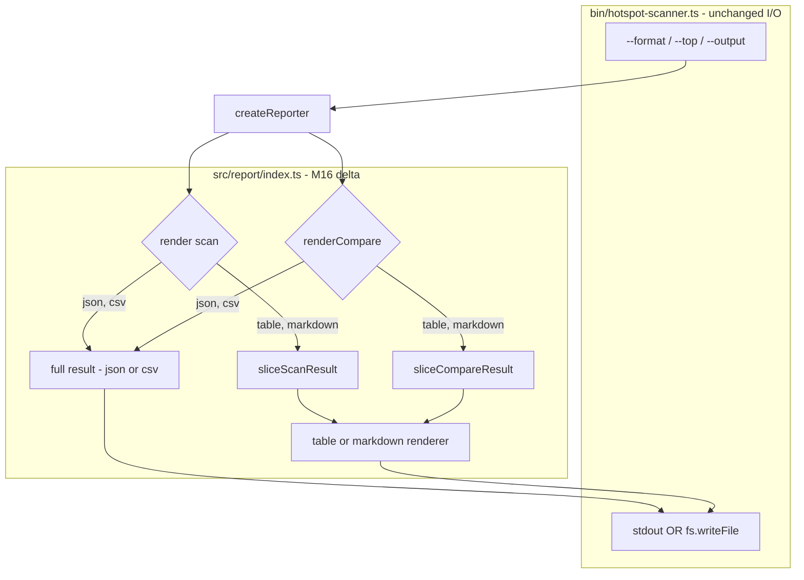

# Milestone 16 — Format-Scoped Top Limit Design

**Spec**: [`.specs/features/format-scoped-top/spec.md`](./spec.md)  
**Context**: [`.specs/features/format-scoped-top/context.md`](./context.md)  
**Status**: Done

---

## Architecture Overview

M16 changes **only** `createReporter()` dispatch in `src/report/index.ts`. Slice helpers and individual renderers are unchanged. JSON joins CSV on the full-export path; table and markdown keep the existing slice-then-render path.



**Baseline:** [`.specs/features/csv-export/design.md`](../csv-export/design.md) § `createReporter` dispatch (M17 CSV bypass).  
**ROADMAP:** M16 Format-Scoped Top Limit.

---

## Code Reuse Analysis

### Existing Components to Leverage

| Component                        | Location                               | How to Use                                        |
| -------------------------------- | -------------------------------------- | ------------------------------------------------- |
| `createReporter`                 | `src/report/index.ts`                  | Add JSON bypass before slice; compare path same   |
| `sliceScanResult`                | `src/report/slice.ts`                  | Call only for `table` / `markdown` scan render    |
| `sliceCompareResult`             | `src/report/slice-compare.ts`          | Call only for `table` / `markdown` compare render |
| `renderJson`                     | `src/report/json.ts`                   | Unchanged — receives full `ScanResult`            |
| `renderCompareJson`              | `src/report/compare-json.ts`           | Unchanged — receives full `CompareResult`         |
| `renderCsv` / `renderCompareCsv` | `src/report/csv.ts`, `compare-csv.ts`  | Unchanged — already bypass slice (M17)            |
| `renderTable` / `renderMarkdown` | `src/report/table.ts`, `markdown.ts`   | Unchanged — receive sliced result                 |
| Compare renderers (table/md)     | `src/report/compare-*.ts`              | Unchanged — receive sliced `CompareResult`        |
| `sample-result.json`             | `tests/fixtures/report/`               | 3 hotspots, 2 coupling — JSON full-export tests   |
| Compare fixtures                 | `tests/fixtures/report/compare-*.json` | Compare JSON unsliced tests                       |
| Integration fixture              | `tests/fixtures/repos/small-ts/`       | E2E JSON full export                              |

### Integration Points

| Consumer                      | Impact                                    |
| ----------------------------- | ----------------------------------------- |
| `src/scan.ts`                 | None — returns full ranked lists          |
| `src/compare/**`              | None — classification unchanged           |
| `src/report/slice.ts`         | None — logic unchanged                    |
| `src/report/slice-compare.ts` | None — logic unchanged                    |
| `src/report/json.ts`          | None                                      |
| `src/report/index.ts`         | **Modified** — conditional slice dispatch |
| `bin/hotspot-scanner.ts`      | **Modified** — `--top` help text only     |

---

## `createReporter` Dispatch (M16 Target)

### Scan path

```typescript
render(result, options) {
  if (options.format === "csv") {
    return renderCsv(result);
  }
  if (options.format === "json") {
    return renderJson(result);
  }
  const sliced = sliceScanResult(result, options.top);
  switch (options.format) {
    case "markdown":
      return renderMarkdown(sliced);
    default:
      return renderTable(sliced);
  }
}
```

### Compare path

```typescript
renderCompare(result, options) {
  if (options.format === "csv") {
    return renderCompareCsv(result);
  }
  if (options.format === "json") {
    return renderCompareJson(result);
  }
  const sliced = sliceCompareResult(result, options.top);
  switch (options.format) {
    case "markdown":
      return renderCompareMarkdown(sliced);
    default:
      return renderCompareTable(sliced);
  }
}
```

### Format × `--top` matrix

| Format     | Scan slice | Compare slice | Notes              |
| ---------- | ---------- | ------------- | ------------------ |
| `table`    | yes        | yes           | Default CLI format |
| `markdown` | yes        | yes           | PR-friendly        |
| `json`     | **no**     | **no**        | Full arrays (M16)  |
| `csv`      | no         | no            | Unchanged from M17 |

---

## CLI Help Text Change

**Current** (`bin/hotspot-scanner.ts`):

```typescript
.option("--top <n>", "Top N results per ranking", String(DEFAULT_TOP))
```

**Target:**

```typescript
.option(
  "--top <n>",
  "Top N rows in table/markdown output (ignored for json/csv)",
  String(DEFAULT_TOP),
)
```

No change to `parsePositiveInteger` validation or default value.

---

## Test Strategy

### Unit (`src/report/index.test.ts`)

| Case                     | Input                                     | Assert                           |
| ------------------------ | ----------------------------------------- | -------------------------------- |
| JSON scan full export    | `format: "json", top: 2`, 3 hotspots      | `parsed.hotspots.length === 3`   |
| JSON compare full export | `format: "json", top: 1`, compare fixture | all delta rows present           |
| Table slice preserved    | `format: "table", top: 2`                 | at most 2 hotspot rows in output |
| Markdown slice preserved | `format: "markdown", top: 2`              | section row count limited        |
| CSV regression           | `format: "csv", top: 1`                   | all 3 hotspot rows (M17)         |
| Function mode table      | `granularity=function`, `top: 2`          | functions sliced, not hotspots   |

### Integration (`bin/hotspot-scanner.integration.test.ts`)

| Case              | Command                                                 | Assert                             |
| ----------------- | ------------------------------------------------------- | ---------------------------------- |
| JSON full export  | `scan small-ts --format json --top 1`                   | parsed `hotspots.length > 1`       |
| Compare JSON full | `scan small-ts --baseline <file> --format json --top 1` | full delta sections in parsed JSON |

---

## Documentation Sync Targets

| File                                            | Change                                                                              |
| ----------------------------------------------- | ----------------------------------------------------------------------------------- |
| `.specs/project/STATE.md`                       | Decision: `--top` table/markdown only; JSON breaking change note                    |
| `.specs/codebase/ARCHITECTURE.md`               | Qualify line 121 (`--top` slices only table/markdown); line 138 compare slice scope |
| `README.md`                                     | Flags table: `--top` scope                                                          |
| `.cursor/skills/vitals-cli-validation/SKILL.md` | JSON export example with `--top` ignored                                            |
| `.specs/project/ROADMAP.md`                     | M16 link + `**Specs:** Done`; implementation checkboxes on Execute Done             |

---

## Risks

| Risk                                           | Mitigation                                                                              |
| ---------------------------------------------- | --------------------------------------------------------------------------------------- |
| JSON consumers relied on pre-M16 slicing       | Document breaking change in STATE.md; JSON is canonical full export                     |
| Stale M5 spec (HOTSPOT-45) confuses agents     | context.md marks superseded; do not edit historical spec                                |
| ARCHITECTURE already says JSON ignores `--top` | M16 Execute aligns code with docs — low doc churn                                       |
| Compare JSON test fixture has few deltas       | Use fixture with known multi-row `rankChanged`; assert against unsliced `CompareResult` |

---

## Out of Scope (Design Boundary)

- No new types or domain changes
- No `ReporterOptions` interface change (`top` remains optional)
- No changes to `sliceScanResult` / `sliceCompareResult` signatures or behavior
