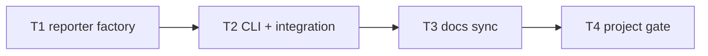

# Milestone 16 — Format-Scoped Top Limit Tasks

**Design**: [`.specs/features/format-scoped-top/design.md`](./design.md)  
**Spec**: [`.specs/features/format-scoped-top/spec.md`](./spec.md)  
**Context**: [`.specs/features/format-scoped-top/context.md`](./context.md)  
**Status**: Planned

---

## Execution Plan

### Phase 1: Reporter factory (Sequential)

```
T1 createReporter JSON bypass + unit tests
```

### Phase 2: CLI + integration (Sequential)

```
T1 → T2 CLI help text + integration tests
```

### Phase 3: Docs + gate (Sequential)

```
T2 → T3 documentation sync
T3 → T4 project gate
```



### Diagram-Definition Cross-Check

| Task | Depends on (declared) | Appears in diagram after deps | Match |
| ---- | --------------------- | ----------------------------- | ----- |
| T1 | None | Root | ✅ |
| T2 | T1 | T1 → T2 | ✅ |
| T3 | T2 | T2 → T3 | ✅ |
| T4 | T3 | T3 → T4 | ✅ |

### Test Co-location Validation

| Task | Code layer | TESTING.md expectation | Tests in same task | Match |
| ---- | ---------- | ---------------------- | ------------------ | ----- |
| T1 | `src/report/index.ts` | Unit required | `index.test.ts` | ✅ |
| T2 | `bin/hotspot-scanner.ts` | Unit + integration | `bin/hotspot-scanner.test.ts`, `bin/hotspot-scanner.integration.test.ts` | ✅ |
| T3 | Docs only | Gate | `pnpm build && pnpm test` | ✅ |
| T4 | Full project | Gate | `pnpm build && pnpm test` | ✅ |

---

## Task Breakdown

### T1: Reporter factory — JSON bypass slice

**What**: Refactor `createReporter()` in `src/report/index.ts` so `json` and `csv` formats bypass `sliceScanResult` / `sliceCompareResult`. Table and markdown continue to slice before render. Update `index.test.ts`: JSON scan/compare tests assert full arrays; table/markdown/CSV tests unchanged or strengthened.

**Where**: `src/report/index.ts`, `src/report/index.test.ts`

**Depends on**: None

**Reuses**: [design.md](./design.md) § `createReporter` Dispatch; [context.md](./context.md) § Slice helpers unchanged; `tests/fixtures/report/sample-result.json` (3 hotspots); compare fixtures via `compareScanResults()`

**Requirement**: HOTSPOT-129, HOTSPOT-130, HOTSPOT-131, HOTSPOT-132, HOTSPOT-133

**Tools**:

- MCP: NONE
- Skill: NONE

**Done when**:

- [ ] `render(..., { format: "json", top: 2 })` returns JSON with all 3 hotspot rows from fixture
- [ ] `render(..., { format: "json", top: 2 })` returns JSON with all coupling rows from fixture
- [ ] `renderCompare(..., { format: "json", top: 1 })` returns unsliced delta arrays (match raw `CompareResult` section lengths)
- [ ] `render(..., { format: "table", top: 2 })` still limits visible hotspot rows
- [ ] `render(..., { format: "markdown", top: 2 })` still limits visible hotspot rows
- [ ] `renderCompare(..., { format: "table", top: 2 })` still slices delta display
- [ ] `render(..., { format: "csv", top: 1 })` still exports all hotspot rows (M17 regression)
- [ ] Function mode: `render(..., { format: "table", top: 2 })` slices `functions`, not `hotspots`
- [ ] `sliceScanResult` and `sliceCompareResult` files unchanged

**Tests**: `index.test.ts` — JSON full export (scan + compare), table/markdown slice preserved, CSV regression, function mode slice

**Gate**: `pnpm exec vitest run src/report/index.test.ts`

---

### T2: CLI help text + integration tests

**What**: Update `--top` commander description in `bin/hotspot-scanner.ts` to document table/markdown-only scope. Add integration tests: `--format json --top 1` on `small-ts` returns full hotspot array; `--baseline ... --format json --top 1` returns full compare JSON.

**Where**: `bin/hotspot-scanner.ts`, `bin/hotspot-scanner.integration.test.ts`

**Depends on**: T1

**Reuses**: [design.md](./design.md) § CLI Help Text Change; `tests/fixtures/repos/small-ts/`; existing compare baseline integration pattern

**Requirement**: HOTSPOT-133, HOTSPOT-134

**Tools**:

- MCP: NONE
- Skill: `vitals-cli-validation`

**Done when**:

- [ ] Commander `--top` help mentions table/markdown scope and json/csv ignored
- [ ] Integration: `scan small-ts --format json --top 1` exits `0` and parsed JSON has `hotspots.length > 1`
- [ ] Integration: `scan small-ts --baseline <file> --format json --top 1` exits `0` and compare JSON sections are unsliced vs pre-render `CompareResult`
- [ ] `--top` validation (positive integer) unchanged
- [ ] Table/markdown integration behavior unchanged

**Tests**: `bin/hotspot-scanner.integration.test.ts` — JSON full export scan + compare; optional help text check in `bin/hotspot-scanner.test.ts`

**Gate**: `pnpm exec vitest run bin/hotspot-scanner.integration.test.ts bin/hotspot-scanner.test.ts`

---

### T3: Documentation sync

**What**: Update STATE.md (format-scoped `--top` decision + JSON breaking change), ARCHITECTURE.md (qualify `--top` lines 121 and 138), README.md flags table, vitals-cli-validation skill. Mark ROADMAP M16 implementation checkboxes `[x]` on Execute Done only.

**Where**: `.specs/project/STATE.md`, `.specs/codebase/ARCHITECTURE.md`, `README.md`, `.cursor/skills/vitals-cli-validation/SKILL.md`, `.specs/project/ROADMAP.md`

**Depends on**: T2

**Reuses**: [design.md](./design.md) § Documentation Sync Targets; [context.md](./context.md) § JSON breaking change

**Requirement**: HOTSPOT-134

**Tools**:

- MCP: NONE
- Skill: `vitals-cli-validation`

**Done when**:

- [ ] STATE.md records `--top` scoped to table/markdown; notes JSON pre-M16 slicing removed
- [ ] ARCHITECTURE.md consistently documents format-scoped `--top` (no ambiguous global slice statement)
- [ ] README.md `--top` flag description matches new semantics
- [ ] vitals-cli-validation skill includes JSON full-export example with `--top` present
- [ ] ROADMAP M16 implementation checkboxes marked `[x]` on Execute Done

**Tests**: Doc review; grep `--top` in listed files

**Gate**: `pnpm build && pnpm test`

---

### T4: Project gate

**What**: Run full project quality gate and confirm all M16 acceptance criteria pass.

**Where**: (verification only)

**Depends on**: T3

**Reuses**: [TESTING.md](../../codebase/TESTING.md) coverage thresholds

**Requirement**: HOTSPOT-129, HOTSPOT-130, HOTSPOT-131, HOTSPOT-132, HOTSPOT-133, HOTSPOT-134

**Tools**:

- MCP: NONE
- Skill: NONE

**Done when**:

- [ ] `pnpm build` succeeds
- [ ] `pnpm test` succeeds with coverage thresholds met
- [ ] No regressions in scan without `--baseline` (integration smoke)

**Tests**: Full project gate

**Gate**: `pnpm build && pnpm test`

---

## Requirement Traceability (Tasks)

| Requirement ID | Tasks |
| -------------- | ----- |
| HOTSPOT-129 | T1, T4 |
| HOTSPOT-130 | T1, T4 |
| HOTSPOT-131 | T1, T4 |
| HOTSPOT-132 | T1, T4 |
| HOTSPOT-133 | T1, T2, T4 |
| HOTSPOT-134 | T2, T3, T4 |

**Coverage:** 6 total, 6 mapped to tasks, 0 unmapped
