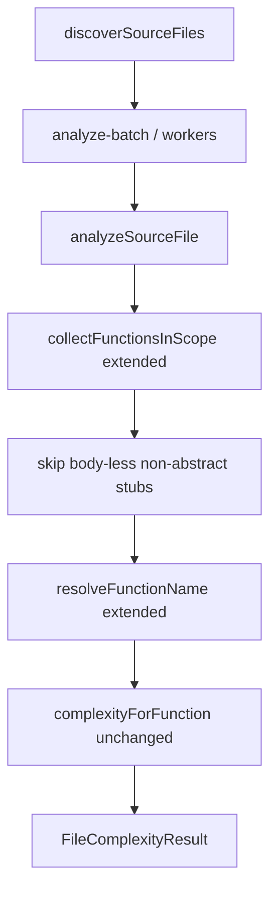

# Milestone 29 — Function AST Coverage+ Design

**Spec**: [`.specs/features/function-ast-coverage-plus/spec.md`](./spec.md)  
**Context**: [`.specs/features/function-ast-coverage-plus/context.md`](./context.md)  
**Status**: Planned

---

## Architecture Overview

M29 is a **surgical extension** of collection / naming in `src/complexity/analyze-file.ts`, plus an overload-stub filter. McCabe (`mccabe.ts`), workers (M15), scoring, and CLI stay unchanged — workers already call `analyzeSourceFile`.

**Brownfield notes (verified gaps):**

| Gap | Root cause in current code |
| --- | -------------------------- |
| ClassExpression | `VariableStatement` returns after `collectCallableInitializer`, which ignores `ClassExpression` |
| Object-literal accessors | `collectFromObjectLiteral` handles `MethodDeclaration` + `PropertyAssignment` only |
| Assignment RHS | No branch for `BinaryExpression` / assignment with callable RHS |
| Function overloads | Top-level `FunctionDeclaration` stubs pushed with no body → complexity 1 noise |

---

## Code Reuse Analysis

| Component | Location | How to Use |
| --------- | -------- | ---------- |
| Class member loop | `analyze-file.ts` ClassDeclaration branch | Extract shared `collectClassLikeMembers(classLike, functions)` for Declaration **and** Expression |
| `collectFromObjectLiteral` | `analyze-file.ts` | Add get/set accessor branches (mirror class accessors) |
| `collectCallableInitializer` | `analyze-file.ts` | Optionally accept ClassExpression → delegate to class-like member collector |
| `resolveFunctionName` | `analyze-file.ts` | Add AssignmentExpression / PropertyAccess LHS naming per context.md |
| `complexityForFunction` | `mccabe.ts` | **Do not modify** decision nodes |
| M11/M22 naming | sister `context.md` files | Additive rows only |
| Fixture style | `tests/fixtures/complexity/` (M22) | New files + comments with expected complexities |

### Fragile areas (CONCERNS.md / RT-005)

| Risk | Mitigation |
| ---- | ---------- |
| Accidental McCabe definition drift | No semantic edits to `mccabe.ts`; review in T3; fixture lock |
| Double-counting ClassExpression | Ensure VariableStatement path collects class-like members **once** and does not also recurse into the same nodes via a second walk |
| Over-filtering abstracts | Skip only body-less **non-abstract** Function/Method declarations; keep M22 abstract accessors |
| File-sum churn | Document intentional increases (new nodes) and decreases (stub skip) in fixture headers |

---

## Components

### 1. Class-like member collection

- **Purpose**: Share ClassDeclaration / ClassExpression member discovery
- **Location**: `src/complexity/analyze-file.ts` (private helpers)
- **Interfaces**: e.g. `collectClassLikeMembers(node, functions)` where `node` is ClassDeclaration | ClassExpression
- **Dependencies**: ts-morph `Node` guards
- **Reuses**: Existing member kind checks (method, constructor, get/set, property initializer)

### 2. Object-literal accessor collection

- **Purpose**: Collect get/set inside object literals
- **Location**: `collectFromObjectLiteral` in `analyze-file.ts`
- **Interfaces**: Same helper signature
- **Reuses**: Class accessor push + body recursion pattern

### 3. Assignment RHS callable collection

- **Purpose**: Discover `=` assignments of arrows / function expressions
- **Location**: `collectFunctionsInScope` (detect BinaryExpression with `=` or ExpressionStatement containing it — prefer walking BinaryExpression when operator is `EqualsToken`)
- **Naming**: Extend `resolveFunctionName` for parent Assignment / BinaryExpression LHS
- **Reuses**: `collectCallableInitializer`-style push + recurse into body; do **not** treat ClassExpression on RHS as a “callable initializer” for naming — use class-like member path instead if RHS is ClassExpression

### 4. Overload stub filter

- **Purpose**: Avoid ranking ambient/overload stubs
- **Location**: At push site for FunctionDeclaration / MethodDeclaration (or immediate post-push guard)
- **Rule**: If `(FunctionDeclaration | MethodDeclaration)` && `!getBody()` && `!hasModifier(AbstractKeyword)` → **do not push**
- **Non-goals**: Do not change complexity math for implementations

### 5. Fixtures + tests

- **Purpose**: Lock McCabe and naming
- **Location**: `tests/fixtures/complexity/` + `src/complexity/analyze-file.test.ts`
- **Suggested files**: `class-expressions.ts`, `object-literal-accessors.ts`, `assignment-callables.ts`, `overloads.ts`, optional `namespace-module.ts`

---

## Tech Decisions

| Decision | Choice | Rationale |
| -------- | ------ | --------- |
| Touch `mccabe.ts` semantics? | No | RT-005 / ROADMAP |
| Assignment operators | Only `=` | YAGNI |
| FunctionExpression inner name on assignment | Ignore; use LHS | Match VariableDeclaration policy |
| ClassExpression via VariableStatement | Collect members in initializer path | Fixes early-return hole |
| Overload stubs | Skip body-less non-abstract | Removes verified noise on `function` overloads |
| Namespace collector | No change | Already works |

---

## Error Handling Strategy

| Scenario | Handling | User impact |
| -------- | -------- | ----------- |
| Invalid syntax file | Unchanged warn-skip at analyzer boundary | No abort |
| Exotic assignment LHS | Fall back to `<anonymous>:L{line}` | Stable IDs |

---

## Integration Points

| System | Integration |
| ------ | ----------- |
| Complexity workers / batch | Transparent — still call `analyzeSourceFile` |
| Function churn (M23) | New nodes get `[line,endLine]` automatically; no miner API change |
| JSON schema | No shape change — still `FunctionComplexityResult[]` |
