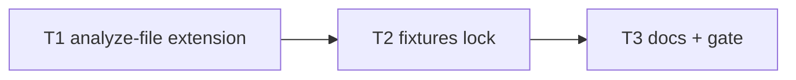

# Milestone 29 — Function AST Coverage+ Tasks

**Design**: [`.specs/features/function-ast-coverage-plus/design.md`](./design.md)  
**Spec**: [`.specs/features/function-ast-coverage-plus/spec.md`](./spec.md)  
**Context**: [`.specs/features/function-ast-coverage-plus/context.md`](./context.md)  
**Status**: Done

---

## Execution Plan

```
T1 extend analyze-file + unit tests → T2 McCabe fixtures (+ optional namespace) → T3 docs + full gate
```



### Diagram-Definition Cross-Check

| Task | Depends on (body) | Diagram | Status   |
| ---- | ----------------- | ------- | -------- |
| T1   | None              | Root    | ✅ Match |
| T2   | T1                | T1 → T2 | ✅ Match |
| T3   | T2                | T2 → T3 | ✅ Match |

### Path Conflict Check (Check 5)

| Task | Module owner                                    | Paths                                                             | Conflict                                        |
| ---- | ----------------------------------------------- | ----------------------------------------------------------------- | ----------------------------------------------- |
| T1   | `src/complexity/`                               | `analyze-file.ts`, `analyze-file.test.ts`                         | Sole owner — sequential                         |
| T2   | `tests/fixtures/complexity/` + complexity tests | New fixtures; may touch `analyze-file.test.ts`                    | After T1 — same domain, sequential (no `[P]`)   |
| T3   | docs (`.specs/codebase/`)                       | `ARCHITECTURE.md`, `CONCERNS.md`; ROADMAP sync deferred to parent | After T2 — no src overlap with unfinished T1/T2 |

**Verdict:** No parallel path conflicts. All tasks sequential under `src/complexity/` + fixtures + docs.

### Test Co-location Validation

| Task | Code layer                | Matrix / project practice               | Task `Tests`                     | Status |
| ---- | ------------------------- | --------------------------------------- | -------------------------------- | ------ |
| T1   | complexity `analyze-file` | unit + complexity fixtures (TESTING.md) | unit (same task)                 | ✅ OK  |
| T2   | complexity fixtures       | Known McCabe values                     | unit / fixture tests (same task) | ✅ OK  |
| T3   | docs only                 | none required for docs                  | none + full gate                 | ✅ OK  |

### Granularity Check

| Task | Scope                                          | Status      |
| ---- | ---------------------------------------------- | ----------- |
| T1   | One module (`analyze-file` + co-located tests) | ✅ Cohesive |
| T2   | Fixture family + assertions                    | ✅ Cohesive |
| T3   | Docs + gate                                    | ✅ Cohesive |

---

## Task Breakdown

### T1: Extend collection, naming, and overload skip

**What**: Update `analyze-file.ts` to (1) collect ClassExpression members via shared class-like helper, (2) collect object-literal get/set accessors, (3) collect `=` AssignmentExpression RHS ArrowFunction / FunctionExpression with naming per [context.md](./context.md), (4) skip body-less non-abstract FunctionDeclaration / MethodDeclaration stubs. **Do not** change `mccabe.ts` decision-node semantics. Add/adjust unit tests for discovery, naming, and overload filtering.

**Where**: `src/complexity/analyze-file.ts`, `src/complexity/analyze-file.test.ts`

**Depends on**: None

**Reuses**: M22 class member / object-literal patterns; `complexityForFunction`; M11/M22 naming rows

**Requirement**: HOTSPOT-281, HOTSPOT-282, HOTSPOT-283, HOTSPOT-284, HOTSPOT-285, HOTSPOT-287

**Tools**:

- MCP: NONE
- Skill: `vitals-pipeline-domain`, `coding-guidelines`

**Done when**:

- [x] ClassExpression members appear with ClassDeclaration-equivalent kinds and names
- [x] Object-literal get/set appear with bare accessor names
- [x] Assignment RHS callables collected and named per context.md (`=` only)
- [x] Body-less non-abstract overload stubs excluded; abstract empty-body policy preserved
- [x] No semantic change to McCabe decision nodes (`mccabe.ts` untouched or comment-only)
- [x] Unit tests cover the four behaviors above
- [x] Gate check passes: `pnpm exec vitest run src/complexity/analyze-file.test.ts`

**Tests**: unit  
**Gate**: `pnpm exec vitest run src/complexity/analyze-file.test.ts`

**Verify**:

```bash
pnpm exec vitest run src/complexity/analyze-file.test.ts
```

---

### T2: McCabe fixtures per construct (+ optional namespace)

**What**: Add fixture TS files with manually verified cyclomatic complexities for ClassExpression, object-literal accessors, assignment callables, and overloads (implementation-only counts). Wire assertions in complexity tests. Optionally add `namespace-module.ts` regression fixture (HOTSPOT-290) — no collector change required if already green. Update any existing fixtures whose file totals change because of new nodes or stub skipping.

**Where**: `tests/fixtures/complexity/` (e.g. `class-expressions.ts`, `object-literal-accessors.ts`, `assignment-callables.ts`, `overloads.ts`, optional `namespace-module.ts`), `src/complexity/analyze-file.test.ts` (and/or sibling complexity tests)

**Depends on**: T1

**Reuses**: M22 fixture comment style (`getters-setters.ts`, etc.)

**Requirement**: HOTSPOT-286, HOTSPOT-287, HOTSPOT-290

**Tools**:

- MCP: NONE
- Skill: `vitals-pipeline-domain`, `fixture-builder` (only if fixture-builder agent preferred for trees — flat `.ts` fixtures OK inline)

**Done when**:

- [x] At least one fixture per new construct family (ClassExpression, object-literal accessors, assignment callables, overloads) with documented expected complexity
- [x] Overload fixture asserts stub signatures are absent and implementation complexity is locked
- [x] Optional namespace/module fixture locks existing behavior (or explicitly skipped with note if deferred)
- [x] Prior decision-node fixtures still pass (updated only where M29 intentionally changes counts)
- [x] Gate check passes: `pnpm exec vitest run src/complexity/`

**Tests**: unit / complexity fixture tests  
**Gate**: `pnpm exec vitest run src/complexity/`

**Verify**:

```bash
pnpm exec vitest run src/complexity/
```

---

### T3: Documentation + full quality gate

**What**: Document M29 collection extensions and overload-skip policy in `.specs/codebase/ARCHITECTURE.md` (§ Function AST collection table) and `.specs/codebase/CONCERNS.md` (collection scope / RT-005 note). Do **not** edit ROADMAP.md / STATE.md in this task if parent owns sync — otherwise note deferred. Run full project gate.

**Where**: `.specs/codebase/ARCHITECTURE.md`, `.specs/codebase/CONCERNS.md` (README only if function naming is listed there)

**Depends on**: T2

**Reuses**: M22 doc rows as the base table to extend

**Requirement**: HOTSPOT-288, HOTSPOT-289

**Tools**:

- MCP: NONE
- Skill: `vitals-spec-driven` (docs only)

**Done when**:

- [x] ARCHITECTURE naming/collection table includes M29 constructs + overload-skip note
- [x] CONCERNS notes M29 collection extension without inviting McCabe decision-node edits
- [x] Full gate green: `pnpm build && pnpm test`

**Tests**: none  
**Gate**: `pnpm build && pnpm test`

**Verify**:

```bash
pnpm build && pnpm test
```

**Commit** (propose only — do not commit unless user asks):  
`feat(complexity): extend AST collection for class expressions, object accessors, assignments`

---

## Parallel Execution Map

```
Phase 1 (Sequential):
  T1 ──→ T2 ──→ T3
```

No `[P]` tasks — all share `src/complexity/` / fixture test files.

---

## Requirement → Task Mapping

| Requirement ID | Task(s) |
| -------------- | ------- |
| HOTSPOT-281    | T1      |
| HOTSPOT-282    | T1      |
| HOTSPOT-283    | T1      |
| HOTSPOT-284    | T1      |
| HOTSPOT-285    | T1, T3  |
| HOTSPOT-286    | T2      |
| HOTSPOT-287    | T1, T2  |
| HOTSPOT-288    | T3      |
| HOTSPOT-289    | T3      |
| HOTSPOT-290    | T2      |

**Unmapped P1:** none
