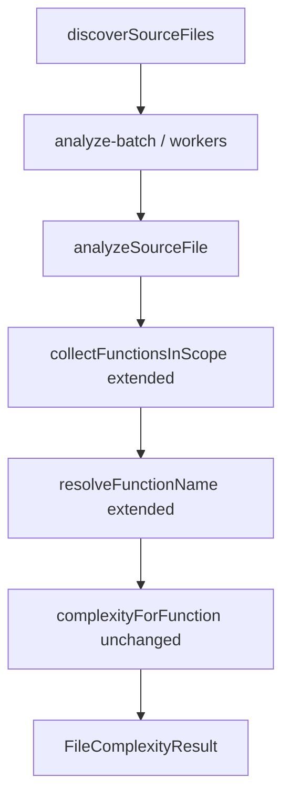

# Milestone 22 — Function AST Coverage Design

**Spec**: [`.specs/features/function-ast-coverage/spec.md`](./spec.md)  
**Context**: [`.specs/features/function-ast-coverage/context.md`](./context.md)  
**Status**: Planned

---

## Architecture Overview

M22 is a **surgical extension** of `collectFunctionsInScope` / `resolveFunctionName` in `analyze-file.ts`. McCabe (`mccabe.ts`) and worker batching (M15) stay unchanged — workers already call `analyzeSourceFile`.

---

## Code Reuse Analysis

| Component                 | Location                        | How to Use                                                  |
| ------------------------- | ------------------------------- | ----------------------------------------------------------- |
| `collectFunctionsInScope` | `analyze-file.ts`               | Add branches for accessors, property arrows, object methods |
| `resolveFunctionName`     | `analyze-file.ts`               | Handle new node kinds per context.md                        |
| `complexityForFunction`   | `mccabe.ts`                     | **Do not modify** decision nodes                            |
| Existing fixtures         | `tests/fixtures/complexity/`    | Keep; add new files per construct                           |
| M11 naming                | function-granularity/context.md | Extend table only                                           |

### Fragile areas (CONCERNS.md)

| Risk                               | Mitigation                                                                                                     |
| ---------------------------------- | -------------------------------------------------------------------------------------------------------------- |
| Accidental McCabe definition drift | Code review: no edits to decision-node list; fixture lock                                                      |
| Double-counting nodes              | Ensure class members not visited twice (current class branch vs forEachChild) — re-read control flow carefully |

---

## Components

### analyze-file collection extension

- **Purpose**: Discover additional callable nodes
- **Location**: `src/complexity/analyze-file.ts`
- **Interfaces**: Same `analyzeSourceFile` export
- **Dependencies**: ts-morph `Node` guards
- **Reuses**: Existing recursion into function bodies

### Fixtures

- **Purpose**: Manually verified McCabe per construct
- **Location**: `tests/fixtures/complexity/` (e.g. `getters-setters.ts`, `class-field-arrows.ts`, `object-literal-methods.ts`)
- **Tests**: `analyze-file.test.ts` and/or dedicated fixture tests

---

## Tech Decisions

| Decision           | Choice             | Rationale          |
| ------------------ | ------------------ | ------------------ |
| Touch mccabe.ts?   | No (semantics)     | ROADMAP / CONCERNS |
| Getter name prefix | Bare name          | Align with methods |
| File sum           | Includes new nodes | Honest complexity  |
