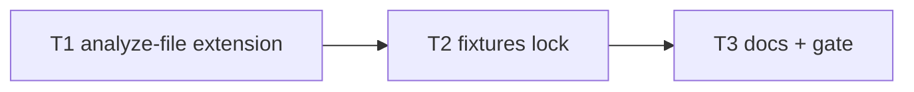

# Milestone 22 — Function AST Coverage Tasks

**Design**: [`.specs/features/function-ast-coverage/design.md`](./design.md)  
**Spec**: [`.specs/features/function-ast-coverage/spec.md`](./spec.md)  
**Context**: [`.specs/features/function-ast-coverage/context.md`](./context.md)  
**Status**: Done

---

## Execution Plan

```
T1 extend analyze-file + unit tests → T2 McCabe fixtures per construct → T3 docs + gate
```



### Diagram-Definition Cross-Check

| Task | Depends on | Diagram | Match |
| ---- | ---------- | ------- | ----- |
| T1   | None       | Root    | ✅    |
| T2   | T1         | T1 → T2 | ✅    |
| T3   | T2         | T2 → T3 | ✅    |

### Path Conflict Check

| Task | Module owner                                    | Paths                                              | Conflict                           |
| ---- | ----------------------------------------------- | -------------------------------------------------- | ---------------------------------- |
| T1   | `src/complexity/`                               | `analyze-file.ts`, `analyze-file.test.ts`          | Sequential                         |
| T2   | `tests/fixtures/complexity/` + complexity tests | fixtures + tests                                   | After T1 — same domain, sequential |
| T3   | docs                                            | README/ARCHITECTURE/CONCERNS naming notes, ROADMAP | After T2                           |

### Test Co-location Validation

| Task | Layer                   | Tests          | Match |
| ---- | ----------------------- | -------------- | ----- |
| T1   | complexity analyze-file | unit same task | ✅    |
| T2   | complexity fixtures     | unit same task | ✅    |
| T3   | docs                    | full gate      | ✅    |

---

## Task Breakdown

### T1: Extend collectFunctionsInScope + naming

**What**: Update `analyze-file.ts` to collect getters, setters, class field arrows/function initializers, and object-literal methods/function properties. Extend `resolveFunctionName` per [context.md](./context.md). **Do not** change `mccabe.ts` decision-node semantics. Add/adjust unit tests for discovery and naming.

**Where**: `src/complexity/analyze-file.ts`, `src/complexity/analyze-file.test.ts`

**Depends on**: None

**Reuses**: M11 naming rules; `complexityForFunction`

**Requirement**: HOTSPOT-174, HOTSPOT-175, HOTSPOT-176, HOTSPOT-177

**Done when**:

- [x] New constructs appear in `analyzeSourceFile` results
- [x] Naming matches context.md
- [x] No semantic change to McCabe decision nodes
- [x] Unit tests green

**Tests**: unit

**Gate**: `pnpm exec vitest run src/complexity/analyze-file.test.ts`

---

### T2: McCabe fixtures per construct

**What**: Add fixture TS files with manually verified cyclomatic complexities for getters/setters, class field arrows, and object-literal methods. Wire assertions. Update any existing fixtures whose file totals change because new nodes are now counted.

**Where**: `tests/fixtures/complexity/*`, related complexity tests

**Depends on**: T1

**Reuses**: Existing fixture documentation style from M3

**Requirement**: HOTSPOT-177, HOTSPOT-178

**Done when**:

- [x] At least one fixture per new construct family with documented expected complexity
- [x] Prior decision-node fixtures still pass (updated only where newly collected nodes exist)
- [x] Tests green

**Tests**: unit / complexity fixture tests

**Gate**: `pnpm exec vitest run src/complexity/`

---

### T3: Documentation + full gate

**What**: Document extended naming and collection coverage (ARCHITECTURE / CONCERNS / README or function-granularity cross-link). Mark M22 ROADMAP complete on Execute finish. `pnpm build && pnpm test`.

**Where**: `.specs/codebase/ARCHITECTURE.md` and/or CONCERNS, `README.md` if function naming listed, `.specs/project/ROADMAP.md`

**Depends on**: T2

**Requirement**: HOTSPOT-179, HOTSPOT-180

**Done when**:

- [x] Docs mention new constructs
- [x] Full gate green

**Tests**: none

**Gate**: `pnpm build && pnpm test`

**Commit** (propose only): `feat(complexity): cover getters, setters, field arrows, object methods`

---

## Requirement → Task map

| Requirement ID | Task   |
| -------------- | ------ |
| HOTSPOT-174    | T1     |
| HOTSPOT-175    | T1     |
| HOTSPOT-176    | T1     |
| HOTSPOT-177    | T1, T2 |
| HOTSPOT-178    | T2     |
| HOTSPOT-179    | T3     |
| HOTSPOT-180    | T3     |
