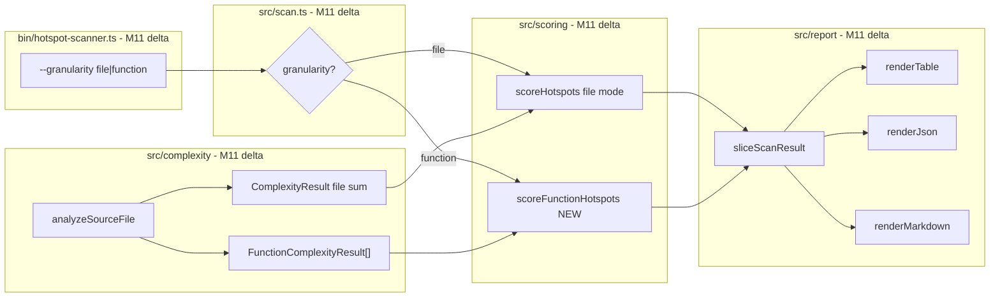

# Milestone 11 — Function Granularity Design

**Spec**: [`.specs/features/function-granularity/spec.md`](./spec.md)  
**Context**: [`.specs/features/function-granularity/context.md`](./context.md)  
**Status**: Done

---

## Architecture Overview

M11 extends the complexity analyzer to emit per-function McCabe results, adds a function-level hotspot scorer with inherited file churn, and branches the pipeline and reporters on `granularity`. File mode (default) is unchanged from M9/M10.



**Baseline:** [`.specs/features/complexity-analyzer/design.md`](../complexity-analyzer/design.md) — M3 McCabe; [`.specs/features/rich-output/design.md`](../rich-output/design.md) — M9 hotspot fields; [`.specs/features/export-formats/design.md`](../export-formats/design.md) — M10 markdown.  
**ROADMAP:** M11 Function Granularity.

---

## Code Reuse Analysis

### Existing Components to Leverage

| Component                        | Location                             | How to Use                                        |
| -------------------------------- | ------------------------------------ | ------------------------------------------------- |
| `collectFunctionsInScope`        | `src/complexity/analyze-file.ts`     | Extend to capture name + line per node            |
| `complexityForFunction`          | `src/complexity/mccabe.ts`           | Unchanged — per-function McCabe                   |
| `normalizeLogMinMax`             | `src/scoring/normalize.ts`           | Reuse for function complexity and inherited churn |
| `scoreHotspots`                  | `src/scoring/hotspot-scorer.ts`      | Unchanged — file mode only                        |
| `createReporter`                 | `src/report/index.ts`                | Branch render on `meta.granularity`               |
| `sliceScanResult`                | `src/report/slice.ts`                | Slice `functions` in function mode                |
| `renderTable` / `renderMarkdown` | `src/report/table.ts`, `markdown.ts` | Add function-mode section                         |
| `renderJson`                     | `src/report/json.ts`                 | Pass-through — new fields serialize automatically |
| Integration fixture              | `tests/fixtures/repos/small-ts/`     | E2E function mode in T6                           |

### Integration Points

| Consumer                                 | Impact                                                      |
| ---------------------------------------- | ----------------------------------------------------------- |
| `src/complexity/analyze-file.ts`         | Return `functions[]` alongside file aggregate               |
| `src/complexity/index.ts`                | Propagate `FunctionComplexityResult[]` in analyze result    |
| `src/scoring/function-hotspot-scorer.ts` | **New** — function ranking                                  |
| `src/scoring/index.ts`                   | Export `scoreFunctionHotspots`, factory                     |
| `src/types/domain.ts`                    | New types + `ScanMeta.granularity` + `ScanResult.functions` |
| `src/scan.ts`                            | Granularity branch after complexity                         |
| `src/report/slice.ts`                    | Slice active array                                          |
| `src/report/table.ts`                    | Function-mode columns                                       |
| `src/report/markdown.ts`                 | Function-mode GFM table                                     |
| `bin/hotspot-scanner.ts`                 | `--granularity` flag + `parseGranularity()`                 |

---

## Type Changes

### `ScanGranularity` and complexity types (`src/types/domain.ts`)

```typescript
export type ScanGranularity = "file" | "function";

export interface FunctionComplexityResult {
  filePath: string;
  functionName: string;
  line: number;
  complexity: number;
}

export interface FunctionHotspotScore {
  filePath: string;
  functionName: string;
  line: number;
  complexity: number;
  complexityNormalized: number;
  churnNormalized: number;
  hotspotScore: number;
  commitCount: number;
  linesChanged: number;
  authorCount: number;
}
```

### `ScanMeta` and `ScanResult`

```typescript
export interface ScanMeta {
  since: string;
  scannedAt: string;
  granularity: ScanGranularity;
}

export interface ScanResult {
  version: "1.0";
  hotspots: HotspotScore[];
  functions: FunctionHotspotScore[];
  coupling: CouplingPair[];
  meta: ScanMeta;
}
```

### `ScanOptions`

```typescript
export interface ScanOptions {
  // ... existing fields ...
  granularity?: ScanGranularity;
}
```

### `ComplexityAnalyzerResult` (internal)

Extend analyze result to carry per-function data:

```typescript
export interface FileComplexityResult {
  file: ComplexityResult;
  functions: FunctionComplexityResult[];
}
```

**YAGNI:** Do not add a separate `FunctionComplexityAnalyzer` — extend `analyzeSourceFile()` return shape.

---

## Function Name Resolution

New helper in `src/complexity/analyze-file.ts`:

```typescript
function resolveFunctionName(node: TsMorphNode): string {
  if (Node.isConstructorDeclaration(node)) return "constructor";
  if (Node.isMethodDeclaration(node) || Node.isFunctionDeclaration(node)) {
    return node.getName() ?? `<anonymous>:L${node.getStartLineNumber()}`;
  }
  // Arrow/function expression in VariableDeclaration — walk parent for name
  const parent = node.getParent();
  if (Node.isVariableDeclaration(parent)) {
    return parent.getName();
  }
  return `<anonymous>:L${node.getStartLineNumber()}`;
}
```

`line` = `node.getStartLineNumber()`.

---

## Function Hotspot Scorer

New module: `src/scoring/function-hotspot-scorer.ts`

```typescript
export function scoreFunctionHotspots(
  fileStats: Map<string, FileChangeStats>,
  functions: FunctionComplexityResult[],
): FunctionHotspotScore[] {
  if (functions.length === 0) return [];

  const complexityValues = functions.map((f) => f.complexity);
  const churnValues = functions.map(
    (f) => fileStats.get(f.filePath)?.commitCount ?? 0,
  );

  const complexityNormalized = normalizeLogMinMax(complexityValues);
  const churnNormalized = normalizeLogMinMax(churnValues);

  return functions
    .map((entry, index) => {
      const c = complexityNormalized[index]!;
      const h = churnNormalized[index]!;
      const hotspotScore = c + h === 0 ? 0 : (2 * c * h) / (c + h);
      const stats = fileStats.get(entry.filePath);

      return {
        filePath: entry.filePath,
        functionName: entry.functionName,
        line: entry.line,
        complexity: entry.complexity,
        complexityNormalized: c,
        churnNormalized: h,
        hotspotScore,
        commitCount: stats?.commitCount ?? 0,
        linesChanged: stats?.linesChanged ?? 0,
        authorCount: stats?.authors.size ?? 0,
      };
    })
    .sort(compareFunctionHotspotScores);
}
```

Tie-break: `hotspotScore` desc → `filePath` asc → `line` asc.

Factory in `src/scoring/index.ts`:

```typescript
export function createFunctionHotspotScorer() {
  return { score: scoreFunctionHotspots };
}
```

---

## Pipeline Branch (`src/scan.ts`)

```typescript
const granularity = options.granularity ?? "file";

// After complexity analyze:
if (granularity === "function") {
  const allFunctions = fileResults.flatMap((r) => r.functions);
  const functions = createFunctionHotspotScorer().score(
    fileStats,
    allFunctions,
  );
  return {
    version: "1.0",
    hotspots: [],
    functions,
    coupling,
    meta: { since, scannedAt, granularity },
  };
}

const hotspots = createHotspotScorer().score(fileStats, results);
return {
  version: "1.0",
  hotspots,
  functions: [],
  coupling,
  meta: { since, scannedAt, granularity: "file" },
};
```

---

## CLI Wiring

### New flag

```typescript
.option("--granularity <mode>", "Ranking granularity: file or function", "file")
```

### `parseGranularity`

```typescript
export function parseGranularity(value: string): ScanGranularity {
  if (value === "file" || value === "function") return value;
  throw new CliUsageError(
    `Invalid --granularity: ${value}. Expected file or function.`,
  );
}
```

Pass to `runScan({ granularity: parseGranularity(options.granularity) })`.

---

## Table Layout

### File mode (unchanged)

**Top Hotspots** section — same columns as M9.

### Function mode (new)

**Top Functions** section:

```
Rank  File                      Function              Line  Score     Cpx   CpxN      Churn  ChurnN  Authors
----  ------------------------  --------------------  ----  --------  ----  --------  -----  ------  -------
```

| Column   | Source field           | Format                |
| -------- | ---------------------- | --------------------- |
| Rank     | index + 1              | integer               |
| File     | `filePath`             | pad/truncate 24 chars |
| Function | `functionName`         | pad/truncate 20 chars |
| Line     | `line`                 | integer               |
| Score    | `hotspotScore`         | 4 decimals            |
| Cpx      | `complexity`           | integer               |
| CpxN     | `complexityNormalized` | 4 decimals            |
| Churn    | `commitCount`          | integer               |
| ChurnN   | `churnNormalized`      | 4 decimals            |
| Authors  | `authorCount`          | integer               |

**Coupling section:** unchanged in both modes.

**Dispatch:**

```typescript
if (result.meta.granularity === "function") {
  renderFunctionsSection(result.functions);
} else {
  renderHotspotsSection(result.hotspots);
}
```

---

## JSON Output

`renderJson()` remains pass-through. Example function object:

```json
{
  "filePath": "src/hot.ts",
  "functionName": "processOrder",
  "line": 42,
  "complexity": 15,
  "hotspotScore": 0.82,
  "complexityNormalized": 0.85,
  "churnNormalized": 0.79,
  "commitCount": 12,
  "linesChanged": 280,
  "authorCount": 3
}
```

Full result in function mode:

```json
{
  "version": "1.0",
  "hotspots": [],
  "functions": [/* ... */],
  "coupling": [/* unchanged */],
  "meta": {
    "since": "12 months ago",
    "scannedAt": "2026-07-22T12:00:00.000Z",
    "granularity": "function"
  }
}
```

---

## Markdown Layout

### Function mode document structure

```markdown
# Hotspot Scanner Report

**Scan window:** 12 months ago  
**Scanned at:** 2026-07-22T12:00:00.000Z  
**Granularity:** function

## Top Functions

| Rank | File       | Function     | Line |  Score | Cpx |   CpxN | Churn | ChurnN | Authors | Lines |
| ---: | ---------- | ------------ | ---: | -----: | --: | -----: | ----: | -----: | ------: | ----: |
|    1 | src/hot.ts | processOrder |   42 | 0.8200 |  15 | 0.8500 |    12 | 0.7900 |       3 |   280 |

## Top Coupling Pairs

| Rank | File A | File B | Strength | Co-changes |
| ---: | ------ | ------ | -------: | ---------: |
```

**Lines column:** include `linesChanged` in markdown (same rationale as M10 — PR viewers handle width).

### File mode

Unchanged from M10 — no **Granularity** metadata line (implicit `file`).

---

## Slice Behavior (`src/report/slice.ts`)

```typescript
export function sliceScanResult(result: ScanResult, top?: number): ScanResult {
  const slicedCoupling =
    top !== undefined ? result.coupling.slice(0, top) : result.coupling;

  if (result.meta.granularity === "function") {
    return {
      ...result,
      functions:
        top !== undefined ? result.functions.slice(0, top) : result.functions,
      hotspots: [],
      coupling: slicedCoupling,
    };
  }

  return {
    ...result,
    hotspots:
      top !== undefined ? result.hotspots.slice(0, top) : result.hotspots,
    functions: [],
    coupling: slicedCoupling,
  };
}
```

---

## Test Impact

| File                                                 | Change                                                      |
| ---------------------------------------------------- | ----------------------------------------------------------- |
| `src/complexity/analyze-file.ts`                     | Per-function extraction + `resolveFunctionName`             |
| `src/complexity/analyze-file.test.ts`                | **New or extend** — naming + complexity per function        |
| `src/complexity/index.ts`                            | Propagate `functions[]`                                     |
| `tests/fixtures/complexity/function-naming.ts`       | **New** — naming fixture                                    |
| `src/scoring/function-hotspot-scorer.ts`             | **New**                                                     |
| `src/scoring/function-hotspot-scorer.test.ts`        | **New**                                                     |
| `src/scoring/index.ts`                               | Export factory                                              |
| `src/types/domain.ts`                                | New types, extend `ScanResult` / `ScanMeta` / `ScanOptions` |
| `src/scan.ts`                                        | Granularity branch                                          |
| `src/scan.integration.test.ts`                       | Function mode integration                                   |
| `src/report/slice.ts`                                | Slice `functions`                                           |
| `src/report/slice.test.ts`                           | **New or extend** — function mode slice                     |
| `src/report/table.ts`                                | Function-mode section                                       |
| `src/report/table.test.ts`                           | Function-mode assertions                                    |
| `src/report/markdown.ts`                             | Function-mode section                                       |
| `src/report/markdown.test.ts`                        | Function-mode assertions                                    |
| `src/report/index.test.ts`                           | Both granularities                                          |
| `tests/fixtures/report/sample-result-functions.json` | **New** — function mode fixture                             |
| `bin/hotspot-scanner.ts`                             | `--granularity`, `parseGranularity`                         |
| `bin/hotspot-scanner.test.ts`                        | `parseGranularity` tests                                    |
| `bin/hotspot-scanner.integration.test.ts`            | `--granularity function` on `small-ts`                      |

**Do not change:**

- `src/scoring/hotspot-scorer.ts` (file mode)
- `src/scoring/coupling-scorer.ts`
- `src/scoring/normalize.ts`
- `src/scoring/mccabe.ts` decision node logic
- `src/git/**`

**Test helper update:** All existing `ScanResult` literals in tests must add `functions: []` and `meta.granularity: "file"` after T3.

---

## Risks

| Risk                                | Mitigation                                                             |
| ----------------------------------- | ---------------------------------------------------------------------- |
| McCabe definition drift             | Reuse `complexityForFunction()` unchanged; existing fixtures must pass |
| Many functions in large repos       | Acceptable v1; M15 covers AST parallelization                          |
| Same-file functions share churn     | Expected; tie-break by `line`                                          |
| JSON consumers break on new fields  | Additive only; inactive array empty; `meta.granularity` explicit       |
| Anonymous function naming ambiguity | Fixture-verified `<anonymous>:L{line}` convention                      |
| Wide function-mode table            | Path/function truncation; markdown richer than terminal                |

---

## Documentation Sync Targets

| File                                             | Update                                                    |
| ------------------------------------------------ | --------------------------------------------------------- |
| `.specs/project/STATE.md`                        | Decision: function-mode ranking with inherited file churn |
| `.specs/codebase/ARCHITECTURE.md`                | Granularity branch, `FunctionHotspotScore`, CLI flag      |
| `.specs/codebase/STRUCTURE.md`                   | `function-hotspot-scorer.ts` if new file                  |
| `README.md`                                      | `--granularity` flag                                      |
| `.cursor/skills/vitals-cli-validation/SKILL.md`  | Function mode example                                     |
| `.cursor/skills/vitals-pipeline-domain/SKILL.md` | Function granularity section                              |
| `.specs/project/ROADMAP.md`                      | Link spec; implementation checkboxes on Execute Done      |
