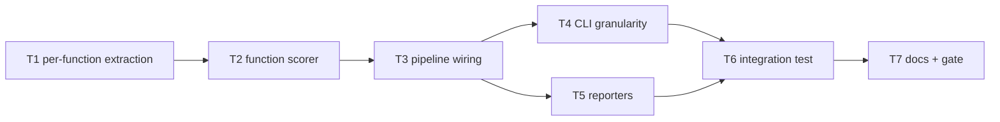

# Milestone 11 — Function Granularity Tasks

**Design**: [`.specs/features/function-granularity/design.md`](./design.md)  
**Spec**: [`.specs/features/function-granularity/spec.md`](./spec.md)  
**Context**: [`.specs/features/function-granularity/context.md`](./context.md)  
**Status**: Done

---

## Execution Plan

### Phase 1: Per-function extraction (Sequential)

```
T1 FunctionComplexityResult extraction + naming fixtures
```

### Phase 2: Function scorer (Sequential)

```
T1 → T2 scoreFunctionHotspots + unit tests
```

### Phase 3: Pipeline types + wiring (Sequential)

```
T2 → T3 domain types + runScan granularity branch
```

### Phase 4: CLI + reporters (Parallel)

```
T3 → T4 CLI --granularity [P]
T3 → T5 reporters table/json/markdown + slice + fixture [P]
```

### Phase 5: Integration (Sequential)

```
T4 + T5 → T6 integration test on small-ts
```

### Phase 6: Docs + gate (Sequential)

```
T6 → T7 documentation sync + project gate
```



### Diagram-Definition Cross-Check

| Task | Depends on (declared) | Appears in diagram after deps | Match |
| ---- | --------------------- | ----------------------------- | ----- |
| T1   | None                  | Root                          | ✅    |
| T2   | T1                    | T1 → T2                       | ✅    |
| T3   | T2                    | T2 → T3                       | ✅    |
| T4   | T3                    | T3 → T4                       | ✅    |
| T5   | T3                    | T3 → T5                       | ✅    |
| T6   | T4, T5                | T4/T5 → T6                    | ✅    |
| T7   | T6                    | T6 → T7                       | ✅    |

### Test Co-location Validation

| Task | Code layer                               | TESTING.md expectation | Tests in same task                                                    | Match |
| ---- | ---------------------------------------- | ---------------------- | --------------------------------------------------------------------- | ----- |
| T1   | `src/complexity/analyze-file.ts`         | Unit required          | `analyze-file.test.ts`                                                | ✅    |
| T2   | `src/scoring/function-hotspot-scorer.ts` | Unit required          | `function-hotspot-scorer.test.ts`                                     | ✅    |
| T3   | `src/scan.ts`, `src/types/domain.ts`     | Integration            | `scan.integration.test.ts` (partial)                                  | ✅    |
| T4   | `bin/hotspot-scanner.ts`                 | CLI unit               | `bin/hotspot-scanner.test.ts`                                         | ✅    |
| T5   | `src/report/**`                          | Unit required          | `table.test.ts`, `markdown.test.ts`, `slice.test.ts`, `index.test.ts` | ✅    |
| T6   | `bin/` integration                       | Integration            | `bin/hotspot-scanner.integration.test.ts`                             | ✅    |
| T7   | Docs only                                | Gate                   | `pnpm build && pnpm test`                                             | ✅    |

---

## Task Breakdown

### T1: Per-function extraction + naming fixtures

**What**: Extend `analyzeSourceFile()` to emit `FunctionComplexityResult[]` alongside file-level `ComplexityResult`. Implement `resolveFunctionName()` per design § Function Name Resolution. Add `function-naming.ts` fixture with documented expected names/lines. Add unit tests for extraction and naming conventions.

**Where**: `src/complexity/analyze-file.ts`, `src/complexity/analyze-file.test.ts`, `src/complexity/index.ts`, `tests/fixtures/complexity/function-naming.ts`

**Depends on**: None

**Reuses**: [design.md](./design.md) § Function Name Resolution; [context.md](./context.md) § Function naming conventions; existing `collectFunctionsInScope`, `complexityForFunction`

**Requirement**: HOTSPOT-92, HOTSPOT-93

**Tools**:

- MCP: NONE
- Skill: NONE

**Done when**:

- [x] `analyzeSourceFile()` returns per-function array with `filePath`, `functionName`, `line`, `complexity`
- [x] File-level `cyclomaticComplexity` still equals sum of per-function complexities
- [x] `functionCount` equals per-function array length
- [x] Named function, method, constructor, `const` arrow, anonymous arrow naming verified by fixtures
- [x] Nested functions each appear as separate entries
- [x] `src/complexity/**` ≥80% line coverage maintained

**Tests**: `analyze-file.test.ts` — per-function extraction, naming conventions, nested functions, empty file

**Gate**: `pnpm exec vitest run src/complexity/analyze-file.test.ts`

---

### T2: Function hotspot scorer

**What**: Implement `scoreFunctionHotspots()` in `src/scoring/function-hotspot-scorer.ts` per design § Function Hotspot Scorer. Export factory from `src/scoring/index.ts`. Add unit tests for inherited churn, zero guard, sort order, and missing fileStats defaults.

**Where**: `src/scoring/function-hotspot-scorer.ts`, `src/scoring/function-hotspot-scorer.test.ts`, `src/scoring/index.ts`

**Depends on**: T1

**Reuses**: [design.md](./design.md) § Function Hotspot Scorer; `normalizeLogMinMax` from `normalize.ts`

**Requirement**: HOTSPOT-94

**Tools**:

- MCP: NONE
- Skill: NONE

**Done when**:

- [x] `scoreFunctionHotspots()` returns `FunctionHotspotScore[]` with all fields per spec
- [x] Harmonic combiner `2ch/(c+h)` with zero guard when `c+h===0`
- [x] Churn inherited from parent file `commitCount`
- [x] Sort: `hotspotScore` desc, `filePath` asc, `line` asc
- [x] Missing `fileStats` → git fields `0`
- [x] `src/scoring/**` ≥80% line coverage maintained

**Tests**: `function-hotspot-scorer.test.ts` — scoring, inherited churn, sort, zero guard, missing stats

**Gate**: `pnpm exec vitest run src/scoring/function-hotspot-scorer.test.ts`

---

### T3: Domain types + pipeline wiring

**What**: Add `ScanGranularity`, `FunctionComplexityResult`, `FunctionHotspotScore` to `src/types/domain.ts`. Extend `ScanMeta`, `ScanResult`, `ScanOptions`. Branch `runScan()` on granularity per design § Pipeline Branch. Update all existing `ScanResult` test literals with `functions: []` and `meta.granularity: "file"`.

**Where**: `src/types/domain.ts`, `src/scan.ts`, `src/scan.integration.test.ts`, test files with `ScanResult` literals

**Depends on**: T2

**Reuses**: [design.md](./design.md) § Type Changes, § Pipeline Branch

**Requirement**: HOTSPOT-95

**Tools**:

- MCP: NONE
- Skill: NONE

**Done when**:

- [x] `ScanOptions.granularity` defaults to `"file"`
- [x] File mode: populated `hotspots`, empty `functions`, `meta.granularity = "file"`
- [x] Function mode: populated `functions`, empty `hotspots`, `meta.granularity = "function"`
- [x] `coupling` populated in both modes
- [x] `version` remains `"1.0"`
- [x] Integration test: `runScan({ granularity: "function" })` on `small-ts` returns non-empty `functions`

**Tests**: `scan.integration.test.ts` — function mode pipeline wiring

**Gate**: `pnpm exec vitest run src/scan.integration.test.ts`

---

### T4: CLI `--granularity` flag [P]

**What**: Add `--granularity <file|function>` to commander options. Implement `parseGranularity()` with validation. Pass to `runScan()`. Add CLI unit tests.

**Where**: `bin/hotspot-scanner.ts`, `bin/hotspot-scanner.test.ts`

**Depends on**: T3

**Reuses**: [design.md](./design.md) § CLI Wiring; [context.md](./context.md) § File mode unchanged

**Requirement**: HOTSPOT-96

**Tools**:

- MCP: NONE
- Skill: NONE

**Done when**:

- [x] `parseGranularity("file")` and `parseGranularity("function")` succeed
- [x] Invalid value throws `CliUsageError` mentioning `file` or `function`
- [x] Default granularity is `file` when flag omitted
- [x] Flag passed through to `runScan()`

**Tests**: `bin/hotspot-scanner.test.ts` — `parseGranularity` valid/invalid

**Gate**: `pnpm exec vitest run bin/hotspot-scanner.test.ts`

---

### T5: Reporters — table, json, markdown, slice, factory [P]

**What**: Extend `sliceScanResult` to slice `functions` in function mode. Add **Top Functions** section to `renderTable()` and `renderMarkdown()`. Create `sample-result-functions.json` fixture. Update `index.test.ts`, `table.test.ts`, `markdown.test.ts`. JSON pass-through requires no `json.ts` changes but add `json.test.ts` assertions for function mode.

**Where**: `src/report/slice.ts`, `src/report/table.ts`, `src/report/markdown.ts`, `src/report/index.ts`, `src/report/*.test.ts`, `tests/fixtures/report/sample-result-functions.json`

**Depends on**: T3

**Reuses**: [design.md](./design.md) § Table Layout, § Markdown Layout, § Slice Behavior; M10 GFM patterns

**Requirement**: HOTSPOT-97, HOTSPOT-98, HOTSPOT-99, HOTSPOT-100

**Tools**:

- MCP: NONE
- Skill: NONE

**Done when**:

- [x] File mode table/markdown unchanged (Top Hotspots)
- [x] Function mode renders Top Functions with columns per design
- [x] `sliceScanResult` slices `functions` when `meta.granularity === "function"`
- [x] Empty sections render without throwing
- [x] Pipe escaping on file paths and function names in markdown
- [x] `json.test.ts` asserts function mode schema with empty `hotspots`
- [x] `src/report/**` ≥80% line coverage maintained

**Tests**: `table.test.ts`, `markdown.test.ts`, `index.test.ts`, `json.test.ts` — function mode fixture

**Gate**: `pnpm exec vitest run src/report/table.test.ts src/report/markdown.test.ts src/report/index.test.ts src/report/json.test.ts`

---

### T6: Integration test (function mode)

**What**: Extend CLI integration tests to run `small-ts` fixture with `--granularity function`. Assert exit `0`, JSON parse with `functions[0]` containing `functionName`, `line`, `complexity`, `hotspotScore`. Test table and markdown output contain "Top Functions" heading.

**Where**: `bin/hotspot-scanner.integration.test.ts`

**Depends on**: T4, T5

**Reuses**: `tests/fixtures/repos/small-ts/`; [context.md](./context.md) § JSON schema shape

**Requirement**: HOTSPOT-101

**Tools**:

- MCP: NONE
- Skill: `vitals-cli-validation`

**Done when**:

- [x] `--granularity function --format json` exits `0` on `small-ts`
- [x] Parsed JSON has `meta.granularity === "function"`, non-empty `functions`, empty `hotspots`
- [x] `functions[0]` has `functionName`, `line`, `complexity`, `hotspotScore` with expected types
- [x] `--granularity function --format markdown` output contains `## Top Functions`
- [x] `--granularity file` (default) behavior unchanged

**Tests**: `bin/hotspot-scanner.integration.test.ts` — function mode cases

**Gate**: `pnpm exec vitest run bin/hotspot-scanner.integration.test.ts`

---

### T7: Documentation sync + project gate

**What**: Update ARCHITECTURE.md, STRUCTURE.md, STATE.md, README.md, vitals-cli-validation skill, vitals-pipeline-domain skill. Mark ROADMAP M11 implementation checkboxes `[x]` on Execute Done only — during planning, link spec and set `**Specs:** Done`. Run full project gate.

**Where**: `.specs/codebase/ARCHITECTURE.md`, `.specs/codebase/STRUCTURE.md`, `.specs/project/STATE.md`, `README.md`, `.cursor/skills/vitals-cli-validation/SKILL.md`, `.cursor/skills/vitals-pipeline-domain/SKILL.md`, `.specs/project/ROADMAP.md`

**Depends on**: T6

**Reuses**: [design.md](./design.md) § Documentation Sync Targets

**Requirement**: HOTSPOT-102

**Tools**:

- MCP: NONE
- Skill: `vitals-cli-validation`

**Done when**:

- [x] STATE.md records function-mode ranking decision (inherited file churn)
- [x] ARCHITECTURE.md documents granularity branch and `FunctionHotspotScore`
- [x] README.md flags table includes `--granularity`
- [x] vitals-cli-validation skill includes function mode example
- [x] vitals-pipeline-domain skill documents function granularity
- [x] ROADMAP M11 implementation checkboxes marked `[x]` on Execute Done
- [x] `pnpm build && pnpm test` passes

**Tests**: Full project gate

**Gate**: `pnpm build && pnpm test`

---

## Requirement Traceability (Tasks)

| Requirement ID | Tasks |
| -------------- | ----- |
| HOTSPOT-92     | T1    |
| HOTSPOT-93     | T1    |
| HOTSPOT-94     | T2    |
| HOTSPOT-95     | T3    |
| HOTSPOT-96     | T4    |
| HOTSPOT-97     | T5    |
| HOTSPOT-98     | T5    |
| HOTSPOT-99     | T5    |
| HOTSPOT-100    | T5    |
| HOTSPOT-101    | T6    |
| HOTSPOT-102    | T7    |

**Coverage:** 11 total, 11 mapped to tasks, 0 unmapped
