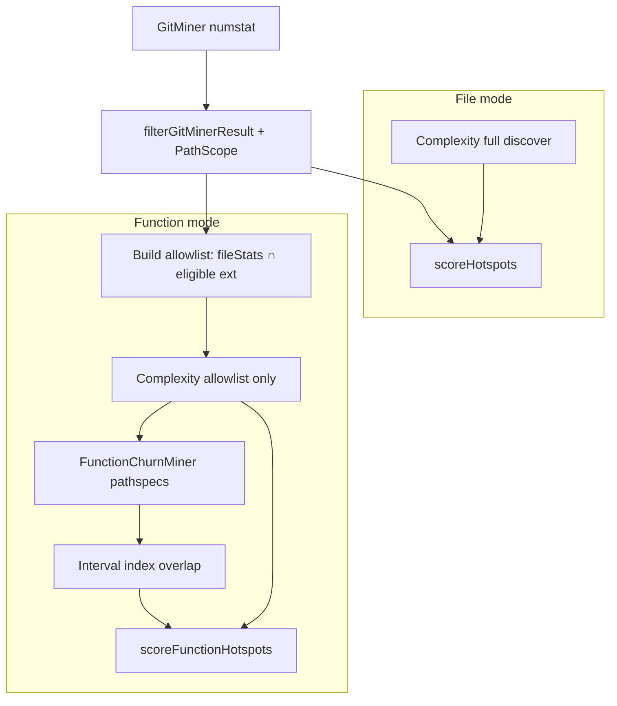

# Milestone 35 — Function-Mode Scan Efficiency Design

**Spec**: [`.specs/features/function-mode-scan-efficiency/spec.md`](./spec.md)  
**Context**: [`.specs/features/function-mode-scan-efficiency/context.md`](./context.md)  
**Status**: Planned

---

## Architecture Overview

M35 optimizes the **function-mode** branch only. File mode keeps single numstat + full in-scope AST. Function mode still runs numstat first (coupling + churn allowlist), then **restricted** complexity, then **pathspec-restricted** patch mining with **interval-indexed** overlap.



**Pipeline sketch (function mode after M35):**

```
GitMiner numstat → filter scope
allowlist = eligible paths in fileStats
ComplexityAnalyzer({ pathAllowlist: allowlist })
FunctionChurnMiner({ pathspecs: allowlist or function filePaths, … })
  → aggregatePatchCommit via interval index
scoreFunctionHotspots → report
```

**File mode:** unchanged — no `FunctionChurnMiner`, no allowlist on complexity.

**IMPL references:** ARCHITECTURE § Function granularity / Key constraints; CONCERNS § Function churn miner + Performance; sisters M23/M26; RT-001 streaming.

---

## Code Reuse Analysis

### Existing Components to Leverage

| Component | Location | How to Use |
| --------- | -------- | ---------- |
| `buildGitPatchLogArgv` / `streamGitPatchLog` | `src/git/function-churn/spawn.ts` | Extend options with `paths?: string[]`; append `--` + paths |
| `createFunctionChurnMiner` | `src/git/function-churn/index.ts` | Pass paths; empty → no spawn |
| `aggregatePatchCommit` / `indexFunctionsByFile` | `src/git/function-churn/aggregate.ts` | Keep file map; replace inner nested loop with interval index |
| `hunkIntersectsFunction` | `src/git/function-churn/parse.ts` | Keep as oracle for equivalence tests; hot path may use range sweep |
| `createComplexityAnalyzer` | `src/complexity/index.ts` | Add optional path allowlist after discover (or replace discover list) |
| `discoverSourceFiles` / `ELIGIBLE_EXTENSIONS` | `src/complexity/discover.ts` | Reuse eligibility when building allowlist from `fileStats` |
| `filterGitMinerResult` / `PathScope` | `src/paths/` | Allowlist already scope-filtered via `fileStats` |
| `runScan` function branch | `src/scan.ts` | Wire allowlist + pathspecs; file branch untouched |
| Patch fixtures | `tests/fixtures/git-patch/` | Equivalence + nested overlap |
| Integration | `src/scan.integration.test.ts` | File-mode zero spawn; function-mode pathspec spy |

### Integration Points

| System | M35 behavior |
| ------ | ------------ |
| `git` subprocess | Pathspecs on function patch spawn only; still `-M -p --unified=0`; no `--follow` |
| `ts-morph` | Fewer files loaded in function mode; no historical Project |
| JSON / schemas | No shape change |
| Diagnostics | Progress `function-churn` unchanged; M26 warnings unchanged |
| Numstat miner | Unchanged (still full history for coupling) |

### Fragile areas (CONCERNS.md)

| Area | Design mitigation |
| ---- | ----------------- |
| Patch stream memory | Keep readline streaming; pathspecs reduce volume only |
| Overlap vs current ranges | Unchanged model; no historical AST (HOTSPOT-395) |
| Nested credit all | Interval index must report all overlapping ranges |
| File mode must not spawn patch | Explicit regression + scan branch isolation |
| Ranking / normalization drift | Document zero-churn omission; test typical churned fixtures |

---

## Design Decisions

| # | Decision | Rationale |
| - | -------- | --------- |
| D1 | Allowlist = scoped `fileStats` keys ∩ eligible source extensions | ROADMAP “churn ∩ scope”; functions without file churn cannot gain non-zero churn under same `--since` |
| D2 | Function-mode complexity uses allowlist; file mode does not | Avoid changing default file rankings / file hotspots universe |
| D3 | Pathspecs = same allowlist (or post-complexity function `filePath` set ⊆ allowlist) | One source of truth; empty → no spawn |
| D4 | Soft threshold → fall back to unrestricted patch stream | Preserve correctness if ARG_MAX / argv length risk |
| D5 | Interval index (sort functions by `line`, sweep vs hunk line span / touched lines) | O((F+H) log F) style vs O(F×H); equivalence-tested |
| D6 | Intentional edge: omit zero-churn-file functions from function-mode output | Enables AST win; document; typical triage targets unchanged |
| D7 | No changes to scoring formulas or JSON version | YAGNI; parity for churned rows |
| D8 | Do not edit numstat `src/git/spawn.ts` argv for this milestone | Clear Path Conflict; file mode I/O unchanged |

### Interval index sketch

Per file in `aggregatePatchCommit`:

1. Take `functions` for the canonical path; sort by `line` ascending (stable by `endLine` / name if needed).
2. For each hunk, derive an interval covering `newLinesTouched` (min..max, or iterate discrete lines if sparse).
3. Find all functions whose `[line, endLine]` intersects that interval (binary search lower bound + scan while `fn.line <= hunkEnd`, testing `fn.endLine >= hunkStart` / touched-line predicate).
4. Attribute `linesChanged` / commit / authors as today.

Keep `hunkIntersectsFunction` for unit oracle; optional internal helper `functionsIntersectingHunk(sortedFns, hunk)`.

### Allowlist helper (scan or small pure util)

```typescript
function buildFunctionModePathAllowlist(
  fileStats: Map<string, FileChangeStats>,
  eligibleExtensions: readonly string[], // from ELIGIBLE_EXTENSIONS
): string[] {
  // paths with commitCount > 0 (or any entry in fileStats) ∩ extension filter
  // sorted for stable argv / tests
}
```

`fileStats` entries already imply in-window churn after mine; treat presence as churned.

### Spawn options extension

```typescript
export interface FunctionChurnSpawnOptions {
  repoPath: string;
  since?: string;
  /** Relative paths; when non-empty (and under threshold), appended after `--` */
  paths?: string[];
}
```

`FunctionChurnMinerOptions` gains the same `paths?: string[]` (or derives from functions when paths omitted — prefer explicit from `runScan` for clarity).

### Complexity options extension

```typescript
export interface ComplexityAnalyzerOptions {
  repoPath: string;
  scope?: PathScope;
  /** When set, analyze only these relative paths (still validated / existing files) */
  pathAllowlist?: readonly string[];
}
```

Implementation: `discover(repoPath, scope)` then filter to allowlist membership **or** if allowlist provided, use allowlist directly after existence filter (prefer discover ∩ allowlist so exclude defaults still apply if a path sneaks in). **Locked:** `discovered.filter(p => allowlistSet.has(p))` when allowlist set — ensures scope/excludes from discovery remain authoritative.

---

## Components

### 1. Pathspec-aware patch spawn

- **Purpose**: Restrict `git log -p` to allowlisted paths.
- **Location**: `src/git/function-churn/spawn.ts`, `spawn.test.ts`
- **Dependencies**: existing `GitLogError`
- **Reuses**: current argv base (`-M -p --unified=0`)

### 2. Miner early-exit + path plumbing

- **Purpose**: Pass paths; skip spawn when empty; apply fallback threshold.
- **Location**: `src/git/function-churn/index.ts`, `index.test.ts`
- **Constant**: e.g. `PATCH_PATHSPEC_FALLBACK_THRESHOLD` (document in ARCHITECTURE; exact value Agent’s Discretion in Execute, suggest 500–2000)

### 3. Interval-index aggregate

- **Purpose**: Fast overlap with identical semantics.
- **Location**: `src/git/function-churn/aggregate.ts`, `aggregate` tests (extend existing or co-locate)
- **Reuses**: `functionStatsKey`, `PathAliasMap.link/canonical`, `hunkIntersectsFunction` as oracle

### 4. Complexity path allowlist

- **Purpose**: Function-mode AST subset.
- **Location**: `src/complexity/index.ts`, `index.test.ts`
- **Reuses**: `discoverSourceFiles`, worker pool unchanged

### 5. Scan wiring + allowlist builder

- **Purpose**: Function branch only; file branch regression.
- **Location**: `src/scan.ts`, `src/scan.integration.test.ts` (and/or focused unit with injectable deps if present)
- **Reuses**: `ELIGIBLE_EXTENSIONS`, `filterGitMinerResult` output

### 6. Docs

- **Purpose**: Living SoT updates.
- **Location**: `.specs/codebase/ARCHITECTURE.md`, `CONCERNS.md`, `TESTING.md` (Execute task; not this planning session’s ROADMAP/STATE)

---

## Data Models

No new public JSON fields. Internal only:

| Name | Role |
| ---- | ---- |
| `pathAllowlist` | `string[]` relative paths for complexity + pathspecs |
| Sorted function ranges per file | Transient in aggregate |

---

## Error Handling

| Case | Behavior |
| ---- | -------- |
| Empty allowlist | No patch spawn; empty function stats; complexity may return empty |
| Git exit non-zero | Existing `GitLogError` |
| Allowlist path missing on disk | Discover ∩ allowlist naturally drops; or warn-skip if forced — prefer discover ∩ |
| Over-threshold paths | Unrestricted stream; no user-facing error |

---

## Testing Strategy

| Layer | Focus |
| ----- | ----- |
| Unit spawn | Argv with `--` paths; without paths; since preserved |
| Unit miner | Empty paths → spawn not called; threshold fallback |
| Unit aggregate | Equivalence nested vs index; nested functions; multi-hunk |
| Unit complexity | Allowlist filters analyzed set; empty allowlist → empty result |
| Integration | File mode: spy/mock asserts no patch spawn; function mode: pathspecs present when churned files exist; typical ranking smoke on `small-ts` |
| Docs | ARCHITECTURE/CONCERNS/TESTING updated in final task |

**Gate:** per-task Vitest targets; final `pnpm build && pnpm test`.

---

## Performance Notes

- Wins: less patch I/O, fewer ts-morph files, cheaper overlap on hot files.
- Non-goals: numstat still full-repo; M34 stage overlap deferred.
- Manual benchmark optional (TESTING § Performance) — not a CI gate for M35.

---

## Implementation Notes

- Prefer surgical diffs in `function-churn/` and `complexity/index.ts` + `scan.ts`.
- Do **not** change `mccabe.ts` decision nodes.
- Do **not** weaken file-mode assertions.
- Export threshold constant for unit tests.
- After Execute: refresh ARCHITECTURE function-mode paragraph (pathspecs + allowlist + interval index).

---

## Open Questions

None — decisions locked in [context.md](./context.md). ROADMAP/STATE sync deferred per planning request (Execute / roadmap-sync later).
