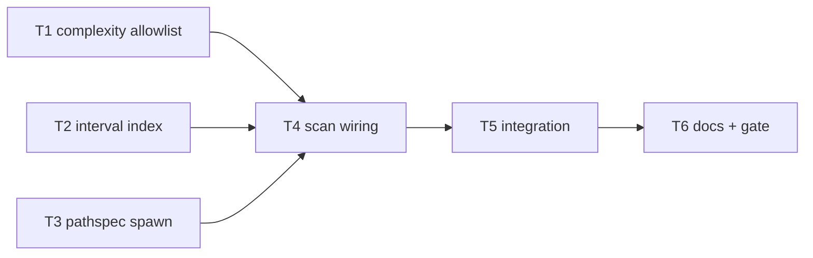

# Milestone 35 — Function-Mode Scan Efficiency Tasks

**Design**: [`.specs/features/function-mode-scan-efficiency/design.md`](./design.md)  
**Spec**: [`.specs/features/function-mode-scan-efficiency/spec.md`](./spec.md)  
**Context**: [`.specs/features/function-mode-scan-efficiency/context.md`](./context.md)  
**Status**: Done

---

## Execution Plan

### Phase 1: Foundation (Parallel OK)

```
T1 complexity allowlist [P] ──┐
                              ├──→ T4
T2 interval index [P] ────────┤
T3 pathspec spawn ────────────┘
```

T2 and T3 share `src/git/function-churn/` but touch **disjoint files** (`aggregate*` vs `spawn*` / miner `index*` path plumbing). Run **T2 ∥ T3** only with a single implementer owning the folder **or** sequential T2→T3 if two agents would conflict on shared exports. Default: **T1 [P] with T2**; **T3 after T2** (safest Path Conflict).

### Phase 2: Pipeline + validation

```
T1 + T2 + T3 → T4 scan wiring → T5 integration → T6 docs + gate
```



### Diagram-Definition Cross-Check

| Task | Depends on (task body)          | Diagram shows            | Match |
| ---- | ------------------------------- | ------------------------ | ----- |
| T1   | None                            | Root                     | ✅    |
| T2   | None                            | Root                     | ✅    |
| T3   | None (seq after T2 recommended) | Root / after T2 in prose | ✅    |
| T4   | T1, T2, T3                      | T1→T4, T2→T4, T3→T4      | ✅    |
| T5   | T4                              | T4→T5                    | ✅    |
| T6   | T5                              | T5→T6                    | ✅    |

### Path Conflict Check

| Task | Module owner                                                                    | Paths                                                          | Conflict                                                                                            |
| ---- | ------------------------------------------------------------------------------- | -------------------------------------------------------------- | --------------------------------------------------------------------------------------------------- |
| T1   | `src/complexity/`                                                               | `index.ts`, `index.test.ts`                                    | None vs T2/T3                                                                                       |
| T2   | `src/git/function-churn/`                                                       | `aggregate.ts`, aggregate/parse tests                          | Disjoint files from T3 spawn                                                                        |
| T3   | `src/git/function-churn/`                                                       | `spawn.ts`, `index.ts` (miner options), tests                  | After T2 if same agent folder; do **not** edit numstat `src/git/spawn.ts`                           |
| T4   | `src/scan.ts` (+ small helper if extracted under `src/git/` or `src/scan` util) | `scan.ts`, maybe tiny allowlist helper                         | Sole scan owner                                                                                     |
| T5   | integration                                                                     | `src/scan.integration.test.ts` (± spawn spy helpers)           | After T4                                                                                            |
| T6   | docs                                                                            | `.specs/codebase/ARCHITECTURE.md`, `CONCERNS.md`, `TESTING.md` | After T5; **do not** require ROADMAP/STATE in this feature’s planning lock — Execute may sync later |

### Test Co-location Validation

| Task | Code layer                 | TESTING.md expectation    | Task `Tests`                  | Match |
| ---- | -------------------------- | ------------------------- | ----------------------------- | ----- |
| T1   | complexity analyzer        | unit                      | unit                          | ✅    |
| T2   | function-churn aggregate   | unit + git-patch fixtures | unit                          | ✅    |
| T3   | function-churn spawn/miner | unit                      | unit                          | ✅    |
| T4   | scan orchestration         | integration / unit        | unit + integration assertions | ✅    |
| T5   | scan integration           | integration               | integration                   | ✅    |
| T6   | docs                       | full gate                 | full gate                     | ✅    |

---

## Task Breakdown

### T1: ComplexityAnalyzer path allowlist [P]

**What**: Extend `ComplexityAnalyzerOptions` with optional `pathAllowlist`. When set, after `discoverSourceFiles(repoPath, scope)`, keep only paths in the allowlist set (discover ∩ allowlist). Empty intersection → empty results without workers. File-mode callers omit the option (unchanged). Unit-test filter behavior and empty allowlist.

**Where**: `src/complexity/index.ts`, `src/complexity/index.test.ts`

**Depends on**: None

**Reuses**: `discoverSourceFiles`; [design.md](./design.md) § Complexity options

**Requirement**: HOTSPOT-386, HOTSPOT-385 (analyzer supports file-mode unchanged when option omitted)

**Tools**:

- MCP: NONE
- Skill: `vitals-pipeline-domain`, `coding-guidelines`

**Done when**:

- [x] `pathAllowlist` optional on analyze options
- [x] Discover ∩ allowlist semantics covered by unit tests
- [x] Omitting allowlist preserves prior discover-all behavior
- [x] Gate check passes: `pnpm exec vitest run src/complexity/index.test.ts`
- [x] Test count: no silent deletions vs pre-task baseline for this file

**Tests**: unit  
**Gate**: `pnpm exec vitest run src/complexity/index.test.ts`

**Commit**: `feat(complexity): support path allowlist for function-mode AST`

---

### T2: Interval index for function×hunk overlap [P]

**What**: Replace the hot-path nested `for fn / for hunk` intersection in `aggregatePatchCommit` with a sort/sweep (or equivalent) interval index over function ranges. Preserve nested credit-all and full-hunk `linesChanged`. Keep `hunkIntersectsFunction` as equivalence oracle. Add/extend unit tests for nested, adjacent, non-overlap, multi-hunk.

**Where**: `src/git/function-churn/aggregate.ts`, co-located tests (`aggregate` coverage via existing `index.test.ts` / new `aggregate.test.ts` as needed), reuse `tests/fixtures/git-patch/` where helpful

**Depends on**: None

**Reuses**: `indexFunctionsByFile`, `hunkIntersectsFunction`; [design.md](./design.md) § Interval index sketch; M23 nested semantics

**Requirement**: HOTSPOT-389, HOTSPOT-390, HOTSPOT-391

**Tools**:

- MCP: NONE
- Skill: `vitals-pipeline-domain`, `coding-guidelines`

**Done when**:

- [x] Hot path uses interval index / sort-sweep
- [x] Equivalence tests vs `hunkIntersectsFunction` semantics pass
- [x] Nested / multi-hunk / non-overlap covered
- [x] Gate check passes: `pnpm exec vitest run src/git/function-churn`
- [x] Test count: no silent deletions

**Tests**: unit  
**Gate**: `pnpm exec vitest run src/git/function-churn`

**Commit**: `perf(git): interval-index function×hunk overlap`

---

### T3: Pathspec-restricted patch spawn + miner plumbing

**What**: Extend `FunctionChurnSpawnOptions` / argv builder to append git pathspecs after `--` when `paths` non-empty. Preserve `-M`, `-p`, `--unified=0`, `--since`. Wire `FunctionChurnMinerOptions.paths`; **empty paths → do not spawn** (return empty stats). When `paths.length` exceeds documented soft threshold constant, fall back to unrestricted argv (still streaming). Unit-test argv, empty skip, and fallback.

**Where**: `src/git/function-churn/spawn.ts`, `spawn.test.ts`, `index.ts`, `index.test.ts`

**Depends on**: None (run after T2 if sharing the folder with another agent)

**Reuses**: existing spawn/error patterns; [context.md](./context.md) § Patch pathspec source

**Requirement**: HOTSPOT-380, HOTSPOT-381, HOTSPOT-382, HOTSPOT-383

**Tools**:

- MCP: NONE
- Skill: `vitals-pipeline-domain`, `coding-guidelines`

**Done when**:

- [x] Argv includes `--` + paths when under threshold
- [x] Empty paths → no `streamGitPatchLog` / spawn
- [x] Over-threshold → unrestricted stream; constant exported/documented
- [x] Numstat `src/git/spawn.ts` unchanged
- [x] Gate check passes: `pnpm exec vitest run src/git/function-churn/spawn.test.ts src/git/function-churn/index.test.ts`

**Tests**: unit  
**Gate**: `pnpm exec vitest run src/git/function-churn/spawn.test.ts src/git/function-churn/index.test.ts`

**Commit**: `perf(git): pathspec-restrict function-churn patch stream`

---

### T4: Wire function-mode allowlist + pathspecs in `runScan`

**What**: On `granularity === "function"` only: build path allowlist from scoped `fileStats` ∩ `ELIGIBLE_EXTENSIONS` (stable sort). Pass `pathAllowlist` into `analyzer.analyze`. Pass the same paths (or unique function file paths ⊆ allowlist) into `churnMiner.mine({ paths })`. File branch: no allowlist, no function churn miner. Do **not** introduce historical AST. Preserve `onProgress` `function-churn` phase. Add focused assertions (injectable deps or existing test seams) that file mode does not construct/invoke patch miner.

**Where**: `src/scan.ts`, helper colocated if needed (prefer inline or tiny pure function in `src/git/function-churn/` or `src/complexity/` — avoid new top-level modules), `src/scan.ts` tests if present / extend integration prep

**Depends on**: T1, T2, T3

**Reuses**: `filterGitMinerResult` output; [design.md](./design.md) D1–D3; [context.md](./context.md) ranking edge

**Requirement**: HOTSPOT-384, HOTSPOT-387, HOTSPOT-392, HOTSPOT-393, HOTSPOT-394, HOTSPOT-395

**Tools**:

- MCP: NONE
- Skill: `vitals-pipeline-domain`, `coding-guidelines`

**Done when**:

- [x] Function branch passes allowlist + paths
- [x] File branch unchanged regarding patch spawn / full AST
- [x] Empty allowlist safe (no patch spawn)
- [x] Progress phase still `function-churn`
- [x] Gate check passes: `pnpm exec vitest run src/scan.integration.test.ts` (and any new scan unit file)
- [x] Test count: no silent deletions

**Tests**: unit + integration assertions  
**Gate**: `pnpm exec vitest run src/scan.integration.test.ts`

**Commit**: `feat(scan): restrict function-mode AST and patch pathspecs`

---

### T5: Integration — ranking parity + zero patch spawn regression

**What**: Strengthen integration coverage: (1) file mode never spawns patch stream (spy/mock at `streamGitPatchLog` / miner boundary); (2) function mode with churned fixture paths asserts pathspec-bearing argv (or fallback only when over threshold); (3) typical churned ranking smoke — functions in files with in-window churn keep expected relative order vs documented baseline on `tests/fixtures/repos/small-ts` (or existing function-mode cases); (4) document/assert intentional omission only where a fixture can show a never-touched eligible file absent from `functions`.

**Where**: `src/scan.integration.test.ts` (± minimal fixture touch via `fixture-builder` only if required)

**Depends on**: T4

**Reuses**: existing function-mode integration cases; TESTING mock boundaries

**Requirement**: HOTSPOT-388, HOTSPOT-392, HOTSPOT-397

**Tools**:

- MCP: NONE
- Skill: `vitals-pipeline-domain`, `vitals-cli-validation`, `coding-guidelines`
- Agent (optional): `fixture-builder` if a dedicated never-touched file case is missing

**Done when**:

- [x] File-mode zero patch spawn assertion present and green
- [x] Function-mode pathspec (or fallback) assertion present
- [x] Typical ranking parity / smoke covered
- [x] Gate check passes: `pnpm exec vitest run src/scan.integration.test.ts`

**Tests**: integration  
**Gate**: `pnpm exec vitest run src/scan.integration.test.ts`

**Commit**: `test(scan): regress file-mode zero patch spawn and function pathspecs`

---

### T6: Living docs + full quality gate

**What**: Update ARCHITECTURE (function-mode pathspecs, AST allowlist, interval index), CONCERNS (zero-churn omission edge, ARG_MAX fallback, file-mode zero spawn), TESTING (regression notes / function-churn efficiency coverage). Document rename+pathspec best-effort + M26 warning unchanged (HOTSPOT-398). Run full gate. Do **not** invent historical AST language.

**Where**: `.specs/codebase/ARCHITECTURE.md`, `.specs/codebase/CONCERNS.md`, `.specs/codebase/TESTING.md`

**Depends on**: T5

**Reuses**: existing function granularity / function churn sections

**Requirement**: HOTSPOT-396, HOTSPOT-398, HOTSPOT-399

**Tools**:

- MCP: NONE
- Skill: `vitals-pipeline-domain`

**Done when**:

- [x] ARCHITECTURE / CONCERNS / TESTING reflect M35 behavior and intentional edges
- [x] Rename/pathspec + no-historical-AST called out
- [x] Gate check passes: `pnpm build && pnpm test`

**Tests**: full gate  
**Gate**: `pnpm build && pnpm test`

**Commit**: `docs(codebase): document function-mode scan efficiency`

---

## Parallel Execution Map

```
Phase 1:
  T1 [P]  complexity allowlist
  T2 [P]  interval index
  T3      pathspec spawn (after T2 if folder contention)

Phase 2:
  T4 → T5 → T6
```

**Parallelism constraint:** T1 is `[P]` vs T2 (disjoint prefixes `src/complexity` vs `src/git/function-churn`). T3 defaults sequential after T2. Unit tests parallel-safe. T4+ sequential (`src/scan.ts`).

---

## Requirement → Task Mapping

| Requirement ID | Task   | Status |
| -------------- | ------ | ------ |
| HOTSPOT-380    | T3     | Done   |
| HOTSPOT-381    | T3     | Done   |
| HOTSPOT-382    | T3     | Done   |
| HOTSPOT-383    | T3     | Done   |
| HOTSPOT-384    | T4     | Done   |
| HOTSPOT-385    | T1     | Done   |
| HOTSPOT-386    | T1     | Done   |
| HOTSPOT-387    | T4     | Done   |
| HOTSPOT-388    | T5     | Done   |
| HOTSPOT-389    | T2     | Done   |
| HOTSPOT-390    | T2     | Done   |
| HOTSPOT-391    | T2     | Done   |
| HOTSPOT-392    | T4, T5 | Done   |
| HOTSPOT-393    | T4     | Done   |
| HOTSPOT-394    | T4     | Done   |
| HOTSPOT-395    | T4     | Done   |
| HOTSPOT-396    | T6     | Done   |
| HOTSPOT-397    | T5     | Done   |
| HOTSPOT-398    | T6     | Done   |
| HOTSPOT-399    | T6     | Done   |

**Coverage:** 20 total, 20 mapped, 0 unmapped ✅

---

## Handoff

Planning complete for this feature. Promote **Status** to `Approved` or `Ready for Execute`, then in a **new** development session invoke `orchestrator-implementer`.

Expected final gate: `pnpm build && pnpm test`  
ROADMAP/STATE sync: **deferred** (per planning request; sync on Execute Done).
