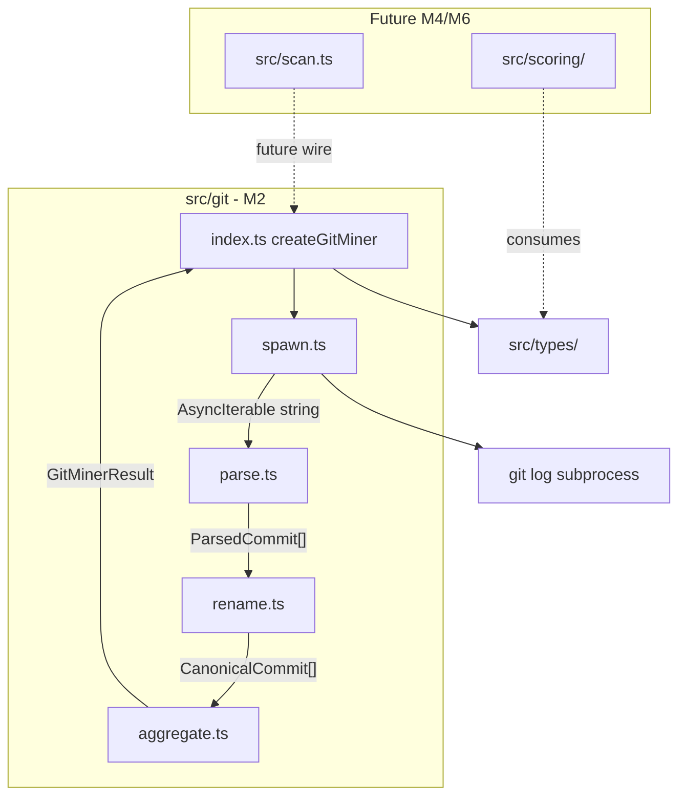

# Milestone 2 — Git Change Miner Design

**Spec**: [`.specs/features/git-change-miner/spec.md`](./spec.md)  
**Status**: Done

---

## Architecture Overview

M2 implements the Git Change Miner as an internal pipeline inside `src/git/`: spawn `git log` once, parse output in a streaming state machine, canonicalize renamed paths, and aggregate into `FileChangeStats` + `CoChangeEvent[]` in a single pass. No changes to `src/scan.ts` — the miner is independently testable.



**IMPL reference:** §4.3 Git Change Miner, §7.1 data flow, §7.2 streaming, ADR-2026-020 single-pass, RT-001 streaming, RT-003 renames.

---

## Code Reuse Analysis

### Existing Components to Leverage

| Component | Location | How to Use |
| --------- | -------- | ---------- |
| Domain types | `src/types/domain.ts` | `FileChangeStats`, `CoChangeEvent` — no changes expected |
| GitMiner contract | `src/git/index.ts` | Extend `GitMinerResult` with `warnings`; keep public interfaces |
| Stub test pattern | `src/git/index.test.ts` | Replace "throws not implemented" with integration tests |
| Fixture directories | `tests/fixtures/git-log/` | Populate with real log samples in T6 |
| Vitest config | `vitest.config.ts` | Coverage threshold for `src/git/**` in T8 |

### Integration Points

| System | M2 behavior | Future milestone |
| ------ | ----------- | ---------------- |
| `git` subprocess | `child_process.spawn` in `src/git/spawn.ts` only | — |
| `simple-git` | Not added (YAGNI) | Revisit only if spawn complexity grows |
| `src/scan.ts` | Not wired | M6 Integration |
| CLI `--since` default | `since` optional on `GitMinerOptions` | M5 Reporter + CLI |
| Scoring | Consumes types only | M4 |

Per [INTEGRATIONS.md](../../codebase/INTEGRATIONS.md): all `git` invocation stays inside `src/git/`. Errors propagate with `repoPath`, command, and stderr snippet.

---

## Design Decisions

| # | Decision | Rationale |
| - | -------- | --------- |
| D1 | `child_process.spawn` over `simple-git` | Zero new runtime dependency; YAGNI; full control over streaming |
| D2 | Rename via `old => new` line parsing + `PathAliasMap` | `git log --follow` only works with a single path argument, not global log mining |
| D3 | Track all file paths from log | Complete co-change picture; M3/M4 filter to TS/JS at complexity/scoring |
| D4 | `warnings: string[]` on `GitMinerResult` | Testable without console mocks; M5 can surface to CLI |
| D5 | Skip empty `CoChangeEvent` (no file changes) | Deterministic; avoids noise in coupling scorer |
| D6 | Deduplicate paths within one commit | Prevents inflated co-change pairs from pathological input |

---

## Components

### Git spawn (`src/git/spawn.ts`)

- **Purpose**: Build `git log` argv, spawn subprocess, expose stdout as async line iterator, propagate errors with context.
- **Location**: `src/git/spawn.ts`
- **Interfaces**:

```typescript
export interface GitLogSpawnOptions {
  repoPath: string;
  since?: string;
}

/** Yields one line at a time from git log stdout. Throws on non-zero exit. */
export async function* streamGitLog(
  options: GitLogSpawnOptions,
): AsyncGenerator<string>;

export class GitLogError extends Error {
  readonly repoPath: string;
  readonly command: string;
  readonly stderr: string;
}
```

- **Git command**:

```bash
git -C <repoPath> log --numstat --name-only --pretty=format:"COMMIT|%H|%ad|%an" [--since=<since>]
```

- **Dependencies**: Node `child_process`, `readline` (or manual buffer split on `\n`)
- **Reuses**: None

**Streaming contract:** `streamGitLog` reads stdout incrementally. It SHALL NOT call `execSync` or buffer the entire stdout string before yielding.

---

### Git log parser (`src/git/parse.ts`)

- **Purpose**: State machine that converts raw log lines into structured commit records.
- **Location**: `src/git/parse.ts`
- **Interfaces**:

```typescript
export interface ParsedFileChange {
  path: string;
  additions: number | null; // null = binary (-)
  deletions: number | null;
  renameFrom?: string; // set when path came from "old => new"
}

export interface ParsedCommit {
  hash: string;
  date: Date;
  author: string;
  files: ParsedFileChange[];
}

/** Parse async line stream into commits. Does not canonicalize renames. */
export async function* parseGitLogStream(
  lines: AsyncIterable<string>,
): AsyncGenerator<ParsedCommit>;
```

- **State machine**:

```
IDLE → (COMMIT| line) → IN_COMMIT
IN_COMMIT → (numstat line) → accumulate file
IN_COMMIT → (rename line: "a => b") → accumulate with renameFrom
IN_COMMIT → (blank line) → yield commit, IDLE
IN_COMMIT → (COMMIT| line) → yield previous, start new
```

- **Numstat parsing**: Split on first two tabs. `-` in additions/deletions → `null` (binary).
- **Rename line**: Pattern `(.+) => (.+)` before numstat for same file; associate with subsequent numstat line if present.
- **Dependencies**: None (pure parsing)
- **Reuses**: None

---

### Path alias map (`src/git/rename.ts`)

- **Purpose**: Resolve rename chains to canonical (current) paths for aggregation.
- **Location**: `src/git/rename.ts`
- **Interfaces**:

```typescript
export class PathAliasMap {
  /** Record that oldPath was renamed to newPath. */
  link(oldPath: string, newPath: string): void;

  /** Resolve any path to its canonical (latest) name. */
  canonical(path: string): string;

  /** Paths where chain could not be fully resolved (for warnings). */
  getAmbiguousPaths(): string[];
}
```

- **Algorithm**: Union-find or forward map with path compression. When `link(A, B)` is recorded, all prior stats keyed under `A` merge conceptually into `B` during aggregation (aggregator calls `canonical()` on every path).
- **Multi-rename**: `a.ts → b.ts → c.ts` — `canonical("a.ts")` and `canonical("b.ts")` both return `c.ts`.
- **Dependencies**: None
- **Reuses**: None

**Limitation (documented in warnings):** Without per-file `--follow`, rename detection relies on `old => new` lines in log output. Copy-paste renames or renames outside the `--since` window may not link — emit warning per RT-003.

---

### Aggregator (`src/git/aggregate.ts`)

- **Purpose**: Build `FileChangeStats` map and `CoChangeEvent[]` from canonicalized commits in one pass.
- **Location**: `src/git/aggregate.ts`
- **Interfaces**:

```typescript
import type { CoChangeEvent, FileChangeStats } from "../types/index.js";
import type { ParsedCommit } from "./parse.js";
import type { PathAliasMap } from "./rename.js";

export interface AggregateResult {
  fileStats: Map<string, FileChangeStats>;
  coChangeEvents: CoChangeEvent[];
}

export function aggregateCommits(
  commits: Iterable<ParsedCommit>,
  aliasMap: PathAliasMap,
): AggregateResult;
```

- **Per-commit logic**:
  1. Canonicalize each file path via `aliasMap.canonical()`
  2. Deduplicate paths within commit
  3. If `files.length > 0`, push `CoChangeEvent { commitHash, filesChanged }`
  4. For each file: increment `commitCount`, add `additions + deletions` to `linesChanged` (skip null), add author to `Set`, update `lastModified` if commit date is newer

- **Dependencies**: `src/types/`, `parse.ts`, `rename.ts`
- **Reuses**: `FileChangeStats`, `CoChangeEvent` from domain types

---

### GitMiner factory (`src/git/index.ts`)

- **Purpose**: Public entry point — orchestrate spawn → parse → alias → aggregate.
- **Location**: `src/git/index.ts`
- **Interfaces** (extended result):

```typescript
export interface GitMinerResult {
  fileStats: Map<string, FileChangeStats>;
  coChangeEvents: CoChangeEvent[];
  warnings: string[];
}

export interface GitMiner {
  mine(options: GitMinerOptions): Promise<GitMinerResult>;
}

export function createGitMiner(): GitMiner {
  return {
    async mine(options) {
      const warnings: string[] = [];
      const aliasMap = new PathAliasMap();
      const commits: ParsedCommit[] = [];

      for await (const line of streamGitLog(options)) {
        // parse incrementally — implementation composes parseGitLogStream
      }

      // Record renames from parsed commits into aliasMap
      // aggregateCommits(commits, aliasMap)

      if (commits.length === 0 && options.since) {
        warnings.push("No commits found in the specified --since window.");
      }

      for (const path of aliasMap.getAmbiguousPaths()) {
        warnings.push(`Rename history may be incomplete for: ${path}`);
      }

      return { fileStats, coChangeEvents, warnings };
    },
  };
}
```

**Note:** Actual implementation may pipe `parseGitLogStream(streamGitLog(options))` directly without collecting all commits in an array if streaming aggregation is preferred. Design allows either as long as memory stays bounded (process one commit at a time).

**Preferred orchestration (streaming commit-by-commit):**

```typescript
for await (const commit of parseGitLogStream(streamGitLog(options))) {
  recordRenames(commit, aliasMap);
  aggregateOneCommit(commit, aliasMap, accumulators);
}
```

This avoids holding all commits in memory.

- **Dependencies**: `spawn.ts`, `parse.ts`, `rename.ts`, `aggregate.ts`, `src/types/`
- **Reuses**: Existing `GitMinerOptions` (`repoPath`, `since?`)

---

## Data Models

No new domain types in `src/types/`. Internal types live in `parse.ts` and `rename.ts`. Only public change: `GitMinerResult.warnings: string[]`.

### FileChangeStats (unchanged)

```typescript
export interface FileChangeStats {
  filePath: string;
  commitCount: number;
  linesChanged: number;
  authors: Set<string>;
  lastModified: Date;
}
```

### CoChangeEvent (unchanged)

```typescript
export interface CoChangeEvent {
  commitHash: string;
  filesChanged: string[];
}
```

---

## Risks and Mitigations

| Risk | Source | Mitigation |
| ---- | ------ | ---------- |
| RT-001: Memory exhaustion on large repos | CONCERNS.md | Line streaming; commit-by-commit aggregation; large fixture test (~10k lines) |
| RT-003: Rename churn distortion | IMPL §9 | `PathAliasMap` + `rename-multi.txt` fixture |
| Incorrect merge numstat | IMPL §9 | `merge-delete.txt` fixture |
| Binary `-` handling | IMPL §9 | `binary.txt` fixture; `null` additions/deletions |
| Git not installed | INTEGRATIONS.md | `GitLogError` with clear message on spawn failure |

---

## Test Strategy

| Layer | Location | Focus |
| ----- | -------- | ----- |
| Unit — spawn | `src/git/spawn.test.ts` | Argv building; error on bad repo (mock spawn) |
| Unit — parse | `src/git/parse.test.ts` | Header, numstat, rename, binary, blank lines |
| Unit — rename | `src/git/rename.test.ts` | Single rename, chain, ambiguous |
| Unit — aggregate | `src/git/aggregate.test.ts` | Stats math, authors Set, co-change events |
| Integration | `src/git/index.test.ts` | Full pipeline on fixtures |
| Edge cases | `src/git/*.test.ts` | Merge, delete, empty history (T7) |
| Fixtures | `tests/fixtures/git-log/` | Real captured `git log` output |

**Mock boundary:** Mock `child_process` only in spawn tests. Parse/aggregate/rename tests use fixture strings or iterables — no git mock needed.

**Coverage target:** ≥80% lines on `src/git/**` per TESTING.md.

### Planned fixtures

| File | Scenario |
| ---- | -------- |
| `basic.txt` | 3 commits, 2 files, simple numstat |
| `rename-multi.txt` | File renamed twice; assert unified churn |
| `merge-delete.txt` | Merge commit + file deletion |
| `binary.txt` | Binary file with `-` `-` numstat |
| `large-synthetic.txt` | ~10k lines for streaming smoke test |

---

## File Layout (after M2)

```
src/git/
├── index.ts          # GitMiner factory (public)
├── spawn.ts          # git subprocess
├── parse.ts          # line parser
├── rename.ts         # PathAliasMap
├── aggregate.ts      # stats + co-change
├── index.test.ts
├── spawn.test.ts
├── parse.test.ts
├── rename.test.ts
└── aggregate.test.ts

tests/fixtures/git-log/
├── basic.txt
├── rename-multi.txt
├── merge-delete.txt
├── binary.txt
└── large-synthetic.txt
```

---

## Out of Scope (design)

- `src/scan.ts` wiring — deferred to M6
- `simple-git` dependency
- Extension filtering in miner
- Author names in JSON output (M5; collected but not exposed)
