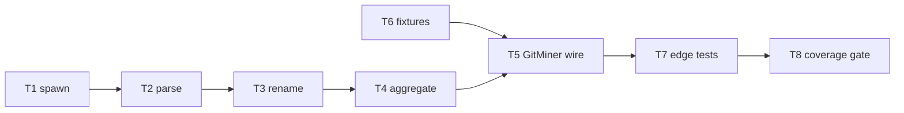

# Milestone 2 — Git Change Miner Tasks

**Design**: [`.specs/features/git-change-miner/design.md`](./design.md)  
**Spec**: [`.specs/features/git-change-miner/spec.md`](./spec.md)  
**Status**: Done

---

## Execution Plan

### Phase 1: Core modules (Sequential)

```
T1 → T2 → T3 → T4
```

### Phase 2: Fixtures (Parallel with Phase 1)

```
T6 [P]  (no code dependency on T1–T4)
```

### Phase 3: Integration and gate (Sequential)

```
T4, T6 → T5 → T7 → T8
```



---

## Task Breakdown

### T1: Git spawn module

**What**: Implement `streamGitLog()` and `GitLogError` — build `git log` argv with `--numstat`, `--name-only`, `--pretty=format:"COMMIT|%H|%ad|%an"`, optional `--since`; spawn via `child_process.spawn`; yield stdout lines; throw `GitLogError` with `repoPath`, command, and stderr on non-zero exit.

**Where**: `src/git/spawn.ts`, `src/git/spawn.test.ts`

**Depends on**: None

**Reuses**: None

**Requirement**: HOTSPOT-09, HOTSPOT-16

**Tools**:

- MCP: NONE
- Skill: NONE

**Done when**:

- [x] `streamGitLog({ repoPath, since })` yields lines from git stdout without buffering full output
- [x] `since` omitted → no `--since` flag in argv
- [x] `since` provided → `--since=<value>` in argv
- [x] Invalid repo or git failure → `GitLogError` with `repoPath` and stderr snippet
- [x] Unit tests mock spawn and assert argv + error shape
- [x] Gate check passes: `pnpm build && pnpm test -- src/git/spawn.test.ts`

**Tests**: unit (`spawn.test.ts` — mock `child_process.spawn`)

**Gate**: build + test

---

### T2: Streaming parser state machine

**What**: Implement `parseGitLogStream()` — state machine for commit headers (`COMMIT|hash|date|author`), numstat lines (`add\t del\t path`), rename lines (`old => new`), binary `-` `-`, and blank-line commit boundaries. Export `ParsedCommit` and `ParsedFileChange` types.

**Where**: `src/git/parse.ts`, `src/git/parse.test.ts`

**Depends on**: T1 (interface contract; tests use fixture iterables, not live git)

**Reuses**: None

**Requirement**: HOTSPOT-10, HOTSPOT-15

**Tools**:

- MCP: NONE
- Skill: NONE

**Done when**:

- [x] Commit header parsed into `hash`, `date`, `author`
- [x] Numstat parsed with tab separation; `-` → `null` additions/deletions
- [x] Rename line sets `renameFrom` on subsequent file entry
- [x] Multiple commits in one stream yield multiple `ParsedCommit` objects
- [x] Parser does not accumulate full input string (processes line-by-line)
- [x] Unit tests cover header, numstat, rename, binary, multi-commit
- [x] Gate check passes: `pnpm build && pnpm test -- src/git/parse.test.ts`

**Tests**: unit (`parse.test.ts` — async iterable of lines from inline strings)

**Gate**: build + test

---

### T3: Path alias / rename canonicalization

**What**: Implement `PathAliasMap` — `link(old, new)`, `canonical(path)`, `getAmbiguousPaths()`. Support rename chains (`a → b → c`). Unit tests for single rename, multi-rename chain, and ambiguous paths.

**Where**: `src/git/rename.ts`, `src/git/rename.test.ts`

**Depends on**: T2 (rename metadata shape from parser)

**Reuses**: None

**Requirement**: HOTSPOT-14

**Tools**:

- MCP: NONE
- Skill: NONE

**Done when**:

- [x] `canonical("a.ts")` returns `"c.ts"` after `link("a.ts","b.ts")` and `link("b.ts","c.ts")`
- [x] `getAmbiguousPaths()` returns paths with incomplete chains
- [x] Unit tests for single rename, chain, and no-op canonical
- [x] Gate check passes: `pnpm build && pnpm test -- src/git/rename.test.ts`

**Tests**: unit (`rename.test.ts`)

**Gate**: build + test

---

### T4: Dual aggregator (stats + co-change)

**What**: Implement `aggregateCommits()` and `aggregateOneCommit()` — build `Map<string, FileChangeStats>` and `CoChangeEvent[]` from canonicalized commits. Rules: `commitCount` per file, `linesChanged` = sum(additions+deletions), `authors` as `Set<string>`, `lastModified` = latest commit date; skip commits with zero files; deduplicate paths within commit.

**Where**: `src/git/aggregate.ts`, `src/git/aggregate.test.ts`

**Depends on**: T2, T3

**Reuses**: `FileChangeStats`, `CoChangeEvent` from `src/types/`

**Requirement**: HOTSPOT-11, HOTSPOT-12, HOTSPOT-13

**Tools**:

- MCP: NONE
- Skill: NONE

**Done when**:

- [x] `FileChangeStats.commitCount` increments once per commit per file
- [x] `linesChanged` sums additions+deletions; binary commits add 0 lines
- [x] `authors` is `Set<string>` with distinct author names
- [x] `lastModified` reflects most recent commit date for file
- [x] `CoChangeEvent` emitted per commit with `filesChanged` canonical paths
- [x] Empty commits produce no `CoChangeEvent`
- [x] Both outputs produced from same `Iterable<ParsedCommit>` (single pass)
- [x] Gate check passes: `pnpm build && pnpm test -- src/git/aggregate.test.ts`

**Tests**: unit (`aggregate.test.ts` — hand-built `ParsedCommit[]`)

**Gate**: build + test

---

### T5: GitMiner factory wiring

**What**: Replace throwing stub in `createGitMiner()` with full pipeline: `streamGitLog` → `parseGitLogStream` → record renames in `PathAliasMap` → aggregate commit-by-commit. Extend `GitMinerResult` with `warnings: string[]`. Replace `index.test.ts` stub test with integration test on `basic.txt` fixture.

**Where**: `src/git/index.ts`, `src/git/index.test.ts`

**Depends on**: T1, T2, T3, T4, T6 (minimal `basic.txt` fixture)

**Reuses**: All `src/git/` submodules; `GitMinerOptions` unchanged

**Requirement**: HOTSPOT-09, HOTSPOT-10, HOTSPOT-11, HOTSPOT-12, HOTSPOT-13, HOTSPOT-14

**Tools**:

- MCP: NONE
- Skill: NONE

**Done when**:

- [x] `createGitMiner().mine()` returns `{ fileStats, coChangeEvents, warnings }` without throwing on valid fixture repo
- [x] `GitMinerResult` includes `warnings: string[]`
- [x] Pipeline processes commits one at a time (no full log buffer)
- [x] `index.test.ts` no longer expects "not implemented" throw
- [x] Integration test reads `tests/fixtures/git-log/basic.txt` via injected stream or test helper
- [x] Gate check passes: `pnpm build && pnpm test -- src/git/index.test.ts`

**Tests**: integration (`index.test.ts`)

**Gate**: build + test

---

### T6: Git log fixtures [P]

**What**: Create real `git log --numstat --name-only` fixture files: `basic.txt`, `rename-multi.txt`, `merge-delete.txt`, `binary.txt`, `large-synthetic.txt` (~10k lines). Capture from small test repos or hand-craft valid git log format per design.md.

**Where**: `tests/fixtures/git-log/`

**Depends on**: None

**Reuses**: Existing `tests/fixtures/git-log/.gitkeep` directory

**Requirement**: HOTSPOT-18

**Tools**:

- MCP: NONE
- Skill: NONE

**Done when**:

- [x] `basic.txt` — 3+ commits, 2+ files, documented expected stats in test comments
- [x] `rename-multi.txt` — file renamed twice; final path has unified commit count
- [x] `merge-delete.txt` — merge commit and file deletion
- [x] `binary.txt` — `-` `-` numstat line
- [x] `large-synthetic.txt` — ≥10,000 lines for streaming smoke test
- [x] Each fixture has header comment documenting provenance and expected behavior

**Tests**: none (fixture data only)

**Gate**: none

---

### T7: Edge-case integration tests

**What**: Add tests exercising full parse+aggregate pipeline (or `mine()` with stream injection) against `rename-multi.txt`, `merge-delete.txt`, `binary.txt`, and empty-history scenario. Assert deterministic `fileStats` and `coChangeEvents` plus warnings for insufficient history.

**Where**: `src/git/index.test.ts`, `src/git/parse.test.ts` (supplement if needed)

**Depends on**: T5, T6

**Reuses**: All fixtures from T6

**Requirement**: HOTSPOT-15, HOTSPOT-17

**Tools**:

- MCP: NONE
- Skill: NONE

**Done when**:

- [x] `rename-multi.txt` → unified churn under final canonical path
- [x] `merge-delete.txt` → deleted file in commit's `filesChanged`
- [x] `binary.txt` → `commitCount` increments, `linesChanged` unchanged for binary
- [x] Empty stream with `since` set → empty results + warning in `warnings`
- [x] Gate check passes: `pnpm build && pnpm test -- src/git/`

**Tests**: integration (fixture-driven)

**Gate**: build + test

---

### T8: Coverage gate and docs sync

**What**: Verify `src/git/**` ≥80% line coverage; run full project gate; update ROADMAP M2 checkboxes; update STRUCTURE.md module map for `src/git/` from `stub` to `implemented`; confirm no regressions.

**Where**: `vitest.config.ts` (if threshold config needed), `.specs/project/ROADMAP.md`, `.specs/codebase/STRUCTURE.md`

**Depends on**: T1–T7

**Reuses**: TESTING.md coverage rules

**Requirement**: HOTSPOT-18

**Tools**:

- MCP: NONE
- Skill: `verifier-quality-gates` (optional)

**Done when**:

- [x] `src/git/**` line coverage ≥80%
- [x] Gate check passes: `pnpm build && pnpm test`
- [x] ROADMAP M2 items checked or linked to completed spec
- [x] STRUCTURE.md reflects `src/git/` as implemented
- [x] No regressions in existing tests (`src/scan.test.ts`, etc.)

**Tests**: project gate + coverage report

**Gate**: full (`pnpm build && pnpm test`)

**Commit**: `feat(git): implement Git Change Miner streaming parser (M2)`

---

## Parallel Execution Map

```
Phase 1 (Sequential):
  T1 ──→ T2 ──→ T3 ──→ T4

Phase 2 (Parallel — no code deps):
  T6 [P]  (can start immediately)

Phase 3 (Sequential):
  T4 + T6 (basic.txt ready) ──→ T5 ──→ T7 ──→ T8
```

**Note:** T6 can run in parallel with T1–T4. T5 needs at least `basic.txt` from T6. T7 needs all T6 fixtures.

---

## Task Granularity Check

| Task | Scope | Status |
| ---- | ----- | ------ |
| T1: Git spawn | 1 module (`spawn.ts`) | ✅ Granular |
| T2: Parser | 1 module (`parse.ts`) | ✅ Granular |
| T3: Rename map | 1 module (`rename.ts`) | ✅ Granular |
| T4: Aggregator | 1 module (`aggregate.ts`) | ✅ Granular |
| T5: GitMiner wire | 1 file (`index.ts`) | ✅ Granular |
| T6: Fixtures | `tests/fixtures/git-log/` data files | ✅ Granular |
| T7: Edge tests | test files only | ✅ Granular |
| T8: Coverage + docs | verification + docs | ✅ Granular |

---

## Diagram-Definition Cross-Check

| Task | Depends On (task body) | Diagram Shows | Status |
| ---- | ---------------------- | ------------- | ------ |
| T1 | None | Entry node | ✅ Match |
| T2 | T1 | T1 → T2 | ✅ Match |
| T3 | T2 | T2 → T3 | ✅ Match |
| T4 | T2, T3 | T3 → T4 | ✅ Match |
| T5 | T1–T4, T6 | T4 → T5, T6 → T5 | ✅ Match |
| T6 | None | Parallel node | ✅ Match |
| T7 | T5, T6 | T5 → T7 | ✅ Match |
| T8 | T1–T7 | T7 → T8 | ✅ Match |

---

## Test Co-location Validation

| Task | Code Layer Created/Modified | Matrix Requires | Task Says | Status |
| ---- | --------------------------- | --------------- | --------- | ------ |
| T1: spawn | `src/git/spawn.ts` | unit ≥80% | unit (`spawn.test.ts`) | ✅ OK |
| T2: parse | `src/git/parse.ts` | unit ≥80% | unit (`parse.test.ts`) | ✅ OK |
| T3: rename | `src/git/rename.ts` | unit ≥80% | unit (`rename.test.ts`) | ✅ OK |
| T4: aggregate | `src/git/aggregate.ts` | unit ≥80% | unit (`aggregate.test.ts`) | ✅ OK |
| T5: GitMiner wire | `src/git/index.ts` | unit ≥80% | integration (`index.test.ts`) | ✅ OK |
| T6: Fixtures | `tests/fixtures/git-log/` | none | none | ✅ OK |
| T7: Edge tests | `src/git/*.test.ts` | unit ≥80% | integration | ✅ OK |
| T8: Coverage gate | docs + config | project gate | full gate | ✅ OK |

---

## Requirement → Task Mapping

| Requirement | Task(s) |
| ----------- | ------- |
| HOTSPOT-09 | T1, T5 |
| HOTSPOT-10 | T2, T5 |
| HOTSPOT-11 | T4, T5 |
| HOTSPOT-12 | T4, T5 |
| HOTSPOT-13 | T4, T5 |
| HOTSPOT-14 | T3, T5 |
| HOTSPOT-15 | T2, T7 |
| HOTSPOT-16 | T1 |
| HOTSPOT-17 | T7 |
| HOTSPOT-18 | T6, T8 |

**Coverage:** 10 requirements, 10 mapped, 0 unmapped

---

## Module Owner Routing

| Task | Primary owner module |
| ---- | -------------------- |
| T1 | `src/git/spawn.ts` |
| T2 | `src/git/parse.ts` |
| T3 | `src/git/rename.ts` |
| T4 | `src/git/aggregate.ts` |
| T5 | `src/git/index.ts` |
| T6 | `tests/fixtures/git-log/` |
| T7 | `src/git/*.test.ts` |
| T8 | project docs + vitest config |

**Path conflict check:** Each production file owned by exactly one task (T1–T5). ✅ No conflicts.

---

## Out of Scope Reminder

- Do **not** modify `src/scan.ts` in M2
- Do **not** add `simple-git` dependency
- Do **not** wire CLI `--since` default (M5)
