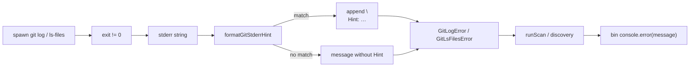

# Milestone 65 — Git Error UX Design (thin)

**Spec**: [`.specs/features/git-error-ux/spec.md`](./spec.md)  
**Context**: [`.specs/features/git-error-ux/context.md`](./context.md)  
**Status**: Planned  
**Depth:** Medium — thin design; small helper in `src/git/`, no pipeline reshape.

---

## Architecture Overview

Map git stderr → optional `Hint:` inside domain error constructors. CLI remains a dumb printer of `error.message`.



**Baseline:** `src/git/spawn.ts` `GitLogError`, `src/git/ls-files.ts` `GitLsFilesError`, M38 `Hint:` tone, M64 doctor since (sister — not implemented here).

---

## Code Reuse Analysis

| Component             | Location                            | How to Use                                                  |
| --------------------- | ----------------------------------- | ----------------------------------------------------------- |
| `GitLogError`         | `src/git/spawn.ts`                  | Call hint helper in constructor when building `super(...)`  |
| `GitLsFilesError`     | `src/git/ls-files.ts`               | Same helper                                                 |
| Function-churn spawn  | `src/git/function-churn/spawn.ts`   | Already `new GitLogError(...)` — inherits enrichment        |
| Mock spawn tests      | `spawn.test.ts`, `ls-files.test.ts` | Extend with stderr fixtures for families                    |
| M38 Hint presentation | resolve-repo / CliUsageError        | Match `\nHint: …` English tone — do not copy not-a-git text |
| Doctor since probe    | M64 `probe-since` (planned)         | **Do not** implement or call from M65                       |

### Fragile / concerns

| Concern                           | Mitigation                                                               |
| --------------------------------- | ------------------------------------------------------------------------ |
| Over-matching stderr (false Hint) | Narrow substring table; first-match order; unit tests for negatives      |
| Duplicate not-a-git               | No dedicated pattern; resolve-repo remains SoT                           |
| Doctor vs runtime                 | M65 only enriches hard spawn failures; empty-window soft warns unchanged |
| INTEGRATIONS spawn ownership      | Helper lives under `src/git/`; bin must not parse git stderr             |

---

## Components

### 1. `formatGitStderrHint(stderr: string): string | undefined`

- **Purpose:** Return one actionable Hint line body (without requiring callers to know patterns), or `undefined` if unmatched
- **Location:** `src/git/git-error-hint.ts` (filename Agent's Discretion; keep under `src/git/`)
- **Behavior (locked):**
  1. Normalize with `stderr.toLowerCase()` for matching
  2. **since/date** if any of: `invalid date`, `not a valid date`, `bad date` → hint about fixing `--since` / config `since` (relative or ISO)
  3. Else **shallow** if includes `shallow` → hint deepen / full clone
  4. Else **corrupt** if includes `corrupt` or `bad object` or `loose object` → hint `git fsck` / re-clone
  5. Else `undefined`
- **Export:** Used by error constructors; may export from `src/git/index.ts` only if needed elsewhere (YAGNI — package-private import OK)
- **Tests:** Co-located `git-error-hint.test.ts` — positives, negatives, priority (date beats shallow if both present)

### 2. Wire `GitLogError` / `GitLsFilesError`

```ts
function buildGitFailureMessage(
  kind: "log" | "ls-files",
  repoPath: string,
  stderr: string,
): string {
  const detail = stderr.trim() || "unknown error";
  const base =
    kind === "log"
      ? `git log failed for repo ${repoPath}: ${detail}`
      : `git ls-files failed for repo ${repoPath}: ${detail}`;
  const hint = formatGitStderrHint(stderr);
  return hint ? `${base}\nHint: ${hint}` : base;
}
```

- Keep `repoPath`, `command`, `stderr` fields unchanged (raw stderr property stays un-hinted)
- **Do not** change AbortError paths

### 3. CLI / exit

No bin edits required for happy path. Exit mapping already treats non-`CliUsageError`/`ConfigError`/`InitError` as `1`. Verify verbally in tasks; add a bin assertion only if an existing test already covers `GitLogError` messaging (optional YAGNI).

---

## Error Handling Strategy

| Scenario                 | Handling              | User impact                 |
| ------------------------ | --------------------- | --------------------------- |
| Invalid since stderr     | Hint on `GitLogError` | Exit 1 + actionable Hint    |
| Shallow stderr           | Hint                  | Exit 1 + deepen Hint        |
| Corrupt stderr           | Hint                  | Exit 1 + fsck/re-clone Hint |
| Unmatched / empty stderr | No Hint               | Same as today               |
| Not a git (resolve-repo) | Unchanged             | Existing Hint; not M65      |
| Doctor invalid since     | M64                   | Out of scope                |
| AbortSignal              | Unchanged             | No Hint                     |

---

## Tech Decisions

| Decision                     | Choice                       | Rationale                                     |
| ---------------------------- | ---------------------------- | --------------------------------------------- |
| Where to enrich              | Constructor / shared builder | One place; all throw sites benefit            |
| Match style                  | Substring / cheap includes   | YAGNI regex engine; stable git phrasing       |
| Hint on `stderr` field       | No — only `message`          | Callers inspecting `stderr` keep raw git text |
| Proactive shallow file check | No                           | Mission: stderr-detectable only               |

---

## Living docs (Execute)

- `.specs/codebase/ARCHITECTURE.md` — brief note: git spawn failures may append `Hint:`
- `.specs/codebase/INTEGRATIONS.md` — stderr→Hint owned by `src/git/`; bin prints only
- `.specs/codebase/STRUCTURE.md` — new helper file if added
- README — only if user-facing “troubleshooting” already lists git errors (cheap)

**Do not** edit ROADMAP/STATE in planning (mission); Execute session may sync when promoting Done.
