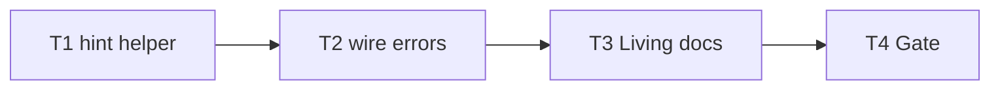

# Milestone 65 — Git Error UX Tasks

**Design**: [`.specs/features/git-error-ux/design.md`](./design.md)  
**Spec**: [`.specs/features/git-error-ux/spec.md`](./spec.md)  
**Context**: [`.specs/features/git-error-ux/context.md`](./context.md)  
**Status**: Done  
**Note**: Medium feature — hint helper + wire error constructors + docs. Planning session ends here; Execute in a separate session after Status → Approved / Ready for Execute.

---

## Execution Plan

### Phase 1: Helper (foundation)

```
T1 git-error-hint helper + unit tests
```

### Phase 2: Wire constructors

```
T1 → T2 GitLogError + GitLsFilesError + spawn/ls-files tests
```

### Phase 3: Docs + gate

```
T2 → T3 living docs → T4 project gate
```



### Diagram-Definition Cross-Check

| Task | Depends on (declared) | Diagram shows | Match |
| ---- | --------------------- | ------------- | ----- |
| T1 | None | Root | ✅ |
| T2 | T1 | T1 → T2 | ✅ |
| T3 | T2 | T2 → T3 | ✅ |
| T4 | T3 | T3 → T4 | ✅ |

### Path Conflict Check (Check 5)

| Task | Module owner | Paths | Conflict |
| ---- | ------------ | ----- | -------- |
| T1 | git (helper) | `src/git/git-error-hint.ts`, `src/git/git-error-hint.test.ts` | Sole owner of new helper |
| T2 | git (spawn + ls-files) | `src/git/spawn.ts`, `src/git/spawn.test.ts`, `src/git/ls-files.ts`, `src/git/ls-files.test.ts` | After T1; single owner for both constructors in one task (avoids split race on shared helper API) |
| T3 | docs | `.specs/codebase/ARCHITECTURE.md`, `INTEGRATIONS.md`, optionally `STRUCTURE.md` / README | No src overlap |
| T4 | gate | none (verify) | After T3 |

No `[P]` tasks — sequential chain; T2 intentionally owns both error classes to keep one coherent message builder.

### Test Co-location Validation

| Task | Code layer | TESTING.md expectation | Task says | Match |
| ---- | ---------- | ---------------------- | --------- | ----- |
| T1 | `src/git/` helper | Unit; mock not required | unit in same task | ✅ |
| T2 | `src/git/spawn.ts`, `ls-files.ts` | Unit; mock spawn at adapter | unit in same task | ✅ |
| T3 | Docs | none | none | ✅ |
| T4 | Full project | Gate | `pnpm build && pnpm test` | ✅ |

### Granularity Check

| Task | Scope | Status |
| ---- | ----- | ------ |
| T1 | One pure helper + tests | ✅ Atomic |
| T2 | Wire two constructors + update existing tests (same domain) | ✅ Cohesive |
| T3 | Living docs | ✅ Granular |
| T4 | Project gate | ✅ Granular |

### Requirement → Task Mapping

| Requirement ID | Task |
| -------------- | ---- |
| HOTSPOT-1141, HOTSPOT-1142, HOTSPOT-1143, HOTSPOT-1144 | T1 |
| HOTSPOT-1140, HOTSPOT-1145, HOTSPOT-1146, HOTSPOT-1147, HOTSPOT-1148, HOTSPOT-1149 | T2 |
| HOTSPOT-1150 | T3 |
| (gate) | T4 |
| HOTSPOT-1151–1159 | Reserved — unused |

---

## Task Breakdown

### T1: Git stderr hint helper

**What**: Add `src/git/git-error-hint.ts` exporting `formatGitStderrHint(stderr: string): string | undefined` per [design.md](./design.md) / [context.md](./context.md): first-match order since/date → shallow → corrupt; return Hint **body** only (no `Hint:` prefix). Co-locate unit tests for each family, unmatched/empty → `undefined`, and priority when multiple cues appear.

**Where**: `src/git/git-error-hint.ts`; `src/git/git-error-hint.test.ts`

**Depends on**: None

**Reuses**: M38 Hint tone (actionable English); design substring table

**Done when**:

- [x] `formatGitStderrHint` implements locked families and priority
- [x] Unit tests cover since/date, shallow, corrupt, unmatched, empty, priority
- [x] No constructor wiring yet (T2); no doctor/probe files; no bin edits
- [x] Gate: `pnpm exec vitest run src/git/git-error-hint.test.ts` — PASS

**Tests**: unit in `src/git/git-error-hint.test.ts` (same task)

**Gate**: `pnpm exec vitest run src/git/git-error-hint.test.ts`

**Requirements**: HOTSPOT-1141, HOTSPOT-1142, HOTSPOT-1143, HOTSPOT-1144

**Verify**:

```bash
pnpm exec vitest run src/git/git-error-hint.test.ts
```

**Tools**:

- MCP: NONE
- Skill: `coding-guidelines`, `vitals-pipeline-domain`

---

### T2: Wire GitLogError + GitLsFilesError

**What**: Use the helper when building `GitLogError` and `GitLsFilesError` messages (`\nHint: ${body}` when defined). Keep `stderr` / `command` / `repoPath` fields as raw values. Update `spawn.test.ts` and `ls-files.test.ts` so matching synthetic stderr asserts Hint present; unmatched/empty paths still have no Hint; existing not-a-git stderr cases must **not** gain a new dedicated not-a-git Hint from this feature. Do not implement doctor since probe. Do not add bin git-pattern switches. Confirm exit semantics remain 1 (no mapping change).

**Where**: `src/git/spawn.ts`; `src/git/spawn.test.ts`; `src/git/ls-files.ts`; `src/git/ls-files.test.ts`

**Depends on**: T1

**Reuses**: `formatGitStderrHint`; existing mock-child patterns in spawn/ls-files tests

**Done when**:

- [x] `GitLogError` message includes Hint for locked families
- [x] `GitLsFilesError` shares the same helper behavior
- [x] Unmatched / empty stderr: no `Hint:` line; unknown-error path preserved
- [x] No dedicated not-a-git Hint pattern added; no `probe-since` / doctor files
- [x] No bin edits for git stderr parsing
- [x] Gate: `pnpm exec vitest run src/git/spawn.test.ts src/git/ls-files.test.ts src/git/git-error-hint.test.ts` — PASS

**Tests**: unit in `spawn.test.ts` + `ls-files.test.ts` (same task)

**Gate**: `pnpm exec vitest run src/git/spawn.test.ts src/git/ls-files.test.ts src/git/git-error-hint.test.ts`

**Requirements**: HOTSPOT-1140, HOTSPOT-1145, HOTSPOT-1146, HOTSPOT-1147, HOTSPOT-1148, HOTSPOT-1149

**Verify**:

```bash
pnpm exec vitest run src/git/spawn.test.ts src/git/ls-files.test.ts src/git/git-error-hint.test.ts
```

**Tools**:

- MCP: NONE
- Skill: `coding-guidelines`, `vitals-pipeline-domain`, `vitals-cli-validation` (exit semantics awareness only)

---

### T3: Living documentation

**What**: Update ARCHITECTURE and INTEGRATIONS to document git stderr → `Hint:` enrichment owned by `src/git/` (CLI prints `message` only). Update STRUCTURE if the new helper file is listed. Touch README only if an existing troubleshooting/git-errors section makes a one-line addition cheap. Do **not** edit ROADMAP/STATE unless the Execute session explicitly syncs Done (planning mission excluded those files).

**Where**: `.specs/codebase/ARCHITECTURE.md`; `.specs/codebase/INTEGRATIONS.md`; optionally `.specs/codebase/STRUCTURE.md`, `README.md`

**Depends on**: T2

**Reuses**: Existing INTEGRATIONS git spawn ownership wording

**Done when**:

- [x] Docs mention hint helper / constructor enrichment and sister boundaries (M38 tone, M64 not duplicated)
- [x] INTEGRATIONS still forbids bin-side git stderr parsing
- [x] No src/bin/tests edits in this task

**Tests**: none

**Gate**: none (docs-only; verified by T4)

**Requirements**: HOTSPOT-1150

**Tools**:

- MCP: NONE
- Skill: NONE

---

### T4: Project quality gate

**What**: Run the full project gate and fix only regressions caused by T1–T3 if any.

**Where**: repo root (verify only)

**Depends on**: T3

**Reuses**: [TESTING.md](../../codebase/TESTING.md) quality gate

**Done when**:

- [x] `pnpm build && pnpm test` exits 0
- [x] No silent test deletions

**Tests**: full suite via gate

**Gate**: `pnpm build && pnpm test`

**Verify**:

```bash
pnpm build && pnpm test
```

**Tools**:

- MCP: NONE
- Skill: none (or invoke `verifier-quality-gates` in Execute)

---

## Parallel Execution Map

```
Phase 1: T1
Phase 2: T2
Phase 3: T3 → T4
```

All sequential — no `[P]` flags.
