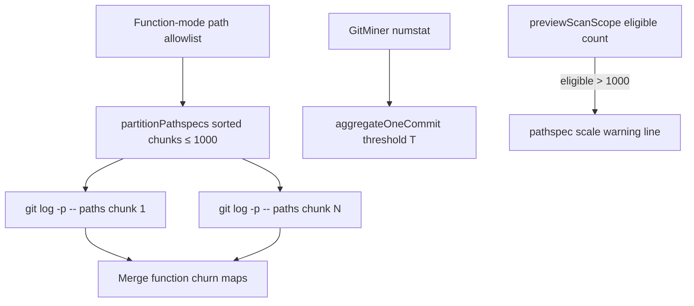

# Milestone 47 — Git Scale Pathspecs Design

**Spec**: [`.specs/features/git-scale-pathspecs/spec.md`](./spec.md)  
**Context**: [`.specs/features/git-scale-pathspecs/context.md`](./context.md)  
**Status**: Planned

---

## Architecture Overview

M47 extends **function-mode patch mining** and **numstat mega-commit aggregation** without changing ADR-2026-020 (single full numstat stream) or scoring formulas.



**Patch path (function mode):**

```
allowlist → sort → chunk(≤1000) → sequential streamGitPatchLog per chunk
  → aggregatePatchCommit into shared stats → scoreFunctionHotspots
```

**Mega-commit path (both granularities):**

```
merged.megaCommitThreshold → GitMiner / aggregateOneCommit({ megaCommitThreshold })
  → MEGA_COMMIT_SKIPPED warnings with effective T
```

**Dry-run:**

```
discoverSourceFiles → eligibleFileCount
  if count > PATCH_PATHSPEC_FALLBACK_THRESHOLD → warning line in preview text
```

---

## Code Reuse Analysis

### Existing Components to Leverage

| Component | Location | How to Use |
| --------- | -------- | ---------- |
| `PATCH_PATHSPEC_FALLBACK_THRESHOLD` / `buildGitPatchLogArgv` | `src/git/function-churn/spawn.ts` | Keep constant as max pathspecs per argv; remove count-based omit; add partition helper |
| `createFunctionChurnMiner` | `src/git/function-churn/index.ts` | Orchestrate sequential batched streams + merge |
| `aggregatePatchCommit` | `src/git/function-churn/aggregate.ts` | Unchanged overlap semantics; reuse per batch |
| `MEGA_COMMIT_UNIQUE_FILE_THRESHOLD` / `aggregateOneCommit` | `src/git/aggregate.ts` | Default + accept override threshold |
| `createMegaCommitSkippedWarnings` | `src/git/mega-commit-warnings.ts` | Parameterize message threshold |
| `createGitMiner` | `src/git/index.ts` | Pass threshold into aggregate options |
| `mergeScanOptions` / `load-config` / exemplar | `src/config/` | Add `megaCommitThreshold` like `minCochange` |
| `ScanOptions` | `src/types/domain.ts` | Optional `megaCommitThreshold?: number` |
| `previewScanScope` / `formatScanScopePreview` | `src/scan-preview.ts` | Eligible-count warning |
| CLI `parsePositiveInteger` | `bin/hotspot-scanner.ts` | `--mega-commit-threshold` |
| M35 spawn/integration tests | `spawn.test.ts`, `scan.integration.test.ts` | Retarget fallback cases to batching |

### Integration Points

| System | M47 behavior |
| ------ | ------------ |
| `git` subprocess | Multiple sequential pathspec-restricted patch spawns when batched; numstat argv unchanged |
| Config / CLI | New optional key/flag; precedence unchanged |
| Diagnostics | Existing `MEGA_COMMIT_SKIPPED`; optional new warning code for ARG_MAX emergency |
| JSON schemas | No shape change |
| Dry-run | Preview text only; still no mine |

### Fragile areas (CONCERNS.md)

| Area | Design mitigation |
| ---- | ----------------- |
| M35 pathspec fallback | Replace count-omit with batching; keep streaming line-by-line |
| M32 mega-commit | Threshold injectable; skip+churn policy untouched |
| Patch stream memory | Sequential batches — never N concurrent patch streams |
| File mode must not spawn patch | Keep M35 regression |
| ARG_MAX on long paths | Emergency shrink + unrestricted last resort + warning |

---

## Components

### Pathspec partition helper

- **Purpose**: Sort + chunk path arrays for git argv safety
- **Location**: `src/git/function-churn/spawn.ts` (or tiny sibling `pathspec-batch.ts` if spawn.ts grows — prefer keep in spawn module unless Execute needs split)
- **Interfaces**:
  - `partitionPathspecs(paths: string[], maxPerChunk = PATCH_PATHSPEC_FALLBACK_THRESHOLD): string[][]`
  - `buildGitPatchLogArgv` — always append `--` + paths when non-empty (caller passes one chunk); no length omit
- **Dependencies**: None
- **Reuses**: Existing argv flags (`-M`, `-p`, `--unified=0`, `--since`)

### FunctionChurnMiner batch orchestrator

- **Purpose**: Sequential multi-chunk patch mining + merge
- **Location**: `src/git/function-churn/index.ts`
- **Interfaces**:
  - Existing `paths?: string[]` on miner options
  - Internal: loop chunks → `streamGitPatchLog` → aggregate into shared map
  - Emergency: detect ARG_MAX-class failure → half-size retry → unrestricted + warning
- **Dependencies**: spawn partition + stream; aggregate
- **Reuses**: Empty-paths early exit; progress `function-churn`

### Configurable mega-commit threshold

- **Purpose**: Operator dial for coupling mega-skip
- **Location**: `src/git/aggregate.ts`, `mega-commit-warnings.ts`, `src/git/index.ts`, `src/config/*`, `src/types/domain.ts`, `src/scan.ts`, `bin/*`
- **Interfaces**:
  - `AggregateOneCommitOptions.megaCommitThreshold?: number` (default constant)
  - `MergedScanOptions.megaCommitThreshold: number`
  - Config key `megaCommitThreshold`; CLI `--mega-commit-threshold <n>`
- **Dependencies**: Existing merge/validation helpers (`assertPositiveInteger`)
- **Reuses**: M32 skip + warning cap logic

### Dry-run pathspec scale warning

- **Purpose**: Early scale signal without mining
- **Location**: `src/scan-preview.ts` (+ tests)
- **Interfaces**:
  - Extend `ScanScopePreview` with optional `pathspecScaleWarning?: string` **or** append line only in formatter (prefer formatter-only to keep preview DTO minimal — Execute choice; if DTO field helps tests, additive optional field OK)
  - Compare `eligibleFileCount` to `PATCH_PATHSPEC_FALLBACK_THRESHOLD`
- **Dependencies**: Existing discover + resolve prelude
- **Reuses**: M39 preview pipeline

---

## Data Models

```typescript
// Aggregate options (sketch)
interface AggregateOneCommitOptions {
  isPathInScope?: (path: string) => boolean;
  megaCommitThreshold?: number; // default MEGA_COMMIT_UNIQUE_FILE_THRESHOLD
}

// Config / merge (additive)
interface HotspotScannerConfig {
  // ...existing
  megaCommitThreshold?: number;
}

interface ScanOptions {
  // ...existing
  megaCommitThreshold?: number;
}
```

**Warning code (emergency only):** Prefer new stable code `PATHSPEC_ARG_MAX_FALLBACK` (document in ARCHITECTURE warning catalog). Do **not** change `MEGA_COMMIT_SKIPPED`.

**Preview phrasing (locked candidate):**

```
warning: eligible files (N) exceed pathspec batch threshold (1000); function mode will batch git pathspecs
```

Exact string may be refined in Execute if tests need a stable substring assert.

---

## Error Handling Strategy

| Error Scenario | Handling | User Impact |
| -------------- | -------- | ----------- |
| Invalid `megaCommitThreshold` / CLI | `ConfigError` / `CliUsageError` before scan | Non-zero exit; no partial mine |
| Patch chunk ARG_MAX | Half-size retry once; then unrestricted + `PATHSPEC_ARG_MAX_FALLBACK` | Scan continues; warning in meta/stderr |
| Empty allowlist | No spawn | Empty function churn (M35) |
| Dry-run eligible > 1000 | Warning line in preview | Exit 0; no mine |

---

## Tech Decisions

| Decision | Choice | Rationale |
| -------- | ------ | --------- |
| Numstat pathspecs | Out of scope | Coupling + ADR-2026-020 |
| Batch parallelism | Sequential | Peak RSS / CONCERNS |
| Inequality for mega skip | Keep `>` (not `≥`) | M32 lock / edge case |
| Constant name `PATCH_PATHSPEC_FALLBACK_THRESHOLD` | Keep symbol; docs redefine as max-per-chunk | Avoid noisy rename; optional alias OK |
| Unrestricted by count | Removed | Mission primary fix |
| Mega sampling | No | Mission prefer keep skip |

---

## Risks

| Risk | Mitigation |
| ---- | ---------- |
| Progress counter double-counts cross-batch commits | Documented acceptable; do not build unique-hash set (YAGNI) |
| Long path strings still hit ARG_MAX inside one chunk of 1000 | Emergency shrink + unrestricted path |
| Tests still assert M35 “omit pathspecs over threshold” | Update unit/integration to expect batching |
| Warning catalog growth | One new code max; document in ARCHITECTURE |
| Config exemplar drift | Add key in `src/config/exemplar.ts` with default 100 |

---

## Test Plan (design-level)

| Area | Surface |
| ---- | ------- |
| Partition + argv | `spawn.test.ts` |
| Miner multi-spawn / merge | `function-churn/index.test.ts` |
| Mega threshold | `aggregate.test.ts`, `mega-commit-warnings.test.ts`, `git/index.test.ts` |
| Config merge/parse | `load-config.test.ts`, `merge-options.test.ts`, exemplar |
| CLI | `bin/hotspot-scanner.test.ts` |
| Dry-run | `scan-preview.test.ts` |
| File-mode zero patch + batching spy | `scan.integration.test.ts` |
| Full gate | `pnpm build && pnpm test` |
