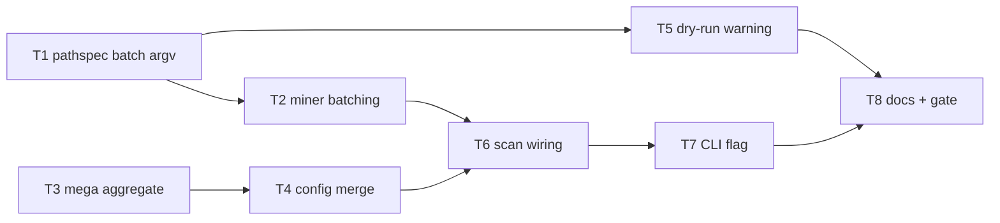

# Milestone 47 — Git Scale Pathspecs Tasks

**Design**: [`.specs/features/git-scale-pathspecs/design.md`](./design.md)  
**Spec**: [`.specs/features/git-scale-pathspecs/spec.md`](./spec.md)  
**Context**: [`.specs/features/git-scale-pathspecs/context.md`](./context.md)  
**Status**: Done

---

## Execution Plan

### Phase 1: Foundation (Parallel OK)

```
T1 pathspec partition + argv [P] ──┐
                                   ├──→ Phase 2
T3 mega threshold in aggregate [P]─┘
```

### Phase 2: Orchestration + config

```
T1 → T2 miner batching
T3 → T4 config/types/merge
T1 → T5 dry-run warning [P with T2/T4]
```

### Phase 3: Pipeline + CLI

```
T2 + T4 → T6 scan/GitMiner wiring → T7 CLI flag
```

### Phase 4: Docs + gate

```
T5 + T6 + T7 → T8 docs + integration + full gate
```



### Diagram-Definition Cross-Check

| Task | Depends on (body) | Diagram shows | Status   |
| ---- | ----------------- | ------------- | -------- |
| T1   | None              | Root          | ✅ Match |
| T2   | T1                | T1→T2         | ✅ Match |
| T3   | None              | Root          | ✅ Match |
| T4   | T3                | T3→T4         | ✅ Match |
| T5   | T1                | T1→T5         | ✅ Match |
| T6   | T2, T4            | T2→T6, T4→T6  | ✅ Match |
| T7   | T6                | T6→T7         | ✅ Match |
| T8   | T5, T7            | T5→T8, T7→T8  | ✅ Match |

### Path Conflict Check

| Task | Module owner                       | Paths                                                                                          | Conflict                                                         |
| ---- | ---------------------------------- | ---------------------------------------------------------------------------------------------- | ---------------------------------------------------------------- |
| T1   | `src/git/function-churn/`          | `spawn.ts`, `spawn.test.ts` (± tiny `pathspec-batch` helper in same folder)                    | None vs T3                                                       |
| T2   | `src/git/function-churn/`          | `index.ts`, `index.test.ts`                                                                    | After T1; sole miner owner                                       |
| T3   | `src/git/` (numstat aggregate)     | `aggregate.ts`, `aggregate.test.ts`, `mega-commit-warnings.ts`, `mega-commit-warnings.test.ts` | Disjoint from function-churn; do **not** edit `function-churn/*` |
| T4   | `src/config/` + `src/types/`       | `load-config.ts`, `merge-options.ts`, `exemplar.ts`, tests, `domain.ts`                        | After T3; no `bin/` yet                                          |
| T5   | `src/scan-preview.ts`              | `scan-preview.ts`, `scan-preview.test.ts`                                                      | After T1 (imports threshold); do not edit `scan.ts` wiring       |
| T6   | `src/scan.ts` + `src/git/index.ts` | `scan.ts`, `scan.test.ts`, `git/index.ts`, `git/index.test.ts`                                 | After T2+T4; sole scan owner — not ∥ T7                          |
| T7   | `bin/`                             | `hotspot-scanner.ts`, `scan-actions.ts`, `hotspot-scanner.test.ts`                             | After T6                                                         |
| T8   | docs + integration                 | ARCHITECTURE, CONCERNS, TESTING, README, `scan.integration.test.ts`, ROADMAP/STATE on Done     | After T5+T7                                                      |

### Test Co-location Validation

| Task | Code layer               | Matrix / TESTING.md     | Task Tests                | Status |
| ---- | ------------------------ | ----------------------- | ------------------------- | ------ |
| T1   | function-churn spawn     | unit                    | unit                      | ✅ OK  |
| T2   | function-churn miner     | unit                    | unit                      | ✅ OK  |
| T3   | git aggregate / warnings | unit                    | unit                      | ✅ OK  |
| T4   | config + types           | unit                    | unit                      | ✅ OK  |
| T5   | scan-preview             | unit                    | unit                      | ✅ OK  |
| T6   | scan + git miner wiring  | unit (+ focused miner)  | unit                      | ✅ OK  |
| T7   | CLI bin                  | CLI Vitest              | CLI unit                  | ✅ OK  |
| T8   | integration + docs       | integration + full gate | integration + none (docs) | ✅ OK  |

### Granularity Check

| Task | Scope                                                     | Status                        |
| ---- | --------------------------------------------------------- | ----------------------------- |
| T1   | Partition helper + argv behavior + unit tests             | ✅ Granular                   |
| T2   | Miner sequential batches + merge + emergency + unit tests | ✅ Granular                   |
| T3   | Aggregate threshold option + warning strings + unit tests | ✅ Granular                   |
| T4   | Config key + merge + ScanOptions + exemplar + unit tests  | ✅ OK (cohesive config slice) |
| T5   | Preview warning + unit tests                              | ✅ Granular                   |
| T6   | Wire threshold + pathspec miner already batched via T2    | ✅ Granular                   |
| T7   | CLI flag forward + validation tests                       | ✅ Granular                   |
| T8   | Docs + integration regressions + full gate                | ✅ Granular                   |

---

## Requirement → Task Mapping

| Requirement ID                                                    | Task                                                     |
| ----------------------------------------------------------------- | -------------------------------------------------------- |
| HOTSPOT-660, HOTSPOT-661, HOTSPOT-664, HOTSPOT-666                | T1                                                       |
| HOTSPOT-662, HOTSPOT-663, HOTSPOT-665, HOTSPOT-667, HOTSPOT-669   | T2                                                       |
| HOTSPOT-668                                                       | T8 (file-mode regression) + T2 must not change file-mode |
| HOTSPOT-670, HOTSPOT-671, HOTSPOT-672, HOTSPOT-673, HOTSPOT-674   | T3                                                       |
| HOTSPOT-675, HOTSPOT-676, HOTSPOT-678, HOTSPOT-679                | T4                                                       |
| HOTSPOT-677, HOTSPOT-679 (CLI)                                    | T7                                                       |
| HOTSPOT-680, HOTSPOT-681, HOTSPOT-682, HOTSPOT-683                | T5                                                       |
| HOTSPOT-678 (scan wiring), HOTSPOT-670 (default through pipeline) | T6                                                       |
| HOTSPOT-684, HOTSPOT-685, HOTSPOT-686                             | T8                                                       |
| HOTSPOT-687–689                                                   | Reserved — no task                                       |

---

## Task Breakdown

### T1: Pathspec partition helper + argv (no count-omit) [P]

**What**: Add `partitionPathspecs` (stable sort + chunks ≤ `PATCH_PATHSPEC_FALLBACK_THRESHOLD`). Change `buildGitPatchLogArgv` so a non-empty `paths` array **always** appends `--` + paths (caller passes one chunk). Remove the M35 behavior that omits pathspecs when `paths.length > threshold`. Unit-test exact threshold, threshold+1 partition shape, and argv per chunk.

**Where**: `src/git/function-churn/spawn.ts`, `src/git/function-churn/spawn.test.ts`

**Depends on**: None

**Reuses**: Existing argv flags; [context.md](./context.md) § Replace unrestricted fallback / Partition semantics

**Requirement**: HOTSPOT-660, HOTSPOT-661, HOTSPOT-664, HOTSPOT-666

**Tools**:

- MCP: NONE
- Skill: `vitals-pipeline-domain`, `coding-guidelines`

**Done when**:

- [x] `partitionPathspecs` sorts + chunks correctly (incl. 1000 / 1001)
- [x] Non-empty paths always get pathspecs in argv (no length-based omit)
- [x] Empty / undefined paths unchanged (no `--` pathspecs)
- [x] Gate check passes: `pnpm exec vitest run src/git/function-churn/spawn.test.ts`
- [x] Test count: no silent deletions vs pre-task baseline for this file

**Tests**: unit  
**Gate**: `pnpm exec vitest run src/git/function-churn/spawn.test.ts`

**Commit**: `feat(git): batch pathspec chunks instead of unrestricted omit`

---

### T2: FunctionChurnMiner sequential batching + merge

**What**: When `paths.length > threshold`, partition via T1 helper and run **sequential** `streamGitPatchLog` per chunk, aggregating into one function-churn result (disjoint files → union/merge without double-count). Keep empty-paths no-spawn. Under/equal threshold: single spawn. Implement ARG_MAX emergency: one half-size retry, then unrestricted remainder + `PATHSPEC_ARG_MAX_FALLBACK` (or design-locked code). Preserve `function-churn` progress. Update miner unit tests that currently expect unrestricted omit over threshold.

**Where**: `src/git/function-churn/index.ts`, `src/git/function-churn/index.test.ts`

**Depends on**: T1

**Reuses**: `aggregatePatchCommit`; spawn stream; [context.md](./context.md) § merge / emergency

**Requirement**: HOTSPOT-662, HOTSPOT-663, HOTSPOT-665, HOTSPOT-667, HOTSPOT-669

**Tools**:

- MCP: NONE
- Skill: `vitals-pipeline-domain`, `coding-guidelines`

**Done when**:

- [x] Over-threshold paths → ≥2 pathspec-restricted spawns (spy), sequential
- [x] Empty paths → no spawn
- [x] Merge semantics covered by unit tests (no double-count for same file functions)
- [x] Emergency path unit-tested with injectable spawn failure (or documented mock)
- [x] Gate check passes: `pnpm exec vitest run src/git/function-churn`
- [x] Test count: no silent deletions

**Tests**: unit  
**Gate**: `pnpm exec vitest run src/git/function-churn`

**Commit**: `feat(git): sequential pathspec batch mining for large allowlists`

---

### T3: Configurable mega-commit threshold in aggregate [P]

**What**: Extend `AggregateOneCommitOptions` with `megaCommitThreshold?: number` (default `MEGA_COMMIT_UNIQUE_FILE_THRESHOLD`). Use effective threshold for `>` skip guard. Parameterize `mega-commit-warnings` message builders to accept/effective threshold. Unit-test boundary (`threshold` vs `threshold+1`), churn still counted, and warning strings include effective N.

**Where**: `src/git/aggregate.ts`, `src/git/aggregate.test.ts`, `src/git/mega-commit-warnings.ts`, `src/git/mega-commit-warnings.test.ts`

**Depends on**: None

**Reuses**: M32 skip + cap logic; [context.md](./context.md) § mega-commit

**Requirement**: HOTSPOT-670, HOTSPOT-671, HOTSPOT-672, HOTSPOT-673, HOTSPOT-674

**Tools**:

- MCP: NONE
- Skill: `vitals-pipeline-domain`, `coding-guidelines`

**Done when**:

- [x] Default behavior remains threshold 100 when option omitted
- [x] Custom threshold changes skip boundary; churn still aggregated
- [x] Warning text uses effective threshold
- [x] Gate check passes: `pnpm exec vitest run src/git/aggregate.test.ts src/git/mega-commit-warnings.test.ts`
- [x] Test count: no silent deletions

**Tests**: unit  
**Gate**: `pnpm exec vitest run src/git/aggregate.test.ts src/git/mega-commit-warnings.test.ts`

**Commit**: `feat(git): injectable mega-commit unique-file threshold`

---

### T4: Config + ScanOptions `megaCommitThreshold`

**What**: Add `megaCommitThreshold` to config schema parse (`assertPositiveInteger`), `mergeScanOptions` (CLI > config > default 100), `ScanOptions` / merged options types, and exemplar config. Unit-test parse reject, merge precedence, exemplar includes key.

**Where**: `src/config/load-config.ts`, `src/config/load-config.test.ts`, `src/config/merge-options.ts`, `src/config/merge-options.test.ts`, `src/config/exemplar.ts`, `src/config/exemplar.test.ts`, `src/types/domain.ts`

**Depends on**: T3

**Reuses**: `minCochange` / `concurrency` validation + merge patterns

**Requirement**: HOTSPOT-675, HOTSPOT-676, HOTSPOT-678, HOTSPOT-679

**Tools**:

- MCP: NONE
- Skill: `vitals-pipeline-domain`, `coding-guidelines`

**Done when**:

- [x] Config key parsed and validated as positive integer
- [x] Merge precedence CLI > config > 100
- [x] Exemplar includes `megaCommitThreshold: 100` (or default constant)
- [x] Gate check passes: `pnpm exec vitest run src/config`
- [x] Test count: no silent deletions

**Tests**: unit  
**Gate**: `pnpm exec vitest run src/config`

**Commit**: `feat(config): support megaCommitThreshold option`

---

### T5: Dry-run pathspec scale warning [P]

**What**: When `eligibleFileCount > PATCH_PATHSPEC_FALLBACK_THRESHOLD`, include the locked-candidate warning line in `formatScanScopePreview` (and any DTO field if chosen). No warning at/under threshold. Confirm dry-run still does not mine. Unit-test both sides.

**Where**: `src/scan-preview.ts`, `src/scan-preview.test.ts`

**Depends on**: T1 (stable threshold export / semantics)

**Reuses**: Existing preview prelude; [context.md](./context.md) § dry-run; design phrasing candidate

**Requirement**: HOTSPOT-680, HOTSPOT-681, HOTSPOT-682, HOTSPOT-683

**Tools**:

- MCP: NONE
- Skill: `vitals-pipeline-domain`, `coding-guidelines`

**Done when**:

- [x] Warning present only when eligible count `> 1000`
- [x] Dry-run path still discovery-only
- [x] Gate check passes: `pnpm exec vitest run src/scan-preview.test.ts`
- [x] Test count: no silent deletions

**Tests**: unit  
**Gate**: `pnpm exec vitest run src/scan-preview.test.ts`

**Commit**: `feat(scan): warn on dry-run when eligible files exceed pathspec threshold`

---

### T6: Wire mega threshold through GitMiner + `runScan`

**What**: Pass merged `megaCommitThreshold` from `runScan` / pipeline context into `createGitMiner` → `aggregateOneCommit`. Add/extend unit tests asserting the option reaches aggregate (mock/spy or fixture commit counts). Ensure function-mode still uses batched miner from T2 (no scan-level reintroduction of unrestricted omit).

**Where**: `src/git/index.ts`, `src/git/index.test.ts`, `src/scan.ts`, `src/scan.test.ts`

**Depends on**: T2, T4

**Reuses**: Existing miner options / scan merge wiring patterns

**Requirement**: HOTSPOT-670, HOTSPOT-678 (pipeline), HOTSPOT-671 (end-to-end option)

**Tools**:

- MCP: NONE
- Skill: `vitals-pipeline-domain`, `coding-guidelines`

**Done when**:

- [x] Effective threshold from merge reaches aggregate
- [x] Default 100 when unset
- [x] Gate check passes: `pnpm exec vitest run src/git/index.test.ts src/scan.test.ts`
- [x] Test count: no silent deletions

**Tests**: unit  
**Gate**: `pnpm exec vitest run src/git/index.test.ts src/scan.test.ts`

**Commit**: `feat(scan): wire megaCommitThreshold into git miner`

---

### T7: CLI `--mega-commit-threshold`

**What**: Register `--mega-commit-threshold <n>` on `scan` / `baseline save` / `compare` (same surfaces as `--min-cochange`). Validate positive integer; forward via `scan-actions` into `ScanOptions`. Help text lists the flag. CLI unit tests for invalid/valid forward.

**Where**: `bin/hotspot-scanner.ts`, `bin/scan-actions.ts`, `bin/hotspot-scanner.test.ts`

**Depends on**: T6

**Reuses**: `parsePositiveInteger`; `--min-cochange` wiring

**Requirement**: HOTSPOT-677, HOTSPOT-679

**Tools**:

- MCP: NONE
- Skill: `vitals-cli-validation`, `coding-guidelines`

**Done when**:

- [x] Flag accepted and forwarded
- [x] Non-positive rejected with `CliUsageError`
- [x] Gate check passes: `pnpm exec vitest run bin/hotspot-scanner.test.ts`
- [x] Test count: no silent deletions

**Tests**: unit (CLI)  
**Gate**: `pnpm exec vitest run bin/hotspot-scanner.test.ts`

**Commit**: `feat(cli): add --mega-commit-threshold flag`

---

### T8: Docs, integration regressions, full gate

**What**: Update ARCHITECTURE / CONCERNS / TESTING for batching (retire M35 count-based unrestricted docs), mega-commit config, dry-run warning, emergency ARG_MAX code. README + recipes mention flag/key. Retarget `scan.integration.test.ts` M35 “over threshold omits pathspecs” assertions to expect batched pathspec spawns; keep file-mode zero patch spawn. Sync ROADMAP M47 checkboxes / STATE on Execute Done. Run full project gate.

**Where**: `.specs/codebase/ARCHITECTURE.md`, `.specs/codebase/CONCERNS.md`, `.specs/codebase/TESTING.md`, `README.md` (± `docs/`), `src/scan.integration.test.ts`, `.specs/project/ROADMAP.md` / `STATE.md` (on Done)

**Depends on**: T5, T7

**Reuses**: M35 integration describe block patterns

**Requirement**: HOTSPOT-668, HOTSPOT-684, HOTSPOT-685, HOTSPOT-686

**Tools**:

- MCP: NONE
- Skill: `vitals-pipeline-domain`, `vitals-cli-validation`

**Done when**:

- [x] Living docs describe batching + configurable mega threshold + dry-run warning
- [x] Integration: file-mode zero patch spawn; function-mode over-threshold uses pathspec batches
- [x] Gate check passes: `pnpm build && pnpm test`
- [x] Test count: no silent deletions vs pre-feature baseline

**Tests**: integration (+ docs checklist)  
**Gate**: `pnpm build && pnpm test`

**Commit**: `docs(git): document pathspec batching and mega-commit threshold`

---

## Parallel Execution Map

```
Phase 1:
  ├── T1 [P]
  └── T3 [P]

Phase 2:
  T1 → T2
  T3 → T4
  T1 → T5 [P with T2/T4]

Phase 3:
  T2 + T4 → T6 → T7

Phase 4:
  T5 + T7 → T8
```

**Parallelism notes:** T1 ∥ T3 only (disjoint path prefixes). T5 may run parallel with T2/T4 after T1. Never parallelize T6 with T7 (shared scan/CLI contract). T2 after T1 in same folder.

---

## Handoff

Status is **Planned**. Do **not** Execute in the planning session.

Next: user promotes Status to `Approved` / `Ready for Execute` → new session → `orchestrator-implementer`.
