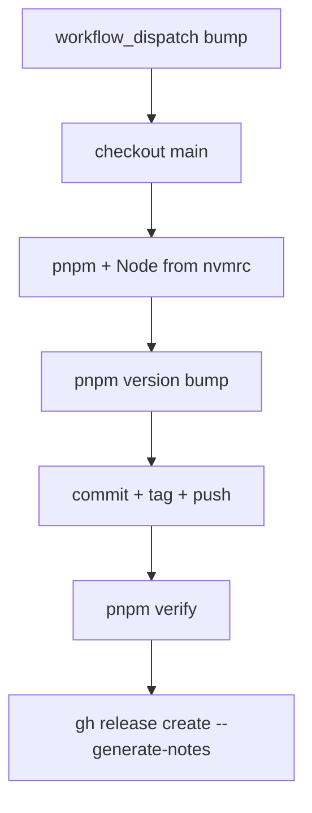

# Milestone 82 — GitHub Release Action Design

**Spec**: [spec.md](./spec.md)  
**Context**: [context.md](./context.md)  
**Status**: Planned

---

## Architecture Overview

Maintainer release tooling only. No scan/trend/assess modules. Adds one workflow beside existing CI; documents the human path in CONTRIBUTING.

**Unchanged:** product CLI, schemas contract versions, `ci.yml` triggers, npm registry.

---

## Brownfield map

| Area        | Evidence                                                         | Execute impact        |
| ----------- | ---------------------------------------------------------------- | --------------------- |
| CI only     | [`.github/workflows/ci.yml`](../../../.github/workflows/ci.yml)  | Coexist; do not merge |
| Version     | `package.json` `"version": "1.0.0"`                              | Bump target           |
| Publish prep| `publishConfig.access`, `files` already set (M24+)               | Unused until M83      |
| Docs        | CONTRIBUTING has setup/gate/PR; no Releasing section             | T2                    |
| STATE       | npm publish Deferred                                             | Leave for M83         |

---

## Code Reuse Analysis

### Existing Components to Leverage

| Component     | Location              | How to Use                                      |
| ------------- | --------------------- | ----------------------------------------------- |
| CI toolchain  | `ci.yml`              | Mirror `pnpm/action-setup`, `setup-node`, `.nvmrc`, frozen lockfile |
| Gate          | `pnpm verify`         | Same command as local/CI bar                    |
| Package meta  | `package.json`        | Semver field only                               |

### Integration Points

| System           | Integration Method                                      |
| ---------------- | ------------------------------------------------------- |
| GitHub Contents  | `permissions: contents: write` + `GITHUB_TOKEN`         |
| GitHub Releases  | `gh release create` or `softprops/action-gh-release`    |
| Default branch   | Push bump commit + tags (see branch protection note)    |

---

## Components

### `release.yml`

- **Purpose**: Manual semver cut + GitHub Release
- **Location**: `.github/workflows/release.yml`
- **Inputs**: `bump` choice enum
- **Steps (order)**:
  1. Checkout (fetch-depth sufficient for tags/notes)
  2. Setup pnpm + Node (`node-version-file: .nvmrc`)
  3. `pnpm install --frozen-lockfile`
  4. Configure git user for bot commits
  5. `pnpm version ${{ inputs.bump }}` (prefer creating commit; if `--no-git-tag-version`, follow with explicit commit + `git tag v$VERSION`)
  6. Push commit + tags to `origin`
  7. `pnpm verify`
  8. `gh release create "v$VERSION" --generate-notes`
- **Permissions**: `contents: write` only
- **Risks**: Branch protection blocking bot push — document; may need “Allow GitHub Actions to create PRs/bypass” or environment rules. Prefer failing loudly over force-push.

### CONTRIBUTING Releasing section

- **Purpose**: Discoverable maintainer instructions
- **Location**: [CONTRIBUTING.md](../../../CONTRIBUTING.md)
- **Content**: Dispatch path, bump meanings (one line each), no-npm-yet, semver ≠ JSON contract
- **Risks**: contributing-sot — keep thin; no STRUCTURE/TESTING dumps

---

## Data Flow

1. Maintainer selects bump → Actions run on `ubuntu-latest`
2. Working tree version → `X.Y.Z`; tag `vX.Y.Z`
3. Remote default branch updated; Release object created for tag
4. Consumers still install via clone + `pnpm build` until M83

---

## Error Handling

| Failure                         | Behavior                                      |
| ------------------------------- | --------------------------------------------- |
| Invalid bump (should not occur) | Workflow input enum prevents                  |
| `pnpm version` / push fails     | Job fails; no Release                         |
| `pnpm verify` fails             | Job fails; Release step must not run         |
| `gh release create` fails       | Job fails; tag may already exist — ops fix    |

---

## Security / permissions

- No long-lived npm secrets in M82
- Least privilege: `contents: write` only
- Restrict who can run `workflow_dispatch` via GitHub repo role (maintainers) — document, do not invent custom ACL in YAML

---

## Testing Strategy

| Layer            | Approach                                                                 |
| ---------------- | ------------------------------------------------------------------------ |
| Product tests    | Unchanged — no `src/` changes                                            |
| Workflow         | Static review vs acceptance criteria; optional `actionlint` if available |
| Project gate     | `pnpm verify` after docs/YAML land                                       |
| Maintainer smoke | One dry dispatch after merge (or fork) — checklist in tasks Done when    |

---

## Migration / rollback

- Rollback: delete `release.yml` and revert CONTRIBUTING section; delete mistaken tags/Releases manually
- Forward: M83 appends OIDC + `pnpm publish` to the **same** filename (`release.yml`) for Trusted Publisher stability

---

## Implementation Notes (for Execute)

- Keep job names clear (`release`)
- Do not combine with `ci.yml`
- Prefer `pnpm` for version bump to match packageManager
- After version bump, read version from `package.json` for tag/Release (single source)
- `GH_TOKEN: ${{ secrets.GITHUB_TOKEN }}` for `gh` CLI
