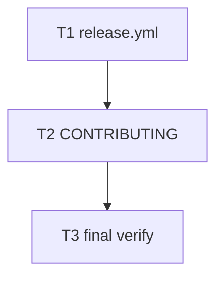

# Milestone 82 — GitHub Release Action Tasks

**Design**: [design.md](./design.md)  
**Spec**: [spec.md](./spec.md)  
**Context**: [context.md](./context.md)  
**Status**: Planned  
**Note**: Medium feature — Execute via `orchestrator-implementer` after Status promotion. Do **not** add npm publish / `id-token` / `NPM_TOKEN`. Do **not** bump JSON contract versions. Do **not** upload Release assets. Expected final gate: `pnpm verify`.

---

## Execution Plan

### Phase 1: Workflow

```
T1 release.yml
```

### Phase 2: Docs

```
T1 → T2 CONTRIBUTING Releasing
```

### Phase 3: Final verify

```
T2 → T3 pnpm verify + static checklist
```



### Diagram-Definition Cross-Check

| Task | Depends on (declared) | Diagram shows | Match |
| ---- | --------------------- | ------------- | ----- |
| T1   | None                  | Root          | yes   |
| T2   | T1                    | T1→T2         | yes   |
| T3   | T2                    | T2→T3         | yes   |

### Path Conflict Check (Check 5)

| Task | Module owner   | Paths (primary)                         | Conflict with parallel peers |
| ---- | -------------- | --------------------------------------- | ---------------------------- |
| T1   | GHA workflows  | `.github/workflows/release.yml`         | None (serial)                |
| T2   | CONTRIBUTING   | `CONTRIBUTING.md`                       | None                         |
| T3   | gate           | none (verify + review)                  | After T2                     |

> No `[P]` peers — fully serial.

### Test Co-location Validation

| Task | Code layer     | Required tests (TESTING.md) | Co-located in task |
| ---- | -------------- | --------------------------- | ------------------ |
| T1   | workflow YAML  | none                        | n/a — static AC    |
| T2   | docs           | none                        | n/a                |
| T3   | gate           | full                        | `pnpm verify`      |

### Granularity Check (Check 1)

| Task | Scope                         | Status      |
| ---- | ----------------------------- | ----------- |
| T1   | One workflow file             | ✅ Granular |
| T2   | One CONTRIBUTING section      | ✅ Granular |
| T3   | Final gate + checklist        | ✅ Granular |

---

## Tasks

### T1: Add `release.yml` workflow

**Owner**: GHA / `.github/workflows/`  
**Depends on**: None  
**Requirements**: HOTSPOT-1760–1771

**Done when**:

- [ ] `.github/workflows/release.yml` exists
- [ ] Trigger is `workflow_dispatch` only with required `bump` choice `major` \| `minor` \| `patch`
- [ ] Job: setup pnpm + Node from `.nvmrc`, frozen install, bump via `pnpm version`, commit + tag `vX.Y.Z`, push, `pnpm verify`, create GitHub Release with generated notes
- [ ] `permissions` includes `contents: write` and does **not** include `id-token: write`
- [ ] No `npm publish` / `pnpm publish` / `NPM_TOKEN` / Release asset uploads
- [ ] Steps do not edit schema/contract JSON `version` fields

**Tests**: none (YAML)  
**Gate**: none beyond review (project gate in T3)

---

### T2: CONTRIBUTING Releasing section

**Owner**: CONTRIBUTING.md  
**Depends on**: T1  
**Requirements**: HOTSPOT-1772, HOTSPOT-1773, HOTSPOT-1774

**Done when**:

- [ ] CONTRIBUTING has a short Releasing section describing Actions → `release.yml` → `bump`
- [ ] Section states npm publish is not in this workflow (future M83 / Deferred until then)
- [ ] Section notes package semver ≠ JSON report contract versions
- [ ] Section stays thin (contributing-sot — no STRUCTURE/TESTING dumps)

**Tests**: none  
**Gate**: none beyond review (project gate in T3)

---

### T3: Final verify + maintainer checklist

**Owner**: gate  
**Depends on**: T2  
**Requirements**: (acceptance close-out for M82)

**Done when**:

- [ ] `pnpm verify` exits 0
- [ ] Static checklist vs spec: trigger, bump enum, verify-before-release, no npm, no assets, CONTRIBUTING present
- [ ] Note for post-merge maintainer smoke: first real `workflow_dispatch` after branch-protection rules allow bot push (ops, not code)

**Tests**: full suite via verify  
**Gate**: `pnpm verify`

---

## Parallelism Summary

All tasks serial: T1 → T2 → T3.
