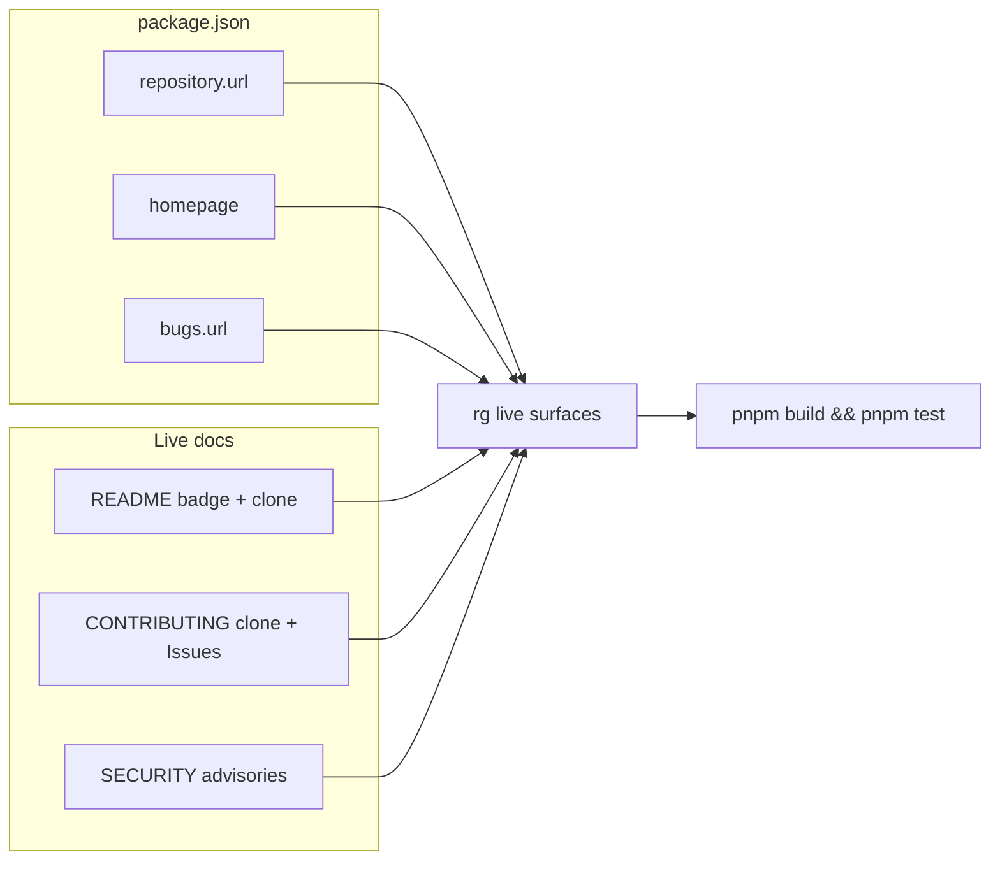

# Milestone 80 — GitHub Repo Identity Design

**Spec**: [`.specs/features/github-repo-identity/spec.md`](./spec.md)  
**Context**: [context.md](./context.md)  
**Status**: Planned

---

## Architecture Overview

Docs/metadata-only. No pipeline, CLI grammar, schemas, or scoring changes. Replace stale `taranti/hotspot-scanner` GitHub citations on four live surfaces with `AlanTaranti/hotspot-scanner`, and add `homepage` / `bugs` on `package.json`.

**Unchanged by design:** pipeline/`src/**` behavior, schemas, npm package `name` (M79), bin, config filename, `vitals-*` skill folders, historical Done feature prose, CI workflows.

---

## Code Reuse Analysis

### Existing Components to Leverage

| Component | Location | How to Use |
| --------- | -------- | ---------- |
| `repository` block | `package.json` | Update `url` only; keep `type: "git"` |
| Adoption clone / Issues patterns | README, CONTRIBUTING | Exact URL replace |
| Advisories wording | SECURITY.md | Exact URL replace (link + bare) |
| Shield badge pattern | README.md | Update encoded label + href |

### Integration Points

| System | Integration Method |
| ------ | ------------------ |
| `package.json` | Set `repository.url`, add `homepage` + `bugs` |
| npm publish | Out of scope — metadata only |
| Git remote (local) | Contributor verify note; no tracked remotes file |
| STACK.md | No edit unless wrong URL string appears (none today) |

---

## Components

### Package GitHub metadata

- **Purpose**: Canonical `repository` / `homepage` / `bugs` for tooling and npm consumers
- **Location**: `package.json`
- **Interfaces**: N/A (metadata)
- **Dependencies**: None
- **Reuses**: Existing `repository.type`; new fields follow npm conventions

### Live adoption / security docs

- **Purpose**: Working clone, badge, Issues, and advisory links
- **Location**: `README.md`, `CONTRIBUTING.md`, `SECURITY.md`
- **Interfaces**: N/A
- **Dependencies**: Same URL target as package metadata
- **Reuses**: Existing prose; string/badge replace only

---

## Data Models

None. No domain types or JSON contract `version` changes.

---

## Error Handling Strategy

| Error Scenario | Handling | User Impact |
| -------------- | -------- | ----------- |
| Leftover `taranti/hotspot-scanner` on live surfaces | T4 fails until empty | Block Done |
| Accidental rewrite of Done historical specs | Forbidden | Archive noise |
| Inventing CI workflows | Forbidden | Scope creep |
| Conflating npm `@taranti` with GitHub `AlanTaranti` | Locked distinct | Wrong “fix” |

Exit codes SoT unchanged.

---

## Risks

| Risk | Mitigation |
| ---- | ---------- |
| Incomplete live-surface replace | T4 scoped `rg` must be empty for old; hits for new |
| Over-eager historical / STACK / CI edits | Locked out of scope in context |
| Local `origin` still wrong after docs fix | Contributor note in T4 Done when (not a tracked file) |

---

## Tech Decisions (locked — do not re-open)

| Decision | Choice | Rationale |
| -------- | ------ | --------- |
| GitHub owner | `AlanTaranti` | Real remote |
| npm scope | Remains `@taranti` (M79) | Intentionally differs |
| Method | Exact string / badge replace + metadata fields | YAGNI; no architecture |
| Historical specs | Untouched | Archive SoT |
| Local remote | Verify note only | Not a repo file |
