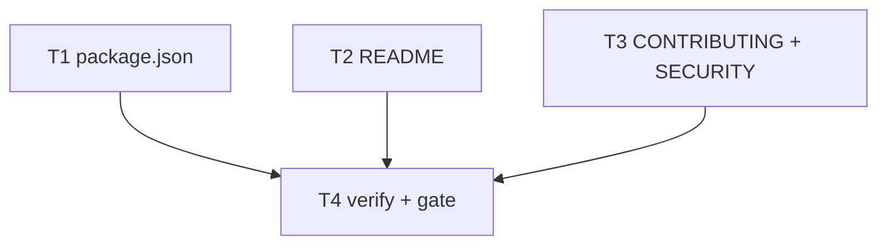

# Milestone 80 — GitHub Repo Identity Tasks

**Design**: [design.md](./design.md)  
**Spec**: [spec.md](./spec.md)  
**Context**: [context.md](./context.md)  
**Status**: Done  
**Note**: Medium feature — STOP at Planned; Execute in a separate session via `orchestrator-implementer` after Status promotion. Do **not** rewrite Done historical feature specs. Do **not** add CI workflows. Do **not** rename npm package scope (M79). Do **not** invent a tracked remotes file.

---

## Execution Plan

### Phase 1: Metadata + docs (parallel OK after no shared-file deps)

```
T1 [P] package.json metadata
T2 [P] README badge + clone
T3 [P] CONTRIBUTING + SECURITY
```

### Phase 2: Verify + gate

```
T1 + T2 + T3 → T4 rg live surfaces + project gate
```



### Diagram-Definition Cross-Check

| Task | Depends on (declared) | Diagram shows | Match |
| ---- | --------------------- | ------------- | ----- |
| T1 | None | Root `[P]` | yes |
| T2 | None | Root `[P]` | yes |
| T3 | None | Root `[P]` | yes |
| T4 | T1, T2, T3 | T1/T2/T3→T4 | yes |

### Path Conflict Check (Check 5)

| Task | Module owner | Paths (primary) | Conflict with parallel peers |
| ---- | ------------ | --------------- | ---------------------------- |
| T1 [P] | package root | `package.json` | None vs T2/T3 |
| T2 [P] | docs / README | `README.md` | None vs T1/T3 |
| T3 [P] | docs / contribute + security | `CONTRIBUTING.md`, `SECURITY.md` | None vs T1/T2 |
| T4 | gate | none (verify only) | After T1–T3 |

> **`[P]`:** T1, T2, T3 — path-disjoint.

### Test Co-location Validation

| Task | Code layer | Required tests (TESTING.md) | Co-located in task |
| ---- | ---------- | --------------------------- | ------------------ |
| T1 | package metadata | none | n/a |
| T2 | docs | none | n/a |
| T3 | docs | none | n/a |
| T4 | gate | full | `pnpm build && pnpm test` + `rg` |

### Granularity Check (Check 1)

| Task | Scope | Status |
| ---- | ----- | ------ |
| T1 | package.json repository + homepage + bugs | ✅ Granular |
| T2 | README badge + clone | ✅ Granular |
| T3 | CONTRIBUTING + SECURITY URLs (one GitHub-identity docs concern) | ✅ OK cohesive |
| T4 | verify-only | ✅ Granular |

---

## Requirement → Task Mapping

| IDs | Task |
| --- | ---- |
| HOTSPOT-1720, HOTSPOT-1721 | T1 |
| HOTSPOT-1722 | T2 |
| HOTSPOT-1723, HOTSPOT-1724 | T3 |
| HOTSPOT-1725 | T4 |
| HOTSPOT-1726–1729 | Reserved unused |

---

## Tasks

### T1: package.json GitHub metadata [P]

**What:** Set `repository.url` to `git+https://github.com/AlanTaranti/hotspot-scanner.git`. Add `homepage`: `https://github.com/AlanTaranti/hotspot-scanner` and `bugs`: `{ "url": "https://github.com/AlanTaranti/hotspot-scanner/issues" }`. Do not change `"name"`, bin, exports, or imports (npm rename is M79).  
**Where:** `package.json`  
**Reuses:** Existing `repository.type: "git"`  
**Done when:**

- [x] `repository.url` is `git+https://github.com/AlanTaranti/hotspot-scanner.git`
- [x] `homepage` and `bugs.url` match the locked AlanTaranti URLs
- [x] `"name"` / bin / exports untouched by this task

**Tests:** none  
**Gate:** none beyond review (project gate in T4)  
**Depends on:** None  
**Requirement:** HOTSPOT-1720, HOTSPOT-1721

---

### T2: README badge + clone [P]

**What:** Update the GitHub badge label (`AlanTaranti%2Fhotspot-scanner`) and href, and the Installation clone URL, to `AlanTaranti/hotspot-scanner`.  
**Where:** `README.md`  
**Reuses:** Existing badge + clone prose  
**Done when:**

- [x] Badge label and href use AlanTaranti (no `taranti/hotspot-scanner` in README GitHub badge/clone)
- [x] Clone URL is `https://github.com/AlanTaranti/hotspot-scanner.git`

**Tests:** none  
**Gate:** none beyond review (project gate in T4)  
**Depends on:** None  
**Requirement:** HOTSPOT-1722

---

### T3: CONTRIBUTING + SECURITY GitHub URLs [P]

**What:** Replace clone and Issues URLs in CONTRIBUTING, and both Security Advisories citations in SECURITY, with `AlanTaranti/hotspot-scanner` targets.  
**Where:** `CONTRIBUTING.md`, `SECURITY.md`  
**Reuses:** Existing wording; exact URL replace  
**Done when:**

- [x] CONTRIBUTING clone + Issues use AlanTaranti
- [x] SECURITY advisory link and bare URL use AlanTaranti
- [x] No `github.com/taranti/hotspot-scanner` left in those two files

**Tests:** none  
**Gate:** none beyond review (project gate in T4)  
**Depends on:** None  
**Requirement:** HOTSPOT-1723, HOTSPOT-1724

---

### T4: Live-surface verify + project gate

**What:** Prove the four live surfaces have zero old GitHub owner path, intended AlanTaranti hits, and the project gate is green. Contributor note only: ensure local `origin` points at AlanTaranti (do not add a tracked remotes file). Do not rewrite historical Done specs if `rg` finds old URLs outside the four surfaces.  
**Where:** repo root (verify only — leftover cleanup only on the four live surfaces if a hit was missed)  
**Reuses:** Project gate; `rg`  
**Done when:**

- [x] `rg 'github.com/taranti/hotspot-scanner' README.md CONTRIBUTING.md SECURITY.md package.json` → empty
- [x] `rg 'github.com/AlanTaranti/hotspot-scanner' README.md CONTRIBUTING.md SECURITY.md package.json` → hits all intended places
- [x] Local `git remote get-url origin` points at AlanTaranti (contributor note; not a file change)
- [x] `pnpm build && pnpm test` exits 0

**Tests:** full suite via project gate  
**Gate:** `pnpm build && pnpm test`  
**Depends on:** T1, T2, T3  
**Requirement:** HOTSPOT-1725  
**Verify:**

```bash
rg 'github.com/taranti/hotspot-scanner' README.md CONTRIBUTING.md SECURITY.md package.json || true   # expect no matches
rg 'github.com/AlanTaranti/hotspot-scanner' README.md CONTRIBUTING.md SECURITY.md package.json
git remote get-url origin   # expect AlanTaranti/hotspot-scanner
pnpm build && pnpm test
```

---

## Suggested execution order

1. T1 ∥ T2 ∥ T3  
2. T4 (verify + gate)
