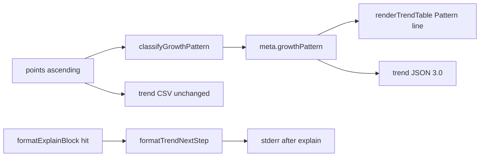

# Milestone 75 — Growth Pattern + Trend Bridge Design

**Spec**: [spec.md](./spec.md)  
**Context**: [context.md](./context.md)  
**Status**: Approved for planning (locked decisions)  
**Depth**: Large  
**Design SoT**: [ARCHITECTURE.md](../../codebase/ARCHITECTURE.md)

---

## Architecture Overview

M75 extends two existing surfaces without a new scan stage:

```text
trend:  … → points → classifyGrowthPattern → meta.growthPattern → table/json
scan:   … → explain hit → stderr "next: hotspot-scanner trend <path>"
```



**Hard boundaries:**

- Do **not** mutate scan JSON `3.0` or reopen compare/baseline
- Do **not** add `--classify` or fail-on pattern gates
- Do **not** run historical trend inside `runScan`
- Classification is pure over already-built `points` (post-sample)

---

## Code Reuse Analysis

| Pattern | Location | How to use |
| ------- | -------- | ---------- |
| Trend orchestration | `src/trend/run-trend.ts` | Attach `growthPattern` when building meta |
| Trend types | `src/trend/types.ts` | Add `GrowthPattern` + bump `version: "3.0"` |
| Table reporter | `src/report/trend-table.ts` | Pattern line above sparklines |
| CSV reporter | `src/report/trend-csv.ts` | Leave row schema unchanged |
| Explain | `src/report/explain.ts` | Add `formatTrendNextStep(filePath)` or append in formatter |
| CLI explain write | `bin/hotspot-scanner.ts` `writeExplainBlock` | Emit next-step after hit |
| Contract tests | `tests/contract/` | Bump complexity-trend fixtures to `3.0` |
| Quiet / explain compose | bin scan action path | Suppress next-step with explain under `--quiet` |

---

## Components

### 1. `classifyGrowthPattern` (pure)

- **Purpose**: Tornhill growth-pattern label + evidence
- **Location**: `src/trend/classify.ts` + `classify.test.ts`
- **Interface**:

```ts
export type GrowthPatternKind =
  | "deteriorating"
  | "refactored"
  | "stable"
  | "inconclusive";

export type GrowthPattern = {
  kind: GrowthPatternKind;
  summary: string;
  /** Relative indentMean change first→last (end-start)/max(start, floor) */
  indentMeanDeltaRel?: number;
  /** Relative ncloc change first→last */
  nclocDeltaRel?: number;
  peakRev?: string;
};

export const MIN_POINTS = 5;
export const STABLE_REL_RANGE = 0.08;
export const STABLE_FLOOR = 0.01;
export const REFACTOR_DROP = 0.18;
export const DETERIORATE_RISE = 0.10;

export function classifyGrowthPattern(
  points: ReadonlyArray<Pick<ComplexityTrendPoint, "rev" | "indentMean" | "ncloc">>,
): GrowthPattern;
```

- **Algorithm** (locked in context):
  1. If `points.length < MIN_POINTS` → `inconclusive`
  2. Compute min/max/`first`/`last` of `indentMean`; relative range = `(max-min)/max(max, STABLE_FLOOR)`
  3. Find peak index (first max if ties); if peak not last and `(peak-end)/max(peak, STABLE_FLOOR) >= REFACTOR_DROP` → `refactored` + `peakRev`
  4. Else if `(last-first)/max(first, STABLE_FLOOR) >= DETERIORATE_RISE` → `deteriorating` (summary mentions whether mean rose faster than ncloc when ncloc deltas computable)
  5. Else if relative range ≤ `STABLE_REL_RANGE` → `stable`
  6. Else → `inconclusive`
- **Dependencies**: none (pure)
- **Reuses**: metric names from trend points only

### 2. Orchestration + types + schema

- **Purpose**: Always attach classification; bump contract
- **Locations**:
  - `src/trend/types.ts` — `version: "3.0"`; `meta.growthPattern: GrowthPattern`
  - `src/trend/run-trend.ts` — after points built, `growthPattern = classifyGrowthPattern(points)`; if `truncated`, optionally append ` (sampled history)` to summary without changing kind
  - `src/trend/index.ts` — re-export classify + constants if public API desired (export `classifyGrowthPattern` from package if `runComplexityTrend` is already public — mirror existing export style)
  - `schemas/complexity-trend.json` — `version` const `"3.0"`; `$defs/GrowthPattern`; require `growthPattern` in meta
  - Contract fixtures under `tests/contract/` + any golden JSON under fixtures
- **Dependencies**: classify, existing run-trend pipeline

### 3. Table reporter

- **Purpose**: Human Pattern line
- **Location**: `src/report/trend-table.ts` (+ test)
- **Behavior**: After legend / before sparklines:

```text
Pattern: deteriorating — indentMean +24% vs ncloc +3%
indent_mean ▁▂▃▄▅▆▇█
ncloc       ▃▃▄▄▅▅▆▇
```

- Exact summary text owned by classifier; table only prefixes `Pattern: ${kind} — ${summary}` or if summary already self-contained, `Pattern: ${summary}` — **prefer** `Pattern: ${kind} — ${summary}` with summary free of repeating the kind word when practical
- **CSV**: no change

### 4. Explain next-step

- **Purpose**: Workflow bridge
- **Location**: Prefer pure helper in `src/report/explain.ts`:

```ts
export function formatTrendNextStep(filePath: string): string {
  return `next: hotspot-scanner trend ${normalizeMatchKey(filePath)}`;
}
```

- **Wiring**: `writeExplainBlock` in `bin/hotspot-scanner.ts`: after writing explain block, if `explainTargetFound`, also write `formatTrendNextStep(matchedPath)` with trailing newline. Matched path = normalized target `filePath` (already repo-relative after `normalizeExplainTarget`).
- **Quiet**: Existing quiet path that skips explain must skip next-step (same `if (explainTarget)` / quiet guard — do not invent a separate flag)
- **Miss**: write only not-found message; no next-step

### 5. Docs

- **Locations**: `docs/recipes.md`, README, `.specs/codebase/ARCHITECTURE.md`, `CONCERNS.md`, `STRUCTURE.md`, brief skill mentions in `vitals-pipeline-domain` / `vitals-cli-validation` if they document trend
- **Content**: cookbook + three-curve glossary; formatter cliff caveat in CONCERNS (extend M72 trend section)

---

## Data Model

```ts
// ComplexityTrendResult.version: "3.0"
meta: {
  // …existing fields…
  growthPattern: GrowthPattern; // required
}
```

Breaking for trend JSON consumers on `version` const (expected minor/major bump already reserved for additive trend evolution). Scan untouched.

---

## Error / edge handling

| Case | Behavior |
| ---- | -------- |
| Empty history | `growthPattern.kind = inconclusive`; trend still exit `0` |
| Truncated sample | Classify sample; optional summary suffix |
| Formatter cliff | Document only |
| Explain miss | No next-step |
| Quiet | No explain, no next-step |

---

## Risks

| Risk | Mitigation |
| ---- | ---------- |
| Heuristic false positives | `inconclusive` band; docs; no fail-on |
| ID / milestone collision with M73 top-only | This feature is **M75**; IDs 1540+ |
| Trend JSON breaking `2.0` | Document bump in README/recipes; update contract tests |
| Quiet/explain compose regressions | Extend existing CLI explain tests |

---

## Testing Strategy

| Layer | What |
| ----- | ---- |
| Unit | `classify.test.ts` — short, flat, rising, peak-drop, mixed |
| Unit | `trend-table` Pattern line; explain `formatTrendNextStep` |
| Contract | Ajv `complexity-trend.json` `3.0` |
| Integration/CLI | `trend` fixture asserts `meta.growthPattern`; scan `--explain` stderr `next:` |
| Regression | CSV header unchanged; explain miss without `next:`; scan schema still `3.0` |

---

## Living docs (Execute)

- ARCHITECTURE — trend growthPattern + explain next-step
- CONCERNS — classification false cliffs / formatter
- STRUCTURE — `src/trend/classify.ts`
- README + recipes — workflow + glossary
- ROADMAP/STATE — Done sync at end of Execute (planning sets Specs Planned)
