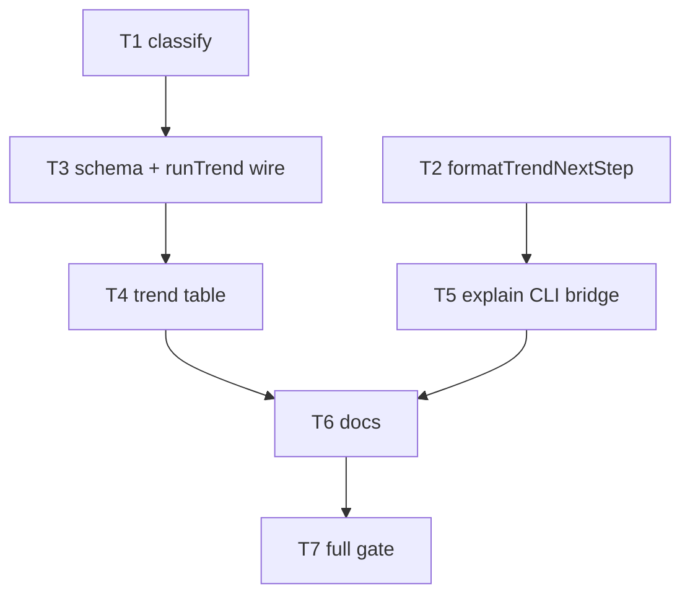

# Milestone 75 — Growth Pattern + Trend Bridge Tasks

**Design**: [design.md](./design.md)  
**Spec**: [spec.md](./spec.md)  
**Context**: [context.md](./context.md)  
**Status**: Done

---

## Execution Plan

### Phase 1: Classify (parallel-safe with explain helper)

```
T1 classifyGrowthPattern
T2 formatTrendNextStep          [P] with T1
```

### Phase 2: Trend contract + reporters

```
T1 → T3 types + schema 3.0 + runComplexityTrend wire
T3 → T4 table Pattern line (+ CSV regression)
```

### Phase 3: Explain bridge + CLI

```
T2 → T5 explain next-step wiring + CLI tests
```

### Phase 4: Docs + gate

```
T4 + T5 → T6 living docs + recipes/README
T6 → T7 full project gate
```



### Diagram-Definition Cross-Check

| Task | Depends on (declared) | Diagram shows | Match |
| ---- | --------------------- | ------------- | ----- |
| T1 | None | Root | yes |
| T2 | None | Root | yes |
| T3 | T1 | T1→T3 | yes |
| T4 | T3 | T3→T4 | yes |
| T5 | T2 | T2→T5 | yes |
| T6 | T4, T5 | T4/T5→T6 | yes |
| T7 | T6 | T6→T7 | yes |

### Path Conflict Check (Check 5)

| Task | Module owner | Paths (primary) | Conflict with parallel peers |
| ---- | ------------ | --------------- | ---------------------------- |
| T1 | `src/trend/` | `classify.ts` + test | None vs T2 |
| T2 | `src/report/` | `explain.ts` + test (next-step helper only) | None vs T1 |
| T3 | `src/trend/` + `schemas/` | `types.ts`, `run-trend.ts`, `index.ts`, `complexity-trend.json`, contract tests | After T1 |
| T4 | `src/report/` | `trend-table.ts` (+ csv regression test) | After T3; not parallel with T5 if both touch explain — T4 does not touch explain |
| T5 | `bin/` + `src/report/` | `hotspot-scanner.ts` wiring; explain tests / CLI tests | After T2; may touch `explain.ts` only if T2 left stub — prefer T2 complete before T5 |
| T6 | docs | README, recipes, ARCHITECTURE, CONCERNS, STRUCTURE, skills | After T4+T5 |
| T7 | gate | none (run only) | After T6 |

> **[P]**: T1 and T2 only.

### Test Co-location Validation

| Task | Code layer | Required tests (TESTING.md) | Co-located in task |
| ---- | ---------- | --------------------------- | ------------------ |
| T1 | `src/trend/classify.ts` | unit | yes — `classify.test.ts` |
| T2 | `src/report/explain.ts` | unit | yes — extend `explain.test.ts` |
| T3 | trend run + schema | unit + contract | yes — run-trend tests + contract |
| T4 | trend-table | unit | yes — table tests |
| T5 | bin CLI | CLI / integration | yes — hotspot-scanner.test explain/trend |
| T6 | docs | none | n/a |
| T7 | gate | full | `pnpm build && pnpm test` |

---

## Requirement → Task Mapping

| IDs | Task |
| --- | ---- |
| HOTSPOT-1540, HOTSPOT-1541, HOTSPOT-1542, HOTSPOT-1543 | T1 |
| HOTSPOT-1549 (helper string shape) | T2 |
| HOTSPOT-1544, HOTSPOT-1545, HOTSPOT-1546 | T3 |
| HOTSPOT-1547, HOTSPOT-1548 | T4 |
| HOTSPOT-1549, HOTSPOT-1550, HOTSPOT-1551 | T5 |
| HOTSPOT-1552, HOTSPOT-1553, HOTSPOT-1554 | T6 |
| all HOTSPOT-1540–1554 | T7 verification |
| HOTSPOT-1555–1569 | Buffer unused |
| HOTSPOT-1570–1599 | Reserved |

---

## Tasks

### T1: classifyGrowthPattern

**What:** Implement pure growth-pattern classifier with locked constants (`MIN_POINTS`, `STABLE_REL_RANGE`, `STABLE_FLOOR`, `REFACTOR_DROP`, `DETERIORATE_RISE`) and priority order from [context.md](./context.md) / [design.md](./design.md).  
**Where:** `src/trend/classify.ts`, `src/trend/classify.test.ts`, re-export from `src/trend/index.ts` if needed for later tasks  
**Reuses:** `ComplexityTrendPoint` field picks only  
**Done when:**

- [x] Synthetic series: short → inconclusive; flat → stable; rising → deteriorating; peak-then-drop → refactored (+ `peakRev`)
- [x] Mixed/weak → inconclusive
- [x] No AST imports

**Tests:** `classify.test.ts`  
**Gate:** `pnpm test -- src/trend/classify.test.ts`  
**Depends on:** None  
**Requirement IDs:** HOTSPOT-1540, HOTSPOT-1541, HOTSPOT-1542, HOTSPOT-1543

---

### T2: formatTrendNextStep helper

**What:** Add pure `formatTrendNextStep(filePath)` returning `next: hotspot-scanner trend <posix-normalized-path>`.  
**Where:** `src/report/explain.ts`, `src/report/explain.test.ts`  
**Reuses:** Existing path normalize helpers in explain module  
**Done when:**

- [x] Unit asserts exact prefix and path normalization (`./` stripped)
- [x] No CLI wiring yet (T5)

**Tests:** extend `explain.test.ts`  
**Gate:** `pnpm test -- src/report/explain.test.ts`  
**Depends on:** None  
**Requirement IDs:** HOTSPOT-1549 (partial — string shape)

---

### T3: Wire runComplexityTrend + schema 3.0

**What:** Bump `ComplexityTrendResult.version` to `"3.0"`; require `meta.growthPattern`; call `classifyGrowthPattern` in `runComplexityTrend`; update `schemas/complexity-trend.json` + contract fixtures; keep scan schema at `"3.0"`. Optionally append sampled-history note to summary when `truncated`.  
**Where:** `src/trend/types.ts`, `src/trend/run-trend.ts`, `src/trend/run-trend.test.ts`, `schemas/complexity-trend.json`, `tests/contract/**`, any trend golden JSON  
**Reuses:** T1 classifier  
**Done when:**

- [x] Every result includes `meta.growthPattern`
- [x] Ajv accepts `3.0` fixtures; rejects stale `2.0` const if tests assert const
- [x] Scan contract tests still pass at `3.0` scan

**Tests:** run-trend unit + contract  
**Gate:** `pnpm test -- src/trend/run-trend.test.ts tests/contract`  
**Depends on:** T1  
**Requirement IDs:** HOTSPOT-1544, HOTSPOT-1545, HOTSPOT-1546

---

### T4: Table Pattern line + CSV regression

**What:** Render `Pattern: <kind> — <summary>` above sparklines in `renderTrendTable`; assert CSV headers unchanged (no pattern column).  
**Where:** `src/report/trend-table.ts`, trend table tests, trend CSV tests if present  
**Reuses:** `meta.growthPattern` from T3  
**Done when:**

- [x] Table contains Pattern line above `indent_mean` sparkline
- [x] CSV header list unchanged

**Tests:** report unit tests  
**Gate:** `pnpm test -- src/report/trend`  
**Depends on:** T3  
**Requirement IDs:** HOTSPOT-1547, HOTSPOT-1548

---

### T5: Explain → trend CLI bridge

**What:** On explain hit, write `formatTrendNextStep` to stderr after explain block; miss has no `next:`; quiet suppresses both; exit codes unchanged.  
**Where:** `bin/hotspot-scanner.ts` (`writeExplainBlock` or adjacent), `bin/hotspot-scanner.test.ts`  
**Reuses:** T2 helper; existing explain compose / quiet  
**Done when:**

- [x] CLI hit: stderr matches `/next: hotspot-scanner trend /`
- [x] CLI miss: no `next: hotspot-scanner trend`
- [x] JSON stdout still clean; fail-on-explain-miss behavior unchanged

**Tests:** CLI tests in `bin/hotspot-scanner.test.ts`  
**Gate:** `pnpm test -- bin/hotspot-scanner.test.ts`  
**Depends on:** T2  
**Requirement IDs:** HOTSPOT-1549, HOTSPOT-1550, HOTSPOT-1551

---

### T6: Living docs + recipes

**What:** Recipes cookbook scan→explain→trend + Tornhill curve glossary; README brief; ARCHITECTURE / CONCERNS (formatter cliff) / STRUCTURE (`classify.ts`); skill one-liners if trend UX listed; ROADMAP/STATE Done sync deferred to T7/Execute closeout (this task updates living codebase docs; final ROADMAP checkbox Done happens when Execute finishes — for planning, task lists the doc files).  
**Where:** `docs/recipes.md`, `README.md`, `.specs/codebase/ARCHITECTURE.md`, `CONCERNS.md`, `STRUCTURE.md`, `.cursor/skills/vitals-pipeline-domain/SKILL.md` and/or `vitals-cli-validation` as needed  
**Done when:**

- [x] Recipe + glossary present
- [x] CONCERNS notes classification false cliffs / Prettier
- [x] STRUCTURE lists `classify.ts`

**Tests:** none (doc review)  
**Gate:** doc paths exist / grep  
**Depends on:** T4, T5  
**Requirement IDs:** HOTSPOT-1552, HOTSPOT-1553, HOTSPOT-1554

---

### T7: Full project gate

**What:** Run final quality gate; mark tasks Complete; sync ROADMAP M75 → Done and STATE Active row.  
**Where:** repo root  
**Done when:**

- [x] `pnpm build && pnpm test` PASS
- [x] ROADMAP/STATE reflect M75 Done
- [x] `tasks.md` Status → Done

**Tests:** full suite  
**Gate:** `pnpm build && pnpm test`  
**Depends on:** T6  
**Requirement IDs:** HOTSPOT-1540–1554 (verification)

---

## Notes for Execute

- Promote Status to `Approved` / `Ready for Execute` before `orchestrator-implementer`.
- Do not reopen M71 compare/baseline.
- M73 (`top-only-rollups`) and M74 (`doctor-color-ux`) are separate Planned features — do not merge scopes.
