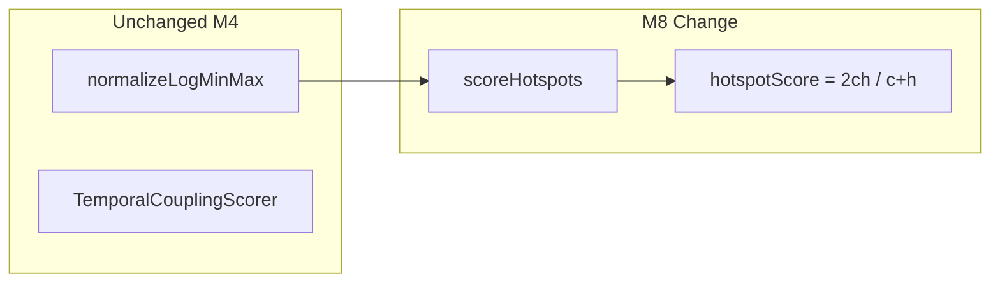

# Milestone 8 — Harmonic Hotspot Score Design

**Spec**: [`.specs/features/harmonic-hotspot-score/spec.md`](./spec.md)  
**Status**: Done

---

## Architecture Overview

M8 changes only the hotspot score combiner in `scoreHotspots()`. Normalization (`normalizeLogMinMax`), coupling scoring, pipeline wiring, CLI, and report schema are unchanged.



**Baseline:** [`.specs/features/scoring/design.md`](../scoring/design.md) — M4 scoring architecture.  
**ROADMAP:** M8 Harmonic Hotspot Score.

---

## Code Reuse Analysis

### Existing Components to Leverage

| Component              | Location                         | How to Use                                  |
| ---------------------- | -------------------------------- | ------------------------------------------- |
| `normalizeLogMinMax`   | `src/scoring/normalize.ts`       | Unchanged — apply before combiner           |
| `scoreHotspots`        | `src/scoring/hotspot-scorer.ts`  | Replace combiner line only                  |
| `compareHotspotScores` | `src/scoring/hotspot-scorer.ts`  | Unchanged — sort desc, `filePath` tie-break |
| `createHotspotScorer`  | `src/scoring/index.ts`           | Unchanged factory                           |
| `hotspot-ranking.json` | `tests/fixtures/scoring/`        | Update `expectedOrder` after formula change |
| Integration fixture    | `tests/fixtures/repos/small-ts/` | Verify top hotspot remains `src/high.ts`    |

### Integration Points

| Consumer                 | Impact                                                 |
| ------------------------ | ------------------------------------------------------ |
| `src/scan.ts`            | None — calls `createHotspotScorer().score()` unchanged |
| `src/report/table.ts`    | None — displays `hotspotScore` value only              |
| `src/report/json.ts`     | None — schema unchanged; numeric values differ         |
| `bin/hotspot-scanner.ts` | None                                                   |

---

## Formula

### Unchanged: normalization

```
transformed[i] = log1p(raw[i])
normalized[i] = (transformed[i] - min) / (max - min)   // when max > min
normalized[i] = 0                                       // when max === min
```

Applied independently to complexity and churn before combiner (M4 decision).

### Changed: hotspot combiner (`hotspot-scorer.ts`)

**Before (M4):**

```
hotspotScore = complexityNormalized × churnNormalized
```

**After (M8):**

```
c = complexityNormalized
h = churnNormalized
hotspotScore = (c + h === 0) ? 0 : (2 × c × h) / (c + h)
```

Properties for `c, h ∈ [0, 1]`:

| Case               | Result                                   |
| ------------------ | ---------------------------------------- |
| `c = h = x > 0`    | `hotspotScore = x`                       |
| `c = 0` or `h = 0` | `hotspotScore = 0`                       |
| `c ≠ h`, both > 0` | `hotspotScore < c × h` (spiky penalized) |

Example: `(c=1, h=0.1)` → product `0.1`, harmonic `≈0.18`; `(c=0.6, h=0.6)` → product `0.36`, harmonic `0.6` → balanced wins.

### Unchanged: sorting

- Sort: `hotspotScore` desc, then `filePath` asc

---

## Components

### Hotspot scorer (`src/scoring/hotspot-scorer.ts`)

- **Purpose**: Join complexity + churn, normalize, compute harmonic scores, sort.
- **Location**: `src/scoring/hotspot-scorer.ts`
- **Delta**: Replace step 4 in M4 algorithm:

```typescript
const c = complexityNormalized[index]!;
const h = churnNormalized[index]!;
hotspotScore = c + h === 0 ? 0 : (2 * c * h) / (c + h);
```

- **YAGNI**: Do not extract `harmonicMean()` helper — inline in `.map()` unless tests require reuse.
- **Dependencies**: `normalize.ts`, `src/types/` (unchanged)
- **Reuses**: `HotspotScore`, `ComplexityResult`, `FileChangeStats`, `compareHotspotScores`

---

## Test Impact

| File                                          | Change                                                                     |
| --------------------------------------------- | -------------------------------------------------------------------------- |
| `src/scoring/hotspot-scorer.test.ts`          | Rename "product" test → harmonic formula; add balanced-vs-spiky case       |
| `tests/fixtures/scoring/hotspot-ranking.json` | Recalculate `expectedOrder`; update `_comment`                             |
| `src/scan.integration.test.ts`                | Verify `EXPECTED_TOP_HOTSPOT = "src/high.ts"` (likely no-op)               |
| `README.md`                                   | Update example scores (e.g. `c=1, h=0.75` → harmonic `≈0.857`, not `0.75`) |

**Do not change:**

- `src/scoring/coupling-scorer.ts`
- `src/scoring/normalize.ts`
- `src/report/` (schema unchanged; `sample-result.json` scores are arbitrary for layout tests)
- `bin/hotspot-scanner.ts`

---

## Risks

| Risk                                   | Mitigation                                                                               |
| -------------------------------------- | ---------------------------------------------------------------------------------------- |
| Silent ranking reorder                 | Fixture `hotspot-ranking.json` + balanced-vs-spiky unit test                             |
| Stale docs referencing product formula | T4 doc sync checklist (STATE, CONCERNS, README, fragile-areas, pipeline-domain, PROJECT) |
| Integration top-hotspot changes        | Assert `src/high.ts` in `scan.integration.test.ts`; adjust only if data proves otherwise |

---

## Documentation Sync Targets

| File                                             | Update                                                    |
| ------------------------------------------------ | --------------------------------------------------------- |
| `.specs/project/STATE.md`                        | New decision row: harmonic combiner + rationale           |
| `.specs/codebase/CONCERNS.md`                    | Scoring formula row                                       |
| `.specs/project/PROJECT.md`                      | Goals line                                                |
| `README.md`                                      | Example table/JSON scores                                 |
| `.cursor/rules/fragile-areas.mdc`                | Scoring formula                                           |
| `.cursor/skills/vitals-pipeline-domain/SKILL.md` | Scoring formula                                           |
| `.specs/project/ROADMAP.md`                      | Link spec; mark implementation checkboxes on Execute Done |
