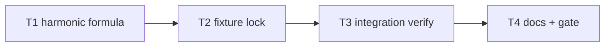

# Milestone 8 — Harmonic Hotspot Score Tasks

**Design**: [`.specs/features/harmonic-hotspot-score/design.md`](./design.md)  
**Spec**: [`.specs/features/harmonic-hotspot-score/spec.md`](./spec.md)  
**Status**: Planned

---

## Execution Plan

### Phase 1: Formula (Sequential)

```
T1 harmonic formula + unit tests
```

### Phase 2: Fixture lock (Sequential)

```
T1 → T2 hotspot-ranking fixture
```

### Phase 3: Integration verify (Sequential)

```
T2 → T3 integration invariant
```

### Phase 4: Docs + gate (Sequential)

```
T3 → T4 documentation sync + project gate
```



### Diagram-Definition Cross-Check

| Task | Depends on (declared) | Appears in diagram after deps | Match |
| ---- | --------------------- | ----------------------------- | ----- |
| T1 | None | Root | ✅ |
| T2 | T1 | T1 → T2 | ✅ |
| T3 | T2 | T2 → T3 | ✅ |
| T4 | T3 | T3 → T4 | ✅ |

### Test Co-location Validation

| Task | Code layer | TESTING.md expectation | Tests in same task | Match |
| ---- | ---------- | ---------------------- | ------------------ | ----- |
| T1 | `src/scoring/hotspot-scorer.ts` | Unit required | `hotspot-scorer.test.ts` update | ✅ |
| T2 | `tests/fixtures/scoring/` | Unit via fixture test | `hotspot-scorer.test.ts` fixture case | ✅ |
| T3 | `src/scan.ts` integration | Integration | `scan.integration.test.ts` verify | ✅ |
| T4 | Docs only | Gate | `pnpm build && pnpm test` | ✅ |

---

## Task Breakdown

### T1: Harmonic formula + unit tests

**What**: Replace product combiner with harmonic mean `2ch/(c+h)` and zero guard in `scoreHotspots()`. Update unit tests: rename product assertion to harmonic formula; add balanced-vs-spiky ranking test; preserve tie-break and zero-churn cases.

**Where**: `src/scoring/hotspot-scorer.ts`, `src/scoring/hotspot-scorer.test.ts`

**Depends on**: None

**Reuses**: [design.md](./design.md) § Formula; M4 `normalizeLogMinMax`, `compareHotspotScores`

**Requirement**: HOTSPOT-69, HOTSPOT-70, HOTSPOT-71, HOTSPOT-72

**Tools**:

- MCP: NONE
- Skill: `vitals-pipeline-domain`

**Done when**:

- [ ] `hotspotScore = (2 × c × h) / (c + h)` when `c + h > 0`
- [ ] `hotspotScore = 0` when `c + h === 0`
- [ ] Balanced file ranks above spiky file in dedicated test
- [ ] Sort `hotspotScore` desc, `filePath` asc on tie preserved
- [ ] Missing `fileStats` and zero churn still produce score `0`
- [ ] `src/scoring/**` ≥80% line coverage maintained

**Tests**: `hotspot-scorer.test.ts` — harmonic formula, zero guard, balanced-vs-spiky, tie-break, single-file degenerate, missing churn

**Gate**: `pnpm exec vitest run src/scoring/hotspot-scorer.test.ts`

---

### T2: Fixture regression lock

**What**: Recalculate `expectedOrder` in `hotspot-ranking.json` under harmonic formula. Update `_comment` to document harmonic combiner and new order.

**Where**: `tests/fixtures/scoring/hotspot-ranking.json`

**Depends on**: T1

**Reuses**: T1 `scoreHotspots`; existing fixture structure

**Requirement**: HOTSPOT-73

**Tools**:

- MCP: NONE
- Skill: NONE

**Done when**:

- [ ] `hotspot-ranking.json` `_comment` references harmonic formula
- [ ] `expectedOrder` matches `scoreHotspots` output on fixture inputs
- [ ] Fixture test in `hotspot-scorer.test.ts` passes

**Tests**: `hotspot-scorer.test.ts` — "matches fixture expected ranking order"

**Gate**: `pnpm exec vitest run src/scoring/hotspot-scorer.test.ts`

---

### T3: Integration invariant

**What**: Run integration test on `small-ts` fixture. Confirm `src/high.ts` remains top hotspot. Adjust `EXPECTED_TOP_HOTSPOT` or fixture README only if harmonic reordering changes top file (expected: no change).

**Where**: `src/scan.integration.test.ts` (adjust only if needed)

**Depends on**: T2

**Reuses**: `tests/fixtures/repos/small-ts/`; existing integration test

**Requirement**: HOTSPOT-74

**Tools**:

- MCP: NONE
- Skill: `vitals-cli-validation`

**Done when**:

- [ ] `runScan({ repoPath: small-ts })` returns non-empty hotspots and coupling
- [ ] `hotspots[0].filePath` is `src/high.ts`
- [ ] Integration test passes without weakening assertions

**Tests**: `scan.integration.test.ts` — top hotspot assertion

**Gate**: `pnpm exec vitest run src/scan.integration.test.ts`

---

### T4: Documentation sync + project gate

**What**: Record harmonic combiner decision in STATE.md. Update formula references in CONCERNS.md, README.md, fragile-areas.mdc, vitals-pipeline-domain skill, PROJECT.md. Mark ROADMAP M8 implementation checkboxes done. Run full project gate.

**Where**: `.specs/project/STATE.md`, `.specs/codebase/CONCERNS.md`, `README.md`, `.cursor/rules/fragile-areas.mdc`, `.cursor/skills/vitals-pipeline-domain/SKILL.md`, `.specs/project/PROJECT.md`, `.specs/project/ROADMAP.md`

**Depends on**: T3

**Reuses**: [design.md](./design.md) § Documentation Sync Targets

**Requirement**: HOTSPOT-75

**Tools**:

- MCP: NONE
- Skill: NONE

**Done when**:

- [ ] STATE.md has harmonic combiner decision with date and rationale
- [ ] All listed docs reference `2ch / (c + h)` instead of product formula
- [ ] ROADMAP M8 implementation checkboxes marked `[x]`
- [ ] `pnpm build && pnpm test` passes

**Tests**: Doc grep for stale `×` product formula in listed files; full gate

**Gate**: `pnpm build && pnpm test`

---

## Requirement Traceability (Tasks)

| Requirement ID | Tasks |
| -------------- | ----- |
| HOTSPOT-69 | T1 |
| HOTSPOT-70 | T1 |
| HOTSPOT-71 | T1 |
| HOTSPOT-72 | T1 |
| HOTSPOT-73 | T2 |
| HOTSPOT-74 | T3 |
| HOTSPOT-75 | T4 |

**Coverage:** 7 total, 7 mapped to tasks, 0 unmapped
