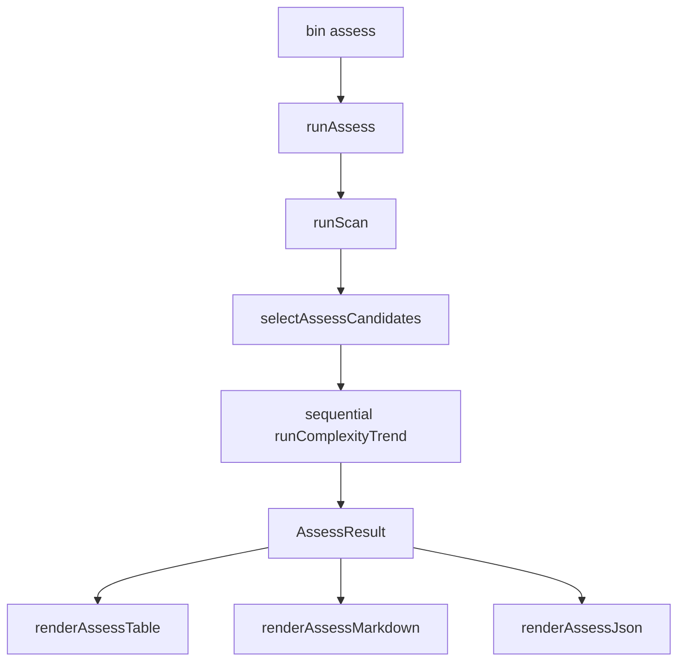

# Milestone 77 — Hotspot Assess Design

**Spec**: [spec.md](./spec.md)  
**Context**: [context.md](./context.md)  
**Status**: Approved for planning (locked decisions)  
**Depth**: Large  
**Design SoT**: [ARCHITECTURE.md](../../codebase/ARCHITECTURE.md)

---

## Architecture Overview

New sibling command and library entry — **does not** add a scan stage or mutate scan/trend JSON contracts.

```text
CLI assess → runAssess → runScan → filter/top → runComplexityTrend × N (sequential)
           → AssessResult → table | markdown | json
```



**Hard boundaries:**

- Do **not** change scan JSON `3.0` or complexity-trend `3.0`
- Do **not** reopen compare/baseline
- Do **not** embed full trend `points` in assess JSON
- Do **not** block on M76 color
- Do **not** add `--fail-on-deteriorating` in MVP

---

## Code Reuse Analysis

| Pattern | Location | How to use |
| ------- | -------- | ---------- |
| Scan orchestration | `src/scan.ts` `runScan` | First stage; pass scan options + cancel signal |
| Config merge | `src/config/` via `runScan` | since/include/exclude/top/concurrency as today |
| Trend + classify | `src/trend/run-trend.ts` | Per candidate; `meta.growthPattern` already attached (M75) |
| GrowthPattern type | `src/trend/classify.ts` / `types.ts` | Reuse type in assess candidate rows |
| Cancel / quiet / warnings | `bin/scan-actions.ts` | `runWithScanCancelSignals`, diagnostic handlers patterns |
| Trend CLI actions | `bin/trend-actions.ts` | Mirror structure as `bin/assess-actions.ts` |
| Report purity | `src/report/` | Pure renderers; file I/O in bin only |
| Contract tests | `tests/contract/json-schema.test.ts` | Add hotspot-assess fixtures |
| Package exports | `package.json` `exports` / `imports` | Add schema + `#assess` |

---

## Components

### 1. `src/assess/` module (new)

Suggested layout:

| File | Role |
| ---- | ---- |
| `types.ts` | `AssessOptions`, `AssessResult`, `AssessCandidate`, constants |
| `select-candidates.ts` | Pure filter ≥ minScore → sort → slice top |
| `run-assess.ts` | Orchestration |
| `index.ts` | Public re-exports |
| `*.test.ts` | Co-located unit tests |

#### Types (sketch)

```ts
export const ASSESS_RESULT_VERSION = "1.0" as const;
export const ASSESS_RESULT_KIND = "hotspot-assess" as const;
export const DEFAULT_MIN_HOTSPOT_SCORE = 0.7;
// DEFAULT_TOP reused from scan (20)

export type AssessCandidateStatus = "ok" | "skipped" | "error";

export type AssessCandidate = {
  filePath: string;
  hotspotScore: number;
  ncloc?: number;
  commitCount?: number;
  status: AssessCandidateStatus;
  /** Present when status === "ok" */
  growthPattern?: GrowthPattern;
  /** Compact trend meta only — never full points */
  revisionCount?: number;
  truncated?: boolean;
  message?: string; // skipped/error
};

export type AssessPatternCounts = {
  deteriorating: number;
  refactored: number;
  stable: number;
  inconclusive: number;
};

export type AssessResult = {
  version: "1.0";
  kind: "hotspot-assess";
  meta: {
    repoPath: string;
    since: string;
    minHotspotScore: number;
    top: number;
    scannedHotspotCount: number;
    candidateCount: number;
    patternCounts: AssessPatternCounts;
    skippedCount: number;
    errorCount: number;
    scannerVersion: string;
    warnings?: ScanWarning[]; // optional forward of scan warnings
    timings?: { totalMs: number; scanMs?: number; trendMs?: number };
  };
  candidates: AssessCandidate[];
};
```

#### `selectAssessCandidates`

```ts
export function selectAssessCandidates(
  hotspots: ReadonlyArray<HotspotScore>,
  options: { minHotspotScore: number; top: number },
): HotspotScore[];
```

- Filter `hotspotScore >= minHotspotScore`
- Sort desc score, then `filePath` asc (match scorer comparator)
- Slice `[0, top)`

#### `runAssess`

```ts
export async function runAssess(options: AssessOptions): Promise<AssessResult>;
```

`AssessOptions` extends scan-relevant fields (`repoPath`, `since`, `include`, `exclude`, `top`, `concurrency`, `includeTests`, `signal`, hooks) plus:

- `minHotspotScore?: number` (default 0.7)
- `onAssessProgress?: (p: { index: number; total: number; filePath: string }) => void`

Algorithm:

1. `const scan = await runScan({ ...scanFields })`
2. `const selected = selectAssessCandidates(scan.hotspots, { minHotspotScore, top })`
3. For each selected **sequentially**:
   - `onAssessProgress?.(...)`
   - try `runComplexityTrend({ filePath: join(repo, path), repoPath, since, signal })`
   - map ok → candidate with `growthPattern` from `trend.meta.growthPattern`, `revisionCount: points.length`, `truncated`
   - catch → `status: "error"|"skipped"` + message; continue
4. Aggregate `patternCounts` from ok candidates only; set skipped/error counts
5. Return `AssessResult` (candidates include ok + failed rows so summary matches)

**Trend options MVP:** pass assess `since` (and cancel signal); use trend defaults for max-revisions/follow. Do not expose forensic start/end in assess MVP.

---

### 2. Report renderers (`src/report/`)

| Function | File |
| -------- | ---- |
| `renderAssessTable` | `assess-table.ts` |
| `renderAssessMarkdown` | `assess-markdown.ts` |
| `renderAssessJson` | `assess-json.ts` |

**Table / markdown structure:**

```text
Hotspot assess
since=…  minHotspotScore=0.7  top=20
Candidates: N
Pattern counts: deteriorating=A  refactored=B  stable=C  inconclusive=D
Skipped: S  Errors: E

## Deteriorating
<file>  score=…  Pattern: deteriorating — <summary>
…
(or: No deteriorating candidates.)
```

No color in MVP (M76-independent).

**JSON:** `JSON.stringify(result, null, 2)` (+ optional `$schema` URL constant if M66 pattern is cheap — additive, not required for `1.0` const). **Forbidden:** attaching `points`.

Re-export from `src/report/index.ts`.

---

### 3. CLI (`bin/`)

| Piece | Location |
| ----- | -------- |
| Command registration | `bin/hotspot-scanner.ts` — `.command("assess")` |
| Action wiring | `bin/assess-actions.ts` — `executeAssess`, `parseAssessFormat`, `mapAssessError` |
| Completion | Extend `bin/completion-scripts.ts` with `assess` + flags if static scripts list subcommands |

Flags:

- `[path]` default `.`
- `--min-hotspot-score <n>` default `0.7` — help: “Minimum hotspotScore (0–1) to include as assess candidate”
- `-t, --top <n>` default `20`
- `--since`, `--include`, `--exclude`, `--include-tests`, `--concurrency` (scan parity as needed)
- `-f, --format table|json|markdown`
- `-o, --output`
- `--quiet` / `--no-progress` — suppress progress (and follow scan quiet patterns for warnings if wired)

Progress: call `onAssessProgress` → stderr overwrite when TTY (reuse ephemeral progress helpers if practical) else newline logs.

Exit codes: usage → `2`; cancel → `130`/`143`; success → `0`.

---

### 4. Package / schema

- `schemas/hotspot-assess.json` — root `version` const `"1.0"`, `kind` const `"hotspot-assess"`, required `meta` + `candidates`
- `package.json` `"exports"` schema subpath; `"imports": { "#assess": "./dist/assess/index.js" }`
- `tsconfig.bin.json` paths for `#assess`
- `src/index.ts` export `runAssess` + types
- Contract tests alongside existing Ajv suite

---

## Data Model

See types sketch above. Relationship:

```text
ScanResult.hotspots → select → HotspotScore[]
HotspotScore + ComplexityTrendResult.meta.growthPattern → AssessCandidate
AssessCandidate[] + meta tallies → AssessResult
```

---

## Error Handling Strategy

| Scenario | Handling | User impact |
| -------- | -------- | ----------- |
| Invalid min score / top | `CliUsageError` / assess usage error | Exit 2 |
| Scan failure (non-git, etc.) | Propagate as today | Non-zero / message |
| Per-file trend failure | Soft continue; row status error/skipped | Summary counts; exit 0 |
| Cancel | AbortController through scan + trend | 130 / 143 |
| Empty after filter | Empty candidates; summary zeros | Exit 0 |

---

## Tech Decisions

| Decision | Choice | Rationale |
| -------- | ------ | --------- |
| Module home | `src/assess/` | Sibling to `src/trend/`; keeps scan.ts free of batch loop |
| Trend concurrency | Sequential | Bounds git show load; simpler cancel; progress honest |
| `--top` semantics | Cap candidates for **all** formats | Assess is a triage set, not a display truncate |
| Config | Scan params merge; `--min-hotspot-score` CLI-only | Match trend CLI-only precedent for command-specific knobs |
| Detail section | Deteriorating only | Reduces noise; other kinds in counts |
| Color | Skip MVP | Do not block on M76 |

---

## Risks (from CONCERNS.md)

| Risk | Mitigation |
| ---- | ---------- |
| Prettier / mass-indent cliffs → false deteriorating | Document in CONCERNS + recipes; no fail-on gate |
| Cost of N× `git log --follow` + `git show` | Default top 20 + sequential; `--top` / min score reduce N; stderr progress |
| Confusion with scan JSON / trend JSON | Separate `kind`/`version`/schema; contract tests assert scan untouched |
| Path conflict with M76 on `trend-table` | Assess uses **new** report files; no edit of trend-table required |
| Soft-continue swallowing real bugs | Unit tests force mid-batch failure; meta.errorCount visible |

---

## Testing Strategy

| Layer | What |
| ----- | ---- |
| Unit | `select-candidates.test.ts` — filter, sort, top, empty |
| Unit | `run-assess.test.ts` — mock `runScan` / `runComplexityTrend`; soft-continue; sequential order |
| Unit | assess table/markdown/json renderers |
| Contract | Ajv `hotspot-assess.json` `1.0`; regression scan + complexity-trend still validate |
| CLI | `bin/hotspot-scanner.test.ts` — help flag name, defaults, format json shape, exit 2 on bad score |
| Integration | Optional fixture assess on `small-ts` with low min score (smoke) |
| Compiled smoke | Extend `tests/compiled-cli.smoke.test.ts` with `assess --help` |

---

## Living docs (Execute)

- ARCHITECTURE — assess command row + data flow
- STRUCTURE — `src/assess/`, `bin/assess-actions.ts`, schema
- CONCERNS — batch trend cost + formatter cliffs under assess
- README + recipes — assess cookbook
- ROADMAP/STATE — Done sync at end of Execute (planning sets Specs Planned)
- AGENTS.md exit-code table if assess-specific notes needed (usually inherit)
