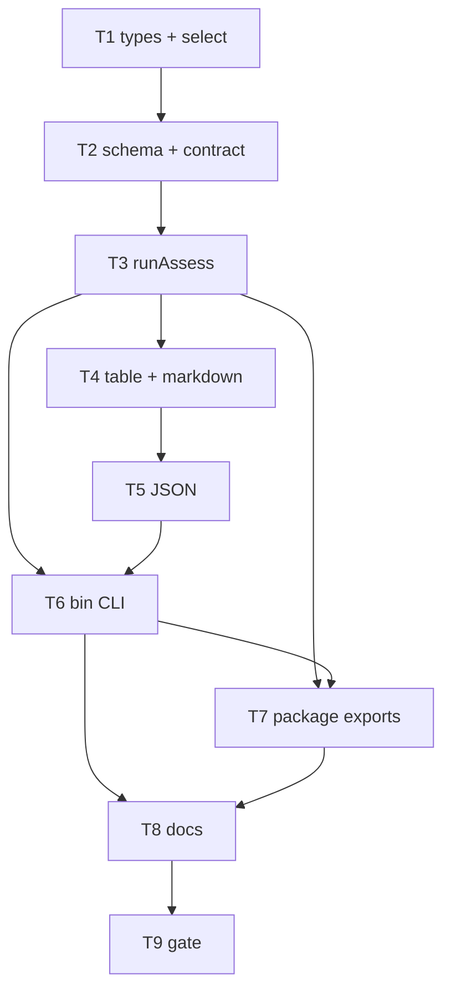

# Milestone 77 — Hotspot Assess Tasks

**Design**: [design.md](./design.md)  
**Spec**: [spec.md](./spec.md)  
**Context**: [context.md](./context.md)  
**Status**: Planned  
**Note**: Large feature — STOP at Planned; Execute in a separate session via `orchestrator-implementer` after Status promotion. Do **not** change scan JSON `3.0`, complexity-trend `3.0`, or reopen compare. Do **not** block on M76.

---

## Execution Plan

### Phase 1: Types + selection + schema

```
T1 selectAssessCandidates + Assess types
T1 → T2 schemas/hotspot-assess.json + contract
```

### Phase 2: Orchestration

```
T2 → T3 runAssess (sequential trends, soft-continue, progress hook)
```

### Phase 3: Reporters

```
T3 → T4 assess table + markdown
T4 → T5 assess JSON
```

### Phase 4: CLI + package surface

```
T3 + T5 → T6 bin assess + assess-actions + CLI tests
T3 + T6 → T7 package exports (#assess, schema, src/index)
```

### Phase 5: Docs + gate

```
T6 + T7 → T8 living docs + recipes/README
T8 → T9 full project gate
```



### Diagram-Definition Cross-Check

| Task | Depends on (declared) | Diagram shows | Match |
| ---- | --------------------- | ------------- | ----- |
| T1 | None | Root | yes |
| T2 | T1 | T1→T2 | yes |
| T3 | T2 | T2→T3 | yes |
| T4 | T3 | T3→T4 | yes |
| T5 | T4 | T4→T5 | yes |
| T6 | T3, T5 | T3/T5→T6 | yes |
| T7 | T3, T6 | T3/T6→T7 | yes |
| T8 | T6, T7 | T6/T7→T8 | yes |
| T9 | T8 | T8→T9 | yes |

### Path Conflict Check (Check 5)

| Task | Module owner | Paths (primary) | Conflict with parallel peers |
| ---- | ------------ | --------------- | ---------------------------- |
| T1 | `src/assess/` | `types.ts`, `select-candidates.ts`, tests | None (no `[P]` peers) |
| T2 | `schemas/` + `tests/contract/` | `hotspot-assess.json`, contract tests | After T1 |
| T3 | `src/assess/` | `run-assess.ts`, `index.ts`, tests | After T2; sole assess owner |
| T4 | `src/report/` | `assess-table.ts`, `assess-markdown.ts`, report index | After T3 |
| T5 | `src/report/` | `assess-json.ts`, report index | After T4 (serializes index) |
| T6 | `bin/` | `assess-actions.ts`, `hotspot-scanner.ts`, completion, CLI tests | After T3+T5 |
| T7 | package root + `src/index.ts` | `package.json`, `tsconfig.bin.json`, `src/index.ts` | After T3+T6 |
| T8 | docs | README, recipes, ARCHITECTURE, STRUCTURE, CONCERNS, skills | After T6+T7 |
| T9 | gate | none (run only) | After T8 |

> **`[P]`:** none in this plan — report index and package.json serialize naturally via T4→T5 and T6→T7.

### Test Co-location Validation

| Task | Code layer | Required tests (TESTING.md) | Co-located in task |
| ---- | ---------- | --------------------------- | ------------------ |
| T1 | `src/assess/select-candidates.ts` | unit | yes |
| T2 | `schemas/` | contract | yes — contract tests |
| T3 | `src/assess/run-assess.ts` | unit (+ mock integration) | yes |
| T4 | `src/report/assess-*.ts` | unit | yes |
| T5 | `src/report/assess-json.ts` | unit | yes |
| T6 | `bin/` | CLI | yes — hotspot-scanner / assess-actions tests |
| T7 | package exports | unit (index export smoke) | yes — extend `src/index.test.ts` |
| T8 | docs | none | n/a |
| T9 | gate | full | `pnpm build && pnpm test` |

---

## Requirement → Task Mapping

| IDs | Task |
| --- | ---- |
| HOTSPOT-1622 (selector), HOTSPOT-1624 (types partial) | T1 |
| HOTSPOT-1625, HOTSPOT-1626 (schema isolation) | T2 |
| HOTSPOT-1620 (pipeline core), HOTSPOT-1623, HOTSPOT-1624, HOTSPOT-1628, HOTSPOT-1629, HOTSPOT-1630 | T3 |
| HOTSPOT-1631, HOTSPOT-1632, HOTSPOT-1633 | T4 |
| HOTSPOT-1634, HOTSPOT-1635, HOTSPOT-1626 (no points) | T5 |
| HOTSPOT-1620, HOTSPOT-1621, HOTSPOT-1622, HOTSPOT-1630 | T6 |
| HOTSPOT-1627 | T7 |
| HOTSPOT-1636, HOTSPOT-1637, HOTSPOT-1638 | T8 |
| all HOTSPOT-1620–1638 | T9 verification |
| HOTSPOT-1639–1659 | Buffer unused |
| HOTSPOT-1660–1679 | Reserved |

---

## Tasks

### T1: Assess types + selectAssessCandidates

**What:** Add `src/assess/types.ts` with `AssessResult` / `AssessCandidate` / defaults (`DEFAULT_MIN_HOTSPOT_SCORE = 0.7`) and pure `selectAssessCandidates` (filter ≥ min → sort desc → slice top).  
**Where:** `src/assess/types.ts`, `src/assess/select-candidates.ts`, `src/assess/select-candidates.test.ts`  
**Reuses:** `HotspotScore` from `#types`; scorer sort comparator semantics  
**Done when:**

- [ ] Filter excludes scores below min; top caps length; empty input → `[]`
- [ ] Sort stable with scan: score desc, `filePath` asc on ties
- [ ] Types export `version`/`kind` string consts for later schema parity

**Tests:** `src/assess/select-candidates.test.ts`  
**Gate:** `pnpm test -- src/assess/select-candidates.test.ts`  
**Depends on:** None  
**Requirement IDs:** HOTSPOT-1622, HOTSPOT-1624 (partial)

---

### T2: Schema hotspot-assess 1.0 + contract tests

**What:** Author `schemas/hotspot-assess.json` (`version: "1.0"`, `kind: "hotspot-assess"`) with required meta tallies + candidates; extend contract tests; assert scan-result and complexity-trend fixtures still pass unchanged.  
**Where:** `schemas/hotspot-assess.json`, `tests/contract/json-schema.test.ts` (and fixtures as needed)  
**Reuses:** Existing Ajv contract harness; GrowthPattern-shaped `$defs` may mirror complexity-trend subset  
**Done when:**

- [ ] Valid assess fixture accepts; invalid version/kind rejects
- [ ] Scan `3.0` and complexity-trend `3.0` contract tests still green
- [ ] Schema forbids requiring `points` on candidates (property absent / not in required shape)

**Tests:** contract suite  
**Gate:** `pnpm test -- tests/contract`  
**Depends on:** T1  
**Requirement IDs:** HOTSPOT-1625, HOTSPOT-1626

---

### T3: runAssess orchestration

**What:** Implement `runAssess`: `runScan` → `selectAssessCandidates` → sequential `runComplexityTrend` with soft-continue, progress callback, cancel signal; assemble `AssessResult` meta counts; export from `src/assess/index.ts`.  
**Where:** `src/assess/run-assess.ts`, `src/assess/run-assess.test.ts`, `src/assess/index.ts`  
**Reuses:** `runScan`, `runComplexityTrend`, `classify` via trend meta, `getPackageVersion`  
**Done when:**

- [ ] Mocked scan+trend: candidates match filter/top; growthPattern copied without `points`
- [ ] Mid-batch trend rejection → error/skipped row + remaining still invoked
- [ ] Progress callback invoked once per candidate in order
- [ ] AbortSignal forwarded to scan and each trend call

**Tests:** `run-assess.test.ts` (injectable deps or module mocks at scan/trend boundary)  
**Gate:** `pnpm test -- src/assess/`  
**Depends on:** T2  
**Requirement IDs:** HOTSPOT-1620, HOTSPOT-1623, HOTSPOT-1624, HOTSPOT-1628, HOTSPOT-1629, HOTSPOT-1630

---

### T4: Assess table + markdown reporters

**What:** Pure `renderAssessTable` / `renderAssessMarkdown`: summary (candidates, pattern counts, skipped/errors) + detailed section **only** for deteriorating; empty deteriorating message.  
**Where:** `src/report/assess-table.ts`, `src/report/assess-markdown.ts`, co-located tests, `src/report/index.ts` re-exports  
**Reuses:** Existing summary/glossary tone; path display helpers if useful  
**Done when:**

- [ ] Non-deteriorating kinds appear in counts only
- [ ] Deteriorating detail includes path + score + pattern summary
- [ ] Empty deteriorating case has explicit empty messaging

**Tests:** report unit tests  
**Gate:** `pnpm test -- src/report/assess`  
**Depends on:** T3  
**Requirement IDs:** HOTSPOT-1631, HOTSPOT-1632, HOTSPOT-1633

---

### T5: Assess JSON reporter

**What:** `renderAssessJson(result)` emits pretty JSON of `AssessResult`; assert no `points` arrays on candidates; wire report index.  
**Where:** `src/report/assess-json.ts`, tests, `src/report/index.ts`  
**Reuses:** Trend/scan JSON stringify style; optional `$schema` constant pattern from M66 if trivial  
**Done when:**

- [ ] Output parses to `kind`/`version` locked values
- [ ] Unit asserts candidates lack `points`
- [ ] Same candidate list as input (no extra table-only slice)

**Tests:** `assess-json` unit (+ schema validate optional)  
**Gate:** `pnpm test -- src/report/assess-json`  
**Depends on:** T4  
**Requirement IDs:** HOTSPOT-1634, HOTSPOT-1635, HOTSPOT-1626

---

### T6: CLI assess command + actions

**What:** Add `bin/assess-actions.ts` (`executeAssess`, format parse, error map) and register `assess [path]` on `bin/hotspot-scanner.ts` with `--min-hotspot-score` (help names hotspotScore), `--top`, scan-parity scope flags, formats table/json/markdown, progress/quiet/cancel. Update completion scripts.  
**Where:** `bin/assess-actions.ts`, `bin/hotspot-scanner.ts`, `bin/completion-scripts.ts`, `bin/hotspot-scanner.test.ts` (and/or assess-actions tests), compiled smoke `--help` if cheap  
**Reuses:** `runWithScanCancelSignals`, scan option parsing patterns, trend-actions structure  
**Done when:**

- [ ] `assess --help` shows `--min-hotspot-score` and hotspotScore wording
- [ ] Default min 0.7 / top 20; invalid min/top → exit 2
- [ ] JSON format validates against assess schema in CLI test
- [ ] Cancel mapping preserved (130/143)
- [ ] `#` alias imports only from bin (no `../src` value imports)

**Tests:** CLI / bin tests  
**Gate:** `pnpm test -- bin/hotspot-scanner.test.ts` (and assess-actions if separate)  
**Depends on:** T3, T5  
**Requirement IDs:** HOTSPOT-1620, HOTSPOT-1621, HOTSPOT-1622, HOTSPOT-1630

---

### T7: Package exports + public API

**What:** Wire `#assess` in `package.json` imports + `tsconfig.bin.json` paths; export schema subpath; export `runAssess` (+ types) from `src/index.ts`; extend `src/index.test.ts`.  
**Where:** `package.json`, `tsconfig.bin.json`, `src/index.ts`, `src/index.test.ts`  
**Reuses:** Existing `#trend` / complexity-trend schema export pattern  
**Done when:**

- [ ] `import { runAssess } from "@vitals/hotspot-scanner"` (or package entry) works in index test
- [ ] Schema path export present
- [ ] `pnpm build` succeeds with new assess module

**Tests:** `src/index.test.ts`  
**Gate:** `pnpm build && pnpm test -- src/index.test.ts`  
**Depends on:** T3, T6  
**Requirement IDs:** HOTSPOT-1627

---

### T8: Living docs + recipes/README

**What:** Document assess pipeline, flags, schema isolation, sequential trends, and Prettier/indent cliff caveat; add recipe cookbook scan→assess.  
**Where:** `README.md`, `docs/recipes.md`, `.specs/codebase/ARCHITECTURE.md`, `STRUCTURE.md`, `CONCERNS.md`, skills (`vitals-cli-validation` / `vitals-pipeline-domain`) if they enumerate commands  
**Reuses:** M75 glossary / cliff wording  
**Done when:**

- [ ] Recipes include assess example with `--min-hotspot-score` / `--top`
- [ ] ARCHITECTURE lists `assess` command row
- [ ] CONCERNS notes batch trend cost + false cliffs
- [ ] STRUCTURE lists `src/assess/` and `bin/assess-actions.ts`

**Tests:** none  
**Gate:** docs review (no test gate beyond T9)  
**Depends on:** T6, T7  
**Requirement IDs:** HOTSPOT-1636, HOTSPOT-1637, HOTSPOT-1638

---

### T9: Full project gate

**What:** Run full quality gate; fix any fallout from assess wiring (coverage thresholds on new files).  
**Where:** n/a (verification only)  
**Reuses:** project gate  
**Done when:**

- [ ] `pnpm build && pnpm test` passes
- [ ] Coverage thresholds met for new `src/assess/**` and report/bin files
- [ ] No silent test deletions

**Tests:** full suite  
**Gate:** `pnpm build && pnpm test`  
**Depends on:** T8  
**Requirement IDs:** HOTSPOT-1620–1638 (verification)

---

## Parallel Execution Map

```
Phase 1: T1 → T2
Phase 2: T3
Phase 3: T4 → T5
Phase 4: T6 → T7   (T6 needs T3+T5; T7 needs T3+T6)
Phase 5: T8 → T9
```

No `[P]` tasks — path ownership on `src/report/index.ts` and `package.json` forces serialization.

---

## Proposed commits (Execute — do not commit in planning)

| Task | Suggested message |
| ---- | ----------------- |
| T1 | `feat(assess): add candidate selection and types` |
| T2 | `feat(assess): add hotspot-assess JSON schema 1.0` |
| T3 | `feat(assess): implement runAssess orchestration` |
| T4 | `feat(report): assess table and markdown reporters` |
| T5 | `feat(report): assess JSON reporter` |
| T6 | `feat(cli): add hotspot-scanner assess command` |
| T7 | `feat(assess): export runAssess and schema` |
| T8 | `docs(assess): document assess CLI and cliffs` |
| T9 | (no commit — gate only; or chore if fixes needed) |
