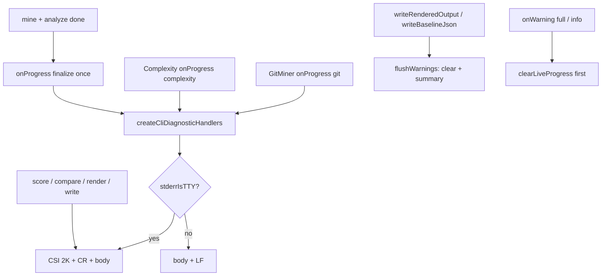

# Milestone 61 — Inline Progress Bar Design

**Spec**: [`.specs/features/inline-progress-bar/spec.md`](./spec.md)  
**Context**: [`.specs/features/inline-progress-bar/context.md`](./context.md)  
**Status**: Planned  

---

## Architecture Overview

Presentation + CLI lifecycle change on top of M59’s ephemeral progress sink. Pipeline emitters keep calling `onProgress`. Diagnostics formatters gain honest complexity bars and a `finalize` body. `runScan` emits one finalize tick at the post-barrier. Bin/scan-actions **defer** `flushWarnings` until after report/baseline write so the live line survives scoring / compare / render.



**No** new runtime deps, flags, config keys, or schema bumps.

---

## Code Reuse Analysis

| Component | Location | How to Use |
| --------- | -------- | ---------- |
| Live overwrite + clear | `src/diagnostics/logger.ts` (M59) | Keep `LIVE_CLEAR`, `liveLineOpen`, phase-switch clear, M58 compose |
| Throttle | `shouldEmitProgress` / intervals | Unchanged for git/complexity; **finalize always passes** when not suppressed |
| Format bodies | `formatComplexityProgressBody` / `formatGitProgressBody` | Rewrite per locked UX; share bar builder |
| `ScanProgress` | `src/types/domain.ts` | Extend `ScanProgressPhase` with `"finalize"` |
| Post-barrier | `src/scan.ts` | Emit finalize once after `Promise.all` / sequential mine+analyze, before score |
| Handlers factory | `createCliDiagnosticHandlers` | Add optional `stderrColumns`; expose `flushWarnings` to callers |
| Bin wiring | `bin/scan-actions.ts`, `bin/hotspot-scanner.ts` | Stop flushing inside `executeScan` before return; flush after write |
| Injectable TTY tests | `logger.test.ts` | Extend for bar goldens + finalize + deferred-order tests in bin |

### Fragile / concerns

| Concern | Mitigation |
| ------- | ---------- |
| Silent progress gap (current flush timing) | Defer flush — primary M61 fix |
| Fake % temptation | Spec forbids overall meter and 99% freeze |
| Narrow terminals | Clamp bar width; always CSI `2K` before write |
| Overlap dual emit | Last-writer-wins; complexity preferred when both tick; finalize replaces after barrier |
| `executeScan` API break | Return `{ result, flushWarnings }` (or equivalent) and update all call sites |
| Verbose argv interleave | Still known M59 risk — out of scope |
| New deps | Forbidden — Option B |

---

## Components and Interfaces

### 1. Domain: finalize phase

**Location:** `src/types/domain.ts`

```ts
export type ScanProgressPhase = "git" | "complexity" | "finalize";

export interface ScanProgress {
  phase: ScanProgressPhase;
  commitsProcessed: number; // 0 for complexity and finalize
  filesProcessed?: number;
  batchesProcessed?: number;
  totalFiles?: number;
  totalBatches?: number;
}
```

Emit contract: `{ phase: "finalize", commitsProcessed: 0 }` once per successful post-barrier entry.

### 2. Bar width + fill helpers

**Location:** `src/diagnostics/logger.ts`

```ts
/** Fallback when stderr.columns missing/invalid */
export const PROGRESS_COLUMNS_FALLBACK = 80;
/** Clamped bar interior width (glyphs between brackets) */
export const PROGRESS_BAR_WIDTH_MIN = 10;
export const PROGRESS_BAR_WIDTH_MAX = 40;

export function resolveProgressBarWidth(columns?: number): number;
export function formatFillBar(ratio: number, width: number, tty: boolean): string;
// TTY: █ / ░   non-TTY: # / -
```

**Width:** `columns = stderrColumns ?? process.stderr.columns ?? FALLBACK`; invalid → fallback; `barWidth = clamp(floor(columns * 0.25), MIN, MAX)` (implementer may tune the fraction if goldens stay readable — keep constants exported for tests).

**Ratio:** `filesProcessed / totalFiles`, clamped to `[0, 1]`. Filled count = `round(ratio * width)` (at ratio 1 → full width).

### 3. Progress body formatters

Rewrite bodies (no trailing `\n`):

| Phase | Body (examples) |
| ----- | --------------- |
| `complexity` + known total | `complexity [████████░░] 800/1,050 files · batch 16/21` (omit ` · batch …` if batches unknown) |
| `complexity` + unknown total | `complexity 800 files` (+ batch fragment if known) — **no** `[…]` |
| `git` | `git 12,000 commits…` |
| `finalize` | `Finalizing…` |

Export format helpers used by tests (or test via `onProgress` spies). Prefer exporting `formatProgressBody` / bar helpers for golden unit tests.

### 4. Handler options + finalize emit path

```ts
export interface CliDiagnosticOptions {
  quiet?: boolean;
  noProgress?: boolean;
  warningsMode?: WarningsMode;
  stderrIsTTY?: boolean;
  /** Default: process.stderr.columns — injectable for tests */
  stderrColumns?: number;
}
```

`shouldEmitProgress`:

- `finalize` → always `true` (single caller emit; no interval)
- `git` / `complexity` → existing intervals

Overlap: unchanged single-line write path (last writer wins). Prefer complexity when both stages tick under M34 overlap (natural if complexity ticks more often / after git for same wall time — no multi-bar). Finalize phase switch clears/replaces prior phase line via existing `lastPhase` logic.

### 5. Emit finalize in `runScan`

**Location:** `src/scan.ts` — immediately after both mine + analyze complete (after sequential awaits or `Promise.all`), **before** `filterGitMinerResult` / score **or** after forwarding stage warnings but **before** `createHotspotScorer().score` — prefer:

1. Await mine + analyze
2. Filter / forward git + complexity warnings (full mode may clear live line)
3. `options.onProgress?.({ phase: "finalize", commitsProcessed: 0 })`
4. Score + build result

That order ensures finalize re-opens the live line after any full-mode warning clears.

### 6. CLI lifecycle — defer flush

**Today:**

```
executeScan: runScan → flushWarnings → return result
bin: render → write
executeCompareAndRender: runScan → compare → flushWarnings → render → write
```

**Target:**

```ts
export async function executeScan(...): Promise<{
  result: ScanResult;
  flushWarnings: () => void;
}> {
  const handlers = createCliDiagnosticHandlers(...);
  const result = await runScan({ ...handlers });
  // do NOT flush here
  return { result, flushWarnings: handlers.flushWarnings };
}
```

| Caller | Flush timing |
| ------ | ------------ |
| `scan` action | After `writeRenderedOutput`; then explain (clear already done) |
| `baseline save` | After `writeBaselineJson` |
| `executeCompareAndRender` | After internal `writeRenderedOutput` (move flush from pre-render) |
| `compare` command | Relies on `executeCompareAndRender` |

M59 clear-before-warning/info unchanged. Quiet/no-progress: finalize + bars suppressed; flush still runs for summary warnings.

Update all `executeScan` call sites and tests that expect a bare `ScanResult`.

---

## Data Models

No JSON / schema changes. `ScanProgressPhase` gains `"finalize"` only (TypeScript domain type — not in scan result payload).

---

## Error Handling Strategy

| Scenario | Handling | User impact |
| -------- | -------- | ----------- |
| Missing `totalFiles` | Omit bar | Counter-only complexity line |
| `totalFiles === 0` | Omit bar / treat as unknown | No NaN |
| Invalid columns | Fallback 80 → clamped bar width | Stable bar size in CI pipes |
| Scan throws before write | Existing error path; optional best-effort `clearLiveProgress` if handlers still in scope | Avoid stuck live line when cheap |
| Double `flushWarnings` | Second clear no-op (M59) | Safe |

---

## Tech Decisions

| Decision | Choice | Rationale |
| -------- | ------ | --------- |
| Progress library | None (homegrown) | Locked Option B; zero deps |
| Overall % | Forbidden | Honest phase semantics |
| `executeScan` return | `{ result, flushWarnings }` | Expose deferred flush without globals |
| Finalize placement | Post-barrier, after stage warning forward, before score | Re-open line after full-mode clears |
| Bar glyphs | TTY `█░` / non-TTY `#-` | Readable interactive vs CI-safe |
| Throttle change | Finalize only | Keep git/complexity intervals |

---

## Test Plan

| Layer | Focus |
| ----- | ----- |
| Unit `logger.test.ts` | Bar math 0/mid/100%; omit when unknown; git counter; finalize body; TTY overwrite; non-TTY `\n`; quiet; columns inject; phase switch to finalize |
| Unit `scan.test.ts` / integration | Exactly one finalize after both stages; not emitted when no `onProgress` |
| Unit `scan-actions` / `hotspot-scanner.test.ts` | Flush after write; compare flush after write; baseline flush after write; explain after flush |
| Package | No new deps in `package.json` |

**Gate:** per-task vitest scopes; final `pnpm build && pnpm test`.

---

## Risks

| Risk | Mitigation |
| ---- | ---------- |
| Call-site churn for `executeScan` return type | Grep all callers; update tests in same task |
| Unicode bar on dumb TTY | Still TTY-gated; non-TTY uses ASCII |
| Finalize before warning forward loses line under full | Prefer emit after forwardWarnings |
| Docs drift vs M59 | Replace “text only” wording with bar + finalize notes |

---

## Implementation Notes (Execute)

1. `formatComplexityProgressBody` builds `[` + filled/empty + `]` when total known; omit bar if unknown; keep existing complexity throttle.
2. Finalize phase once at post-barrier; body `Finalizing…`; bypass throttle.
3. CLI lifecycle: defer flush after write (scan / compare / baseline).
4. Tests: golden bar math; TTY overwrite; deferred flush ordering; quiet suppression.
5. YAGNI: no flags, schema, ETA, multi-bar, deps.
6. Living docs: README progress + ARCHITECTURE diagnostics phases table + deferred flush note.
