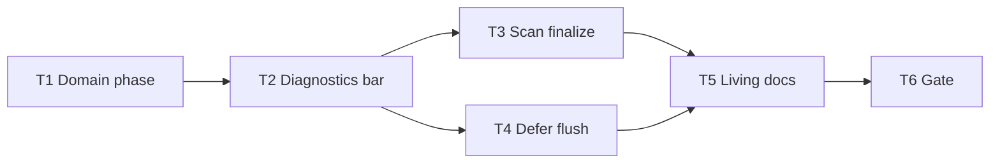

# Milestone 61 — Inline Progress Bar Tasks

**Design**: [`.specs/features/inline-progress-bar/design.md`](./design.md)  
**Spec**: [`.specs/features/inline-progress-bar/spec.md`](./spec.md)  
**Context**: [`.specs/features/inline-progress-bar/context.md`](./context.md)  
**Status**: Planned  
**Note**: Large feature — diagnostics formatters + finalize emit + deferred flush + docs. Planning session ends here; Execute in a separate session after Status → Approved / Ready for Execute.

---

## Execution Plan

### Phase 1: Domain + diagnostics

```
T1 domain finalize phase → T2 formatters + handlers + unit tests
```

### Phase 2: Pipeline emit + CLI lifecycle

```
T2 → T3 emit finalize in scan
T2 → T4 defer flushWarnings (bin/scan-actions)
```

### Phase 3: Docs + gate

```
T3 + T4 → T5 living docs → T6 project gate
```



### Diagram-Definition Cross-Check

| Task | Depends on (declared) | Diagram shows | Match |
| ---- | --------------------- | ------------- | ----- |
| T1 | None | Root | ✅ |
| T2 | T1 | T1 → T2 | ✅ |
| T3 | T2 | T2 → T3 | ✅ |
| T4 | T2 | T2 → T4 | ✅ |
| T5 | T3, T4 | T3+T4 → T5 | ✅ |
| T6 | T5 | T5 → T6 | ✅ |

### Path Conflict Check (Check 5)

| Task | Module owner | Paths | Conflict |
| ---- | ------------ | ----- | -------- |
| T1 | types | `src/types/domain.ts` (exports via `src/types/index.ts` if needed) | Sole types owner |
| T2 | diagnostics | `src/diagnostics/logger.ts`, `src/diagnostics/logger.test.ts`, optionally `src/diagnostics/index.ts` | After T1; sole diagnostics owner |
| T3 | scan | `src/scan.ts`, `src/scan.test.ts` and/or `src/scan.integration.test.ts` | Disjoint from T4; after T2 — `[P]` OK with T4 |
| T4 | bin | `bin/scan-actions.ts`, `bin/hotspot-scanner.ts`, `bin/hotspot-scanner.test.ts` (and related bin tests touching `executeScan`) | Disjoint from T3; after T2 — `[P]` OK with T3 |
| T5 | docs | `README.md`, `.specs/codebase/ARCHITECTURE.md`, optionally `docs/recipes.md`; Execute may tick ROADMAP/STATE Done | After T3+T4; no src overlap |
| T6 | gate | none (verify) | After T5 |

T3 and T4 may run in parallel after T2 (`[P]` on T4).

### Test Co-location Validation

| Task | Code layer | TESTING.md expectation | Task says | Match |
| ---- | ---------- | ---------------------- | --------- | ----- |
| T1 | `src/types/` | none (types excluded from coverage) | none | ✅ |
| T2 | `src/diagnostics/` | Unit | unit in same task | ✅ |
| T3 | `src/scan.ts` | Unit / integration | unit (and integration assert if already covering onProgress phases) | ✅ |
| T4 | `bin/` | Unit / CLI | unit in same task | ✅ |
| T5 | Docs | none | none | ✅ |
| T6 | Full project | Gate | `pnpm build && pnpm test` | ✅ |

### Granularity Check

| Task | Scope | Status |
| ---- | ----- | ------ |
| T1 | Add `"finalize"` to phase union | ✅ Atomic |
| T2 | Formatters + handlers + diagnostics tests | ✅ Cohesive diagnostics module |
| T3 | One emit site in scan + tests | ✅ One orchestrator change |
| T4 | Defer flush API + all call sites + tests | ✅ Cohesive bin lifecycle |
| T5 | Living docs | ✅ Granular |
| T6 | Project gate | ✅ Granular |

### Requirement → Task Mapping

| Requirement ID | Task |
| -------------- | ---- |
| HOTSPOT-1015 (type), HOTSPOT-1023 (no schema — verify) | T1 |
| HOTSPOT-1010, HOTSPOT-1011, HOTSPOT-1012, HOTSPOT-1013, HOTSPOT-1014, HOTSPOT-1015 (body), HOTSPOT-1020, HOTSPOT-1021, HOTSPOT-1022, HOTSPOT-1024 | T2 |
| HOTSPOT-1016, HOTSPOT-1017 (emit side) | T3 |
| HOTSPOT-1017 (lifecycle), HOTSPOT-1018, HOTSPOT-1019, HOTSPOT-1023 (no flags) | T4 |
| HOTSPOT-1025 | T5 |
| (gate) | T6 |
| HOTSPOT-1026–1029 | Reserved — unused |

---

## Task Breakdown

### T1: Add finalize to ScanProgressPhase

**What**: Extend `ScanProgressPhase` with `"finalize"` in `src/types/domain.ts`. Document in a brief comment that finalize uses `commitsProcessed: 0`. No schema/JSON changes. Ensure re-exports via `src/types/index.ts` remain correct (no new file unless needed).

**Where**: `src/types/domain.ts`; optionally `src/types/index.ts`

**Depends on**: None

**Reuses**: Existing `ScanProgress` shape

**Done when**:

- [ ] `ScanProgressPhase` is `"git" | "complexity" | "finalize"`
- [ ] No JSON schema / contract edits
- [ ] Typecheck consumers can assign finalize progress objects

**Tests**: none (types layer)

**Gate**: `pnpm exec tsc -p tsconfig.json --noEmit` — PASS (or rely on next task’s vitest compile)

**Requirements**: HOTSPOT-1015 (type surface), HOTSPOT-1023 (no schema)

---

### T2: Complexity/git/finalize formatters + handler wiring

**What**: In `src/diagnostics/logger.ts`, implement homegrown fill-bar helpers and rewrite progress bodies per [design.md](./design.md) / [context.md](./context.md): TTY `█`/`░`, non-TTY `#`/`-`; omit bar when `totalFiles` unknown; git indeterminate `git N commits…`; finalize body `Finalizing…`. Derive bar width from injectable `stderrColumns` (default `process.stderr.columns`) with clamp + fallback. `shouldEmitProgress` always allows `finalize`. Keep M59 live overwrite/clear and M58 compose. Honor quiet/no-progress (no finalize/bar writes). No new deps. Co-locate unit tests: golden bar math (0%, mid, 100% files), omit-bar, git no `%`/brackets, finalize body, TTY `\x1b[2K\r`, non-TTY `\n`, columns inject, quiet suppression, phase switch to finalize.

**Where**: `src/diagnostics/logger.ts`; `src/diagnostics/logger.test.ts`; optionally `src/diagnostics/index.ts`

**Depends on**: T1

**Reuses**: M59 `LIVE_CLEAR` / `writeProgressLine` / `createCliDiagnosticHandlers`; complexity throttle intervals

**Done when**:

- [ ] Complexity TTY/non-TTY bars match locked examples (semantics)
- [ ] Git counter has no bar / %
- [ ] Finalize body is `Finalizing…` and bypasses throttle
- [ ] `stderrColumns` injectable; clear-to-EOL preferred
- [ ] Quiet / no-progress emit nothing
- [ ] No ora/cli-progress or other new runtime deps
- [ ] Unit tests cover goldens + handler paths above

**Tests**: unit in `src/diagnostics/logger.test.ts` (same task)

**Gate**: `pnpm exec vitest run src/diagnostics/` — PASS

**Requirements**: HOTSPOT-1010, HOTSPOT-1011, HOTSPOT-1012, HOTSPOT-1013, HOTSPOT-1014, HOTSPOT-1015, HOTSPOT-1020, HOTSPOT-1021, HOTSPOT-1022, HOTSPOT-1024

---

### T3: Emit finalize at post-barrier in runScan [P]

**What**: After both git mine and complexity analyze complete, forward stage warnings, then emit `options.onProgress?.({ phase: "finalize", commitsProcessed: 0 })` once before scoring. Do not change scoring/compare formulas or JSON. Update `src/scan.test.ts` and/or integration progress-phase assertions to expect exactly one finalize after git+complexity when `onProgress` is provided.

**Where**: `src/scan.ts`; `src/scan.test.ts`; optionally `src/scan.integration.test.ts`

**Depends on**: T2

**Reuses**: Existing `onProgress` forwarding; design emit order (after warning forward, before score)

**Done when**:

- [ ] One finalize emit per successful barrier crossing
- [ ] Emit occurs before `createHotspotScorer().score`
- [ ] Tests assert phase order includes `finalize` after complexity (and git)
- [ ] No schema / ranking changes

**Tests**: unit (and integration if existing phase list tests)

**Gate**: `pnpm exec vitest run src/scan.test.ts src/scan.integration.test.ts` — PASS

**Requirements**: HOTSPOT-1016, HOTSPOT-1017 (emit)

---

### T4: Defer flushWarnings until after write [P]

**What**: Change `executeScan` to **not** call `flushWarnings` before return; return `{ result, flushWarnings }` (or equivalent exposing flush). Update `bin/hotspot-scanner.ts` scan path to flush **after** `writeRenderedOutput`; baseline save to flush **after** `writeBaselineJson`; move flush in `executeCompareAndRender` to **after** its `writeRenderedOutput`. Preserve clear-before-warning/info; ensure explain runs after flush (or clear before explain). Update all call sites and bin tests for the new return shape and ordering (write then flush). No new CLI flags.

**Where**: `bin/scan-actions.ts`; `bin/hotspot-scanner.ts`; `bin/hotspot-scanner.test.ts` (and any other bin tests importing `executeScan`)

**Depends on**: T2

**Reuses**: Existing `createCliDiagnosticHandlers` flush/clear; design lifecycle table

**Done when**:

- [ ] Scan / compare / baseline flush after write
- [ ] Live finalize line can remain until after write (ordering tests)
- [ ] Explain does not race an open live line (flush or clear first)
- [ ] All `executeScan` callers updated; tests green
- [ ] No new flags/config

**Tests**: unit in bin tests (same task)

**Gate**: `pnpm exec vitest run bin/` — PASS

**Requirements**: HOTSPOT-1017 (lifecycle), HOTSPOT-1018, HOTSPOT-1019, HOTSPOT-1023

---

### T5: Living docs

**What**: Document complexity fill bar (TTY vs non-TTY ASCII), git indeterminate counter, `Finalizing…` phase, and deferred flush (clear after write; clear before diagnostics). Update README Advanced **Progress (stderr)** and ARCHITECTURE diagnostics / progress phases table (`finalize` row + deferred flush note). Touch `docs/recipes.md` only if progress UX is mentioned. Do not invent flags. On Execute Done, tick ROADMAP M61 and STATE Active/decision row (planner already added Planned milestone).

**Where**: `README.md`, `.specs/codebase/ARCHITECTURE.md`, optionally `docs/recipes.md` (+ ROADMAP/STATE Done sync at Execute completion)

**Depends on**: T3, T4

**Reuses**: M59 docs tone; M61 design wording

**Done when**:

- [ ] README describes bar + git counter + finalize + flush-after-write
- [ ] ARCHITECTURE lists `finalize` and deferred flush lifecycle
- [ ] Recipes updated only if needed
- [ ] No invented flags/config keys

**Tests**: none (docs)

**Gate**: none beyond review (full gate in T6)

**Requirements**: HOTSPOT-1025

---

### T6: Project quality gate

**What**: Run the required project gate and confirm green. Do not mark feature Done until this passes.

**Where**: repo root (no source edits unless gate surfaces a fix owned by T1–T5 — then fix in the owning task and re-run)

**Depends on**: T5

**Reuses**: quality-gates rule / `verifier-quality-gates`

**Done when**:

- [ ] `pnpm build && pnpm test` PASS
- [ ] tasks.md Status → Done (Execute session); ROADMAP M61 marked Done

**Tests**: full suite via gate

**Gate**: `pnpm build && pnpm test` — PASS

**Requirements**: (gate)

---

## Parallel Execution Map

```
Phase 1 (Sequential):
  T1 ──→ T2

Phase 2 (Parallel after T2):
  T2 complete, then:
    ├── T3 [P]
    └── T4 [P]

Phase 3 (Sequential):
  T3 + T4 complete, then:
    T5 ──→ T6
```

**Parallelism constraint:** T3 (`src/scan*`) and T4 (`bin/*`) touch disjoint path prefixes; unit tests are parallel-safe per TESTING.md. Do not mark T2 `[P]` with anything — sole diagnostics owner after T1.

---

## Handoff

Planning complete. Promote **Status** to `Approved` or `Ready for Execute`, then in a **new development session** invoke `orchestrator-implementer`.

Expected final gate: `pnpm build && pnpm test`
