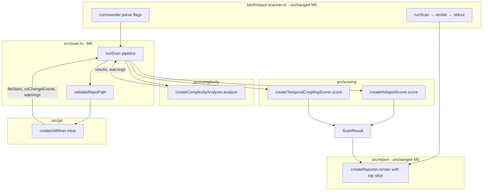

# Milestone 6 — Integration Design

**Spec**: [`.specs/features/integration/spec.md`](./spec.md)  
**Context**: [`.specs/features/integration/context.md`](./context.md)  
**Status**: Draft

---

## Architecture Overview

M6 replaces the M5 `runScan()` stub with full pipeline orchestration. The CLI (`bin/hotspot-scanner.ts`) and reporter (`src/report/`) require **no functional changes** — M5 already wires diagnostics callbacks and passes options through. M6 owns `src/scan.ts` and fixture/test infrastructure.



**IMPL reference:** §4 pipeline, §7.2 streaming/batching, §8.4 errors, §9 integration tests.

---

## Code Reuse Analysis

### Existing Components to Leverage

| Component | Location | How to Use |
| --------- | -------- | ---------- |
| `createGitMiner` | `src/git/index.ts` | `mine({ repoPath, since, onProgress })` |
| `createComplexityAnalyzer` | `src/complexity/index.ts` | `analyze({ repoPath })` |
| `createHotspotScorer` | `src/scoring/index.ts` | `score(fileStats, complexityResults)` |
| `createTemporalCouplingScorer` | `src/scoring/index.ts` | `score(coChangeEvents, fileStats, minCochange)` |
| `DEFAULT_MIN_COCHANGE` | `src/scoring/index.ts` | Default for `minCochange` |
| `DEFAULT_SINCE`, `DEFAULT_TOP` | `src/scan.ts` | Existing exports; `top` accepted but not used in M6 orchestration |
| Diagnostics callbacks | `ScanOptions` in `src/types/domain.ts` | Forward warnings/progress |
| Path validation | `src/scan.ts` | Keep existing `validateRepoPath` |
| Reporter slicing | `src/report/slice.ts` | CLI applies `--top` after `runScan` returns |

### Integration Points

| System | M6 behavior | Notes |
| ------ | ----------- | ----- |
| `src/git/` | Called from `runScan` | No API changes expected |
| `src/complexity/` | Called from `runScan` | Warnings forwarded via `onWarning` |
| `src/scoring/` | Called from `runScan` | Full sorted arrays returned |
| `src/scan.ts` | Full pipeline | **Primary M6 deliverable** |
| `bin/hotspot-scanner.ts` | Unchanged | Integration test only |
| `src/report/` | Unchanged | Integration test only |
| `tests/fixtures/repos/` | New `small-ts/` (+ P2 repos) | Versioned `.git/` |

---

## Design Decisions

| # | Decision | Rationale |
| - | -------- | --------- |
| D1 | Default factories in `runScan` — no required DI | Integration tests use real modules on fixture ([context.md](./context.md)) |
| D2 | Forward warnings in `for` loops after each phase | Simple, ordered; matches git miner warning pattern |
| D3 | `void options.top` removed — `top` unused in orchestrator | Reporter owns display limit; optional comment/doc only |
| D4 | Git errors propagate from `src/git/spawn.ts` | [INTEGRATIONS.md](../../codebase/INTEGRATIONS.md) — message includes repo context |
| D5 | Fixture `small-ts` with README + fixed commit dates | Stable `--since "12 months ago"` across test runs |
| D6 | Separate `scan.integration.test.ts` | Keeps unit `scan.test.ts` fast for path validation |
| D7 | No intersection filter at orchestration | [context.md](./context.md) C1 — M4 churn=0 for missing stats |
| D8 | Sequential stages | [context.md](./context.md) C3 — aligns ARCHITECTURE.md |

---

## Components

### Pipeline orchestrator (`src/scan.ts`)

- **Purpose**: Coordinate git → complexity → scoring; return typed `ScanResult`.
- **Location**: `src/scan.ts`
- **Implementation sketch**:

```typescript
import { createGitMiner } from "./git/index.js";
import { createComplexityAnalyzer } from "./complexity/index.js";
import {
  createHotspotScorer,
  createTemporalCouplingScorer,
  DEFAULT_MIN_COCHANGE,
} from "./scoring/index.js";

export async function runScan(options: ScanOptions): Promise<ScanResult> {
  await validateRepoPath(options.repoPath);

  const since = options.since ?? DEFAULT_SINCE;
  const minCochange = options.minCochange ?? DEFAULT_MIN_COCHANGE;
  const onWarning = options.onWarning;

  const miner = createGitMiner();
  const { fileStats, coChangeEvents, warnings: gitWarnings } =
    await miner.mine({
      repoPath: options.repoPath,
      since,
      onProgress: options.onProgress,
    });

  for (const message of gitWarnings) {
    onWarning?.(message);
  }

  const analyzer = createComplexityAnalyzer();
  const { results, warnings: complexityWarnings } = await analyzer.analyze({
    repoPath: options.repoPath,
  });

  for (const message of complexityWarnings) {
    onWarning?.(message);
  }

  const hotspots = createHotspotScorer().score(fileStats, results);
  const coupling = createTemporalCouplingScorer().score(
    coChangeEvents,
    fileStats,
    minCochange,
  );

  return {
    version: "1.0",
    hotspots,
    coupling,
    meta: {
      since,
      scannedAt: new Date().toISOString(),
    },
  };
}
```

- **Dependencies**: `src/git/`, `src/complexity/`, `src/scoring/`, `src/types/`
- **Reuses**: Existing factories; no new runtime dependencies

---

### Fixture `small-ts` (`tests/fixtures/repos/small-ts/`)

- **Purpose**: Minimal versioned Git repo for deterministic E2E assertions.
- **Suggested layout**:

```
tests/fixtures/repos/small-ts/
├── README.md
├── src/
│   ├── high.ts      # nested if/loops — highest McCabe
│   ├── medium.ts    # moderate complexity
│   └── low.ts       # minimal complexity (empty or single return)
└── .git/            # versioned — created by fixture-builder
```

- **Git history design** (implementer creates via fixture-builder):

| Commit | Files changed | Intent |
| ------ | ------------- | ------ |
| 1 | Add `low.ts` | Baseline file |
| 2 | Add `medium.ts` | Second complexity tier |
| 3 | Add `high.ts` | Highest complexity |
| 4–6 | Touch `high.ts` + `medium.ts` together | ≥3 co-changes for coupling pair |
| 7 | Touch `high.ts` only | Extra churn on `high.ts` for hotspot ranking |

- **Expected assertions** (document in README):
  - Top hotspot: `src/high.ts` (highest complexity × highest churn)
  - Top coupling pair: `src/high.ts` ↔ `src/medium.ts` with `coChangeCount >= 3`
- **Commit dates**: Set author/committer dates within last 6 months so `DEFAULT_SINCE` always includes them

---

### Benchmark procedure (`scripts/benchmark-scan.md` or `scripts/benchmark-scan.ts`)

- **Purpose**: Manual RT-001 assessment before v1 declaration.
- **Suggested steps**:
  1. Generate or clone a large synthetic repo (thousands of commits / hundreds of TS files)
  2. Run `time pnpm exec hotspot-scanner scan <path> --since "12 months ago" --format json > /dev/null`
  3. Record: wall time, commit count (from progress stderr or git), machine notes
  4. Compare against qualitative target (e.g., "completes in reasonable time on dev laptop for 10k commits")
- **Not in CI**: No `package.json` test script dependency

---

## Data Models

No changes to `ScanResult`, `ScanOptions`, or domain types. M6 consumes existing M1–M4 contracts.

---

## Error Handling Strategy

| Scenario | Behavior | Test |
| -------- | -------- | ---- |
| Invalid `repoPath` | Throw before git (M5) | `scan.test.ts` |
| Non-git directory | `git log` spawn fails → throw with context | T4 optional test |
| Empty `--since` window | Complete with empty rankings + warning | Git miner existing behavior |
| Invalid TS syntax in repo | Warning + skip file | Complexity analyzer existing behavior |
| Git miner rename ambiguity | Warning forwarded via `onWarning` | P2 `with-renames` fixture |

---

## Test Strategy

| Layer | File | Focus |
| ----- | ---- | ----- |
| Unit (update) | `src/scan.test.ts` | Path validation preserved; remove empty-array expectations for repo `.` or move to integration |
| Integration | `src/scan.integration.test.ts` | `runScan` on `small-ts` — top hotspot path, coupling pair, non-empty arrays |
| CLI integration | `bin/hotspot-scanner.integration.test.ts` | Real fixture, exit 0, JSON parse, table substring |
| Benchmark | `scripts/benchmark-scan.md` | Manual procedure only |
| P2 fixtures | `tests/fixtures/repos/with-renames/`, `merge-heavy/` | Optional integration tests in T6 |

**Mock boundaries** ([TESTING.md](../../codebase/TESTING.md)):

- Do **not** mock git/ts-morph inside `scan.integration.test.ts`
- Unit tests for git spawn failures may mock at `GitMiner` deps if needed

---

## Risks

| Risk | Mitigation |
| ---- | ---------- |
| RT-001: Large repo performance | Manual benchmark T2; streaming already in git miner |
| RT-003: Rename churn distortion | P2 `with-renames` fixture; warnings for ambiguous paths |
| Stage order change breaks rankings | Integration test locks expected top file; fragile-areas rule |
| Fixture `.git` size in repo | Keep `small-ts` minimal (≤10 commits, 3–4 files) |
| Flaky dates vs `--since` | Fixed recent commit dates in fixture-builder workflow |

---

## File Structure (new/changed)

```
src/
├── scan.ts                    # M6: full pipeline
├── scan.test.ts               # M6: updated unit tests
└── scan.integration.test.ts   # M6: new E2E

bin/
└── hotspot-scanner.integration.test.ts  # M6: CLI on fixture

tests/fixtures/repos/
├── small-ts/                  # M6 P1
├── with-renames/              # M6 P2
└── merge-heavy/               # M6 P2

scripts/
└── benchmark-scan.md          # M6 P2 manual procedure
```

---

## Out of Scope (design)

- Reporter/CLI flag changes — M5 complete
- Scoring formula changes — M4 complete
- Worker-thread parallelization — STATE.md deferred
- CI performance gates — [context.md](./context.md) C5
- Intersection filter — [context.md](./context.md) C1
