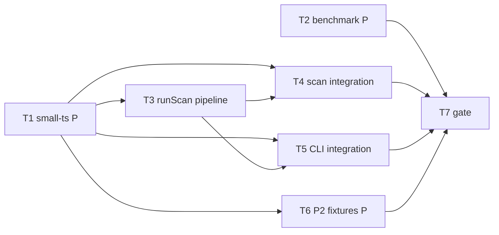

# Milestone 6 — Integration Tasks

**Design**: [`.specs/features/integration/design.md`](./design.md)  
**Spec**: [`.specs/features/integration/spec.md`](./spec.md)  
**Context**: [`.specs/features/integration/context.md`](./context.md)  
**Status**: Complete

---

## Execution Plan

### Phase 1: Fixtures and benchmark (Parallel OK)

```
T1 [P] small-ts fixture
T2 [P] benchmark procedure
```

### Phase 2: Pipeline (Sequential)

```
T3 runScan pipeline wiring
```

### Phase 3: Integration tests (Parallel after T1 + T3)

```
T4 scan integration tests
T5 CLI fixture validation
```

### Phase 4: Extended fixtures + gate (Sequential)

```
T6 [P] with-renames + merge-heavy fixtures (P2)
T4, T5, T6 → T7 gate + docs sync
```



---

## Task Breakdown

### T1: Versioned fixture `small-ts` [P]

**What**: Create `tests/fixtures/repos/small-ts/` — minimal Git repository with 3–4 TS files, commit history producing predictable hotspot and coupling rankings. Include `README.md` with validation command and expected top hotspot file.

**Where**: `tests/fixtures/repos/small-ts/` (source files, `.git/`, `README.md`)

**Depends on**: None

**Reuses**: [fixture-builder agent](../../../.cursor/agents/fixture-builder.md), [design.md](./design.md) § Fixture `small-ts`

**Requirement**: HOTSPOT-54

**Tools**:

- MCP: NONE
- Skill: `vitals-cli-validation` (validation command reference)
- Agent: `fixture-builder` (recommended)

**Done when**:

- [ ] `tests/fixtures/repos/small-ts/` is a valid Git repo with versioned `.git/`
- [ ] Contains `src/high.ts`, `src/medium.ts`, `src/low.ts` (or equivalent) with varied McCabe complexity
- [ ] At least one file pair co-changes ≥ `DEFAULT_MIN_COCHANGE` (3) times within `DEFAULT_SINCE` window
- [ ] Commit dates fixed within last 6 months for stable `--since "12 months ago"`
- [ ] `README.md` documents: purpose, `pnpm exec hotspot-scanner scan tests/fixtures/repos/small-ts`, expected top hotspot path
- [ ] Manual smoke (after T3): scan command produces non-empty output

**Tests**: none (fixture data; consumed by T4/T5)

**Gate**: fixture structure review (no code gate until T3)

---

### T2: Manual benchmark procedure [P]

**What**: Document manual performance benchmark procedure for large synthetic repos (RT-001). Optional thin `scripts/benchmark-scan.ts` wrapper — must not run in `pnpm test`.

**Where**: `scripts/benchmark-scan.md` (required); `scripts/benchmark-scan.ts` (optional)

**Depends on**: None

**Reuses**: IMPL §9 performance layer; `tests/fixtures/git-log/large-synthetic.txt` as reference for scale

**Requirement**: HOTSPOT-59

**Tools**:

- MCP: NONE
- Skill: NONE

**Done when**:

- [ ] Procedure describes how to obtain/generate a large test repo
- [ ] Procedure includes `time pnpm exec hotspot-scanner scan <path>` example
- [ ] Procedure states operator records wall time and commit count
- [ ] No benchmark script hooked into `pnpm test` or CI
- [ ] P2 acceptable: procedure-only without executable script

**Tests**: none (manual)

**Gate**: doc review

---

### T3: `runScan` pipeline wiring

**What**: Replace M5 stub in `src/scan.ts` with full orchestration: `createGitMiner` → `createComplexityAnalyzer` → `createHotspotScorer` + `createTemporalCouplingScorer`. Forward warnings and progress callbacks. Preserve path validation and defaults.

**Where**: `src/scan.ts`

**Depends on**: T1 (for manual smoke validation)

**Reuses**: `createGitMiner` (`src/git/`), `createComplexityAnalyzer` (`src/complexity/`), `createHotspotScorer` / `createTemporalCouplingScorer` (`src/scoring/`), [design.md](./design.md) implementation sketch

**Requirement**: HOTSPOT-51, HOTSPOT-52, HOTSPOT-53

**Tools**:

- MCP: NONE
- Skill: `vitals-pipeline-domain`

**Done when**:

- [ ] `runScan()` invokes git miner with `repoPath`, `since`, and `onProgress`
- [ ] `runScan()` invokes complexity analyzer with `repoPath`
- [ ] `runScan()` invokes both scorers with correct arguments and `minCochange` default
- [ ] Git and complexity warnings forwarded to `onWarning` when provided
- [ ] Returns full sorted `hotspots` and `coupling` (no `--top` slicing)
- [ ] Path validation behavior unchanged from M5
- [ ] `void options.top` stub removed or documented as reporter-only
- [ ] Manual smoke on `small-ts`: non-empty rankings
- [ ] Gate check passes: `pnpm build && pnpm test -- src/scan.test.ts` (may fail until T4 updates tests)

**Tests**: unit (`scan.test.ts` — update in T4)

**Gate**: build + test (scan tests updated in T4)

---

### T4: Scan integration tests

**What**: Add `src/scan.integration.test.ts` with deterministic assertions on `runScan({ repoPath: small-ts })`. Update `src/scan.test.ts` — remove empty-array expectations for valid repo; keep path validation tests.

**Where**: `src/scan.integration.test.ts`, `src/scan.test.ts`

**Depends on**: T1, T3

**Reuses**: Fixture README expected values; TESTING.md mock boundaries (no git/ts-morph mocks)

**Requirement**: HOTSPOT-53, HOTSPOT-55

**Tools**:

- MCP: NONE
- Skill: NONE

**Done when**:

- [ ] Integration test asserts `hotspots.length >= 1`
- [ ] Integration test asserts `hotspots[0].filePath` matches fixture README expected top file
- [ ] Integration test asserts `coupling.length >= 1` with `coChangeCount >= 3`
- [ ] Integration test does not mock `GitMiner` or `ComplexityAnalyzer`
- [ ] `scan.test.ts` path validation tests still pass
- [ ] Optional: callback test asserts `onProgress` or `onWarning` called when applicable
- [ ] Gate check passes: `pnpm build && pnpm test -- src/scan.test.ts src/scan.integration.test.ts`

**Tests**: integration (`scan.integration.test.ts`), unit (`scan.test.ts`)

**Gate**: build + test

---

### T5: CLI fixture validation test

**What**: Add CLI integration test running against `tests/fixtures/repos/small-ts/` — exit 0, valid JSON with `--format json`, table output with `--format table`.

**Where**: `bin/hotspot-scanner.integration.test.ts`

**Depends on**: T1, T3

**Reuses**: `vitals-cli-validation` patterns; `runCli` or subprocess against built binary

**Requirement**: HOTSPOT-56

**Tools**:

- MCP: NONE
- Skill: `vitals-cli-validation`

**Done when**:

- [ ] Test runs `scan` on `small-ts` fixture path (real `runScan`, not mocked)
- [ ] Asserts exit code `0` for default table format
- [ ] Asserts `--format json` stdout parses as JSON with `version`, `hotspots`, `coupling`, `meta`
- [ ] Asserts table output includes since header substring
- [ ] Gate check passes: `pnpm build && pnpm test -- bin/hotspot-scanner.integration.test.ts`

**Tests**: CLI integration

**Gate**: build + test

---

### T6: P2 fixtures `with-renames` and `merge-heavy` [P]

**What**: Create optional E2E fixture repos for rename chain churn continuity and merge/delete edge cases. README per fixture. Optional integration test stubs.

**Where**: `tests/fixtures/repos/with-renames/`, `tests/fixtures/repos/merge-heavy/`

**Depends on**: T1 (pattern established)

**Reuses**: `fixture-builder` agent; `tests/fixtures/git-log/` scenarios as reference

**Requirement**: HOTSPOT-57, HOTSPOT-58

**Tools**:

- MCP: NONE
- Agent: `fixture-builder` (recommended)

**Done when**:

- [ ] `with-renames/` contains file renamed ≥2 times; README documents expected canonical path churn
- [ ] `merge-heavy/` contains merge commit(s) and at least one file delete in history
- [ ] `pnpm exec hotspot-scanner scan <fixture>` exits 0 for each (after T3)
- [ ] P2: integration tests optional — fixture presence + manual validation sufficient for MVP gate

**Tests**: optional integration per fixture

**Gate**: build + test (if integration tests added) or fixture review only

---

### T7: Coverage gate and docs sync

**What**: Run full project gate; update ROADMAP M6 checkboxes; update ARCHITECTURE.md orchestration section; confirm TESTING.md integration layer references `small-ts`.

**Where**: `.specs/project/ROADMAP.md`, `.specs/codebase/ARCHITECTURE.md`, `.specs/codebase/TESTING.md` (if needed)

**Depends on**: T4, T5 (T6 P2 optional before gate)

**Reuses**: `verifier-quality-gates` agent; TESTING.md per-file thresholds

**Requirement**: HOTSPOT-60

**Tools**:

- MCP: NONE
- Skill: `verifier-quality-gates` (recommended)

**Done when**:

- [ ] Gate check passes: `pnpm build && pnpm test`
- [ ] `src/scan.ts` meets `vitest.config.ts` per-file coverage thresholds
- [ ] No regressions in `src/git/**`, `src/complexity/**`, `src/scoring/**`, `src/report/**` tests
- [ ] ROADMAP M6 links to `.specs/features/integration/spec.md` and checkboxes updated
- [ ] ARCHITECTURE.md describes `runScan()` as full pipeline orchestrator
- [ ] Manual smoke: `pnpm exec hotspot-scanner scan tests/fixtures/repos/small-ts` prints real rankings

**Tests**: project gate

**Gate**: full (`pnpm build && pnpm test`)

---

## Parallel Execution Map

```
Phase 1 (Parallel):
  T1 [P], T2 [P]

Phase 2 (Sequential):
  T3 (after T1 for smoke)

Phase 3 (Parallel after T1 + T3):
  T4 [P], T5 [P]

Phase 4:
  T6 [P] (can start after T1, finish before/parallel T7)
  T4 + T5 → T7
```

---

## Task Granularity Check

| Task | Scope | Status |
| ---- | ----- | ------ |
| T1: small-ts fixture | fixture tree only | ✅ Granular |
| T2: benchmark doc | scripts/ doc only | ✅ Granular |
| T3: runScan pipeline | `src/scan.ts` only | ✅ Granular |
| T4: scan integration tests | `src/scan*.test.ts` | ✅ Granular |
| T5: CLI integration test | `bin/*.integration.test.ts` | ✅ Granular |
| T6: P2 fixtures | `tests/fixtures/repos/` | ✅ Granular |
| T7: gate + docs | verification + docs | ✅ Granular |

---

## Diagram-Definition Cross-Check

| Task | Depends On (task body) | Diagram Shows | Status |
| ---- | ---------------------- | ------------- | ------ |
| T1 | None | Entry node | ✅ Match |
| T2 | None | Entry node | ✅ Match |
| T3 | T1 | T1 → T3 | ✅ Match |
| T4 | T1, T3 | T3 → T4 | ✅ Match |
| T5 | T1, T3 | T3 → T5 | ✅ Match |
| T6 | T1 | T1 → T6 | ✅ Match |
| T7 | T4, T5 | T4+T5 → T7 | ✅ Match |

---

## Test Co-location Validation

| Task | Code Layer Created/Modified | Matrix Requires | Task Says | Status |
| ---- | --------------------------- | --------------- | --------- | ------ |
| T1: fixture | `tests/fixtures/repos/` | none | none | ✅ OK |
| T2: benchmark | `scripts/` | none | none | ✅ OK |
| T3: runScan | `src/scan.ts` | integration | unit (T4) | ✅ OK |
| T4: integration | `src/scan.integration.test.ts` | integration | integration | ✅ OK |
| T5: CLI integration | `bin/` | CLI tests | CLI integration | ✅ OK |
| T6: P2 fixtures | `tests/fixtures/repos/` | optional integration | optional | ✅ OK |
| T7: gate | docs only | project gate | full gate | ✅ OK |

---

## Requirement → Task Mapping

| Requirement | Task(s) |
| ----------- | ------- |
| HOTSPOT-51 | T3 |
| HOTSPOT-52 | T3 |
| HOTSPOT-53 | T3, T4 |
| HOTSPOT-54 | T1 |
| HOTSPOT-55 | T4 |
| HOTSPOT-56 | T5 |
| HOTSPOT-57 | T6 |
| HOTSPOT-58 | T6 |
| HOTSPOT-59 | T2 |
| HOTSPOT-60 | T7 |

**Coverage:** 10 requirements, 10 mapped, 0 unmapped

---

## Module Owner Routing

| Task | Primary owner module |
| ---- | -------------------- |
| T1 | `tests/fixtures/repos/small-ts/` |
| T2 | `scripts/benchmark-scan.md` |
| T3 | `src/scan.ts` |
| T4 | `src/scan.integration.test.ts`, `src/scan.test.ts` |
| T5 | `bin/hotspot-scanner.integration.test.ts` |
| T6 | `tests/fixtures/repos/with-renames/`, `merge-heavy/` |
| T7 | `.specs/project/ROADMAP.md`, `.specs/codebase/ARCHITECTURE.md` |

**Path conflict check:** Each production file owned by exactly one task. ✅ No conflicts.

| File | Owner task |
| ---- | ---------- |
| `src/scan.ts` | T3 |
| `src/scan.test.ts` | T4 |
| `src/scan.integration.test.ts` | T4 |
| `bin/hotspot-scanner.integration.test.ts` | T5 |
| `tests/fixtures/repos/small-ts/` | T1 |
| `tests/fixtures/repos/with-renames/` | T6 |
| `tests/fixtures/repos/merge-heavy/` | T6 |

---

## Out of Scope Reminder

- Do **not** change scoring formulas or normalization (M4)
- Do **not** add new CLI flags or reporter format changes (M5)
- Do **not** add intersection filter at orchestration ([context.md](./context.md) C1)
- Do **not** add CI performance time thresholds (T2 manual only)
- Do **not** expose `authors` in output (STATE.md)
